# 0x01 What Is Kryo

Kryo 是一个快速序列化/反序列化工具，依赖于字节码生成机制（底层使用了 ASM 库)，因此在序列化速度上有一定的优势，但正因如此，其使用也只能限制在基于 JVM 的语言上（Scala、Kotlin）

其他类似的序列化工具：原生JDK、Hessian、FTS

官方文档👉https://github.com/EsotericSoftware/kryo

# 0x02 Quick Start

引入依赖

```xml
<dependency>
  <groupId>com.esotericsoftware</groupId>
  <artifactId>kryo</artifactId>
  <version>4.0.2</version>
</dependency>
```

待序列化目标类MyClass：

```java
public class MyClass {
    public String hello;
    private int num;

   // 省略getter、setter、toString
}
```

```java
import com.esotericsoftware.kryo.Kryo;
import com.esotericsoftware.kryo.io.Input;
import com.esotericsoftware.kryo.io.Output;
import java.nio.file.Files;
import java.nio.file.Paths;

public class Test {
    public static void main(String[] args) throws Exception {
        Kryo kryo = new Kryo();
        kryo.register(MyClass.class);
        MyClass myClass = new MyClass();
        myClass.setHello("Hello Kryo");
        myClass.setNum(11);

        Output output = new Output(Files.newOutputStream(Paths.get("file.bin")));
        kryo.writeObject(output, myClass);
        output.close();

        Input input = new Input(Files.newInputStream(Paths.get("file.bin")));
        MyClass obj = kryo.readObject(input, MyClass.class);
        input.close();
        System.out.println(obj);
    }
}
// MyClass{hello='Hello Kryo', num=11}
```

# 0x02 Ser and Deser

`Kryo`提供了三组方法来读写对象

> * 类未知且对象可能为null
>
> ```
> kryo.writeClassAndObject(output, object);
> Object object = kryo.readClassAndObject(input);
> ```
>
> * 类已知且对象可能为null
>
> ```java
> kryo.writeObjectOrNull(output, object);
> SomeClass object = kryo.readObjectOrNull(input, SomeClass.class);
> ```
>
> * 类已知且对象不为null
>
> ```java
> kryo.writeObject(output, object);
> SomeClass object = kryo.readObject(input, SomeClass.class);
> ```

这些方法首先都是找到合适的序列化器（serializer），再进行序列化或反序列化，序列化器会递归地调用这些方法。

## Kryo的注册

Kryo为了提供性能和减小序列化结果体积，提供注册序列化对象类的方式。

在注册时，会为该序列化类生成int ID, 后续在序列化时使用int ID唯一标识该类型

```java
kryo.register(SomeClass.class);
```

## 序列化流程

跟进`writeClassAndObject`

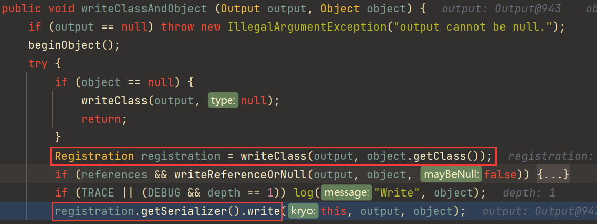

### Registration获取

`writeClass(output, object.getClass())`返回一个`object`类的`Registration`

若该类没有注册过（也就是没有上面的`kryo.register`指定一个类），会自动使用默认的序列化器注册，注册有两个目的：获取序列化器和类的唯一标识Id，方便后续的序列化和反序列化

```
get:351, ObjectMap (com.esotericsoftware.kryo.util)
getRegistration:79, DefaultClassResolver (com.esotericsoftware.kryo.util)
getRegistration:488, Kryo (com.esotericsoftware.kryo)
writeClass:97, DefaultClassResolver (com.esotericsoftware.kryo.util)
writeClass:540, Kryo (com.esotericsoftware.kryo)
writeClassAndObject:645, Kryo (com.esotericsoftware.kryo)
main:16, Test
```

`com.esotericsoftware.kryo.util.ObjectMap`类维护了一个`Class`与`Registration`（含相对应的反序列化器）的对应表

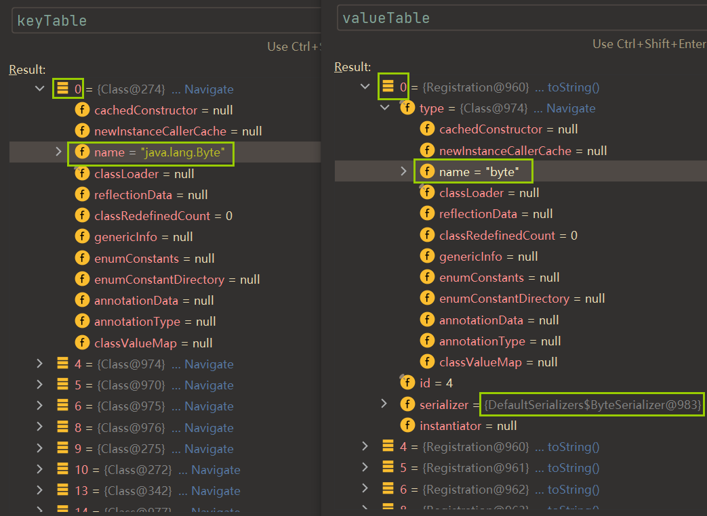

当然我们自定义的类肯定在这个表中找不到，里面都是Java的基础类，`DefaultClassResolver#getRegistration`就返回null

接着进入`registerImplicit` -> `getDefaultSerializer`继续找一些Java内置类是否和待序列化类对应

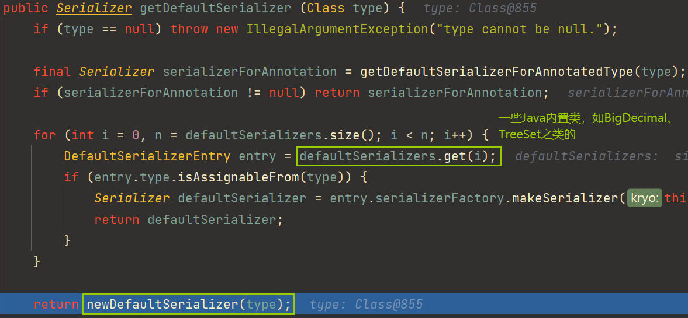

继续跟进，发现`FieldSerializer`作为默认序列化器，并在`FieldSerializer#rebuildCachedFields`中获取序列化类的`Fields`，忽略静态成员

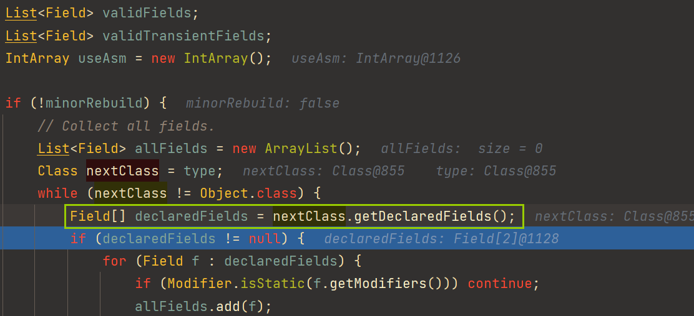

到此就获取到了自定义类的`Registration`

### Field序列化

接着进入`FieldSerializer.write(this, output, object);`

```java
CachedField[] fields = this.fields;
for (int i = 0, n = fields.length; i < n; i++)
    fields[i].write(output, object);
```

`Kryo`封装了一个`UnsafeUtil`（`Unsafe`对象通过反射获取）

```java
java.lang.reflect.Field field = sun.misc.Unsafe.class.getDeclaredField("theUnsafe");
field.setAccessible(true);
_unsafe = (sun.misc.Unsafe)field.get(null);
```

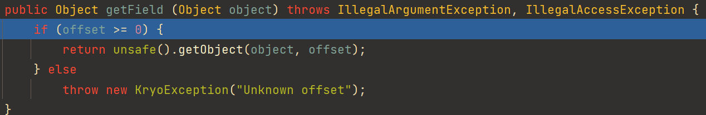

在JVM中，对实例的Field进行了有规律的存储，通过一个偏移量可以从内存中找到相应的Field值

unsafe实现了在内存层面，通过成员字段偏移量offset来获取对象的属性值

接着获取成员的序列化器，步骤跟上面的一样（`getRegistration(type).getSerializer()`）

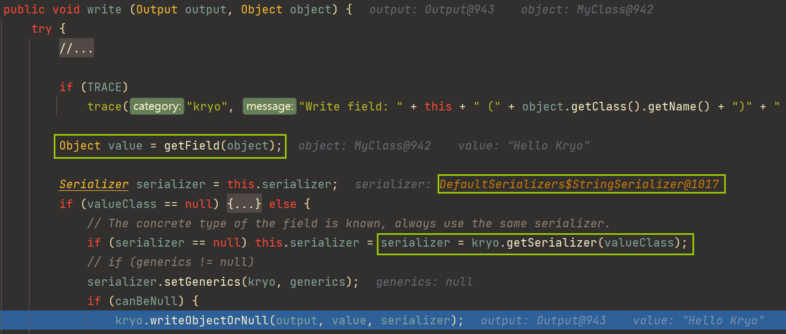

剩下的就是继续递归所有成员，获取序列化器进行序列化

## 反序列化流程

同样也是先获取类的`Registration`，再从`Registration`拿序列化器器

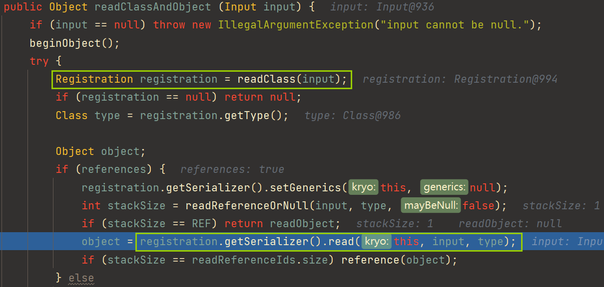

`FieldSerializer#read`首先对类进行实例化，这里是使用了Kryo封装的`com.esotericsoftware.reflectasm#ConstructorAccess`去构造类对象，基于ASM，还没学过ASM，就不深入跟进去看了

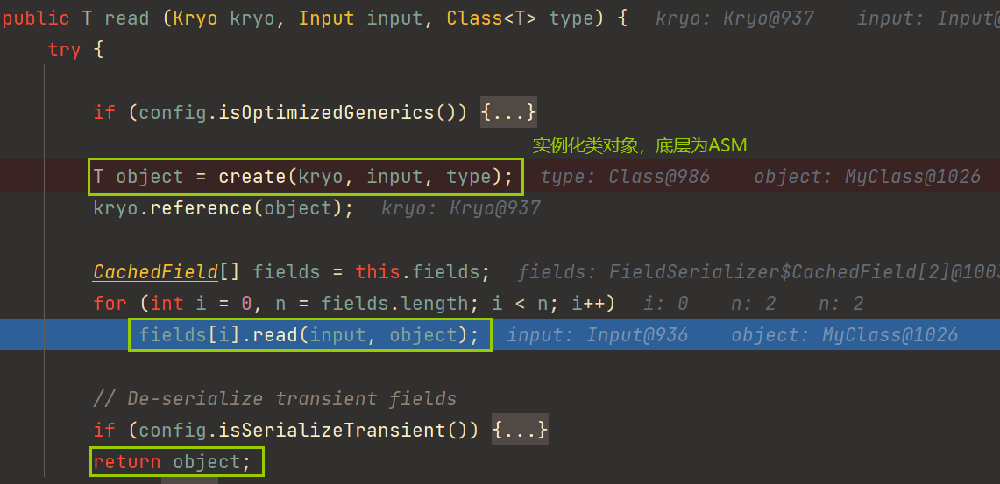

同样是获取成员的序列化器，递归调用`readObject`

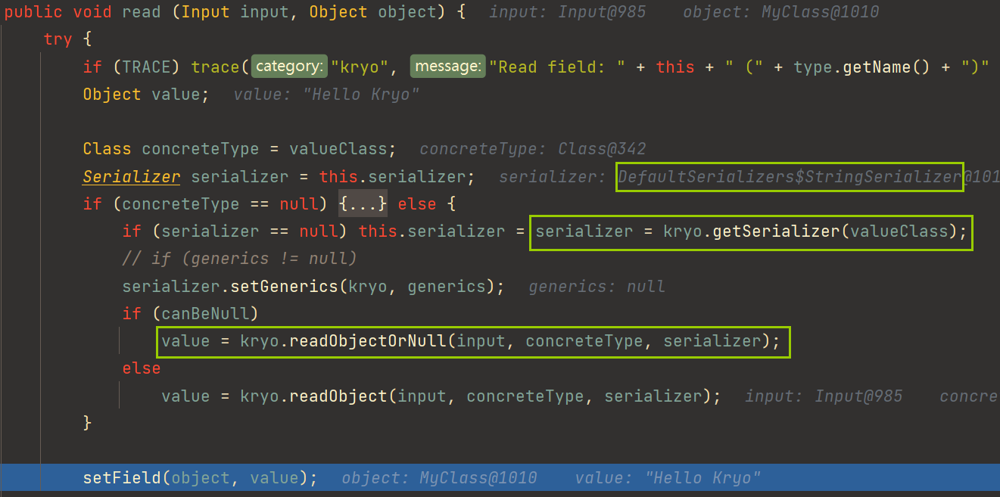

可以跟一下这里的`readObjectOrNull`

```java
object = (T)serializer.read(this, input, type);
```

这里的序列化器是`StringSerializer`，直接从输入流input读取了，否则就继续调用上面的`FieldSerializer#read`了

后面的`setField`也是用`unsafe`从内存层面往成员偏移量处填充值

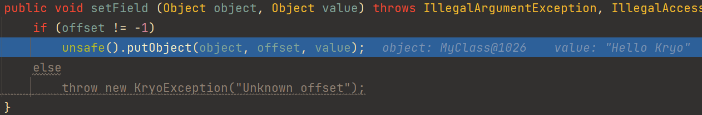

到此反序列化就结束了

## 总结

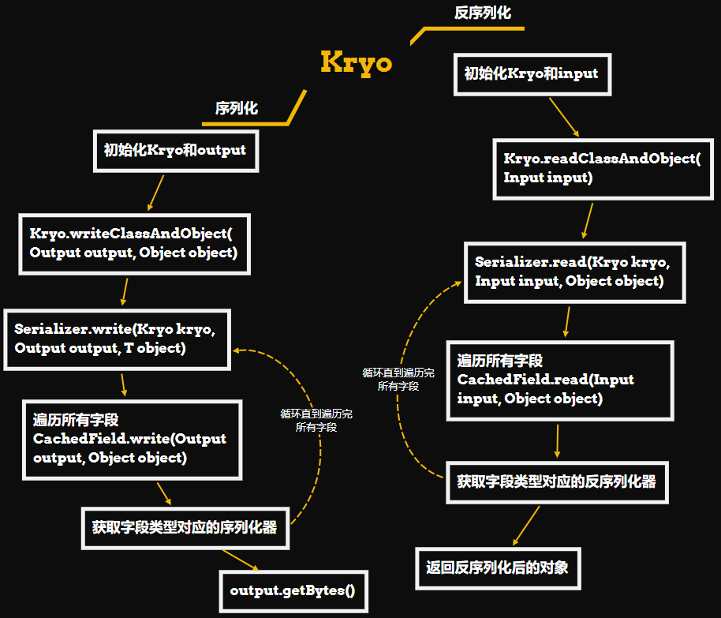

# 0x03 Way To Attack

网上找到的Kryo反序列化问题都是放在Dubbo那块的。Dubbo默认的序列化协议是Hessian，但可以修改Dubbo协议数据包中的header，指定SerializationID，来确定Consumer和Provider通信使用的序列化协议，这里就不细讲Dubbo数据包的修改了，而是抽取其中关键的Kryo反序列化，Dubbo相关的具体可以看[这里](./dubbo.md)

调用栈

> getTransletInstance:455, TemplatesImpl (com.sun.org.apache.xalan.internal.xsltc.trax)
>
> newTransformer:486, TemplatesImpl (com.sun.org.apache.xalan.internal.xsltc.trax)
>
> getOutputProperties:507, TemplatesImpl (com.sun.org.apache.xalan.internal.xsltc.trax)
>
> write:-1, ASMSerializer_1_TemplatesImpl (com.alibaba.fastjson.serializer)
>
> write:270, MapSerializer (com.alibaba.fastjson.serializer)
>
> write:44, MapSerializer (com.alibaba.fastjson.serializer)
>
> write:280, JSONSerializer (com.alibaba.fastjson.serializer)
>
> toJSONString:863, JSON (com.alibaba.fastjson)
>
> toString:857, JSON (com.alibaba.fastjson)
>
> equals:392, XString (com.sun.org.apache.xpath.internal.objects)
>
> equals:104, HotSwappableTargetSource (org.springframework.aop.target)
>
> putVal:635, HashMap (java.util)
>
> put:612, HashMap (java.util)
>
> read:162, MapSerializer (com.esotericsoftware.kryo.serializers)
>
> read:39, MapSerializer (com.esotericsoftware.kryo.serializers)
>
> readClassAndObject:813, Kryo (com.esotericsoftware.kryo)

Kryo从input中读取解析到type为HashMap

因此会调用`MapSerializer`序列化器来读取input中的信息

既然是Map的反序列化就肯定涉及到键值对的处理

`MapSerializer`会将解析到的key和value都通过调用`map.put()`来放入HashMap对象中

接着调用`putVal()`，`equals()`判断两个键是否相对

`com.sun.org.apache.xpath.internal.objects.XString#equals`会调用`toString`

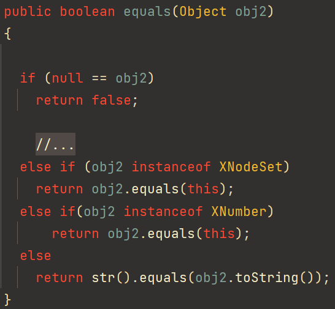

`org.springframework.aop.target.HotSwappableTargetSource#equals`

```java
public boolean equals(Object other) {
    return this == other || other instanceof HotSwappableTargetSource && this.target.equals(((HotSwappableTargetSource)other).target);
}
```

多套一个`HotSwappableTargetSource`是为了让HashMap的`putVal`能走到`equals`

这里触发`com.alibaba.fastjson.JSON`类的`toString()`函数，进而调用`JSONSerializer`的`write()`函数，从而触发Fastjson Gadget

# 0x04 Reference

* [浅析Dubbo Kryo/FST反序列化漏洞（CVE-2021-25641）Mi1k7ea](https://www.mi1k7ea.com/2021/06/30/浅析Dubbo-KryoFST反序列化漏洞（CVE-2021-25641）/)

* [Dubbo的反序列化安全问题——kryo和fst - bitterz - 博客园 (cnblogs.com)](https://www.cnblogs.com/bitterz/p/15588955.html)