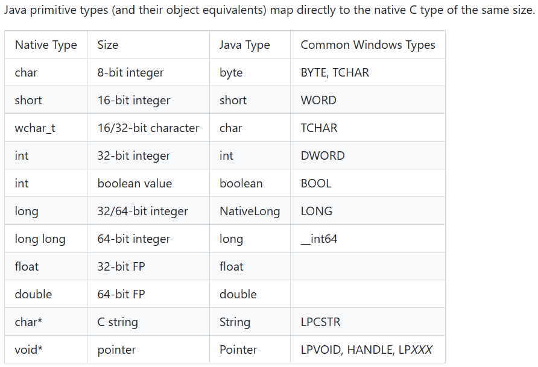

# 0x01 What Is JNA

前面介绍了JNI，是用于Java调用本地方法的接口，也感受了实现一个native方法的繁琐。

首先得在Java代码中定义native方法，然后通过`javah`命令生成对应的头文件，再使用C实现头文件中声明的方法。Java和C++之间的数据类型映射也十分麻烦。

让一个Java程序员去开发C程序自然不好，专业问题得交给专业人士去完成。

JNA（Java Native Access）是一个Java框架，它会在运行期间动态访问本地共享类库，只要在Java接口中描述目标本地库的函数，JNA会自动实现映射，不需要编写任何JNI代码。

在实际开发中，共享类库就可以由专业的C++工程师去实现，Java调就完事了。

# 0x02 Best Pratice

首先得准备一个共享类库

`CMakeLists.txt`👇

```cmake
cmake_minimum_required(VERSION 3.29)
project(myLib)

set(CMAKE_CXX_STANDARD 20)

add_library(myLib SHARED library.cpp)
```

`library.h`👇

```cpp
#ifndef MYLIB_LIBRARY_H
#define MYLIB_LIBRARY_H
#ifdef __cplusplus
extern "C"
{
    int max(int, int);
}
#endif
#endif
```

由于C++支持函数重载，因此编译器在编译函数的过程中，会将函数的参数类型等也加入到编译后的代码中，因此编译出来的动态链接库中所含的函数名称与原函数名称是不同的。

这使得JNA调用动态链接库时无法找到原来的函数名，需要在头文件中对外提供的函数前面声明`extern "C"`，让编译器以C语言的形式编译接口。否则会报如下错：

`java.lang.UnsatisfiedLinkError: Error looking up function max`

`library.cpp`👇

```cpp
#include "library.h"

int max(int num1, int num2) {
    return num1 > num2 ? num1 : num2;
}
```

制作完动态链接库后，就可以看Java这侧了

引入JNA依赖

```xml
<dependency>
    <groupId>net.java.dev.jna</groupId>
    <artifactId>jna</artifactId>
    <version>5.10.0</version>
</dependency>
```

C和Java的数据类型映射：



将编译好的 `myLib.dll` 放入 `resources` 文件夹下的 `win32-x86-64` 目录中

接着定义一个继承`Library`的接口

`Native.load`第一个参数为共享库文件的名称，它会先在当前类路径下找，找不到再去相应操作系统和位数的文件夹下找。

第二个参数为当前的接口类，它会根据这个接口类生成动态代理并返回

```java
import com.sun.jna.Library;
import com.sun.jna.Native;

public interface JnaLibrary extends Library {
    JnaLibrary INSTANCE = Native.load("myLib", JnaLibrary.class);
    int max(int a, int b);
}
```

接着就用`Native.load`返回赋值给的静态成员`INSTANCE`来调用

```java
int max = JnaLibrary.INSTANCE.max(125, 135);
System.out.println(max);  // 135
```


