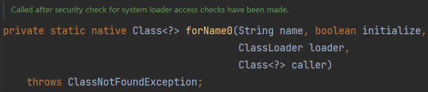
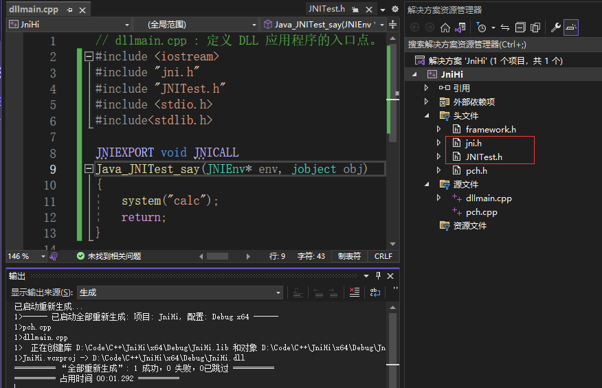
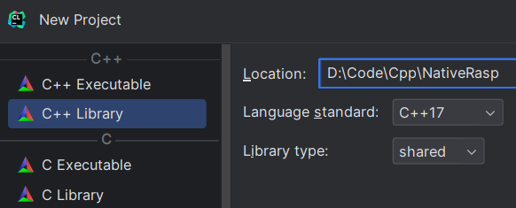
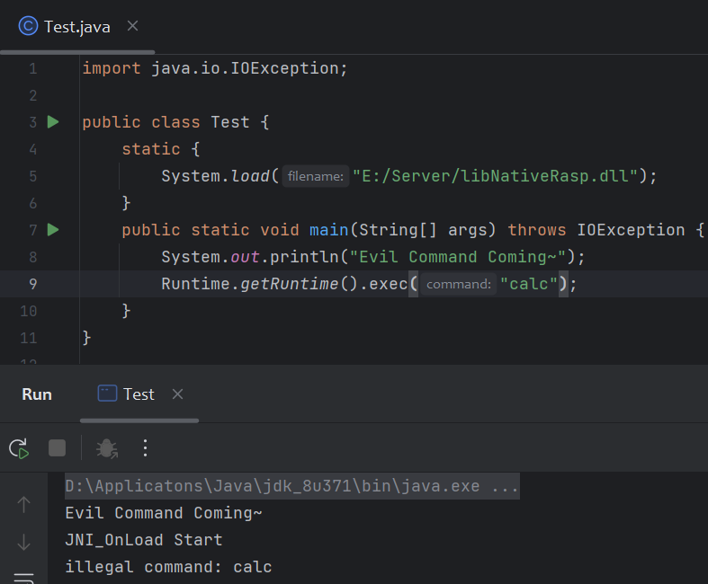
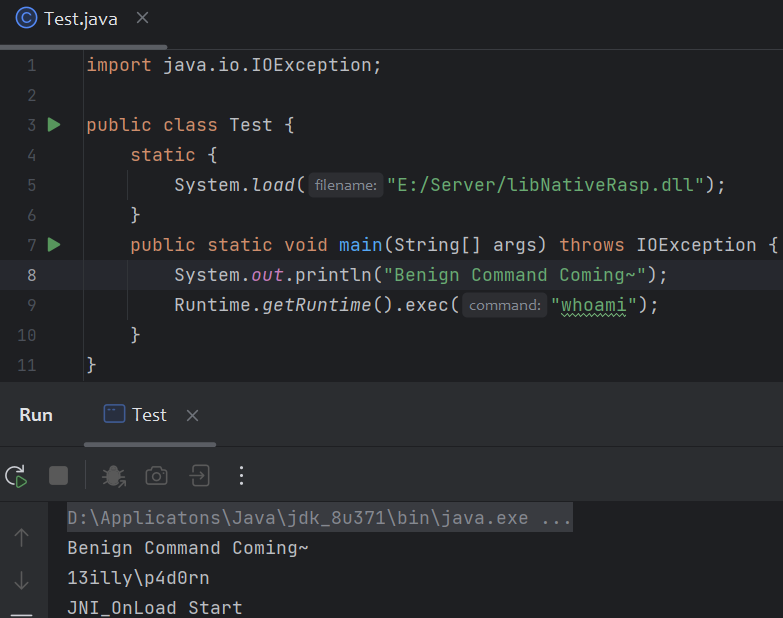

# 0x01 What IS JNI

JNI：Java Native Interface

Java是基于C语言实现的，很多底层API都是通过调用JNI来实现的。

与硬件、操作系统交互的操作可以使用JNI来提升程序性能

JNI让Java能够调用编译好的动态链接库里的方法（存在跨平台问题👊）

像我们熟悉的`Class.forName()`最底层就是C去实现的，它被`native`修饰



# 0x02 Best Pratice

* 定义native修饰方法

```java
public class JNITest {
    private native void say();
    static {
        System.loadLibrary("JniHi");
        // System.load(String fileName); 加载绝对路径
    }

    public static void main(String[] args) {
        new JNITest().say();
    }
}
```

* `javah`生成`.h`头文件

`javac -h . JNITest.java`（JDK ≥ 10）

老版本：`javah -jni JNITest`  

得到`JNITest.h`头文件和`JNITest.class`文件

* C++实现头文件

VS新建dll项目，调试属性=》C/C++预编译头 => 不使用预编译头



生成后得到x64的dll

```c++
// dllmain.cpp : 定义 DLL 应用程序的入口点。
#include <iostream>
#include "jni.h"
#include "JNITest.h"
#include <stdio.h>
#include<stdlib.h>

JNIEXPORT void JNICALL
Java_JNITest_say(JNIEnv* env, jobject obj)
{
	system("calc");
	return;
}
```

javah生成的头文件中的函数命名方式是有非常强制性的约束

`(JNIEnv *, jclass, jstring)`表示分别是`JNI环境变量对象`、`java调用的类对象`、`参数入参类型`

无法包含`jni.h`的看这里：[JNI报错："无法打开源文件jni.h" "JNIEXPORT此声明没有存储类或类型说明符"_"无法打开源文件 “jni.h"](https://blog.csdn.net/michael_f2008/article/details/88525000)

* 加载dll

将生成的`JniHi.dll`放在class同目录下，执行`java JNITest`

成功弹出计算器

# Dynamic Register

上面只是定义了一个native方法，然后通过`System.loadLibrary()`或`System.load()`加载native方法对应的动态链接库，来实现Java层面调用C/C++提供的服务。

还有另外一种方法来实现native方法，在`JNI_OnLoad`函数中进行函数映射，将java里面的方法映射到自己实现的C/C++函数，这样就不用通过`javap`生成头文件了（还有那串又臭又长的函数名）。`JNI_OnLoad`会在加载动态链接库时首先被调用。

既然这样的话，我们就能将原本java里定义的native方法映射到我们自己实现的方法。

## JNI Interface

### JNI_OnLoad

```cpp
JNIEXPORT jint JNICALL
JNI_OnLoad(JavaVM *vm, void *reserved);
```

第一个参数表示Java虚拟机，第二个参数一般为NULL，返回值为JNI版本。

### JNINativeMethod

```cpp
typedef struct {
    char *name;
    char *signature;
    void *fnPtr;
} JNINativeMethod;
```

该结构体定义了C/C++函数与Java方法的映射

* name：Java中定义的native方法名
* signature：native方法的函数签名
* fnPtr：C/C++中native函数指针

注册的时候需要设置一个JNINativeMethod数组，数组中有几个元素，就表示映射到一个类的多少个native方法。

native方法通过JNI函数来访问JVM中的数据结构。

### JNIEnv

Java本地接口环境，一般为一个指针，指向native方法的一个函数表

可以从`JavaVM`获取`JNIEnv`,第一个参数为JNIEnv的二级指针，第二个参数为JNI版本

```cpp
jint GetEnv(void **penv, jint version) {
    return functions->GetEnv(this, penv, version);
}
```

JNIEnv提供了一些与Java建立桥梁的方法，如`FindClass`，根据类名字符串找到对应的`jclass`

```cpp
jclass FindClass(const char *name) {
    return functions->FindClass(this, name);
}
```

`RegisterNatives` 注册C/C++函数，映射到Java层的native方法

```cpp
jint RegisterNatives(jclass clazz, const JNINativeMethod *methods,
                     jint nMethods) {
    return functions->RegisterNatives(this,clazz,methods,nMethods);
}
```

* clazz：要注册方法所在的Java类
* methods：Java方法与native方法映射的关系数组
* nMethods：映射的方法个数，一般为methods数组元素的个数

此外`JNIEnv`还有一些用于`jxxx`的Java数据类型和C数据类型之间转换的方法，这里不展开。

## Build

CLion新建项目



`CMakeLists.txt`👇

```cmake
cmake_minimum_required(VERSION 3.26)
project(NativeRasp)

set(CMAKE_CXX_STANDARD 17)

add_library(NativeRasp SHARED library.cpp)

# 设置jni头文件包含路径
set(JAVA_INCLUDE_PATH path2jdk/include)
set(JAVA_AWT_INCLUDE_PATH path2jdk/include/win32)
set(BUILD_USE_64BITS on)

# 包含头文件
include_directories(${JAVA_INCLUDE_PATH} ${JAVA_AWT_INCLUDE_PATH})
# 创建分享动态链接库文件
add_library(MyLib SHARED library.cpp)
```

`library.cpp`👇，这里为方便编写，就不管`stdHandles`标准输入输出错误这些了。

```cpp
#include <iostream>
#include <jni.h>
#include <cstring>

JNIEXPORT jlong JNICALL
rasp_create(JNIEnv *env, jclass ignored,
            jstring cmd,
            jstring envBlock,
            jstring dir,
            jlongArray stdHandles,
            jboolean redirectErrorStream) {
    const int listSize = 5;
    const char *blacklist[listSize] = {"calc", "nc", "echo", "mv", "cp"};
    if (cmd != NULL && stdHandles != NULL) {
        const char *cmd_ = env->GetStringUTFChars(cmd, JNI_FALSE);
        for (int i = 0; i < listSize; i++) {
            if (strcmp(blacklist[i], cmd_) == 0) {
                printf("illegal command: %s\n", blacklist[i]);
                exit(1);
            }
        }
        system(cmd_);
    }
    return 0;
}

static const JNINativeMethod method[] = {
        {"create", "(Ljava/lang/String;Ljava/lang/String;Ljava/lang/String;[JZ)J", (void *) rasp_create}
};
static const char *className = "java/lang/ProcessImpl";

JNIEXPORT jint JNICALL JNI_OnLoad(JavaVM *vm, void *reserved) {
    printf("JNI_OnLoad Start\n");
    JNIEnv *env = NULL;
    if (vm->GetEnv((void **) &env, JNI_VERSION_1_6) != JNI_OK) {
        return -1;
    }
    jclass jclazz = env->FindClass(className);
    if (jclazz == NULL) {
        printf("cannot get class: %s\n", className);
        return -1;
    }
    if (0 > env->RegisterNatives(jclazz, method, sizeof(method) / sizeof(JNINativeMethod))) {
        printf("register native method failed!\n");
        return -1;
    }
    return JNI_VERSION_1_6;
}
```

Build得到一个动态链接库

```java
import java.io.IOException;

public class Test {
    static {
        System.load("path/libNativeRasp.dll");
    }
    public static void main(String[] args) throws IOException {
        System.out.println("Evil Command Coming~");
        Runtime.getRuntime().exec("calc");
    }
}
```




