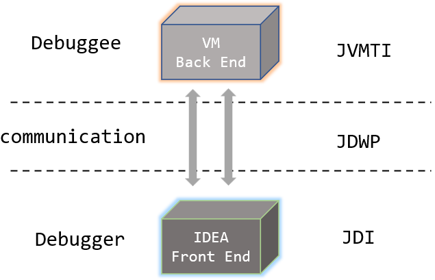

# 0x01 JPDA Overview

JPDA（Java Platform Debugger Architecture）是一套用于调试Java程序的标准，它将调试体系分为三部分，并规定了三者之间的通信接口

日常我们接触最多的就是IDEA去调试Java程序了。

* JVMTI（JVM Tool Interface）
  * 定义了一系列跟调试相关的接口，由JVM实现这些接口。
  * 类似一个钩子的机制，通过JVMTI，可以指挥JVM执行某些操作（如停在断点处，发生某些事件时通知外部）
  * JVMTI Agent才能与钩子通信。JVMTI Agent与JVM是运行在同一个机器上同一个进程内的。
  * 有了JVMTI，调试就可以与具体的JVM解耦，不同类型的JVM只要遵循JVMTI规范即可
* JDWP（Java Debug Wire Protocol）
  * 想要向JVM发起命令，要先与Agent通信
  * JVMTI Agent内置了一个称之为“通信后端”的模块来接收外部请求
  * JDWP就是和JVMTI Agent通信的协议
  * 定义了调试器和被调试程序之间传递的信息的格式
* JDI（Java Debug Interface）
  * 使用IDEA调试就是以JDWP协议与目标JVM的JVMTI Agent通信
  * `com.sun.jdi`这个包实现了JDWP协议，封装为一个个Java API，方便第三方与JVMTI Agent通信
  * 与JVMTI Agent的通信后端相对应，JDI包含了一个通信前端模块，负责JDWP协议的转换以及消息的发送和接收。
  * 当然JDI不仅仅实现JDWP协议那么简单，还实现了队列、缓存、连接初始化等服务

# 0x02 Configuration

debugger和debuggee在启动的时候, 都需要通过设置JVM参数来让它具有调试的能力或者可被调试的能力。

参数格式为：`-agentlib:jdwp={子配置项1,子配置项2,子配置项3}`

子配置项包括：

* transport：数据交换方式，`dt_socket`（socket 网络通信）或`dt_shmem`（共享内存通信）
* address：标识一个对端的地址，`{ip}:{port}`
* server：标识自己是调试者还是被调试者，调试者为`n`，被调试者为`y`
* suspend：`y`表示等待调试者连接上来才真正启动Java应用， `n`则直接启动Java应用

比如IDEA启动调试，控制台打印的是

> java -agentlib:jdwp=transport=dt_socket,address=127.0.0.1:13344,suspend=y,server=n -javaagent:xxx\JetBrains\apps\IDEA-U\ch-0\233.14475.28\plugins\java\lib\rt\debugger-agent.jar -Dfile.encoding=UTF-8 -classpath xxx YYY
>
> Connected to the target VM, address: '127.0.0.1:13344', transport: 'socket'

# 0x03 JVMTI

JVMTI(JVM Tool Interface)是JVM提供的一套对JVM进行操作的工具接口

> JVM TI is intended to provide a VM interface for the full breadth of tools that need access to VM state, including but not limited to: profiling, debugging, monitoring, thread analysis, and coverage analysis tools.    

通过JVMTI，可以实现对JVM的多种操作，它通过接口注册各种事件钩子，在JVM事件触发时，同时触发预定义的钩子，以实现对各种JVM事件的响应。

事件包括类文件加载、异常产生与捕获、线程启动和结束、成员变量修改、方法调用进入和退出、VM启动与退出等。

> 并非所有的JVM实现都支持JVMTI
>
> JVMTI是一个双向的接口（CS架构），Client称为Agent、Server为JVM
>
> 因此开发JVM工具就需要写一个Agent程序来使用这些接口，Agent来和JVM通信

## JVMTI Agent

1. Agent可以使用C/C++编写。

2. 函数、事件、数据类型、常量定义等定义在了基础库`jvmti.h`
3. Agent跟目标JVM是运行在同一个进程的
4. 允许多个Agent并行运行，每个Agent相互独立
5. JDK本身已经自带一个调试Agent，在windows下以`JDWP.dll`形式存在，在linux下以`JDWP.so`形式存在

JVM启动的时候，会调用各个Agent的启动函数

* 如果Agent启动了，`Agent_OnLoad`回调函数会被调起

* 如果Agent是中途才attach进JVM的，那么回调的函数是`Agent_OnAttach`

通过配置JVM参数的方式，让JVM加载Agent

1. `-agentlib:{agent-lib-name}={其它配置项}`。如配置为：`-agentlib:myagent`，在windows平台上，将会搜索PATH下的myagent.dll 文件，在类Unix平台上，将会搜索`LD_LIBRARY_PATH`下的myagent.so文件。
2. `-agentpath:{path-to-agent}={其它配置项}`。这个配置方式用来配置Agent的绝对路径，例如：`-agentpath:d:\myagent\MyAgent.dll`

## JavaAgent

虽然java提供了JVMTI，但是对应的agent需要用C/C++开发，对java开发者而言并不是很友好。在Java SE 5的新特性中加入了`Instrumentation`机制，开发者可以构建一个基于Java编写的Agent来监控或者操作JVM了，比如替换或者修改某些类的定义，也就是上一节讲的JavaAgent。

> `instrumentation`翻译为插桩，指在指令级别对程序进行分析与修改。

通过`addTransformer`方法注册了一个`ClassFileTransformer`，后面类加载的时候都会经过这个Transformer处理。

对于已加载过的类，可以调用`retransformClasses`来重新触发这个Transformer的转换

利用`Instrumentation`可以很好地实现虚拟机层面的AOP