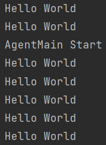

# 0x00 Intro

IAST（Interactive Application Security Testing）交互式应用程序安全测试

RASP（Runtime application self-protection）运行时应用自我保护。

RASP是一种植入到应用程序内部或其运行时环境的安全技术。RASP可将自身注入到应用程序中，与应用程序融为一体，实时监测、阻断攻击，使程序自身拥有自保护的能力。区别于传统的WAF防护，RASP检测更全面精准、不易被绕过、可预防未知漏洞。

JavaAgent是其背后的技术支持

在Java SE 5及后续版本中，开发者可以构建一个独立于应用程序的代理程序（Agent），用来监测和协助运行在JVM上的程序，还能够修改字节码，动态修改已加载或未加载的类以及它们的属性和方法。

# 0x01 Basic Concept

Java Agent 有两种加载方式：

* `premain`, 以指示代理类的方式启动JVM。
* `agentmain`, 在JVM启动后的某个时间提供启动代理

`premain`相当于在main前类加载时进行字节码修改，而`agentmain`则是main后在类调用前通过重新转换类完成字节码修改。由于加载方式不同，所以premain只能在程序启动时指定Agent文件进行部署，而agentmain需要通过Attach API在程序运行后根据进程ID动态注入agent到jvm中。

关键Instrumentation类（`java.lang.instrument`）：

Java agent通过Instrumentation类和JVM进行交互，从而到达修改字节码的目的。

```java
public interface Instrumentation {
    
    //增加一个Class 文件的转换器，转换器用于改变 Class 二进制流的数据，参数 canRetransform 设置是否允许重新转换。
    void addTransformer(ClassFileTransformer transformer, boolean canRetransform);

    //在类加载之后，可以使用 retransformClasses 方法重新定义类。addTransformer方法配置之后，后续的类加载都会被Transformer拦截。对于已经加载过的类，可以执行retransformClasses来重新触发这个Transformer的拦截。类加载的字节码被修改后，除非再次被retransform，否则不会恢复。
    void addTransformer(ClassFileTransformer transformer);

    //删除一个类转换器
    boolean removeTransformer(ClassFileTransformer transformer);

    boolean isRetransformClassesSupported();

    // 在类加载之后，重新定义Class。该方法是1.6之后加入的，事实上，该方法是 update 了一个类。可以修改方法体，但是不能变更方法签名、增加和删除方法/类的成员属性
    void retransformClasses(Class<?>... classes) throws UnmodifiableClassException;
    
    // 获取目标已经加载的类。
    @SuppressWarnings("rawtypes")
    Class[] getAllLoadedClasses();
    
}
```

## 启动时加载-premain

* Agent构造

  * 实现premain方法

  * manifest清单中包含`Premain-Class`字段

* 加载Agent

  * 添加-javaagent参数指定Agent（jar包）
  * 在运行main方法前会先调用Agent的premain方法

```java
import java.lang.instrument.ClassFileTransformer;
import java.lang.instrument.IllegalClassFormatException;
import java.lang.instrument.Instrumentation;
import java.security.ProtectionDomain;

public class MyAgent {

    public static void premain(String agentArgs, Instrumentation inst) {
        System.out.println("agentArgs : " + agentArgs);
        inst.addTransformer(new DefineTransformer(), true);
    }

    static class DefineTransformer implements ClassFileTransformer{

        @Override
        public byte[] transform(ClassLoader loader, String className, Class<?> classBeingRedefined, ProtectionDomain protectionDomain, byte[] classfileBuffer) throws IllegalClassFormatException {
            System.out.println("premain load Class:" + className);
            return classfileBuffer;
        }
    }
}
```

jar打包方式：

* 法一：maven + POM
  配置manifestEntries参数

  ```xml
  <build>
    <plugins>
      <plugin>
        <groupId>org.apache.maven.plugins</groupId>
        <artifactId>maven-jar-plugin</artifactId>
        <version>3.1.0</version>
        <configuration>
          <archive>
            <manifest>
              <addClasspath>true</addClasspath>
            </manifest>
            <manifestEntries>
              <Premain-Class>com.demo.agent.MyAgent</Premain-Class>
              <!--<Agent-Class>com.demo.agent.MyAgent</Agent-Class>-->
              <Can-Redefine-Classes>true</Can-Redefine-Classes>
              <Can-Retransform-Classes>true</Can-Retransform-Classes>
              <Can-Set-Native-Method-Prefix>true</Can-Set-Native-Method-Prefix>
            </manifestEntries>
          </archive>
        </configuration>
      </plugin>
    </plugins>
  </build>
  ```

  1. Premain-Class：包含`premain`方法的类，需要配置为类的全路径
  2. Agent-Class：包含`agentmain`方法的类，需要配置为类的全路径
  3. Can-Redefine-Classes：为`true`时表示能够重新定义Class
  4. Can-Retransform-Classes：为`true`时表示能够重新转换Class，实现字节码替换
  5. Can-Set-Native-Method-Prefix：为`true`时表示能够设置native方法的前缀


  执行`mvn clean package`

* 法二：MANIFEST.MF配置文件
  在资源目录（resources）下，新建目录`META-INF`
  在`META-INF`目录下，新建文件`MANIFEST.MF`

  ```
  Manifest-Version: 1.0
  Premain-Class: com.demo.agent.MyAgent
  Agent-Class: com.demo.agent.MyAgent
  Can-Redefine-Classes: true
  Can-Retransform-Classes: true
  Can-Set-Native-Method-Prefix: true
  ```

  > javac .\com\demo\myAgent\MyAgent.java
  >
  > jar -cvf MyAgent.jar -C ./ .

运行上加上参数VM options：-javaagent

`-javaagent:path\JavaAgent01-1.0-SNAPSHOT.jar`


或者通过命令行执行

`java -javaagent:path\JavaAgent01-1.0-SNAPSHOT.jar MainTest`

注意`-javaagent:path`要放在`MainTest`前面

```java
//MainTest.java
public class MainTest {
    public static void main(String[] args) {
        System.out.println("main start");
        try {
            Thread.sleep(3000);
        } catch (InterruptedException e) {
            e.printStackTrace();
        }
        System.out.println("main end");
    }
}
```


1. 执行main方法之前会加载所有的类，包括系统类和自定义类；
2. 在ClassFileTransformer中会去拦截系统类和自己实现的类对象；
3. 要对某些类对象进行改写，在拦截的时候抓住该类使用字节码编译工具即可实现。

## agentmain

在 Java SE 6 的 Instrumentation 当中，提供了一个新的代理操作方法：agentmain，可以在 main 函数开始运行之后再运行。

agentmain需要通过Attach API在程序运行后根据进程ID动态注入agent到jvm中，利用`com.sun.tools.attach.VirtualMachine`的attach方法连接目标虚拟机

通过VirtualMachine类的`attach(pid)`方法，便可以attach到一个运行中的java进程上，之后便可以通过`loadAgent(agentJarPath)`来将agent的jar包注入到对应的进程，然后对应的进程会调用agentmain方法。

```java
import java.lang.instrument.Instrumentation;

public class MyAgent {

    public static void agentmain(String agentArgs, Instrumentation inst) {
        System.out.println("AgentMain Start");
    }

}
```

同上面一样打包为jar

```java
import com.sun.tools.attach.*;

import java.io.IOException;
import java.util.List;
public class AttachMain {
    public static void main(String[] args) throws IOException, AttachNotSupportedException, AgentLoadException, AgentInitializationException {
        //获取当前系统中所有运行中的虚拟机
        System.out.println("running JVM start ");
        List<VirtualMachineDescriptor> list = VirtualMachine.list();
        for (VirtualMachineDescriptor vmd : list) {
            //如果虚拟机的名称为xxx则该虚拟机为目标虚拟机，获取该虚拟机的pid并attach
            //然后加载 agent.jar 发送给该虚拟机
            System.out.println(vmd.displayName());
            if (vmd.displayName().endsWith("com.test.Demo")) {
                VirtualMachine virtualMachine = VirtualMachine.attach(vmd.id());
                virtualMachine.loadAgent("path\\JavaAgent01-1.0-SNAPSHOT.jar");
                virtualMachine.detach();
            }
        }
    }
}
```

main函数执行起来的时候进程名为当前类名，所以通过这种方式可以去找到当前的进程id。

若找不到`com.sun.tools`，在POM中加入tool.jar外部依赖，指定本地tools.jar路径

```xml
<dependency>
    <groupId>com.sun</groupId>
    <artifactId>tools</artifactId>
    <version>1.8.0</version>
    <scope>system</scope>
    <systemPath>D:\Lang\Java\jdk1.8.0_65\lib\tools.jar</systemPath>
</dependency>
```

Main测试类

```java
package com.test;

public class Demo {
    public static void main(String[] args) throws InterruptedException {
        for (int i = 0; i < 7; i++) {
            Thread.sleep(3000);
            System.out.println("Hello World");
        }
    }
}
```

先启动Main测试类，再启动AttachMain来注入jar



由于 tools.jar 并不会在 JVM 启动的时候默认加载，尝试利用URLClassloader来加载tools.jar

```java
import java.io.File;
import java.lang.reflect.Method;
import java.net.URL;
import java.net.URLClassLoader;
import java.util.List;

public class AttachMain {
    public static void main(String[] args) throws Exception {
        File toolsPath = new java.io.File(System.getProperty("java.home").replace("jre", "lib") + java.io.File.separator + "tools.jar");
        System.out.println(toolsPath.toURI().toURL());
        URL url = toolsPath.toURI().toURL();
        URLClassLoader classLoader = new URLClassLoader(new URL[]{url});
        Class<?> MyVirtualMachine = classLoader.loadClass("com.sun.tools.attach.VirtualMachine");
        Class<?> MyVirtualMachineDescriptor = classLoader.loadClass("com.sun.tools.attach.VirtualMachineDescriptor");

        Method listMethod = MyVirtualMachine.getDeclaredMethod("list");
        List<Object> list = (List<Object>) listMethod.invoke(MyVirtualMachine);

        for (Object o : list) {
            Method displayName = MyVirtualMachineDescriptor.getDeclaredMethod("displayName");
            String name = (String) displayName.invoke(o);
            System.out.println(name);
            if (name.contains("com.test.Demo")) {
                Method getId = MyVirtualMachineDescriptor.getDeclaredMethod("id");
                Method attach = MyVirtualMachine.getDeclaredMethod("attach", String.class);
                String id = (String) getId.invoke(o);
                Object vm = attach.invoke(o, id);
                Method loadAgent = MyVirtualMachine.getDeclaredMethod("loadAgent", String.class);
                loadAgent.invoke(vm, "D:\\Code\\Java\\JavaSec\\JavaAgent01\\target\\JavaAgent01-1.0-SNAPSHOT.jar");
                Method detach = MyVirtualMachine.getDeclaredMethod("detach");
                detach.invoke(vm);
            }
        }
    }
}
```

