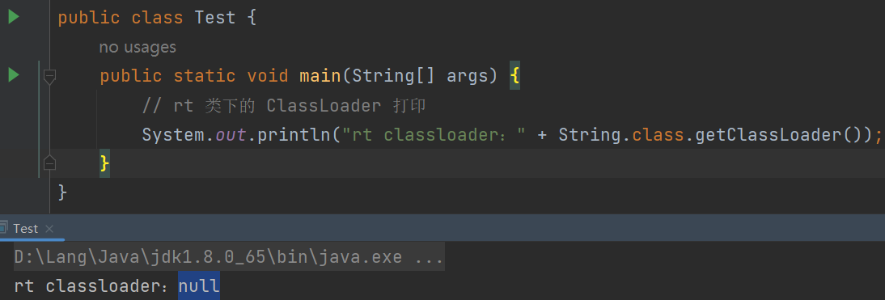
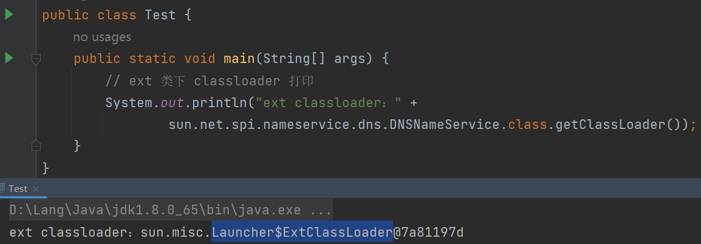
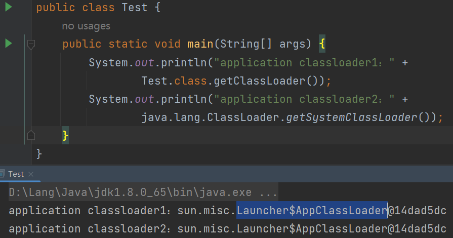
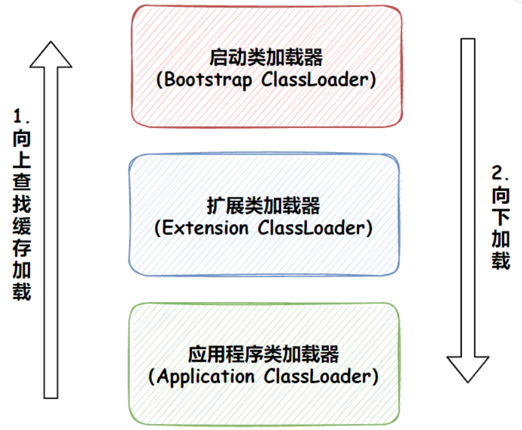

# 0x01 类加载器

类加载器：将**Java字节码**加载为**`java.lang.Class`实例**

特点：

* 动态加载。可在程序运行过程中动态按需加载字节码（字节码可以是jar、war、远程和本地.class文件）
* 类加载器加载类时，该类所有的依赖类都由这个类加载器一并加载。

类的唯一性由**加载它的类加载器**和**类本身**决定，只有**两个类是被同一类加载器加载**的前提下，比较两个类是否相等才有意义（`equals`、`isInstance`、`instanceof`）。即使两个类源于同一Class文件，被同一JVM加载，只要加载它们的类加载器不同，这两个类就不同。

类加载器可分为两种：

* **启动类加载器**：C++实现，虚拟机自身的一部分
* 继承自`java.lang.ClassLoader`的类加载器，包括**扩展类加载器**、**应用程序类加载器**、**自定义类加载器**

**启动类加载器（`Bootstrap ClassLoader`）**：负责加载`<JAVA_HOME>\lib`目录。启动类加载器无法被Java程序直接引用

**扩展类加载器（`Extension ClassLoader`）**：负责加载`<JAVA_HOME>\lib\ext`目录。该类加载器由`sun.misc.Launcher$ExtClassLoader`实现。扩展类加载器由启动类加载器加载，其父类加载器为启动类加载器（`parent=null`）

**应用程序类加载器（`Application ClassLoader`）**：负责加载用户类路径`ClassPath`上所指定的类库，由`sun.misc.Launcher$App-ClassLoader`实现。开发者可直接通过`java.lang.ClassLoader`中的`getSystemClassLoader()`方法获取应用程序类加载器，所以也可称它为系统类加载器。应用程序类加载器也是启动类加载器加载的，但是它的父类加载器是扩展类加载器。在一个应用程序中，系统类加载器一般是默认类加载器。

* BootStrap ClassLoader



由于启动类加载器（Bootstrap ClassLoader）是由C++实现的，而C++实现的类加载器在Java中是没有与之对应的类的，所以拿到的结果是null。

* Extension ClassLoader



* Application ClassLoader



# 0x02 双亲委派机制

JVM并非在启动时就把加载了所有`.class`文件，而是在程序运行过程中动态按需加载。除了启动类加载器外，其他所有类加载器都需要继承抽象类`ClassLoader`

```java
public abstract class ClassLoader {
    // The parent class loader for delegation
    private final ClassLoader parent;
    
    protected Class<?> loadClass(String name, boolean resolve) throws ClassNotFoundException{
        // First, check if the class has already been loaded
        Class<?> c = findLoadedClass(name);
        // if the class is not loaded
        if (c == null) {
          // 委派给父加载器去加载(此处递归调用)
          if (parent != null) {
             c = parent.loadClass(name, false);
           } else {
             // 若父加载器为null，检查BootStrap加载器是否加载过
             c = findBootstrapClassOrNull(name);
           }
        }
        if (c == null) {
            // 父加载器没加载成功，调用findClass自己去加载
            c = findClass(name);
        }
        return c;
    }
    
    protected Class<?> findClass(String name){
       //1. 根据传入的类名name，到在特定目录下去寻找类文件，把.class文件读入内存
       //2. 调用defineClass将字节数组转成Class对象
       return defineClass(buf, off, len)；
    }
    
    // 将字节码数组解析成一个Class对象
    protected final Class<?> defineClass(byte[] b, int off, int len){
       ...
    }
}
```

* 每个类加载器都持有一个 `parent `字段，指向父加载器。（`AppClassLoader`的`parent`是`ExtClassLoader`，`ExtClassLoader`的`parent`是`BootstrapClassLoader`，但`ExtClassLoader`的`parent=null`。）
* `loadClass`方法实现了双亲委派机制：先检查这个类是否被加载过，若未加载过委派给父加载器加载，递归调用，一层层向上委派，若到最顶层的类加载器（`BootStrap ClassLoader`）无法加载该类，再一层层向下委派给子类加载器加载
* `findClass`：找到字节码文件并读入得到字节码数组，传入`defineClass`实现类加载
* `defineClass`：将Java类的字节码解析为`java.lang.Class`实例



# 0x03 双亲委派模型优缺

优点：

1. 安全：防止用户伪造的恶意类覆盖原系统类。例如类`java.lang.Object`，它存放在`rt.jar`之中，无论哪个类加载器要加载这个类，最终都是委派给启动类加载器加载
2. 避免多个类加载器将同一类重复加载

缺点：

典型问题：加载 SPI 实现类的场景

比如 JNDI服务，它的代码由启动类加载器去加载(在 JDK 1.3 时放进 rt.jar)，但 JNDI 的目的就是对资源进行集中管理和查找，它需要调用独立厂商实现的部署在应用程序的 classpath 下的 JNDI 接口提供者（SPI）的代码，上面说到类加载器加载类时，该类所有的依赖类都由这个类加载器一并加载。启动类加载器不可能去加载ClassPath下的类。此时就只能打破双亲委派机制。

# 0x04 破坏双亲委派机制

由上面知道实现双亲委派机制主要是`loadClass`方法，若想打破双亲委派机制，自定义类加载器继承`ClassLoader`，重写`loadClass`方法即可

java中所有类都继承了`Object`，而加载自定义类显然还会加载其父类，而最顶级的父类`Object`是java官方的类，只能由`BootstrapClassLoader`加载，java禁止用户用自定义的类加载器加载`java.`开头的官方类。所以就算破坏双亲委派机制，`BootStrap ClassLoader`还是绕不过的，但可以跳过`AppClassLoader`和`ExtClassLoader`

另一种破坏双亲委派机制的方法是利用线程上下文类加载器，其实是一种类加载器传递机制。可以通过`java.lang.Thread#setContextClassLoader`方法给一个线程设置上下文类加载器，在该线程后续执行过程中就能把这个类加载器取（`java.lang.Thread#getContextClassLoader`）出来使用。

如果创建线程时未设置上下文类加载器，将会从父线程（`parent = currentThread()`）中获取，如果在应用程序的全局范围内都没有设置过，就默认是应用程序类加载器。

# 0x05 Res

* [Java双亲委派模型：为什么要双亲委派？如何打破它？破在哪里？_徐同学呀的博客-CSDN博客_java为什么用双亲委派](https://stefan.blog.csdn.net/article/details/117457014)

* [面试必问：什么是双亲委派模型？-51CTO.COM](https://www.51cto.com/article/745615.html)

* [深入理解Java类加载 - czwbig - 博客园 (cnblogs.com)](https://www.cnblogs.com/czwbig/p/11127222.html)