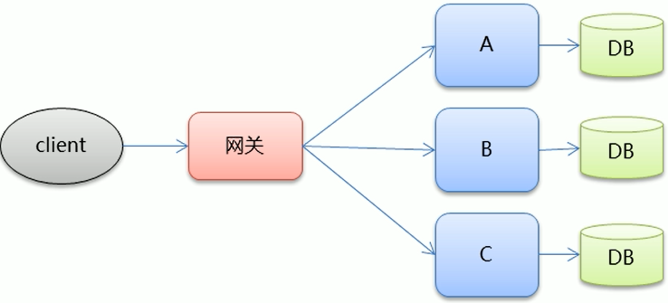

# 0x01 Application Architecture History

* 单体架构

早期的互联网流量很小，网站所有的功能都部署到一处。

优点：开发部署方便，小型项目首选

缺点：项目变得很庞大启动慢，耦合度高，可靠性差，不易维护和扩展

* 垂直架构

随着访问量的增大，需要将应用拆分成不相干的几个应用以提高效率，如将一个电商项目分为电商交易系统、后台管理系统、CMS管理系统。

缺点：各系统相互独立，无法互相调用，存在重叠的业务导致重复开发，后期维护困难

* 分布式服务架构

将公共业务模块抽取出来，作为独立的服务，供其他调用者消费，以实现服务的共享和重用（通过RPC远程过程调用 ）

优点：将重复的业务代码抽象出来，提高代码复用性。

缺点：调用关系变得复杂，服务提供方一旦发生变更，所有消费方都需要变更

* SOA架构

SOA是一种面向服务的架构（Service-Oriented Architecture），基于分布式架构。增加了一个统一的调度中心（中介）来对集群进行实时管理。单点登录（SSO，Single Sign On）是一个典型的面向服务的架构，用户服务和认证服务被剥离开来，各个系统之间通过统一登录和管理用户信息。

* 微服务架构

  在SOA上做的升华，强调如下特点：

  * 服务实现组件化
  * 服务之间的交互一般使用REST API
  * 去中心：每个微服务都有自己私有的数据库持久化业务数据
  * 自动化部署：把应用拆分成一个个独立的单个服务，方便自动化部署、测试、运维

> 集群和分布式：
>
> * 集群：一个业务模块，部署到多台服务器上（一群人干一样的事情）
>   * 通过负载均衡分配
>   * 高可用
>   * 高性能
> * 分布式：大的业务系统拆分为多个小的业务模块，分别部署到不同的机器上（一群干不同的事情，合起来是一件大事）
>   * 高可扩展
>   * 可伸缩（可增加或减少单个模块的性能）

# 0x02 What Is RPC

从上面的应用架构发展史可以看出，RPC是分布式服务架构的关键。

**RPC**（ `Remote Procedure Call`）—远程过程调用 ，它是一种通过网络从远程计算机程序上请求服务，而不需要了解底层网络技术的协议。在 OSI 网络通信模型中，RPC 跨越了传输层和应用层。其实现了像调用本地类方法那样来调用服务端的服务。

**RPC 采用客户端（服务调用方）/服务器端（服务提供方）模式**，客户端只需要引入要使用的接口，接口的实现和运行都在服务器端。RPC的主要依赖技术包括**序列化、反序列化、数据传输协议**。

RMI（`Remote Method Invoke`，远程方法调用）是RPC的一种实现。RMI 的代理模式是通过代理对象将方法传递给实际对象的。`stub`驻留客户端，承担着代理远程对象实现者的角色。`skeleton/server stub`类帮助远程对象与`stub`连接进行通信。 

1. 服务调用方（client）调用以本地调用方式调用服务
2. `client stub` 接收到调用后负责将方法、参数等组装成能够进行网络传输的消息体
3. `client stub` 找到服务地址，并将消息发送到服务端
4. `server stub` 收到消息后进行解码
5. `server stub` 根据解码结果调用本地的服务
6. 本地服务执行并将结果返回给 `server stub`
7. `server stub` 将返回结果打包成消息并发送至调用方
8. `client stub` 接收到消息，并进行解码
9. 服务调用方得到最终结果

接口实现是由服务端对定义好的业务接口进行功能实现，并将接口实例注册到服务中心提供给客户端调用。

# 0x03 RPC Framework

Java中常见的RPC框架有RMI（JDK自带）、Hessian、Dubbo、Thrift

* Dubbo是SOA时代的产物
* SpringCloud是微服务时代的产物
