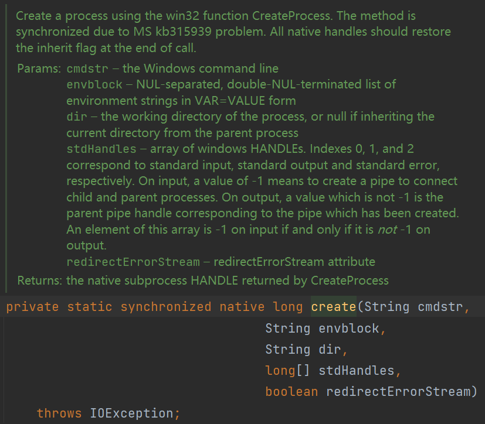

## Preface

开发者设计本地命令执行的本意是实现某些程序功能

如ps（进程管理）、top（内存管理）

但对于攻击者来说这就是直捣黄龙的利器

## Runtime

最简单的命令执行方法

```java
Runtime.getRuntime().exec("calc");
```

跟踪调用栈可以发现，`Runtime#exec`并不是命令执行的最终点

```java
java.lang.ProcessImpl.start
java.lang.ProcessBuilder.start
java.lang.Runtime.exec
java.lang.Runtime.exec
java.lang.Runtime.exec
```

## ProcessBuilder

```java
public final class ProcessBuilder {
    public ProcessBuilder(List<String> command) {
            if (command == null)
                throw new NullPointerException();
            this.command = command;
        }

    public ProcessBuilder(String... command) {
        this.command = new ArrayList<>(command.length);
        for (String arg : command)
            this.command.add(arg);
    }
    public Process start() throws IOException {
        // ...
        try {
            return ProcessImpl.start(cmdarray,
                                     environment,
                                     dir,
                                     redirects,
                                     redirectErrorStream);
        } // ...
    }
}
```


```java
// ProcessBuilder processBuilder = new ProcessBuilder(Arrays.asList("calc"));
ProcessBuilder processBuilder = new ProcessBuilder("calc");
processBuilder.start();
```

## ProcessImpl

非public类，需要使用反射调用

```java
Class clazz = Class.forName("java.lang.ProcessImpl");
Method start = clazz.getDeclaredMethod("start", String[].class, Map.class, String.class, ProcessBuilder.Redirect[].class, boolean.class);
start.setAccessible(true);
start.invoke(clazz, new String[]{"calc"}, null, null, null, false);
```

`ProcessImpl#start`最终调用的是`ProcessImpl`的构造方法

```java
Class clazz = Class.forName("java.lang.ProcessImpl");
Constructor constructor = clazz.getDeclaredConstructor(String[].class, String.class, String.class, long[].class, boolean.class);
constructor.setAccessible(true);
constructor.newInstance(new String[]{"calc"}, null, null, new long[]{-1,-1,-1}, false);
```

最后调用的是`ProcessImpl#create` native方法



Linux和Mac系统上则是交给`UNIXProcess#forkAndExec` native方法