# Intro

上一节的介绍的RMI反序列化入口都是JDK自带的rmi包中，很难想象官方会不去修复或缓解这个漏洞。

针对此JDK9加入了一个反序列化的安全机制————JEP 290

在JDK6、7、8的高版本中也引入了这个机制（JDK8121、JDK7u131、JDK6u141）

官方的描述👉https://openjdk.org/jeps/290

> JEP 290: Filter Incoming Serialization Data
>
> Allow incoming streams of object-serialization data to be filtered in order to improve both security and robustness.

对输入的对象序列化数据流进行过滤，以提高安全性和鲁棒性。

根据官方的描述，核心机制在于一个可以被用户实现的filter接口，作为`ObjectInputStream`的一个属性，反序列化时会触发接口的方法，对序列化类进行合法性检查。每个对象在被实例化和反序列化之前，过滤器都会被调用，除去Java的基本类型和`java.lang.String`（若过滤器未设置，默认使用全局过滤器）。此外，针对RMI，用于导出远程对象的`UnicastServerRef`中的`MarshalInputStream`也设置了过滤器，用于验证方法参数的合法性。

下面的分析都基于JDK8u202，其他版本应该类似。

> 我们下载的`Oracle JDK`只提供了java和javax包下的源码，没有sun包源码
>
> 需要去OpenJDK官网下载JDK源码，如8u202👉https://hg.openjdk.org/jdk8u/jdk8u/jdk/rev/4d01af166527，点击zip下载源码
>
> 下载的压缩包下src/share/classes，将sun目录复制到JDK的安装目录下的src，IDEA中Project Structure->SDKs->SourcePath，添加src目录
>
> 这样就不用看🤮反编译结果了✌️

# ObjectInputFilter

原生反序列化的入口在`ObjectInputStream#readObject`，在这里设置过滤器再合适不过。JEP 290在`ObjectInputStream`类中增加了一个`serialFilter`属性和一个`filterCheck`方法。

## serialFilter

`ObjectInputStream`的构造方法初始化了`serialFilter`

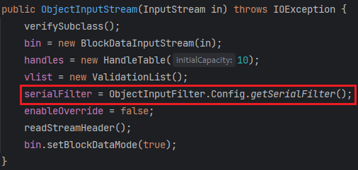

`Config`是`sun.misc.ObjectInputFilter`这个接口的一个静态内部类，`getSerialFilter`返回`Config`的静态字段`serialFilter`

这个静态字段在`Config`的静态代码块中进行初始化

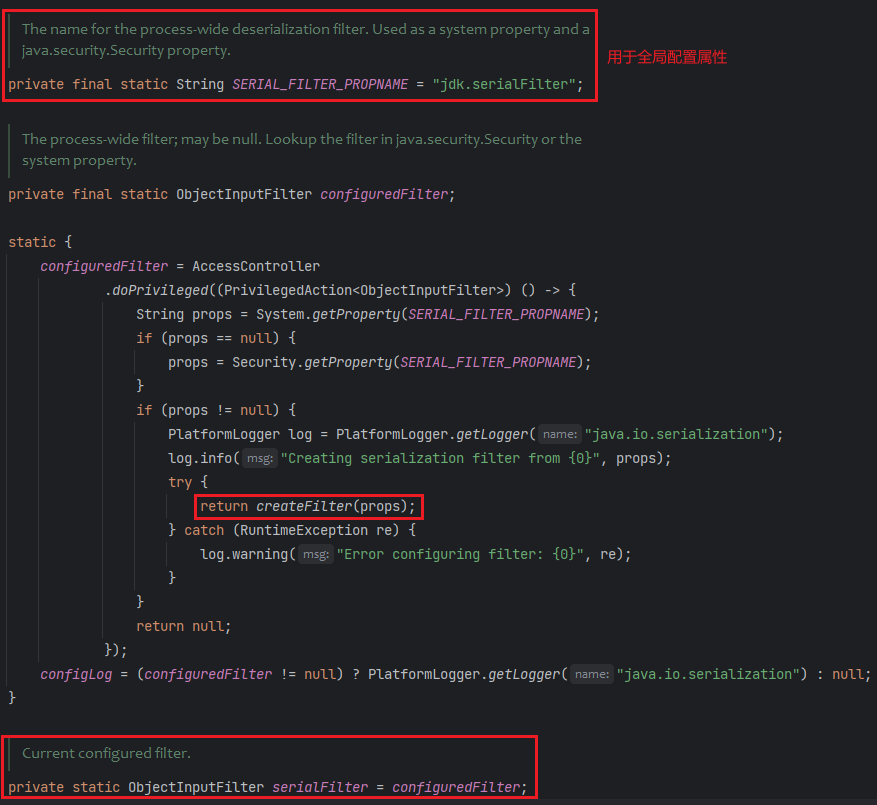

试试打印这两个全局属性，发现是null，所以默认反序列化过滤器为空

```java
System.getProperty("jdk.serialFilter");
Security.getProperty("jdk.serialFilter")
```

若有设置这两个全局属性，才会构造序列化过滤器。

`serialFilter`是`ObjectInputFilter`接口类，`ObjectInputStream#setObjectInputFilter`（JDK9以下是`setInternalObjectInputFilter`）用于设置过滤器。（相应的也有`getObjectInputFilter`用于获取过滤器）

下面看看当`jdk.serialFilter`全局属性不为空时，如何创建一个过滤器

`ObjectInputFilter.Config#createFilter`

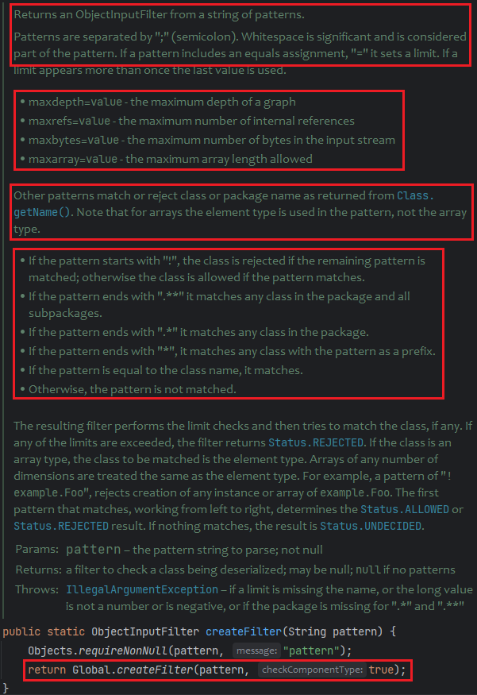

关于pattern的规则，注释也写得很详细明了了。

反序列化时检查类有三种状态：`ALLOWED`、`REJECTED`、`UNDECIDED`

见`ObjectInputFilter`接口的枚举类`Status`

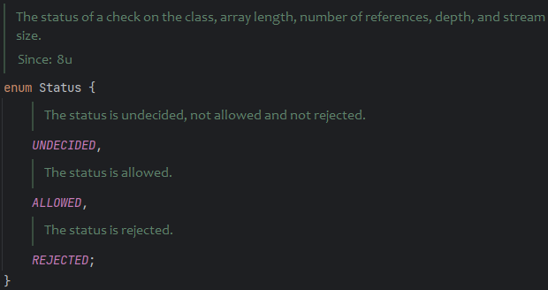

这里插入一个测试例子

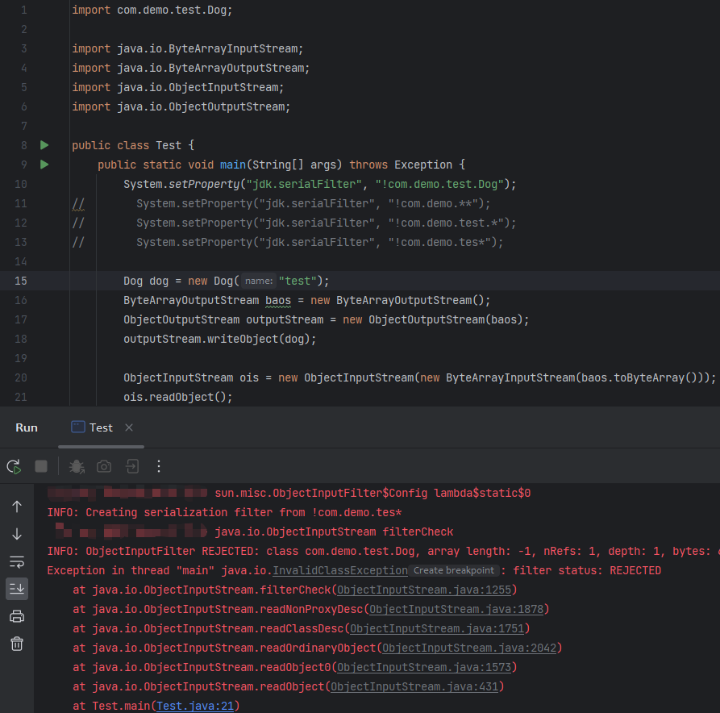

反序列化时成功抛出`InvalidClassException`异常，显示过滤器状态为`REJECTED`

接着交给`ObjectInputFilter.Config.Global#createFilter`去创建过滤器

`Global`本身就实现了`ObjectInputFilter`接口

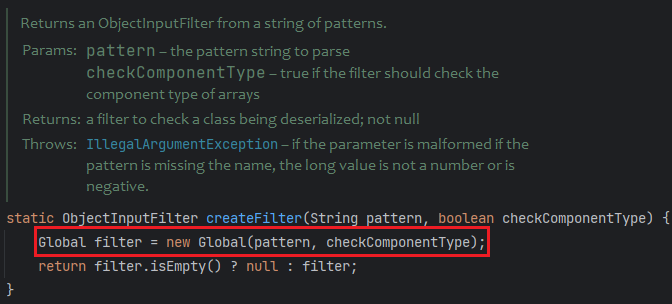

`Global`的构造函数会解析我们传入的匹配规则pattern，将规则解析成一个个lambda表达式，lambda表达式会返回`ObjectInputFilter.Status`

```java
private final List<Function<Class<?>, Status>> filters;
```

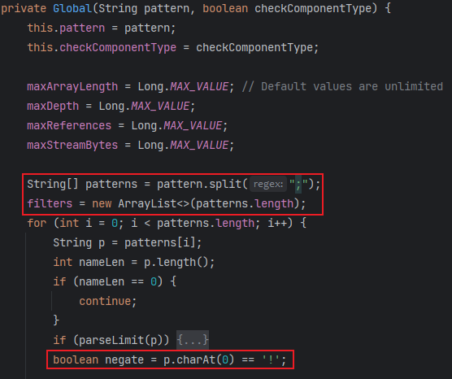

* 过滤包下的所有类

pkg为我们设置的待过滤包名

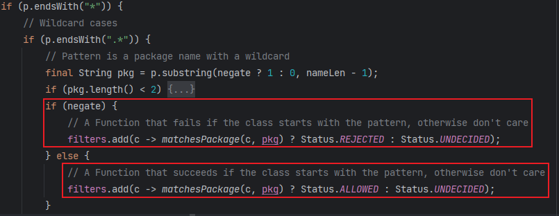

pkg与`Class.getName()`进行比较

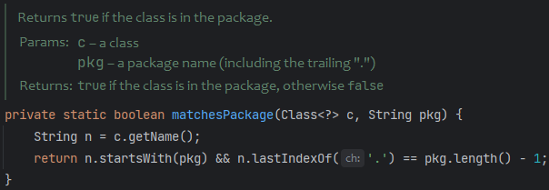

* 过滤包下的所有类及所有子包

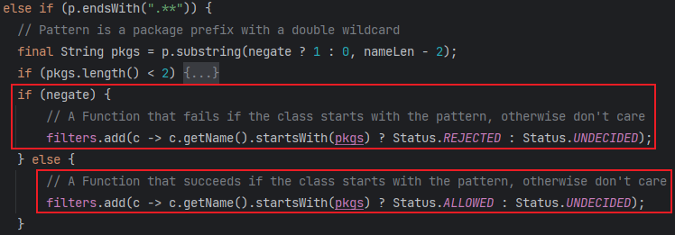

* 过滤某个前缀

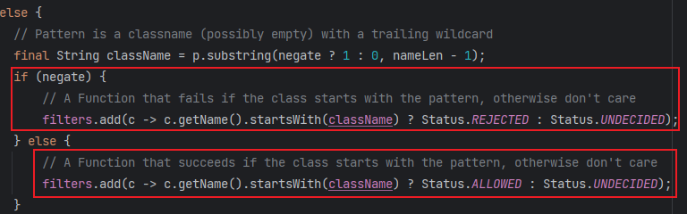

* 过滤某个类

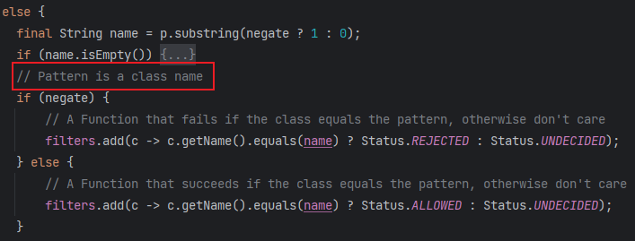

总结：`ObjectInputStream`的构造方法中获取`serialFilter`(`ObjectInputFilter`接口类)，即`ObjectInputFilter.Config`的静态成员`serialFilter`，其在`Config`的静态代码块中初始化，若有通过`System`或`Security`设置全局属性`jdk.serialFilter`，则创建反序列化过滤器（默认为null，不创建）。最后调用`ObjectInputFilter.Config.Global`的构造方法，`Global`实现了`ObjectInputFilter`接口，所以它本身就是一个过滤器。`Global`的构造方法中对传入的过滤规则pattern解析成一个个lambda表达式，放入自身的`filters`字段中。

## filterCheck

`ObjectInputStream#filterCheck`会对类进行过滤

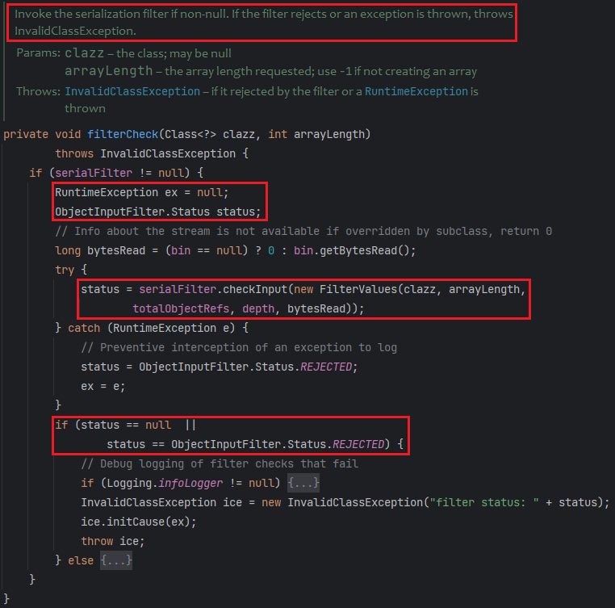

* 判断`serialFilter`是否为空
* 交给`serialFilter#checkInput`进行类检测
* 若返回状态为`null`或`REJECTED`，抛出`InvalidClassException`异常

这里封装了一个`FilterValues`对象（这个类实现了`ObjectInputFilter.FilterInfo`接口）

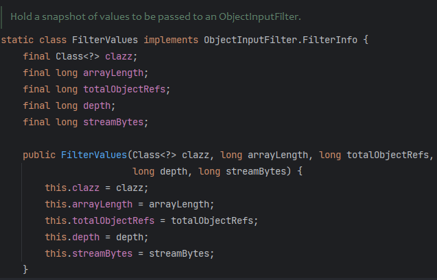

`Global#checkInput`会检测如下内容：

* 数组长度是否超过`maxArrayLength`
* 类名是否在黑名单`filters`
* 对象引用是否超过`maxReferences`
* 序列流大小是否超过`maxStreamBytes`
* 嵌套对象的深度是否超过`maxDepth`


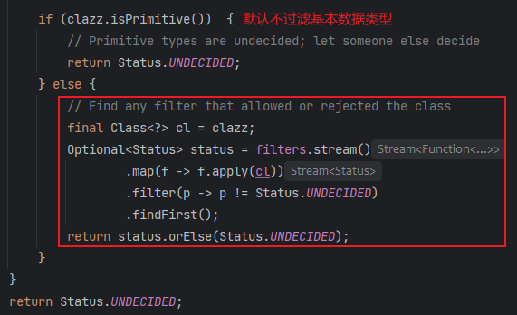

## customized filter

上面通过设置全局属性`jdk.serialFilter`，创建的是全局过滤器，因为`ObjectInputFilter.Config`类初始化，`Global`这个过滤器被创建并赋值给`Config.serialFilter`，每次创建`ObjectInputStream`对象都是去拿`Config`的`serialFilter`属性。

### Local customization

若想设置局部自定义过滤器，可以调用`ObjectInputStream#setInternalObjectInputFilter`，传入自定义的`ObjectInputFilter`（JDK9及以上是`setObjectInputFilter`）

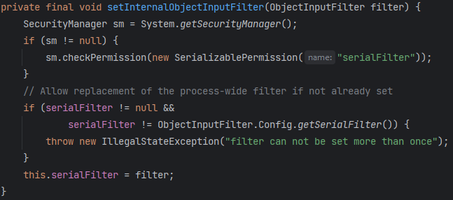

或者调用`ObjectInputFilter.Config#setObjectInputFilter`，需要传入`ObjectInputStream`对象和自定义的过滤器

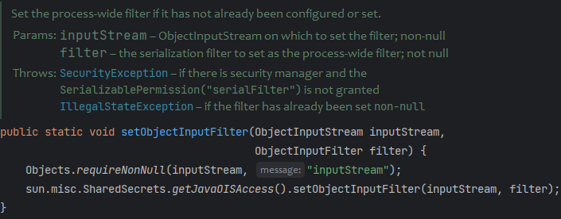

### Global customization

可能需要通过反射去修改Config的`serialFilter`属性

因为对象实例化后`serialFilter`已经被赋值了，但`setSerialFilter`会检查`serialFilter`是否为空，不为空就改不了。（笑死，不让改那这方法有啥用）

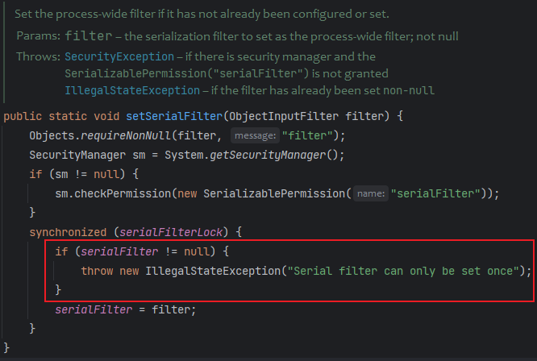

# Filter in RMI

RMI在调用远程方法时，服务端会反序列化客户端发送的序列化参数对象。

`sun.rmi.server.UnicastServerRef#dispatch`

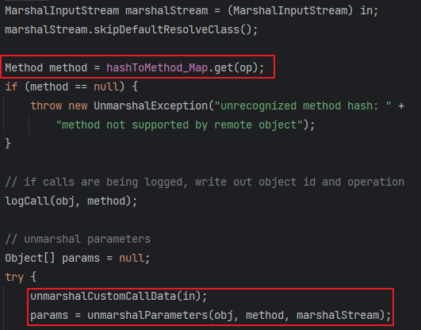

`unmarshalCustomCallData`就设置了一个局部过滤器，对传入的`MarshalInputStream`设置`serialFilter`，来过滤远程方法的调用参数。

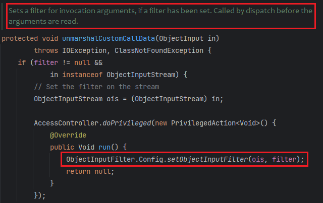

但很可惜这个filter默认是null，也就是设置普通的远程对象，默认没有反序列化过滤器。

远程对象继承了`UnicastRemoteObject`，其构造方法会把自身导出，

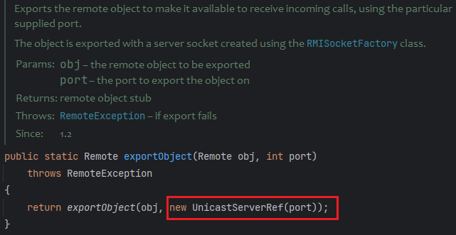

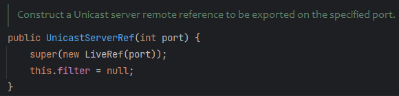

可以看到这里构造`UnicastServerRef`时默认过滤器为null。

但对于注册中心`RegistryImpl`的创建，就指定了一个过滤器。

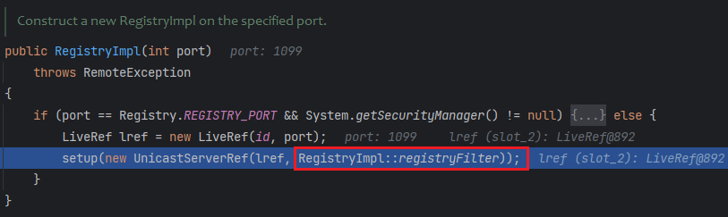

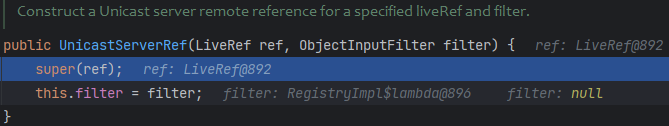

> 这里的`::`表示方法引用，配合函数式接口使用，比如：
>
> ```java
> interface Converter {
>     String convert(String input);
> }
> 
> // 使用静态方法引用实现函数式接口
> Converter converter = String::toUpperCase;
> String result = converter.convert("hello"); // HELLO
> ```
>
> 函数式接口是只有一个抽象方法的接口，可以使用lambda表达式或方法引用来实现该抽象方法。避免匿名类的构造。Java中的函数式接口使用`@FunctionalInterface`注解进行标识。

刚好`ObjectInputFilter`有`@FunctionalInterface`注解

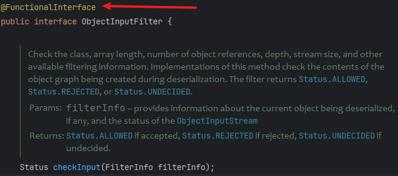

`RegistryImpl::registryFilter`设置了一个白名单，只允许反序列化特定类的子类

`父类.class.isAssignableFrom(子类.class)`

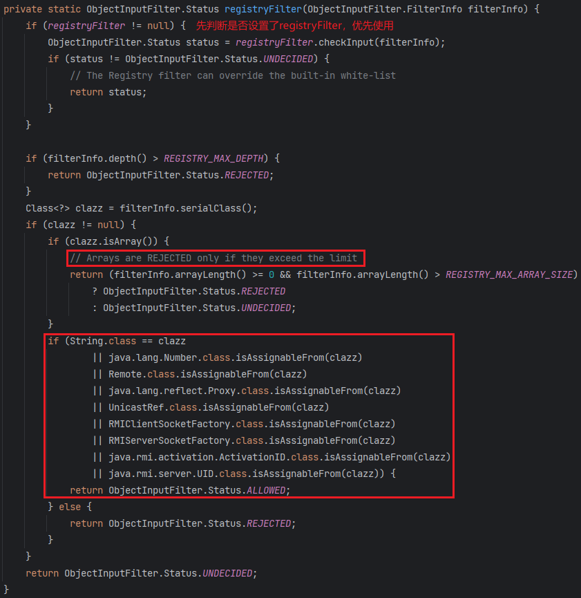

`RegistryImpl`的`registryFilter`属性在初始化时读取全局属性`sun.rmi.registry.registryFilter`，读不到也是默认null过滤器。

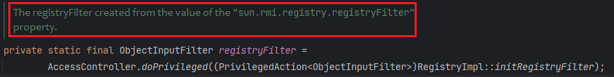

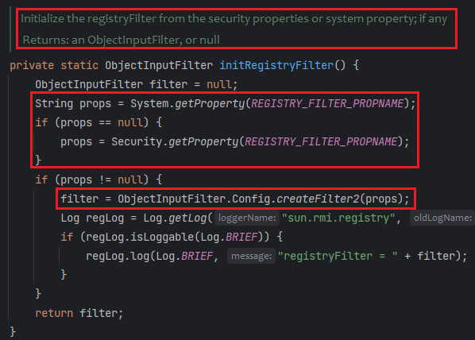

`Config.createFilter2`和`Config.createFilter`的区别在于前者不会检测数组里的元素类型。

# Filter in WebLogic

海妹学weblogic，占个位

# Ref

* https://paper.seebug.org/1689/
