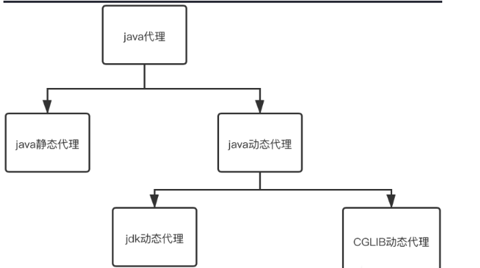

# 代理模式

代理模式是Java的设计模式之一

> 1. 代理类和委托类有相同接口 	
> 2. 代理类负责为委托类预处理消息、过滤消息、转发消息、事后处理消息等  



## 静态代理

定义接口或父类，被代理对象和代理对象一起实现相同的接口或继承相同的父类

```java
// 定义一个接口
public interface Rental {
    public void sale();
}
```

```java
// 委托类 实现接口方法
public class Entrust implements Rental{
    @Override
    public void sale() {
        System.out.println("出租房子");
    }
}
```

```java
// 代理类
public class AgentRental implements Rental{
    private Rental target; // 被代理对象
    public AgentRental(Rental target) {
        this.target = target;
    }
    @Override
    public void sale() {
        System.out.println("房子出租价位有1k-3k"); // 增加新的操作
        target.sale(); // 调用Entrust委托类的sale方法
    }
}
```

```java
public static void main(String[] args) {
    Entrust entrust = new Entrust();
    AgentRental agentRental = new AgentRental(entrust);
    agentRental.sale();
}
```

优点：
可以在不改变委托类源码的情况下，通过代理类来修改委托类的功能
缺点：
接口方法增删时，代理类需要跟着变，不易维护；代理类繁多时不好管理

## 动态代理

* InvocationHandler 接口：提供调用代理操作代理类实现这个接口
* Proxy类：动态构建代理类

实现过程

1. 实现`InvocationHandler`接口，创建自定义调用处理器
2. 获取委托类的`ClassLoader`、`Interface`、`InvocationHandler`
3. `newProxyInstance`传入2中参数，创建动态代理实例对象
4. 通过代理对象调用目标方法

```java
// 代理类
import java.lang.reflect.InvocationHandler;
import java.lang.reflect.Method;
public class TestAgent implements InvocationHandler {
    // target变量为委托类对象
    private Object target;
    public TestAgent(Object target) {
        this.target = target;
    }
    // 实现 java.lang.reflect.InvocationHandler.invoke()方法
    @Override
    public Object invoke(Object proxy, Method method, Object[] args) throws Throwable {
        // 添加自定义的委托逻辑
        System.out.println("房子出租价位有1k-3k");
        // 调用委托类的方法（java底层封装好了）
        method.invoke(target,args);
    }
}
```

```java
// 测试类
import java.lang.reflect.InvocationHandler;
import java.lang.reflect.Proxy;
public class test {
    public static void main(String[] args) {
        // 获取委托类的实例对象
        Entrust testEntrust = new Entrust();
        // 获取委托类的CLassLoader
        ClassLoader classLoader = testEntrust.getClass().getClassLoader();
        // 获取委托类的所有接口
        Class[] interfaces = testEntrust.getClass().getInterfaces();
        // 获取一个调用处理器
        InvocationHandler invocationHandler = new TestAgent(testEntrust);
        // 查看生成的代理类
        System.getProperties().put("sun.misc.ProxyGenerator.saveGeneratedFiles","true");
        // 创建代理对象
        Rental proxy = (Rental) Proxy.newProxyInstance(classLoader,interfaces,invocationHandler);
        // 调用代理对象的sale()方法
        proxy.sale();
    }
}
```

# 动态代理在反序列化中的利用

InvocationHandler的invoke方法，不管外边执行什么方法，都会执行到invoke

目的调用 B.f
入口类 A 接收参数O A中有O.method 但method没有可利用的
若O是动态代理类，且O接收参数B、invoke方法中含有 B.f
则执行O.method时会自动执行 B.f

readObject -> 反序列化时自动执行
invoke -> 函数调用时自动执行