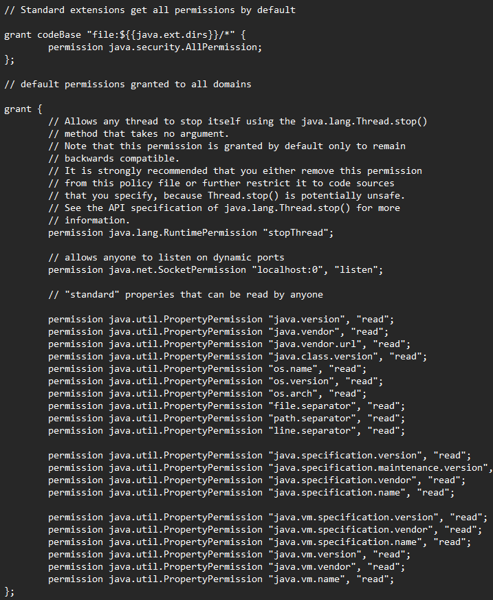
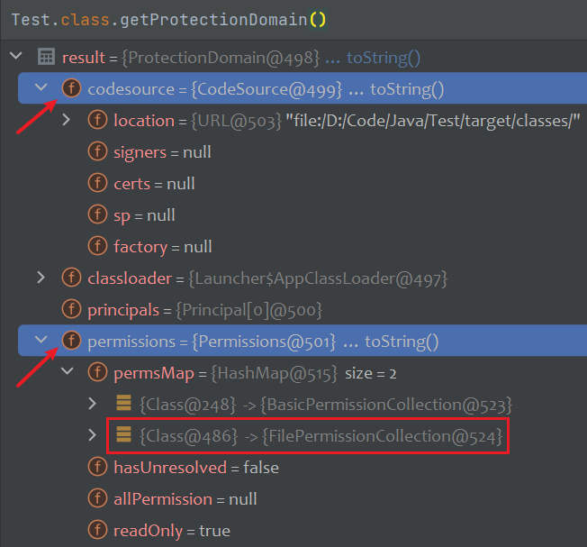

# Preface

阅读源码时经常碰到`SecurityManager`，一直都没研究这是个什么东西，是时候拿出来看看了。

顾名思义，这个类是Java的安全管理器。当运行未知的Java程序的时候，该程序可能有恶意代码，为了防止运行恶意代码对系统产生影响，需要对运行的代码的权限进行控制，类似一个沙箱的运行环境。

`SecurityManager`可以追溯到Java1.0，那时候还是`Applet`的时代，`Applet`依赖于Web浏览器的支持。当用户访问包含`Applet`的网页时，Web浏览器将下载`Applet`的字节码并在客户端执行，通过配置`SecurityManager`来拒绝`Applet`访问文件系统或网络等资源。

# Intro

`SecurityManager`默认是关闭的，需要加上一个启动参数`-Djava.security.manager`

可以指定自己的策略文件`-Djava.security.policy=/path/to/policy`

策略文件用于指定哪些类有哪些权限。默认的配置文件在` $JAVA_HOME/jre/lib/security/java.policy`



这个策略文件实际上就和Java的保护域对应上了。

每个Java类都有一个关联的`ProtectionDomain`对象，该对象包含了有关该类所属的代码来源（CodeBase）以及该类可访问的资源的信息（Permission）

* `CodeSource`: Java代码的来源，它包含了代码的URL或代码所在JAR文件的URL

* `Permission`: 代码对特定资源或操作的访问权限
  * `FilePermission`: 文件系统的访问权限
  * `SocketPermission`: 网络套接字的访问权限
  * `RuntimePermission`: 运行时环境的访问权限



可以看到这个类拥有`FilePermission`，`FileInputStream`的构造方法中会调用`checkRead`检查，同样`FileOutputStram`会调用`checkWrite`检查

```java
public FileInputStream(File file) throws FileNotFoundException {
    String name = (file != null ? file.getPath() : null);
    SecurityManager security = System.getSecurityManager();
    if (security != null) {
        security.checkRead(name);
    }
    // ...
}

// java.lang.SecurityManager
public void checkRead(String file) {
    checkPermission(new FilePermission(file,
                                       SecurityConstants.FILE_READ_ACTION));
}
public void checkPermission(Permission perm) {
    java.security.AccessController.checkPermission(perm);
}
```

`checkPermission`会检查当前上下文（即调用链中的所有类）中的权限，没有权限会抛出`SecurityException`异常

`AccessController`还提供了`doPrivilege`方法，当这个方法被调用时，栈顶的`AccessController`只会自顶向下遍历到调用`doPrivileged`方法的栈帧

# Bypass

参考：https://www.anquanke.com/post/id/151398

JDK17已经标识弃用`SecurityManager`

Tomcat在`conf/catalina.policy`也有自己的安全策略文件，但默认都没开启。

貌似已经被时代遗弃了，暂时不看。