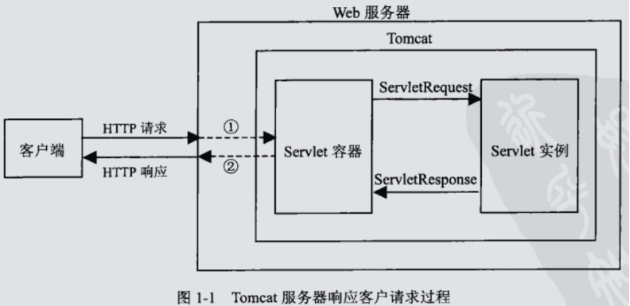
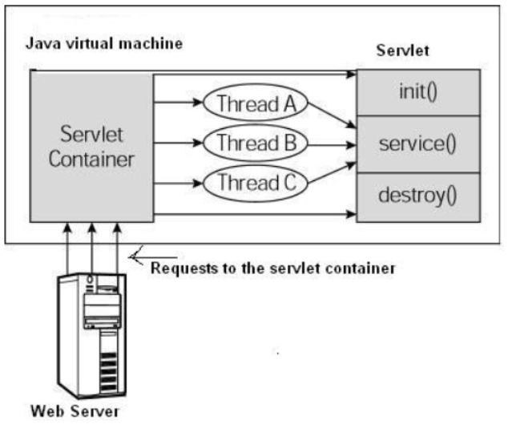
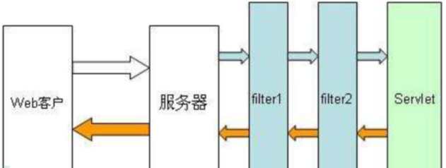
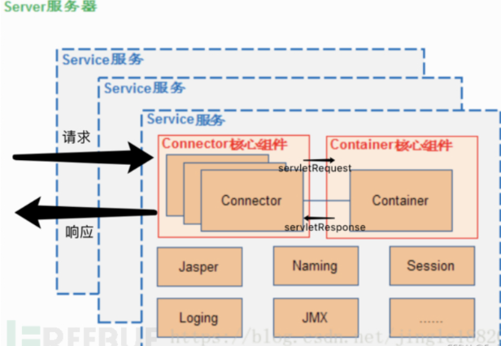
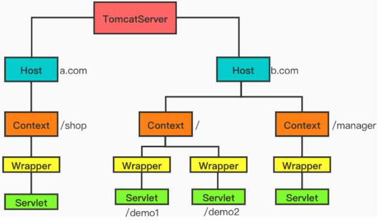

# 0x01 Java Web 三大件

## 1. Servlet

Servlet就是运行在服务器上的一个小程序，用来处理服务器接收到的请求。



Tomcat是Web应用服务器，一个**Servlet容器**。

1. Tomcat将http请求文本接收并解析，然后封装成HttpServletRequest类型的request对象，因此所有的HTTP信息都可以通过request对象调用对应方法获得。
2. Tomcat将要响应的信息封装为HttpServletResponse类型的response对象，通过设置response属性可以修改要发送给浏览器的内容，接着Tomcat会把它变成http响应文本的格式发送给浏览器。

Servlet生命周期：

- Servlet 初始化后调用 **init ()** 方法。
- Servlet 调用 **service()** 方法来处理客户端的请求。
- Servlet 销毁前调用 **destroy()** 方法。
- 最后，Servlet 是由 JVM 的垃圾回收器进行垃圾回收的。

注意：

- init方法只调用一次，第一次创建Servlet时被调用（服务器启动时【需要web.xml设置load-on-startup=1】或用户第一次请求时）。当用户调用一个 Servlet 时，就会创建一个 Servlet 实例，每一个用户请求都会产生一个新的线程。
- Servlet 容器（Tomcat）调用 service() 方法来处理来自客户端的请求。service 方法在适当的时候调用 doGet、doPost 等方法。

```xml
<dependency>
    <groupId>javax.servlet</groupId>
    <artifactId>javax.servlet-api</artifactId>
    <version>4.0.1</version>
    <scope>provided</scope>
</dependency>
```

```java
package servlets;

import javax.servlet.ServletConfig;
import javax.servlet.ServletException;
import javax.servlet.http.HttpServlet;
import javax.servlet.annotation.WebServlet;   //servlet3 以上才可以使用注解
import javax.servlet.http.HttpServletRequest;
import javax.servlet.http.HttpServletResponse;
import java.io.IOException;

@WebServlet("/test", loadOnStartup = 1)
public class MyServlet extends HttpServlet {
    @Override
    public void init(ServletConfig config) throws ServletException {
        System.out.println("init ....");
    }

    @Override
    protected void service(HttpServletRequest req, HttpServletResponse resp) throws ServletException, IOException {
        System.out.println("service ....");
        doGet(req, resp);
    }

    @Override
    public void destroy() {
        System.out.println("destroy ....");
    }

    @Override
    protected void doGet(HttpServletRequest req, HttpServletResponse resp) throws ServletException, IOException {
        resp.getWriter().write("Hello Servlet");
    }

    @Override
    protected void doPost(HttpServletRequest req, HttpServletResponse resp) throws ServletException, IOException {
        super.doPost(req, resp);
    }
}
```



## 2. Filter

- 在客户端的请求访问后端资源之前，拦截这些请求。
- 在服务器的响应发送回客户端之前，处理这些响应。



| 序号 | 方法 & 描述                                                  |
| :--: | :----------------------------------------------------------- |
|  1   | **public void doFilter (ServletRequest, ServletResponse, FilterChain)** 该方法完成实际的过滤操作，当客户端请求方法与过滤器设置匹配的URL时，Servlet容器将先调用过滤器的doFilter方法。FilterChain用户访问后续过滤器。 |
|  2   | **public void init(FilterConfig filterConfig)** web 应用程序启动时，web 服务器将创建Filter 的实例对象，并调用其init方法，**读取web.xml配置**，完成对象的初始化功能，从而为后续的用户请求作好拦截的准备工作（filter对象只会创建一次，init方法也只会执行一次）。开发人员通过init方法的参数，可获得代表当前filter配置信息的FilterConfig对象。 |
|  3   | **public void destroy()** Servlet容器在销毁过滤器实例前调用该方法，在该方法中释放Servlet过滤器占用的资源。 |

web.xml 中的 filter-mapping 元素的顺序决定了多个过滤器的顺序

```xml
  <filter>
    <filter-name>MyFilter</filter-name>
    <filter-class>filters.MyFilter</filter-class>
    <init-param>
      <param-name>player</param-name>
      <param-value>p4d0rn</param-value>
    </init-param>
  </filter>
  <filter-mapping>
    <filter-name>MyFilter</filter-name>
    <url-pattern>/myServlet</url-pattern>
  </filter-mapping>
```

```java
package filters;

import javax.servlet.*;
import java.io.IOException;

public class MyFilter implements Filter {
    @Override
    public void init(FilterConfig config) throws ServletException {
        // 获取初始化参数
        String who = config.getInitParameter("player");
        System.out.println("I am " + who);
    }

    @Override
    public void doFilter(ServletRequest req, ServletResponse resp, FilterChain chain) throws IOException, ServletException {
        System.out.println("JAVA SEC");
        // 把请求传回过滤链，即请求通过
        chain.doFilter(req, resp);
        // 处理响应报文
        System.out.println("I am sending response back!");
    }

    @Override
    public void destroy() {
        /* 在 Filter 实例被 Web 容器从服务移除之前调用 */
    }
}
```

## 3. Listener

监听器（Listener）就是 Application、Session 和 Request 三大对象创建、销毁或者往其中添加、修改、删除属性时自动执行代码的功能组件。

ServletContextListener、ServletContextAttributeListener
HttpSessionListener、HttpSessionAttributeListener
ServletRequestListener、ServletRequestAttributeListener

# 0x02 Tomcat 架构

Apache 是 web 服务器（静态解析，如 HTML），Tomcat 是 java 应用服务器（动态解析，如 JSP）

Tomcat 只是一个 servlet(jsp 也是一种 servlet)容器，可以认为是 Apache 的扩展，但是可以独立于 Apache 运行。



主要有server、service、connector、container 四个部分

核心组件：Connector 和 Container

- Connector 主要负责对外交流，进行 Socket 通信(基于 TCP/IP)，解析 HTTP 报文
- Container 主要处理 Connector 接受的请求，主要是处理内部事务，加载和管理 Servlet，由 Servlet 具体负责处理 Request 请求

### server

代表整个 Tomcat 服务器，它要能够提供一个接口让其它程序能够访问到这个 Service 集合、同时要维护它所包含的所有 Service 的生命周期

### service

主要是为了关联 Connector 和 Container，同时会初始化它下面的其它组件，在 Connector 和 Container 外面多包一层，把它们组装在一起，向外面提供服务，一个 Service 可以设置多个 Connector，但是只能有一个 Container 容器。

### connector

负责接收浏览器的发过来的 tcp 连接请求，创建一个 Request 和 Response 对象分别用于和请求端交换数据，然后会产生一个线程来处理这个请求并把产生的 Request 和 Response 对象传给处理这个请求的线程，处理这个请求的线程就是 Container 组件要做的事了。

- EndPoint: 负责网络通信，将字节流传递给 Processor；
- Processor: 负责处理字节流生成 Tomcat Request 对象，将 Tomcat Request 对象传递给 Adapter；
- Adapter: 负责将 Tomcat Request 对象转化成 ServletRequest 对象，传递给容器。


### container

Container（又名Catalina）用于处理Connector发过来的servlet连接请求，它是容器的父接口，所有子容器都必须实现这个接口，Container 容器的设计用的是典型的责任链的设计模式，它有四个子容器组件构成，分别是：Engine、Host、Context、Wrapper，这四个组件不是平行的，而是父子关系，Engine 包含 Host，Host 包含 Context，Context 包含 Wrapper。

- Engine: 最顶层容器组件，可以包含多个 Host。实现类为 `org.apache.catalina.core.StandardEngine`
- Host: 代表一个虚拟主机，每个虚拟主机和某个域名 Domain Name 相匹配，可以包含多个 Context。实现类为 `org.apache.catalina.core.StandardHost`
- Context: 一个 Context 对应于一个 Web 应用，可以包含多个 Wrapper。实现类为 `org.apache.catalina.core.StandardContext`
- Wrapper: 一个 Wrapper 对应一个 Servlet。负责管理 Servlet ，包括 Servlet 的装载、初始化、执行以及资源回收。实现类为 `org.apache.catalina.core.StandardWrapper`（每个JSP其实也是一个个的Servlet。）



每一个 Context 都有唯一的 path。这里的 path 不是指 servlet 绑定的 WebServlet 地址，而是指独立的一个 Web 应用地址。

